# 垃圾回收

垃圾回收需要完成的三件事情

1. 哪些内存需要回收？
2. 什么时候回收？
3. 如何回收？

## 如何判断对象是否存活

在堆里面存放着 Java 世界中几乎所有的对象实例，垃圾收集器在对堆进行回收前，首先就要确定对象的存活状态

### 对象存活算法

#### 引用计数算法（Reference Counting）

在对象中添加一个引用计数器，每当有一个地方引用它时，计数器值就加一；当引用失效时，计数器值就减一；任何时刻计数器为零的对象就是不可能再被使用的

引用计数算法虽然占用了一些额外的内存空间来进行计数，但它的原理简单，判定效率也很高，在大多数情况下它都是一个不错的算法

##### 循环引用

这个看似简单的算法有很多例外情况要考虑，必须要配合大量额外处理才能保证正确地工作，譬如单纯的引用计数就很难解决对象之间相互循环引用的问题

```java
public class ReferenceCountingGC {

    public Object instance = null;

    public static void testGC() {
        ReferenceCountingGC objA = new ReferenceCountingGC();
        ReferenceCountingGC objB = new ReferenceCountingGC();
        objA.instance = objB;
        objB.instance = objA;
        objA = null;
        objB = null;
    }
}
```

除了两个对象互相引用外，这两个对象再无任何引用，实际上这两个对象已经不可能再被访问，但是它们因为互相引用着对方，导致它们的引用计数都不为零，引用计数算法也就无法回收它们

#### 可达性分析算法（Reachability Analysis）

通过一系列称为 GC Roots 的根对象作为起点，从这些节点开始，根据引用关系向下搜索，搜索过程所走过的路径称为引用链（Reference Chain），如果某个对象到 GC Roots 间没有任何引用链相连，则证明此对象是不可能再被使用的

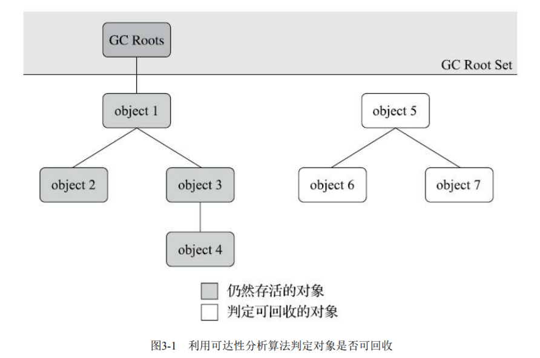

<small>*[深入理解Java虚拟机（第3版） - 图3-1 利用可达性分析算法判定对象是否可回收](https://book.douban.com/subject/34907497/)*</small>

##### 可作为 GC Roots 的对象

- 在虚拟机栈（栈帧中的本地变量表）中引用的对象
- 在方法区中类静态属性引用的对象
- 在方法区中常量引用的对象
- 在本地方法栈中 JNI（即通常所说的 Native 方法）引用的对象
- Java虚拟机内部的引用
  - 如基本数据类型对应的 Class 对象，一些常驻的异常对象（NullPointExcepiton、OutOfMemoryError）等，还有系统类加载器
- 所有被同步锁（synchronized 关键字）持有的对象
- 反映 Java 虚拟机内部情况的 JMXBean、JVMTI 中注册的回调、本地代码缓存等

除了这些固定的 GC Roots 集合以外，根据用户所选用的垃圾收集器以及当前回收的内存区域不同，还可以有其他对象临时性地加入，共同构成完整 GC Roots 集合

### 缓刑阶段

即使在可达性分析算法中判定为不可达的对象，也不是非死不可的，这时候它们暂时还处于缓刑阶段

要真正宣告一个对象死亡，**至少要经历两次标记过程**

1. 如果对象在进行可达性分析后发现没有与 GC Roots 相连接的引用链，那它将会被第一次标记，随后进行一次筛选，筛选的条件是此对象是否有必要执行 finalize 方法。假如对象没有覆盖 finalize 方法，或者 finalize 方法已经被虚拟机调用过，那么虚拟机将这两种情况都视为没有必要执行
2. 如果这个对象被判定为确有必要执行 finalize 方法，那么该对象将会被放置在一个队列中进行第二次标记，如果对象要在 finalize 方法中成功拯救自己，只要重新与引用链上的任何一个对象建立关联即可

#### finalize 方法

对象逃脱死刑的最后机会，当垃圾收集器发现一个对象实例没有任何的引用与之关联，在准备执行垃圾回收之前该方法才会被调用，且 **所有对象的 finalize 方法都只会被系统自动调用一次**

```java
public class Test {

    private static Test test;

    @Override
    protected void finalize() throws Throwable {
        super.finalize();
        System.out.println("execute finalize");
        test = this;
    }

    private static void print(Test t) {
        if (t == null) {
            System.out.println("dead!!!");
        } else {
            System.out.println("alive...");
        }
    }

    public static void main(String[] args) throws InterruptedException {
        test = new Test();

        // 第一次成功自救
        test = null;
        System.gc();
        Thread.sleep(500);
        print(test);

        // 第二次自救失败
        test = null;
        System.gc();
        Thread.sleep(500);
        print(test);
    }
}
```

- 执行结果

> execute finalize
> alive...
> dead!!!

### 引用

在 JDK1.2 版之前，Java 里面的引用是很传统的定义：如果 reference 类型的数据中存储的数值代表的是另外一块内存的起始地址，就称该 reference 数据是代表某块内存、某个对象的引用

为了实现对象在内存空间足够时，能保留在内存之中，如果内存空间在进行垃圾收集后仍然非常紧张，可以自动舍弃。在 JDK1.2 版之后，Java 对引用的概念进行了扩充

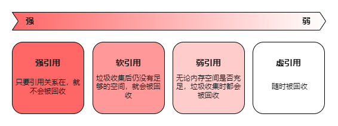

#### 强引用（Strongly Reference）

最传统的引用的定义，是指在程序代码之中普遍存在的引用赋值。无论任何情况下，只要强引用关系还存在，垃圾收集器就永远不会回收掉被引用的对象

```java
Test test = new Test();
```

#### 软引用（Soft Reference）

描述一些还有用，但非必须的对象。只被软引用关联着的对象，在系统将要发生内存溢出异常前，会把这些对象列进回收范围之中进行第二次回收，如果这次回收还没有足够的内存，才会抛出内存溢出异常

```java
Reference<Object> reference = new SoftReference<>(new Test());

System.out.println(reference.get() == null);

System.gc();
Thread.sleep(500);
System.out.println(reference.get() == null);
```

- 执行结果

> false
> false

#### 弱引用（Weak Reference）

描述那些非必须对象，但是它的强度比软引用更弱一些，被弱引用关联的对象只能生存到下一次垃圾收集发生为止。当垃圾收集器开始工作，无论当前内存是否足够，都会回收掉只被弱引用关联的对象

```java
Reference<Object> reference = new WeakReference<>(new Test());

System.out.println(reference.get() == null);

System.gc();
Thread.sleep(500);
System.out.println(reference.get() == null);
```

- 执行结果

> false
> true

#### 虚引用（Phantom Reference）

虚引用也称为幽灵引用或者幻影引用，它是最弱的一种引用关系。一个对象是否有虚引用的存在，完全不会对其生存时间构成影响，也无法通过虚引用来取得一个对象实例。为一个对象设置虚引用关联的唯一目的只是为了能在这个对象被收集器回收时收到一个系统通知

```java
ReferenceQueue queue = new ReferenceQueue();
Reference<Object> reference = new PhantomReference<>(new Test(), queue);

System.out.println(reference.get() == null);

System.gc();
Thread.sleep(500);
System.out.println(reference.get() == null);
```

- 执行结果

> true
> true

## 分代收集理论（Generational Collection）

当前商业虚拟机的垃圾收集器，大多数都遵循了分代收集的理论进行设计，它建立在两个分代假说之上

- **弱分代假说（Weak Generational Hypothesis）：绝大多数对象都是朝生夕灭的**
- **强分代假说（Strong Generational Hypothesis）：熬过越多次垃圾收集过程的对象就越难以消亡**

这两个分代假说共同奠定了多款常用的垃圾收集器的一致的设计原则：收集器应该将堆划分出不同的区域，然后将回收对象依据其年龄（即对象熬过垃圾收集过程的次数）分配到不同的区域之中存储

- 如果一个区域中大多数对象都是朝生夕灭，难以熬过垃圾收集过程的话，那么把它们集中放在一起，每次回收时只关注如何保留少量存活而不是去标记那些大量将要被回收的对象，就能以较低代价回收到大量的空间；如果剩下的都是难以消亡的对象，那把它们集中放在一块，虚拟机便可以使用较低的频率来回收这个区域，这就 **同时兼顾了垃圾收集的时间开销和内存的空间有效利用**

设计者一般至少会把堆划分为新生代（Young Generation）和老年代（Old Generation）两个区域。在新生代中，每次垃圾收集时都发现有大批对象死去，而每次回收后存活的少量对象，将会逐步晋升到老年代中存放

在堆中划分出不同的区域之后，垃圾收集器才可以每次只回收其中某一个或者某些部分的区域

- 部分收集
  - 新生代收集（Minor GC / Young GC）：指针对新生代
  - 老年代收集（Major GC / Old GC）：指针对老年代
  - 混合收集（Mixed GC）：针对整个新生代和部分老年代
- 全部收集（Full GC）：针对整个堆和方法区

### 跨代引用

分代收集并非只是简单划分一下内存区域那么容易，例如对象不是孤立的，对象之间会存在跨代引用

假如要现在进行一次 Minor GC，但新生代中的对象是完全有可能被老年代所引用的，为了找出该区域中的存活对象，不得不在固定的 GC Roots 之外，再额外遍历整个老年代中所有对象来确保可达性分析结果的正确性，反过来也是一样。遍历整个老年代所有对象的方案虽然理论上可行，但无疑会为内存回收带来很大的性能负担。为了解决这个问题，就需要对分代收集理论添加第三条经验法则

- **跨代引用假说（Intergenerational Reference Hypothesis）：跨代引用相对于同代引用来说仅占极少数**
  - 这其实是可根据前两条假说逻辑推理得出的隐含推论：存在互相引用关系的两个对象，是应该倾向于同时生存或者同时消亡的

依据这条假说，我们就不应再为了少量的跨代引用去扫描整个老年代，也不必浪费空间专门记录每一个对象是否存在及存在哪些跨代引用，只需在新生代上建立一个全局的数据结构（记忆集，Remembered Set），这个结构把老年代划分成若干小块，标识出老年代的哪一块内存会存在跨代引用。此后当发生 Minor GC 时，只有包含了跨代引用的小块内存里的对象才会被加入到 GC Roots 进行扫描。虽然这种方法需要在对象改变引用关系（如将自己或者某个属性赋值）时维护记录数据的正确性，会增加一些运行时的开销，但比起收集时扫描整个老年代来说仍然是划算的

## 内存分配与回收策略

### 对象优先在 Eden 区分配

大多数情况下，对象在新生代 Eden 区中分配。当 Eden 区没有足够空间进行分配时，虚拟机将发起一次 Minor GC

据统计新生代中的对象有 98% 熬不过第一轮收集。可以把新生代分为一块较大的 Eden 空间和两块较小的 Survivor 空间，每次分配内存只使用 Eden 和其中一块 Survivor。发生垃圾收集时，将 Eden 和 Survivor 中仍然存活的对象一次性复制到另外一块 Survivor 空间上，然后直接清理掉 Eden 和已用过的那块 Survivor 空间

HotSpot 虚拟机默认 Eden 和 Survivor 的大小比例是 8∶1，即每次新生代中可用内存空间为整个新生代容量的 90%，只有一个 Survivor 空间，即 10% 的新生代是会被浪费的

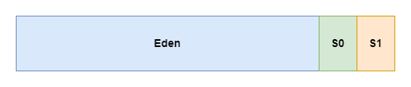

### 大对象直接进入老年代

大对象就是指需要 **大量连续内存空间** 的 Java 对象，比如很长的字符串，或者元素数量很庞大的数组

在分配空间时，大对象容易导致内存明明还有不少空间时就提前触发垃圾收集，以获取足够的连续空间才能安置好它们，而当复制对象时，大对象就意味着高额的内存复制开销

比一个大对象更糟糕的是一群短命的大对象

### 长期存活的对象将进入老年代

虚拟机给每个对象定义了一个对象年龄（Age）计数器。对象通常在 Eden 区里诞生，如果经过第一次 Minor GC 后仍然存活，并且能被 Survivor 容纳的话，该对象会被移动到 Survivor 空间中，并且将其对象年龄设为 1 岁。对象在 Survivor 区中每熬过一次 Minor GC，年龄就增加 1 岁，当它的年龄增加到一定程度（默认为 15），就会被晋升到老年代中

### 动态对象年龄判定

如果在 Survivor 空间中相同年龄所有对象大小的总和大于 Survivor 空间的一半，年龄大于或等于该年龄的对象就可以直接进入老年代

### 空间分配担保

当 Survivor 空间不足以容纳一次 Minor GC 之后存活的对象时，就需要依赖其他内存区域（实际上大多就是老年代）进行分配担保（Handle Promotion）

在发生 Minor GC 之前，虚拟机必须先检查老年代最大可用的连续空间是否大于新生代所有对象总空间，如果这个条件成立，那这一次 Minor GC 可以确保是安全的

如果不成立，则虚拟机会先检查是否允许担保失败。如果允许，那会继续检查老年代最大可用的连续空间是否大于历次晋升到老年代对象的平均大小，如果大于，将尝试进行一次 Minor GC，尽管这次 Minor GC 是有风险的；如果小于或者不允许，那这时就要改为进行一次 Full GC

#### 风险

新生代使用复制收集算法，但为了内存利用率，只使用其中一个 Survivor 空间来作为轮换备份，因此当出现大量对象在 Minor GC 后仍然存活的情况，且 Survivor 空间无法全部容纳，就需要老年代进行分配担保。当然前提是老年代本身还有容纳这些对象的剩余空间，但一共有多少对象会在这次回收中活下来在实际完成内存回收之前是无法明确知道的，所以只能取之前每一次回收晋升到老年代对象容量的平均大小作为经验值，与老年代的剩余空间进行比较，决定是否进行 Full GC 来让老年代腾出更多空间

## 垃圾回收算法

### 标记-清除算法（Mark-Sweep）

最早出现也是最基础的垃圾收集算法，算法分为标记和清除两个阶段：首先标记出所有需要回收的对象，在标记完成后，统一回收掉所有被标记的对象，也可以反过来，标记存活的对象，统一回收所有未被标记的对象

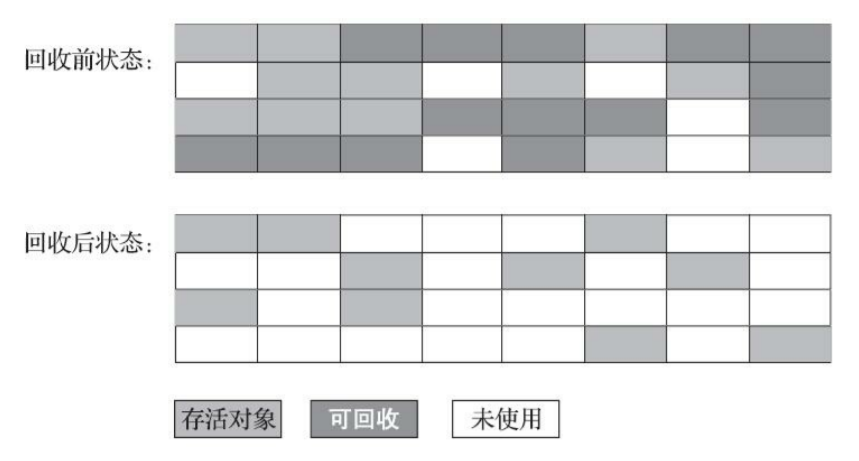

<small>*[深入理解Java虚拟机（第3版） - 图3-2 “标记-清除”算法示意图](https://book.douban.com/subject/34907497/)*</small>

后续的收集算法大多都是以标记-清除算法为基础，对其缺点进行改进而得到的。它的主要缺点有两个

- 执行效率不稳定，如果堆中包含大量对象，而且其中大部分是需要被回收的，这时必须进行大量标记和清除的动作，导致标记和清除两个过程的执行效率都随对象数量增长而降低
- 内存空间的碎片化，标记、清除之后会产生大量不连续的内存碎片，空间碎片太多可能会导致当以后在程序运行过程中需要分配较大对象时无法找到足够的连续内存而不得不提前触发另一次垃圾收集动作

### 标记-复制算法（Copying）

为了解决标记-清除算法面对大量可回收对象时执行效率低的问题，复制算法将可用内存按容量划分为大小相等的两块，每次只使用其中的一块。当这一块的内存用完了，就将还存活着的对象复制到另外一块上面，然后再把已使用过的内存空间一次清理掉

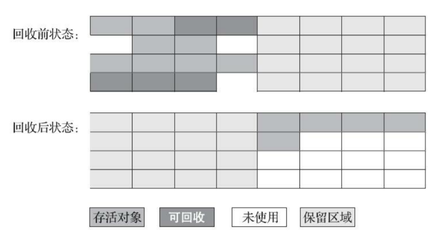

<small>*[深入理解Java虚拟机（第3版） - 图3-3 标记-复制算法示意图](https://book.douban.com/subject/34907497/)*</small>

如果内存中多数对象都是存活的，这种算法将会产生大量的内存间复制的开销，但对于多数对象都是可回收的情况，算法需要复制的就是占少数的存活对象，而且每次都是针对整个半区进行内存回收，分配内存时也就不用考虑有空间碎片的复杂情况，只要移动堆顶指针，按顺序分配即可。这样实现简单，运行高效，不过其缺陷也显而易见，可用内存缩小为了原来的一半，空间浪费未免太多了一点

现在的商用 Java 虚拟机大多都优先采用了这种收集算法去回收新生代，新生代中的对象有 98% 熬不过第一轮收集，因此并不需要按照 1∶1 的比例来划分新生代的内存空间

### 标记-整理算法（Mark-Compact）

标记过程与标记-清除算法一样，但后续步骤不是直接对可回收对象进行清理，而是让所有存活的对象都向内存空间一端移动，然后直接清理掉边界以外的内存

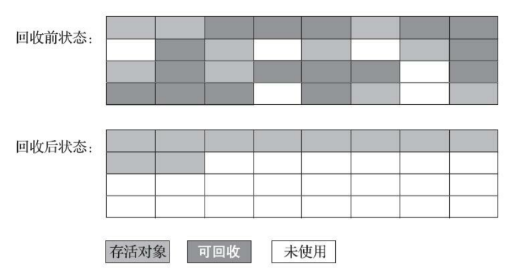

<small>*[深入理解Java虚拟机（第3版） - 图3-4 “标记-整理”算法示意图](https://book.douban.com/subject/34907497/)*</small>

如果移动存活对象，尤其是在老年代这种每次回收都有大量对象存活区域，移动存活对象并更新所有引用这些对象的地方将会是一种极为负重的操作。但如果跟标记-清除算法那样完全不考虑移动和整理存活对象的话，弥散于堆中的存活对象导致的空间碎片化问题就只能依赖更为复杂的内存分配器和内存访问器来解决

是否移动对象都存在弊端，移动则内存回收时会更复杂，不移动则内存分配时会更复杂。从垃圾收集的停顿时间来看，不移动对象停顿时间会更短，甚至可以不需要停顿，但是从整个程序的吞吐量来看，移动对象会更划算

## Hotspot 算法实现

### 根节点枚举

固定可作为GC Roots的节点主要在全局性的引用（例如常量或类静态属性）与执行上下文（例如栈帧中的本地变量表）中，尽管目标明确，但查找过程要做到高效并非一件容易的事情，现在Java应用越做越庞大，光是方法区的大小就常有数百上千兆，里面的类、常量等更是恒河沙数，若要逐个检查以这里为起源的引用肯定得消耗不少时间

迄今为止，所有收集器在根节点枚举这一步骤时都是必须暂停用户线程的，但根节点枚举始终还是必须在一个能保障一致性的快照中才得以进行——这里“一致性”的意思是整个枚举期间执行子系统看起来就像被冻结在某个时间点上，不会出现分析过程中，根节点集合的对象引用关系还在不断变化的情况，若这点不能满足的话，分析结果准确性也就无法保证。这是导致垃圾收集过程必须停顿所有用户线程的其中一个重要原因，即使是号称停顿时间可控，或者（几乎）不会发生停顿的CMS、G1、ZGC等收集器，枚举根节点时也是必须要停顿的

由于目前主流Java虚拟机使用的都是准确式垃圾收集，所以当用户线程停顿下来之后，其实并不需要一个不漏地检查完所有执行上下文和全局的引用位置，虚拟机应当是有办法直接得到哪些地方存放着对象引用的。在HotSpot的解决方案里，是使用一组称为OopMap的数据结构来达到这个目的。一旦类加载动作完成的时候，HotSpot就会把对象内什么偏移量上是什么类型的数据计算出来，在即时编译过程中，也会在特定的位置记录下栈里和寄存器里哪些位置是引用。这样收集器在扫描时就可以直接得知这些信息了，并不需要真正一个不漏地从方法区等GC Roots开始查找

### 安全点

在OopMap的协助下，HotSpot可以快速准确地完成GC Roots枚举，但一个很现实的问题随之而来：可能导致引用关系变化，或者说导致OopMap内容变化的指令非常多，如果为每一条指令都生成对应的OopMap，那将会需要大量的额外存储空间

实际上HotSpot也的确没有为每条指令都生成OopMap，前面已经提到，只是在“特定的位置”记录了这些信息，这些位置被称为安全点（Safepoint）。有了安全点的设定，也就决定了用户程序执行时并非在代码指令流的任意位置都能够停顿下来开始垃圾收集，而是强制要求必须执行到达安全点后才能够暂停。因此，安全点的选定既不能太少以至于让收集器等待时间过长，也不能太过频繁以至于过分增大运行时的内存负荷

安全点位置的选取基本上是以“是否具有让程序长时间执行的特征”为标准进行选定的，因为每条指令执行的时间都非常短暂，程序不太可能因为指令流长度太长这样的原因而长时间执行，“长时间执行”的最明显特征就是指令序列的复用，例如方法调用、循环跳转、异常跳转等都属于指令序列复用，所以只有具有这些功能的指令才会产生安全点

对于安全点，另外一个需要考虑的问题是，如何在垃圾收集发生时让所有线程（这里其实不包括执行JNI调用的线程）都跑到最近的安全点，然后停顿下来

- 抢先式中断（Preemptive Suspension）：不需要线程的执行代码主动去配合，在垃圾收集发生时，系统首先把所有用户线程全部中断，如果发现有用户线程中断的地方不在安全点上，就恢复这条线程执行，让它一会再重新中断，直到跑到安全点上。现在几乎没有虚拟机实现采用抢先式中断来暂停线程响应GC事件
- 主动式中断（Voluntary Suspension）：当垃圾收集需要中断线程的时候，不直接对线程操作，仅仅简单地设置一个标志位，各个线程执行过程时会不停地主动去轮询这个标志，一旦发现中断标志为真时就自己在最近的安全点上主动中断挂起。轮询标志的地方和安全点是重合的，另外还要加上所有创建对象和其他需要在Java堆上分配内存的地方，这是为了检查是否即将要发生垃圾收集，避免没有足够内存分配新对象
  - 由于轮询操作在代码中会频繁出现，这要求它必须足够高效。HotSpot使用内存保护陷阱的方式，把轮询操作精简至只有一条汇编指令的程度

### 安全区域

安全点机制保证了程序执行时，在不太长的时间内就会遇到可进入垃圾收集过程的安全点。但是，程序“不执行”的时候呢？所谓的程序不执行就是没有分配处理器时间，典型的场景便是用户线程处于Sleep状态或者Blocked状态，这时候线程无法响应虚拟机的中断请求，不能再走到安全的地方去中断挂起自己，虚拟机也显然不可能持续等待线程重新被激活分配处理器时间。对于这种情况，就必须引入安全区域（Safe Region）来解决

安全区域是指能够确保在某一段代码片段之中，引用关系不会发生变化，因此，在这个区域中任意地方开始垃圾收集都是安全的。我们也可以把安全区域看作被扩展拉伸了的安全点

当用户线程执行到安全区域里面的代码时，首先会标识自己已经进入了安全区域，那样当这段时间里虚拟机要发起垃圾收集时就不必去管这些已声明自己在安全区域内的线程了。当线程要离开安全区域时，它要检查虚拟机是否已经完成了根节点枚举（或者垃圾收集过程中其他需要暂停用户线程的阶段），如果完成了，那线程就当作没事发生过，继续执行；否则它就必须一直等待，直到收到可以离开安全区域的信号为止

### 记忆集与卡表

为解决对象跨代引用所带来的问题，垃圾收集器在新生代中建立了名为记忆集（Remembered Set）的数据结构，用以避免把整个老年代加进GC Roots扫描范围。事实上并不只是新生代、老年代之间才有跨代引用的问题，所有涉及部分区域收集（Partial GC）行为的垃圾收集器，典型的如G1、ZGC和Shenandoah收集器，都会面临相同的问题

记忆集是一种用于记录从非收集区域指向收集区域的指针集合的抽象数据结构。如果我们不考虑效率和成本的话，最简单的实现可以用非收集区域中所有含跨代引用的对象数组来实现这个数据结构

## 垃圾收集器

### Serial 收集器

Serial 收集器是最基础、历史最悠久的收集器。这个收集器是一个单线程工作的收集器，但它的单线程的意义并不仅仅是说明它只会使用一个处理器或一条收集线程去完成垃圾收集工作，更重要的是强调在它进行垃圾收集时，必须暂停其他所有工作线程（Stop The World），直到它收集结束

- 在越来越构思精巧，越来越优秀，也越来越复杂的垃圾收集器不断涌现，用户线程的停顿时间在持续缩短，但是仍然没有办法彻底消除

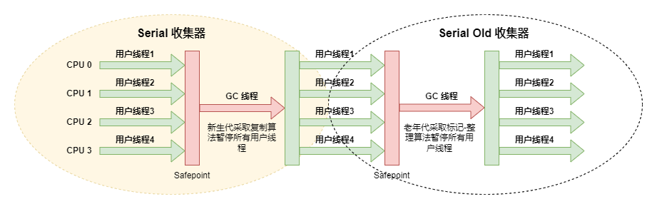

Serial 收集器依然是客户端模式下默认的新生代收集器，简单而高效（与其他收集器的单线程相比），对于内存资源受限的环境，它是所有收集器里额外内存消耗最小的；对于单核处理器或处理器核心数较少的环境来说，Serial 收集器由于没有线程交互的开销，专心做垃圾收集自然可以获得最高的单线程收集效率

### ParNew 收集器

实质上是 Serial 收集器的多线程并行版本，在实现上这两种收集器也共用了相当多的代码

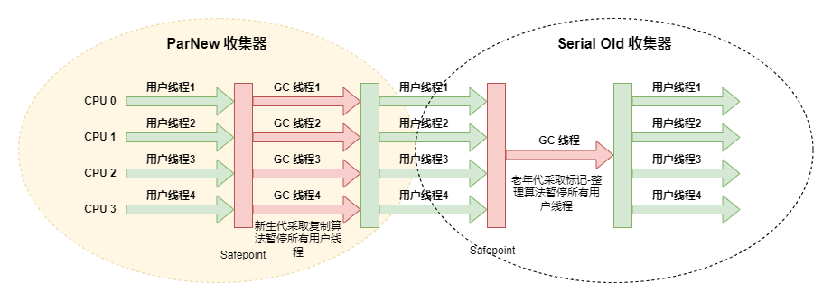

是不少运行在服务端模式下虚拟机的首选收集器，尤其是 JDK1.7 之前的遗留系统，其中有一个与功能、性能无关但其实很重要的原因是：除了 Serial 收集器外，目前只有它能与 CMS 收集器配合工作

### Parallel Scavenge 收集器

基于标记-复制算法实现的收集器，是一款新生代收集器，也是能够并行收集的多线程收集器

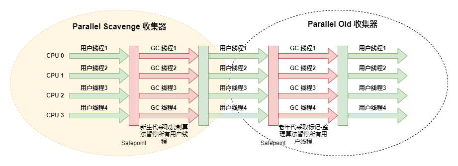

它的关注点与其他收集器不同，CMS 等收集器的关注点是尽可能地缩短垃圾收集时用户线程的停顿时间，而 Parallel Scavenge 收集器的目标则是达到一个可控制的吞吐量（Throughput）。所谓吞吐量就是处理器用于运行用户代码的时间与处理器总消耗时间的比值

停顿时间越短就越适合需要与用户交互或需要保证服务响应质量的程序，良好的响应速度能提升用户体验；而高吞吐量则可以最高效率地利用处理器资源，尽快完成程序的运算任务，主要适合在后台运算而不需要太多交互的分析任务

### Serial Old 收集器

Serial Old 是 Serial 收集器的老年代版本，它同样是一个单线程收集器，使用标记-整理算法。这个收集器的主要意义也是供客户端模式下的虚拟机使用。如果在服务端模式下，它也可能有两种用途：一种是在 JDK1.5 以及之前的版本中与 Parallel Scavenge 收集器搭配使用，另外一种就是作为 CMS 收集器发生失败时的后备预案

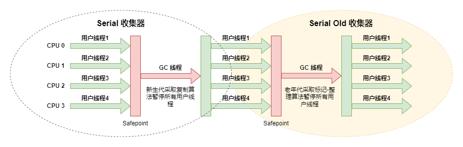

### Parallel Old 收集器

Parallel Scavenge 收集器的老年代版本，支持多线程并发收集，基于标记-整理算法实现

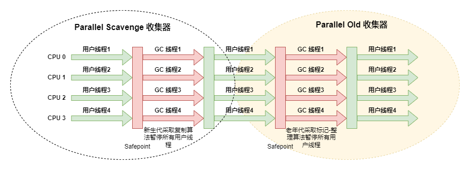

直到 Parallel Old 收集器出现后，吞吐量优先收集器终于有了比较名副其实的搭配组合，在注重吞吐量或者处理器资源较为稀缺的场合，都可以优先考虑 Parallel Scavenge 加 Parallel Old 收集器这个组合

- Parallel Scavenge 与 Parallel Old 也是 JDK1.8 默认收集器

### CMS 收集器

CMS（Concurrent Mark Sweep）收集器是一种以获取最短回收停顿时间为目标的收集器。目前很大一部分的 Java 应用集中在互联网网站或者基于浏览器的 B/S 系统的服务端上，这类应用通常都会较为关注服务的响应速度，希望系统停顿时间尽可能短，以给用户带来良好的交互体验。CMS 收集器就非常符合这类应用的需求

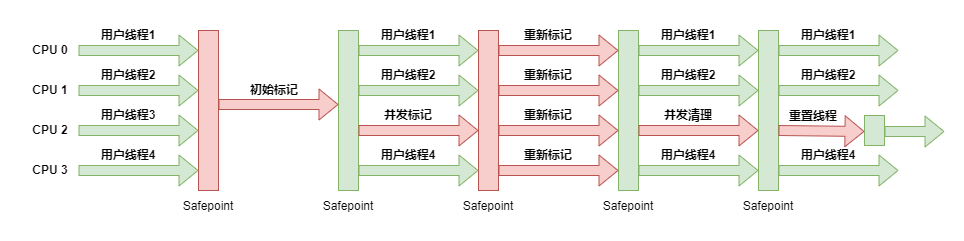

1. 初始标记：仅仅只是标记一下 GC Roots 能直接关联到的对象，速度很快
2. 并发标记：是从 GC Roots 的直接关联对象开始遍历整个对象图的过程，这个过程耗时较长但是不需要停顿用户线程，可以与垃圾收集线程一起并发运行
3. 重新标记：是为了修正并发标记期间，因用户程序继续运作而导致标记产生变动的那一部分对象的标记记录，这个阶段的停顿时间通常会比初始标记阶段稍长一些，但也远比并发标记阶段的时间短
4. 并发清除：清理删除掉标记阶段判断的已经死亡的对象，由于不需要移动存活对象，所以这个阶段也是可以与用户线程同时并发的

由于在整个过程中耗时最长的并发标记和并发清除阶段中，垃圾收集器线程都可以与用户线程一起工作，所以从总体上来说，CMS 收集器的内存回收过程是与用户线程一起并发执行的

#### 缺点

##### 对处理器资源非常敏感

事实上，面向并发设计的程序都对处理器资源比较敏感。在并发阶段，它虽然不会导致用户线程停顿，但却会因为占用了一部分线程（或者说处理器的计算能力）而导致应用程序变慢，降低总吞吐量

##### 无法处理浮动垃圾（Floating Garbage）

在 CMS 的并发标记和并发清理阶段，用户线程是还在继续运行的，程序在运行自然就还会伴随有新的垃圾对象不断产生，但这一部分垃圾对象是出现在标记过程结束以后，CMS 无法在当次收集中处理掉它们，只好留待下一次垃圾收集时再清理掉

##### 空间碎片

款基于标记-清除算法实现的收集器，收集结束时会有大量空间碎片产生

### Garbage First （G1）收集器

G1 是一款主要面向服务端应用的垃圾收集器。在G1收集器出现之前的所有其他收集器，包括 CMS 在内，垃圾收集的目标范围要么是整个新生代（Minor GC），要么就是整个老年代（Major GC），再要么就是整个堆（Full GC）。而 G1 可以面向堆内存任何部分来组成回收集（Collection Set，CSet）进行回收，衡量标准不再是它属于哪个分代，而是哪块内存中存放的垃圾数量最多，回收收益最大，这就是 G1 收集器的 Mixed GC 模式

G1 开创了基于 Region 的堆内存布局，G1 不再坚持固定大小以及固定数量的分代区域划分，而是把堆划分为多个大小相等的独立区域（Region），每一个 Region 都可以根据需要，扮演新生代的 Eden 空间、Survivor 空间，或者老年代空间。收集器能够对扮演不同角色的 Region 采用不同的策略去处理

Region 中还有一类特殊的 Humongous 区域，专门用来存储大对象。G1 认为只要大小超过了一个 Region 容量一半的对象即可判定为大对象。而对于那些超过了整个 Region 容量的超级大对象，将会被存放在多个连续的 Humongous Region 之中，G1 会把 Humongous Region 作为老年代的一部分来进行看待

G1 收集器之所以能建立可预测的停顿时间模型，是因为它将 Region 作为单次回收的最小单元，即每次收集到的内存空间都是 Region 大小的整数倍，这样可以有计划地避免在整个堆中进行全区域的垃圾收集。更具体的处理思路是让 G1 收集器去跟踪各个 Region 里面的垃圾堆积的价值大小，价值即回收所获得的空间大小以及回收所需时间的经验值，然后在后台维护一个优先级列表，每次根据用户设定允许的收集停顿时间（默认值是 200 毫秒），优先处理回收价值收益最大的那些Region，这也就是 Garbage First 名字的由来

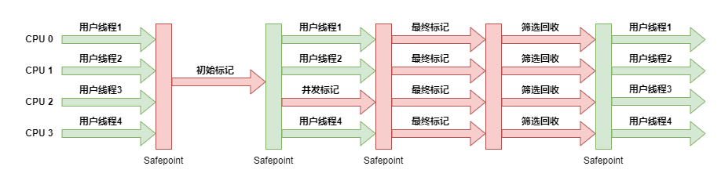

1. 初始标记（Initial Marking）：标记一下 GC Roots 能直接关联到的对象，需要停顿线程，但耗时很短
2. 并发标记（Concurrent Marking）：从 GC Roots 开始对堆中对象进行可达性分析，递归扫描整个堆里的对象图，找出要回收的对象，这阶段耗时较长，但可与用户程序并发执行
3. 最终标记（Final Marking）：对用户线程做另一个短暂的暂停，用于处理并发阶段结束后仍遗留下来的最后那少量的 SATB 记录
4. 筛选回收（Live Data Counting and Evacuation）：负责更新 Region 的统计数据，对各个 Region 的回收价值和成本进行排序，根据用户所期望的停顿时间来制定回收计划，可以自由选择任意多个 Region 构成回收集，然后把决定回收的那一部分 Region 的存活对象复制到空的 Region 中，再清理掉整个旧 Region 的全部空间。这里的操作涉及存活对象的移动，是必须暂停用户线程，由多条收集器线程并行
完成的

### Shenandoah 收集器

### ZGC 收集器