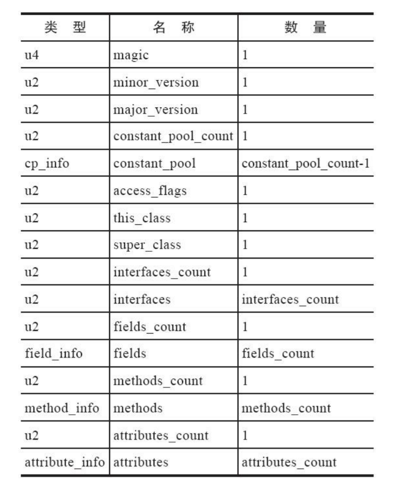
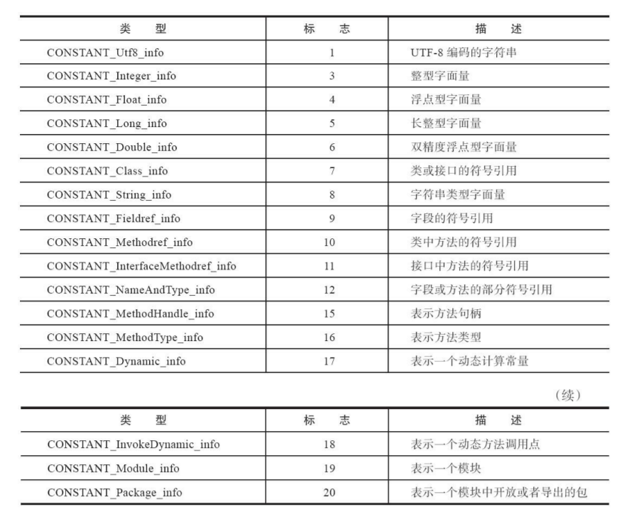
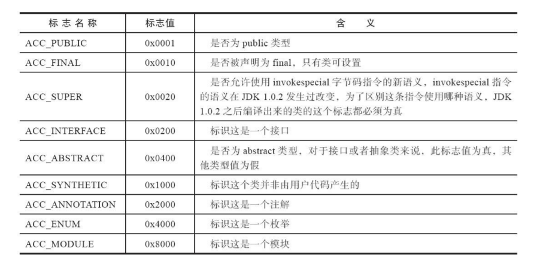
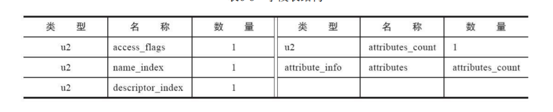
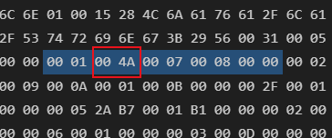
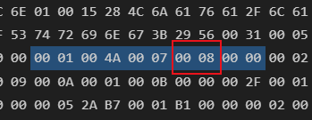
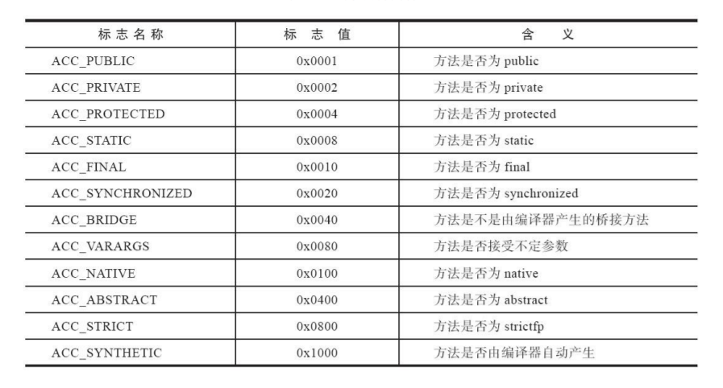
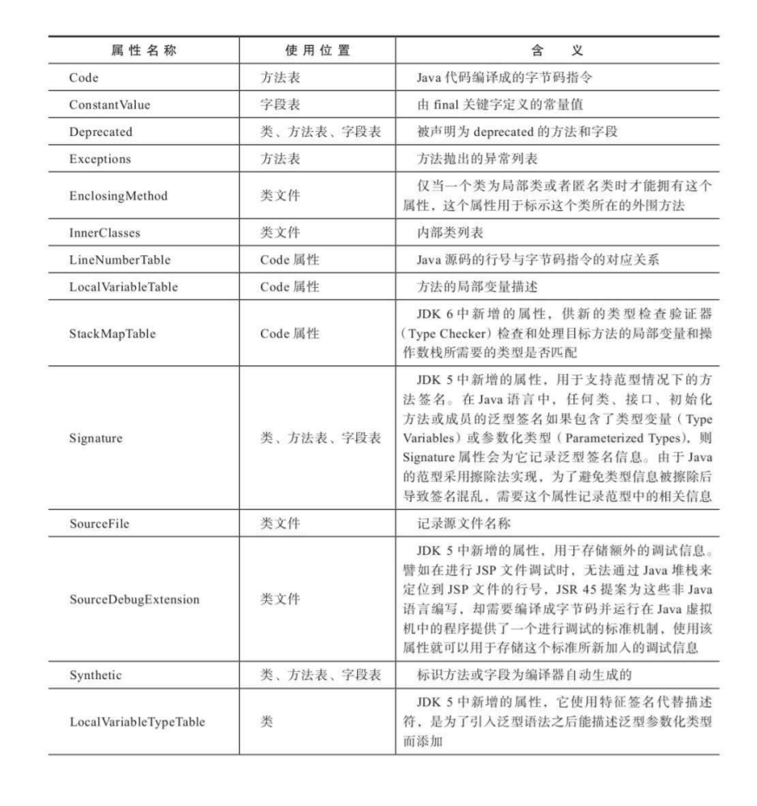
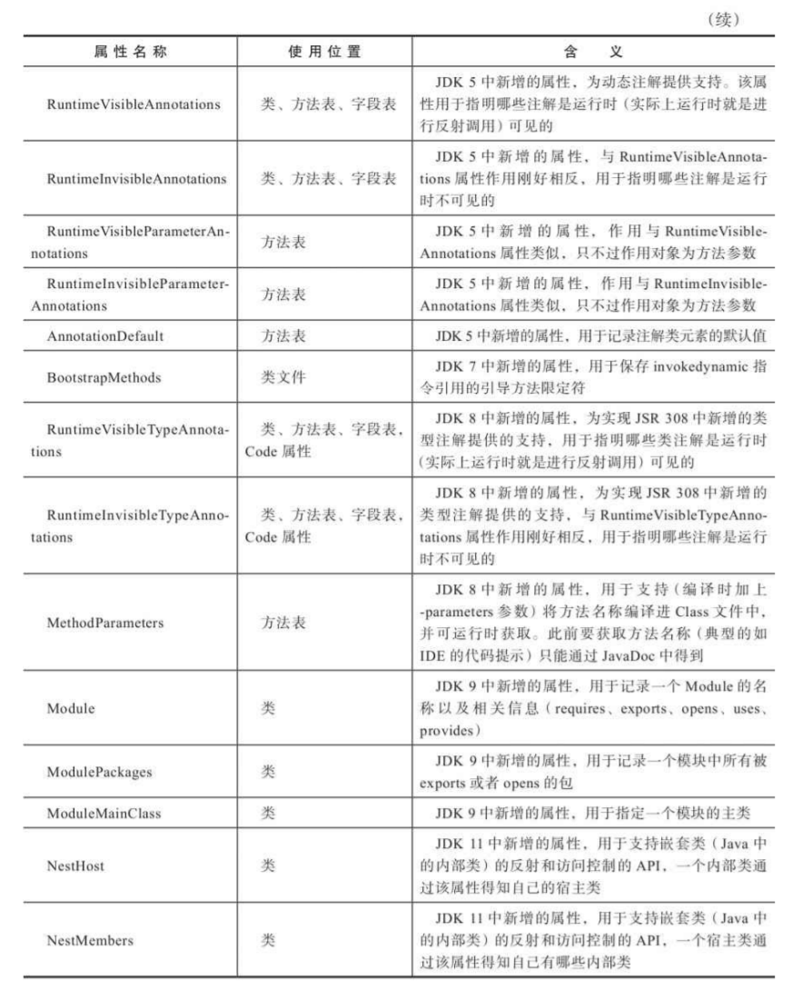

# Class 类文件的结构

Class 文件是一组以 8 个字节为基础单位的二进制流，各个数据项目严格按照顺序紧凑地排列在文件之中，中间没有添加任何分隔符，这使得整个Class文件中存储的内容几乎全部是程序运行的必要数据，没有空隙存在。当遇到需要占用8个字节以上空间的数据项时，则会按照高位在前的方式分割成若干个8个字节进行存储

Class文件格式采用一种类似于C语言结构体的伪结构来存储数据，这种伪结构中只有两种数据类型：“无符号数”和“表”

- 无符号数属于基本的数据类型，以u1、u2、u4、u8来分别代表1个字节、2个字节、4个字节和8个字节的无符号数，无符号数可以用来描述数字、索引引用、数量值或者按照UTF-8编码构成字符串值
- 表是由多个无符号数或者其他表作为数据项构成的复合数据类型，为了便于区分，所有表的命名都习惯性地以“_info”结尾。表用于描述有层次关系的复合结构的数据，整个Class文件本质上也可以视作是一张表

- 无论是无符号数还是表，当需要描述同一类型但数量不定的多个数据时，经常会使用一个前置的容量计数器加若干个连续的数据项的形式，这时候称这一系列连续的某一类型的数据为某一类型的“集合”

## 魔数与 Class 文件的版本

每个Class文件的头4个字节被称为魔数（Magic Number），它的唯一作用是确定这个文件是否为一个能被虚拟机接受的Class文件

- 使用魔数而不是扩展名来进行识别主要是基于安全考虑，因为文件扩展名可以随意改动。文件格式的制定者可以自由地选择魔数值，只要这个魔数值还没有被广泛采用过而且不会引起混淆

Class文件的魔数取得很有“浪漫气息”，值为0xCAFEBABE（咖啡宝贝？）

紧接着魔数的4个字节存储的是Class文件的版本号：第5和第6个字节是次版本号（Minor Version），第7和第8个字节是主版本号（Major Version）。Java的版本号是从45开始的，JDK 1.1之后的每个JDK大版本发布主版本号向上加1（JDK 1.0～1.1使用了45.0～45.3的版本号），高版本的JDK能向下兼容以前版本的Class文件，但不能运行以后版本的Class文件，因为《Java虚拟机规范》在Class文件校验部分明确要求了即使文件格式并未发生任何变化，虚拟机也必须拒绝执行超过其版本号的Class文件

### 常量池

紧接着主、次版本号之后的是常量池入口，常量池可以比喻为Class文件里的资源仓库，它是Class文件结构中与其他项目关联最多的数据，通常也是占用Class文件空间最大的数据项目之一，另外，它还是在Class文件中第一个出现的表类型数据项目

由于常量池中常量的数量是不固定的，所以在常量池的入口需要放置一项u2类型的数据，代表常量池容量计数值（constant_pool_count）。与Java中语言习惯不同，这个容量计数是从1而不是0开始的

- 在Class文件格式规范制定之时，设计者将第0项常量空出来是有特殊考虑的，这样做的目的在于，如果后面某些指向常量池的索引值的数据在特定情况下需要表达“不引用任何一个常量池项目”的含义，可以把索引值设置为0来表示
- Class文件结构中只有常量池的容量计数是从1开始

常量池中主要存放两大类常量：字面量（Literal）和符号引用（Symbolic References）。字面量比较接近于Java语言层面的常量概念，如文本字符串、被声明为final的常量值等。而符号引用则属于编译原理方面的概念，主要包括下面几类常量

- 被模块导出或者开放的包
- 类和接口的全限定名
- 字段的名称和描述符
- 方法的名称和描述符
- 方法句柄和方法类型
- 动态调用点和动态常量

在Class文件中不会保存各个方法、字段最终在内存中的布局信息，这些字段、方法的符号引用不经过虚拟机在运行期转换的话是无法得到真正的内存入口地址，也就无法直接被虚拟机使用的。当虚拟机做类加载时，将会从常量池获得对应的符号引用，再在类创建时或运行时解析、翻译到具体的内存地址之中

常量池中每一项常量都是一个表，常量表中分别有17种不同类型的常量。这17类表都有一个共同的特点，表结构起始的第一位是个u1类型的标志位，代表着当前常量属于哪种常量类型

### 访问标志

在常量池结束之后，紧接着的2个字节代表访问标志（access_flags），这个标志用于识别一些类或者接口层次的访问信息

### 类索引、父类索引与接口索引集合

类索引（this_class）和父类索引（super_class）都是一个u2类型的数据，而接口索引集合（interfaces）是一组u2类型的数据的集合，Class文件中由这三项数据来确定该类型的继承关系。类索引用于确定这个类的全限定名，父类索引用于确定这个类的父类的全限定名。由于Java语言不允许多重继承，所以父类索引只有一个，除了java.lang.Object之外，所有的Java类都有父类，因此除了java.lang.Object外，所有Java类的父类索引都不为0。接口索引集合就用来描述这个类实现了哪些接口，这些被实现的接口将按implements关键字（如果这个Class文件表示的是一个接口，则应当是
extends关键字）后的接口顺序从左到右排列在接口索引集合中

### 字段表集合

字段表（field_info）用于描述接口或者类中声明的变量。Java语言中的“字段”（Field）包括类级变量以及实例级变量，但不包括在方法内部声明的局部变量

字段可以包括的修饰符有字段的作用域（public、private、protected修饰符）、是实例变量还是类变量（static修饰符）、可变性（final）、并发可见性（volatile修饰符，是否强制从主内存读写）、可否被序列化（transient修饰符）、字段数据类型（基本类型、对象、数组）、字段名称

#### access_flags

字段修饰符放在access_flags项目中

#### name_index

对常量池项的引用，代表着字段的简单名称。没有类型和参数修饰的方法或者字段名称

#### descriptor_index

对常量池项的引用，代表着字段和方法的描述符

全限定名仅仅是把类全名中的“.”替换成了“/”而已，为了使连续的多个全限定名之间不产生混淆，在使用时最后一般会加入一个“；”号表示全限定结束

描述符的作用是用来描述字段的数据类型、方法的参数列表（包括数量、类型以及顺序）和返回值。根据描述符规则，基本数据类型（byte、char、double、float、int、long、short、boolean）以及代表无返回值的void类型都用一个大写字符来表示，而对象类型则用字符L加对象的全限定名来表示

对于数组类型，每一维度将使用一个前置的“[”字符来描述，如一个定义为“java.lang.String[][]”类型的二维数组将被记录成“[[Ljava/lang/String；”，一个整型数组“int[]”将被记录成“[I”

用描述符来描述方法时，按照先参数列表、后返回值的顺序描述，参数列表按照参数的严格顺序放在一组小括号“()”之内。如方法void inc()的描述符为“()V”，方法java.lang.String toString()的描述符为“()Ljava/lang/String；”，方法int indexOf(char[]source，int sourceOffset，int sourceCount，char[]target，int targetOffset，int targetCount，int fromIndex)的描述符为“([CII[CIII)I

#### attributes_count 与 attributes

字段表所包含的固定数据项目到descriptor_index为止就全部结束了，不过在descrip-tor_index之后跟随着一个属性表集合，用于存储一些额外的信息，字段表可以在属性表中附加描述零至多项的额外信息

### 方法表集合

Class文件存储格式中对方法的描述与对字段的描述采用了几乎完全一致的方式，方法表的结构如同字段表一样。仅在访问标志和属性表集合的可选项中有所区别

因为volatile关键字和transient关键字不能修饰方法，所以方法表的访问标志中没有了ACC_VOLATILE标志和ACC_TRANSIENT标志。与之相对，synchronized、native、strictfp和abstract关键字可以修饰方法，方法表的访问标志中也相应地增加了ACC_SYNCHRONIZED、ACC_NATIVE、ACC_STRICTFP和ACC_ABSTRACT标志

方法里的Java代码，经过Javac编译器编译成字节码指令之后，存放在方法属性表集合中一个名为“Code”的属性里面，属性表作为Class文件格式中最具扩展性的一种数据项目

与字段表集合相对应地，如果父类方法在子类中没有被重写（Override），方法表集合中就不会出现来自父类的方法信息。但同样地，有可能会出现由编译器自动添加的方法，最常见的便是类构造器“<clinit>()”方法和实例构造器“<init>()”方法

### 属性表集合

属性表（attribute_info）在前面的讲解之中已经出现过数次，Class文件、字段表、方法表都可以携带自己的属性表集合，以描述某些场景专有的信息

与Class文件中其他的数据项目要求严格的顺序、长度和内容不同，属性表集合的限制稍微宽松一些，不再要求各个属性表具有严格顺序，并且《Java虚拟机规范》允许只要不与已有属性名重复，任何人实现的编译器都可以向属性表中写入自己定义的属性信息，Java虚拟机运行时会忽略掉它不认识的属性

