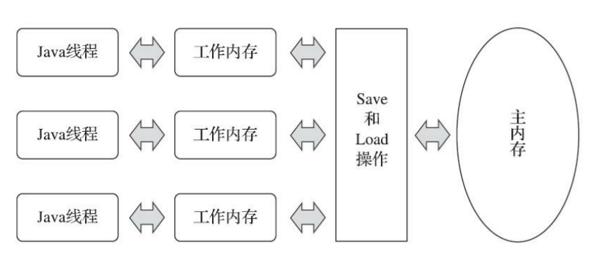

# Java 内存模型

Java 内存模型（Java Memory Model）的主要目的是定义程序中各种变量的访问规则，即关注在虚拟机中把变量值存储到内存和从内存中取出变量值这样的底层细节

## 主内存与工作内存

Java 内存模型规定了 **所有的变量都存储在主内存**（Main Memory）中（虚拟机内存的一部分）。**每条线程还有自己的工作内存**（Working Memory），线程的工作内存中保存了被该线程使用的变量的主内存副本，**线程对变量的所有操作都必须在工作内存中进行**，而不能直接读写主内存中的数据。**不同的线程之间也无法直接访问对方工作内存中的变量，线程间变量值的传递均需要通过主内存来完成**



<small>*[深入理解Java虚拟机（第3版） - 图12-2 线程、主内存、工作内存三者的交互关系](https://book.douban.com/subject/34907497/)*</small>

## 内存间交互操作

关于主内存与工作内存之间具体的交互协议，Java 内存模型中定义了以下 8 种操作来完成。JVM 实现时必须保证下面提及的每一种操作都是原子的、不可再分的

- 作用于主内存的变量
  - lock（锁定）：把一个变量标识为一条线程独占的状态
  - unlock（解锁）：把一个处于锁定状态的变量释放出来，释放后的变量才可以被其他线程锁定
  - read（读取）：把一个变量的值从主内存传输到线程的工作内存中，以便随后的 load 动作使用
  - write（写入）：把 store 操作从工作内存中得到的变量的值放入主内存的变量中
- 作用于工作内存的变量
  - load（载入）：把 read 操作从主内存中得到的变量值放入工作内存的变量副本中
  - use（使用）：把工作内存中一个变量的值传递给执行引擎，每当虚拟机遇到一个需要使用变量的值的字节码指令时将会执行这个操作
  - assign（赋值）：把一个从执行引擎接收的值赋给工作内存的变量，每当虚拟机遇到一个给变量赋值的字节码指令时执行这个操作
  - store（存储）：把工作内存中一个变量的值传送到主内存中，以便随后的 write 操作使用

如果要把一个变量从主内存拷贝到工作内存，那就要按顺序执行 read 和 load 操作，如果要把变量从工作内存同步回主内存，就要按顺序执行 store 和 write 操作。Java 内存模型只要求上述两个操作必须按顺序执行，但不要求是连续执行，中间可插入其他指令

Java 内存模型还规定了在执行上述 8 种基本操作时必须满足如下规则

- 不允许 read 和 load、store 和 write 操作之一单独出现，即不允许一个变量从主内存读取了但工作内存不接受，或者工作内存发起回写了但主内存不接受的情况出现
- 不允许一个线程丢弃它最近的 assign 操作，即变量在工作内存中改变了之后必须把该变化同步回主内存
- 不允许一个线程无原因地（没有发生过任何 assign 操作）把数据从线程的工作内存同步回主内存中
- 一个新的变量只能在主内存中诞生，不允许在工作内存中直接使用一个未被初始化（load 或 assign）的变量，换句话说就是对一个变量实施 use、store 操作之前，必须先执行 assign 和 load 操作
- 一个变量在同一个时刻只允许一条线程对其进行 lock 操作，但 lock 操作可以被同一条线程重复执行多次，多次执行 lock 后，只有执行相同次数的 unlock 操作，变量才会被解锁
- 如果对一个变量执行 lock 操作，那将会清空工作内存中此变量的值，在执行引擎使用这个变量前，需要重新执行 load 或 assign 操作以初始化变量的值
- 如果一个变量事先没有被 lock 操作锁定，那就不允许对它执行 unlock 操作，也不允许去 unlock 一个被其他线程锁定的变量
- 对一个变量执行 unlock 操作之前，必须先把此变量同步回主内存中（执行 store、write 操作）

## 对于 volatile 型变量的特殊规则

关键字 volatile 可以说是 JVM 提供的最轻量级的同步机制，但是它并不容易被正确、完整地理解，以至于许多程序员都习惯去避免使用它，遇到需要处理多线程数据竞争问题的时候一律使用 synchronized 来进行同步

### volatile 特性

当一个变量被定义成 volatile 之后，它将具备两项特性

#### 保证线程间变量的可见性

被 volatile 修饰的变量，当一条线程修改了这个变量的值，新值对于其他线程来说是可以立即得知的。而普通变量并不能做到这一点，普通变量的值在线程间传递时均需要通过主内存来完成

线程对普通变量的更改不会立即同步到主内存，其他线程工作内存放的该变量的副本也不会立即更新。如果其他线程需要操作该变量，可能会读取到旧值


被 volatile 修饰的变量，会在本工作内存中修改完成后，立即强制将修改后的值刷新到主内存中。如果有其他线程存有该变量的副本，会被强制失效。如果其他线程需要操作该变量，就会从主内存中加载最新的值

##### 无法保证原子性

volatile 变量的运算在并发下一样是不安全的

```java
public class Test {

    private static volatile int race = 0;

    public static void incr() {
        race++;
    }

    public static void main(String[] args) {
        Thread[] arr = new Thread[20];

        for (int i = 0; i < arr.length; i++) {
            arr[i] = new Thread(() -> {
                for (int j = 0; j < 10000; j++) {
                    incr();
                }
            });
            arr[i].start();
        }

        while (Thread.activeCount() > 1) {
            Thread.yield();
        }
        System.out.println(race);
    }
}
```

该段代码的期望值为 200000，而实际执行得到的结果且千奇百怪，volatile 确实保证了可见性，但 `race++` 并不是一个原子操作，它需要先取值，再加 1，再写入到工作内存中

volatile 变量在不符合以下两条规则的运算场景中，需要通过加锁（或者使用原子类）来保证原子性

- 运算结果并不依赖变量的当前值，或者能够确保只有单一的线程修改变量的值
- 变量不需要与其他的状态变量共同参与不变约束

#### 禁止指令重排序

普通的变量仅会保证在该方法的执行过程中所有依赖赋值结果的地方都能获取到正确的结果，而不能保证变量赋值操作的顺序与程序代码中的执行顺序一致。因为在同一个线程的方法执行过程中无法感知到这点，这就是Java内存模型中描述的所谓“线程内表现为串行的语义”（Within-Thread As-If-Serial Semantics）

那为何说它禁止指令重排序呢？从硬件架构上讲，指令重排序是指处理器采用了允许将多条指令不按程序规定的顺序分开发送给各个相应的电路单元进行处理。但并不是说指令任意重排，处理器必须能正确处理指令依赖情况保障程序能得出正确的执行结果。譬如指令1把地址A中的值加10，指令2把地址A中的值乘以2，指令3把地址B中的值减去3，这时指令1和指令2是有依赖的，它们之间的顺序不能重排——(A+10)*2与A*2+10显然不相等，但指令3可以重排到指令1、2之前或者中间，只要保证
处理器执行后面依赖到A、B值的操作时能获取正确的A和B值即可。所以在同一个处理器中，重排序过的代码看起来依然是有序的

## 针对 long 和 double 型变量的特殊规则

Java内存模型要求lock、unlock、read、load、assign、use、store、write这八种操作都具有原子性，但是对于64位的数据类型（long和double），在模型中特别定义了一条宽松的规定：允许虚拟机将没有被volatile修饰的64位数据的读写操作划分为两次32位的操作来进行，即允许虚拟机实现自行选择是否要保证64位数据类型的load、store、read和write这四个操作的原子性，这就是所谓的“long和double的非原子性协定”（Non-Atomic Treatment of double and long Variables）

如果有多个线程共享一个并未声明为volatile的long或double类型的变量，并且同时对它们进行读取和修改操作，那么某些线程可能会读取到一个既不是原值，也不是其他线程修改值的代表了“半个变量”的数值。不过这种读取到“半个变量”的情况是非常罕见的

## 原子性、可见性与有序性

### 原子性（Atomicity）

由Java内存模型来直接保证的原子性变量操作包括read、load、assign、use、store和write这六个，我们大致可以认为，基本数据类型的访问、读写都是具备原子性的（例外就是long和double的非原子性协定，读者只要知道这件事情就可以了，无须太过在意这些几乎不会发生的例外情况）

如果应用场景需要一个更大范围的原子性保证（经常会遇到），Java内存模型还提供了lock和unlock操作来满足这种需求，尽管虚拟机未把lock和unlock操作直接开放给用户使用，但是却提供了更高层次的字节码指令monitorenter和monitorexit来隐式地使用这两个操作。这两个字节码指令反映到Java代码中就是同步块——synchronized关键字，因此在synchronized块之间的操作也具备原子性

### 可见性（Visibility）

可见性就是指当一个线程修改了共享变量的值时，其他线程能够立即得知这个修改。

Java内存模型是通过在变量修改后将新值同步回主内
存，在变量读取前从主内存刷新变量值这种依赖主内存作为传递媒介的方式来实现可见性的，无论是普通变量还是volatile变量都是如此。普通变量与volatile变量的区别是，volatile的特殊规则保证了新值能立即同步到主内存，以及每次使用前立即从主内存刷新。因此我们可以说volatile保证了多线程操作时变量的可见性，而普通变量则不能保证这一点

除了volatile之外，Java还有两个关键字能实现可见性，它们是synchronized和final。同步块的可见性是由“对一个变量执行unlock操作之前，必须先把此变量同步回主内存中（执行store、write操作）”这条规则获得的。而final关键字的可见性是指：被final修饰的字段在构造器中一旦被初始化完成，并且构造器没有把“this”的引用传递出去（this引用逃逸是一件很危险的事情，其他线程有可能通过这个引用访问到“初始化了一半”的对象），那么在其他线程中就能看见final字段的值

### 有序性（Ordering）

Java程序中天然的有序性可以总结为一句话：如果在本线程内观察，所有的操作都是有序的；如果在一个线程中观察另一个线程，所有的操作都是无序的。前半句是指“线程内似表现为串行的语义”（Within-Thread As-If-Serial Semantics），后半句是指“指令重排序”现象和“工作内存与主内存同步延迟”现象

Java语言提供了volatile和synchronized两个关键字来保证线程之间操作的有序性，volatile关键字本身就包含了禁止指令重排序的语义，而synchronized则是由“一个变量在同一个时刻只允许一条线程对其进行lock操作”这条规则获得的，这个规则决定了持有同一个锁的两个同步块只能串行地进入

## 先行发生原则

如果Java内存模型中所有的有序性都仅靠volatile和synchronized来完成，那么有很多操作都将会变得非常啰嗦，但是我们在编写Java并发代码的时候并没有察觉到这一点，这是因为Java语言中有一个“先行发生”（Happens-Before）的原则

先行发生是Java内存模型中定义的两项操作之间的偏序关系，比如说操作A先行发生于操作B，其实就是说在发生操作B之前，操作A产生的影响能被操作B观察到，“影响”包括修改了内存中共享变量的值、发送了消息、调用了方法等

下面是Java内存模型下一些“天然的”先行发生关系，这些先行发生关系无须任何同步器协助就已经存在，可以在编码中直接使用。如果两个操作之间的关系不在此列，并且无法从下列规则推导出来，则它们就没有顺序性保障，虚拟机可以对它们随意地进行重排序

- 程序次序规则（Program Order Rule）：在一个线程内，按照控制流顺序，书写在前面的操作先行发生于书写在后面的操作。注意，这里说的是控制流顺序而不是程序代码顺序，因为要考虑分支、循环等结构
- 管程锁定规则（Monitor Lock Rule）：一个unlock操作先行发生于后面对同一个锁的lock操作。这里必须强调的是“同一个锁”，而“后面”是指时间上的先后
- volatile变量规则（Volatile Variable Rule）：对一个volatile变量的写操作先行发生于后面对这个变量的读操作，这里的“后面”同样是指时间上的先后
- 线程启动规则（Thread Start Rule）：Thread对象的start()方法先行发生于此线程的每一个动作
- 线程终止规则（Thread Termination Rule）：线程中的所有操作都先行发生于对此线程的终止检测
- 线程中断规则（Thread Interruption Rule）：对线程interrupt()方法的调用先行发生于被中断线程的代码检测到中断事件的发生
- 对象终结规则（Finalizer Rule）：一个对象的初始化完成（构造函数执行结束）先行发生于它的finalize()方法的开始
- 传递性（Transitivity）：如果操作A先行发生于操作B，操作B先行发生于操作C，那就可以得出操作A先行发生于操作C的结论

## 线程的实现

## 引用

- [图解volatile是如何保证可见性](https://juejin.cn/post/7032462314989338637)
