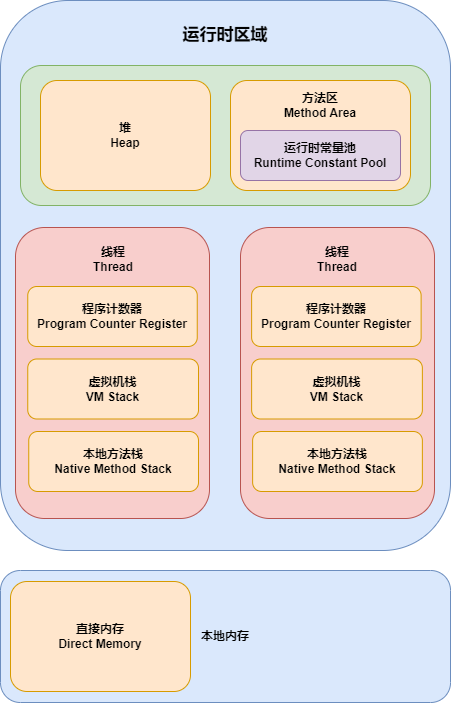
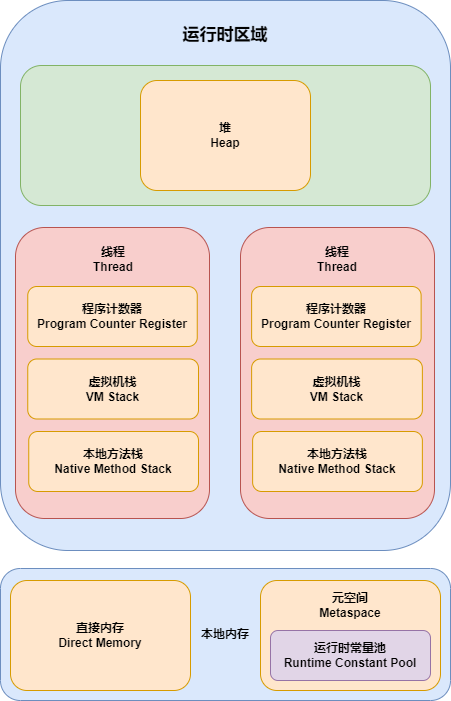
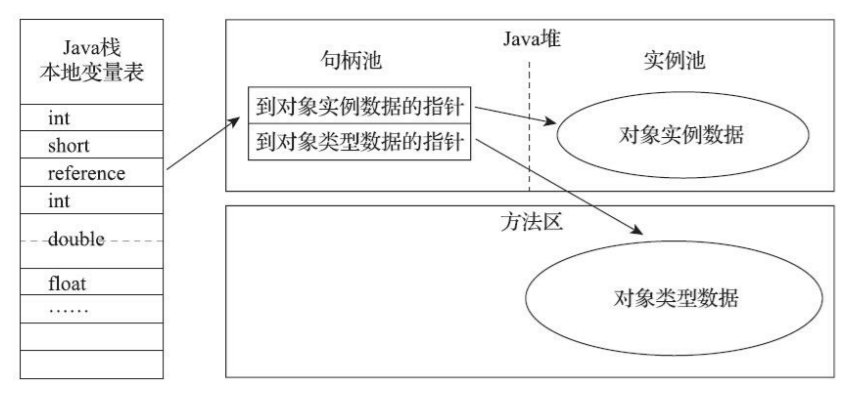
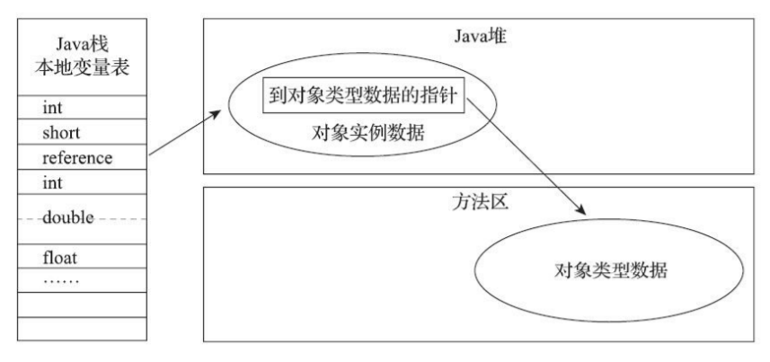
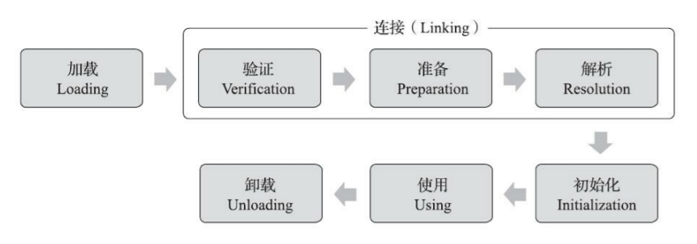

## 运行时数据区域

JVM 在执行 Java 程序的过程中会把它所管理的内存划分为若干个不同的数据区域

- JDK 1.7



- JDK 1.8



### 程序计数器（Program Counter Register）

程序计数器是一块较小的内存空间，可以看作是当前线程所执行的字节码的行号指示器

字节码解释器工作时就是通过改变这个计数器的值来选取下一条需要执行的字节码指令，它是程序控制流的指示器，分支、循环、跳转、异常处理、线程恢复等基础功能都需要依赖这个计数器来完成

为了线程切换后能恢复到正确的执行位置，每条线程都需要有一个独立的程序计数器，各条线程之间计数器互不影响，独立存储

- 此内存区域是唯一一个在虚拟机规范中没有规定任何 OutOfMemoryError 情况的区域

### 虚拟机栈（Virtual Machine Stack）

虚拟机栈描述的是 Java 方法执行的线程内存模型：每个方法被执行的时候，Java虚拟机都会同步创建一个栈帧（Stack Frame）用于存储局部变量表、操作数栈、动态连接、方法出口等信息。每一个方法被调用直至执行完毕的过程，就对应着一个栈帧在虚拟机栈中从入栈到出栈的过程

- 在虚拟机规范中，对这个内存区域规定了两类异常状况
  - 如果线程请求的栈深度大于虚拟机所允许的深度，将抛出 StackOverflowError 异常
  - 如果虚拟机栈容量可以动态扩展，当栈扩展时无法申请到足够的内存会抛出 OutOfMemoryError 异常

### 本地方法栈（Native Method Stack）

本地方法栈与虚拟机栈所发挥的作用是非常相似的，区别是虚拟机栈为虚拟机执行 Java 方法（也就是字节码）服务，而本地方法栈则是为虚拟机使用到的本地方法服务

- 与虚拟机栈一样，本地方法栈也会在栈深度溢出或者栈扩展失败时分别抛出 StackOverflowError 或 OutOfMemoryError 异常

### 堆（Heap）

是虚拟机所管理的内存中最大的一块，是被所有线程共享的一块内存区域，在虚拟机启动时创建。此内存区域的唯一目的就是 **存放对象实例**，Java 世界里几乎所有的对象实例都在这里分配内存

- Java堆是垃圾收集器管理的主要区域，因此也被称作 GC 堆

如果从分配内存的角度看，在堆中可以划分出多个线程私有的分配缓冲区（Thread Local Allocation Buffer，TLAB），以提升对象分配时的效率

- 根据虚拟机规范的规定，Java堆可以处于物理上不连续的内存空间中，但在逻辑上它应该被视为连续的

堆既可以被实现成固定大小的，也可以是可扩展的，不过当前主流的 Java 虚拟机都是按照可扩展来实现的（通过参数 -Xmx 和 -Xms 设定）

- 如果在堆中没有内存完成实例分配，并且堆也无法再扩展时，虚拟机将会抛出 OutOfMemoryError 异常

### 方法区（Method Area）

用于存储已被虚拟机加载的类型信息、常量、静态变量、即时编译器编译后的代码缓存等数据

JDK1.7 把原本放在永久代（Permanent Generation）的字符串常量池、静态变量等移出，而到了 JDK1.8，完全废弃了永久代的概念，改用在本地内存中实现的元空间（Metaspace）来代替，把 JDK1.7 中永久代还剩余的内容（主要是类型信息）全部移到元空间中

这区域的内存回收目标主要是针对常量池的回收和对类型的卸载，一般来说这个区域的回收效果比较难令人满意，尤其是类型的卸载，条件相当苛刻，但是这部分区域的回收有时又确实是必要的

- 如果方法区无法满足新的内存分配需求时，将抛出 OutOfMemoryError 异常

### 运行时常量池（Runtime Constant Pool）

运行时常量池是方法区的一部分。Class 文件中除了有类的版本、字段、方法、接口等描述信息外，还有一项信息是常量池表，用于 **存放编译期生成的各种字面量与符号引用**，这部分内容将在类加载后存放到方法区的运行时常量池中

- 既然运行时常量池是方法区的一部分，自然受到方法区内存的限制，当常量池无法再申请到内存时会抛出 OutOfMemoryError 异常

### 直接内存（Direct Memory）

直接内存并不是虚拟机运行时数据区的一部分，也不是虚拟机规范中定义的内存区域。但是这部分内存也被频繁地使用，而且也可能导致 OutOfMemoryError 异常出现

本机直接内存的分配不会受到堆大小的限制，但是，既然是内存，则肯定还是会受到本机总内存（包括物理内存、SWAP 分区或者分页文件）大小以及处理器寻址空间的限制

- 一般服务器管理员配置虚拟机参数时，会根据实际内存去设置 -Xmx 等参数信息，但经常忽略掉直接内存，使得各个内存区域总和大于物理内存限制（包括物理的和操作系统级的限制），从而导致动态扩展时出现 OutOfMemoryError 异常

## 对象的创建

Java 是一门面向对象的编程语言，Java 程序运行过程中无时无刻都有对象被创建出来

### 1. 类加载检查

当虚拟机遇到一条字节码 new 指令时，首先将去检查这个指令的参数是否能在常量池中定位到一个类的符号引用，并且检查这个符号引用代表的类是否已被加载、解析和初始化过。如果没有，那必须先执行相应的类加载过程

### 2. 内存分配

在类加载检查通过后，接下来虚拟机将为新生对象分配内存。对象所需内存的大小在类加载完成后便可完全确定，为对象分配空间的任务实际上便等同于把一块确定大小的内存块从堆中划分出来

#### 2.1 分配方式

选择哪种分配方式由堆是否规整决定，而堆是否规整又由所采用的垃圾收集器是否带有空间压缩整理（Compact）的能力决定

##### 2.1.1 指针碰撞（Bump The Pointer）

如果堆中内存是绝对规整的，所有被使用过的内存都被放在一边，空闲的内存被放在另一边，中间放着一个指针作为分界点的指示器，那所分配内存就仅仅是把那个指针向空闲空间方向挪动一段与对象大小相等的距离

##### 2.1.2 空闲列表（Free List）

如果堆中内存并不是规整的，已被使用的内存和空闲的内存相互交错在一起，那就没有办法简单地进行指针碰撞了，虚拟机就必须维护一个列表，记录上哪些内存块是可用的，在分配的时候从列表中找到一块足够大的空间划分给对象实例，并更新列表上的记录

#### 2.2 并发问题

对象创建在虚拟机中是非常频繁的行为，即使仅仅修改一个指针所指向的位置，在并发情况下也并不是线程安全的

##### 2.2.1 CAS + 失败重试

对分配内存空间的动作进行同步处理。实际上虚拟机是采用 CAS 配上失败重试的方式保证更新操作的原子性

##### 2.2.2 TLAB

把内存分配的动作按照线程划分在不同的空间之中进行，即每个线程在堆中预先分配一小块内存，称为本地线程分配缓冲（TLAB），哪个线程要分配内存，就在哪个线程的本地缓冲区中分配，只有本地缓冲区用完了，分配新的缓存区时才需要同步锁定

### 3. 初始化零值

内存分配完成之后，虚拟机必须将分配到的内存空间（不包括对象头）都初始化为零值，如果使用了 TLAB 的话，这一项工作也可以提前至 TLAB 分配时顺便进行

这步操作保证了对象的实例字段在 Java 代码中可以不赋初始值就直接使用，使程序能访问到这些字段的数据类型所对应的零值

### 4. 设置对象头

初始化零值完成后，虚拟机还要对对象进行必要的设置，例如这个对象是哪个类的实例、如何才能找到类的元数据信息、对象的哈希码、对象的 GC 分代年龄等信息。这些信息存放在对象的对象头（Object Header）之中。根据虚拟机当前运行状态的不同，如是否启用偏向锁等，对象头会有不同的设置方式

### 5. 执行 init 方法

在上面工作都完成之后，从虚拟机的视角来看，一个新的对象已经产生了。但是从 Java 程序的视角看来，对象创建才刚刚开始。构造函数，即 Class 文件中的 `<init>()` 方法还没有执行，所有的字段都为默认的零值，对象需要的其他资源和状态信息也还没有按照预定的意图构造好

## 对象的内存布局

对象在堆内存中的存储布局可以划分为三个部分：对象头（Header）、实例数据（Instance Data）和对齐填充（Padding）

### 对象头（Header）

HotSpot 虚拟机对象的对象头部分包括两类信息

第一类是用于 **存储对象自身的运行时数据**，如哈希码、GC 分代年龄、锁状态标志、线程持有的锁、偏向线程 ID、偏向时间戳等，这部分数据的长度在32位和64位的虚拟机（未开启压缩指针）中分别为32个比特和64个比特，官方称它为 Mark Word

~~对象需要存储的运行时数据很多，其实已经超出了32、64位Bitmap结构所能记录的最大限度，但对象头里的信息是与对象自身定义的数据无关的额外存储成本，考虑到虚拟机的空间效率，Mark Word被设计成一个有着动态定义的数据结构，以便在极小的空间内存储尽量多的数据，根据对象的状态复用自己的存储空间~~

另一类是 **类型指针**，即对象指向它的类型元数据的指针，虚拟机通过这个指针来确定该对象是哪个类的实例

如果对象是一个数组，那在对象头中还必须有一块用于记录数组长度的数据，因为虚拟机可以通过对象的元数据信息确定对象的大小，但是如果数组的长度是不确定的，将无法通过元数据中的信息推断出数组的大小

### 实例数据（Instance Data）

实例数据部分是 **对象真正存储的有效信息**，即我们在程序代码里面所定义的各种类型的字段内容，无论是从父类继承下来的，还是在子类中定义的字段都必须记录起来

### 对齐填充（Padding）

**仅仅起着占位符的作用**。由于 HotSpot 虚拟机的自动内存管理系统要求对象起始地址必须是 8 字节的整数倍，换句话说就是任何对象的大小都必须是 8 字节的整数倍。对象头部分已经被精心设计成正好是 8 字节的倍数（1 倍或者 2 倍），因此，如果对象实例数据部分没有对齐的话，就需要通过对齐填充来补全

## 对象的访问定位

创建对象自然是为了后续使用该对象，Java 程序会通过栈上的 reference 数据来操作堆上的具体对象。主流的访问方式主要有使用句柄和直接指针两种

### 句柄访问

堆中会划分出一块内存来作为句柄池，reference 中存储的就是对象的句柄地址，而句柄中包含了对象实例数据与类型数据各自具体的地址信息



使用句柄来访问的最大好处就是 reference 中存储的是稳定句柄地址，在对象被移动（垃圾收集时移动对象是非常普遍的行为）时只会改变句柄中的实例数据指针，而 reference 本身不需要被修改

### 直接指针访问

使用直接指针访问，堆中对象的内存布局就必须考虑如何放置访问类型数据的相关信息，reference 中存储的直接就是对象地址，如果只是访问对象本身的话，就不需要多一次间接访问的开销



使用直接指针来访问最大的好处就是速度更快，它节省了一次指针定位的时间开销，由于对象访问在 Java 中非常频繁，因此这类开销积少成多也是一项极为可观的执行成本

HotSpot 虚拟机主要使用的就是直接指针来进行对象访问，但从整个软件开发的范围来看，在各种语言、框架中使用句柄来访问的情况也十分常见

## 垃圾收集

垃圾收集需要完成的三件事情

1. 哪些内存需要回收？
2. 什么时候回收？
3. 如何回收？

今天的内存动态分配与内存回收技术已经相当成熟，一切看起来都进入了自动化时代。当需要排查各种内存溢出、内存泄漏问题时，当垃圾收集成为系统达到更高并发量的瓶颈时，我们就必须对这些自动化的技术实施必要的监控和调节

### 如何判断对象是否存活

在堆里面存放着 Java 世界中几乎所有的对象实例，垃圾收集器在对堆进行回收前，首先就要确定对象的存活状态

#### 对象存活算法

##### 引用计数算法（Reference Counting）

在对象中添加一个引用计数器，每当有一个地方引用它时，计数器值就加一；当引用失效时，计数器值就减一；任何时刻计数器为零的对象就是不可能再被使用的

引用计数算法虽然占用了一些额外的内存空间来进行计数，但它的原理简单，判定效率也很高，在大多数情况下它都是一个不错的算法

但这个看似简单的算法有很多例外情况要考虑，必须要配合大量额外处理才能保证正确地工作，譬如单纯的引用计数就很难解决对象之间相互循环引用的问题

```java
public class ReferenceCountingGC {

    public Object instance = null;

    public static void testGC() {
        ReferenceCountingGC objA = new ReferenceCountingGC();
        ReferenceCountingGC objB = new ReferenceCountingGC();
        objA.instance = objB;
        objB.instance = objA;
        objA = null;
        objB = null;
    }
}
```

- 除了两个对象互相引用外，这两个对象再无任何引用，实际上这两个对象已经不可能再被访问，但是它们因为互相引用着对方，导致它们的引用计数都不为零，引用计数算法也就无法回收它们

##### 可达性分析算法（Reachability Analysis）

是通过一系列称为 GC Roots 的根对象作为起始节点集，从这些节点开始，根据引用关系向下搜索，搜索过程所走过的路径称为引用链（Reference Chain），如果某个对象到 GC Roots 间没有任何引用链相连，则证明此对象是不可能再被使用的


在 Java 技术体系里面，固定可作为 GC Roots 的对象包括以下几种：

- 在虚拟机栈（栈帧中的本地变量表）中引用的对象
- 在方法区中类静态属性引用的对象
- 在方法区中常量引用的对象
- 在本地方法栈中 JNI（即通常所说的 Native 方法）引用的对象
- Java虚拟机内部的引用
  - 如基本数据类型对应的 Class 对象，一些常驻的异常对象（NullPointExcepiton、OutOfMemoryError）等，还有系统类加载器
- 所有被同步锁（synchronized 关键字）持有的对象
- 反映 Java 虚拟机内部情况的 JMXBean、JVMTI 中注册的回调、本地代码缓存等

除了这些固定的 GC Roots 集合以外，根据用户所选用的垃圾收集器以及当前回收的内存区域不同，还可以有其他对象临时性地加入，共同构成完整 GC Roots 集合

#### 引用

在 JDK1.2 版之前，Java 里面的引用是很传统的定义：如果 reference 类型的数据中存储的数值代表的是另外一块内存的起始地址，就称该 reference 数据是代表某块内存、某个对象的引用

在 JDK1.2 版之后，Java 对引用的概念进行了扩充

##### 强引用（Strongly Reference）

最传统的引用的定义，是指在程序代码之中普遍存在的引用赋值。无论任何情况下，只要强引用关系还存在，垃圾收集器就永远不会回收掉被引用的对象

##### 软引用（Soft Reference）

描述一些还有用，但非必须的对象。只被软引用关联着的对象，在系统将要发生内存溢出异常前，会把这些对象列进回收范围之中进行第二次回收，如果这次回收还没有足够的内存，才会抛出内存溢出异常

##### 弱引用（Weak Reference）

描述那些非必须对象，但是它的强度比软引用更弱一些，被弱引用关联的对象只能生存到下一次垃圾收集发生为止。当垃圾收集器开始工作，无论当前内存是否足够，都会回收掉只被弱引用关联的对象

##### 虚引用（Phantom Reference）

虚引用也称为幽灵引用或者幻影引用，它是最弱的一种引用关系。一个对象是否有虚引用的存在，完全不会对其生存时间构成影响，也无法通过虚引用来取得一个对象实例。为一个对象设置虚引用关联的唯一目的只是为了能在这个对象被收集器回收时收到一个系统通知

#### 缓刑

即使在可达性分析算法中判定为不可达的对象，也不是非死不可的，这时候它们暂时还处于缓刑阶段

要真正宣告一个对象死亡，**至少要经历两次标记过程**

1. 如果对象在进行可达性分析后发现没有与 GC Roots 相连接的引用链，那它将会被第一次标记，随后进行一次筛选，筛选的条件是此对象是否有必要执行 finalize 方法。假如对象没有覆盖 finalize 方法，或者 finalize 方法已经被虚拟机调用过，那么虚拟机将这两种情况都视为没有必要执行

2. 如果这个对象被判定为确有必要执行 finalize 方法，那么该对象将会被放置在一个名为 F-Queue 的队列之中。收集器将对队列中的对象进行第二次小规模的标记，如果对象要在 finalize 中成功拯救自己，只要重新与引用链上的任何一个对象建立关联即可

### 垃圾回收算法

#### 分代收集理论（Generational Collection）

当前商业虚拟机的垃圾收集器，大多数都遵循了分代收集的理论进行设计，它建立在两个分代假说之上

- 弱分代假说（Weak Generational Hypothesis）：绝大多数对象都是朝生夕灭的
- 强分代假说（Strong Generational Hypothesis）：熬过越多次垃圾收集过程的对象就越难以消亡

这两个分代假说共同奠定了多款常用的垃圾收集器的一致的设计原则：收集器应该将堆划分出不同的区域，然后将回收对象依据其年龄（年龄即对象熬过垃圾收集过程的次数）分配到不同的区域之中存储

如果一个区域中大多数对象都是朝生夕灭，难以熬过垃圾收集过程的话，那么把它们集中放在一起，每次回收时只关注如何保留少量存活而不是去标记那些大量将要被回收的对象，就能以较低代价回收到大量的空间；如果剩下的都是难以消亡的对象，那把它们集中放在一块，虚拟机便可以使用较低的频率来回收这个区域，这就同时兼顾了垃圾收集的时间开销和内存的空间有效利用

设计者一般至少会把堆划分为新生代（Young Generation）和老年代（Old Generation）两个区域。在新生代中，每次垃圾收集时都发现有大批对象死去，而每次回收后存活的少量对象，将会逐步晋升到老年代中存放

分代收集并非只是简单划分一下内存区域那么容易，它至少存在一个明显的困难：对象不是孤立的，对象之间会存在跨代引用

假如要现在进行一次只局限于新生代区域内的收集（Minor GC），但新生代中的对象是完全有可能被老年代所引用的，为了找出该区域中的存活对象，不得不在固定的 GC Roots 之外，再额外遍历整个老年代中所有对象来确保可达性分析结果的正确性，反过来也是一样。遍历整个老年代所有对象的方案虽然理论上可行，但无疑会为内存回收带来很大的性能负担。为了解决这个问题，就需要对分代收集理论添加第三条经验法则

- 跨代引用假说（Intergenerational Reference Hypothesis）：跨代引用相对于同代引用来说仅占极少数
  - 这其实是可根据前两条假说逻辑推理得出的隐含推论：存在互相引用关系的两个对象，是应该倾向于同时生存或者同时消亡的

依据这条假说，我们就不应再为了少量的跨代引用去扫描整个老年代，也不必浪费空间专门记录每一个对象是否存在及存在哪些跨代引用，只需在新生代上建立一个全局的数据结构（记忆集，Remembered Set），这个结构把老年代划分成若干小块，标识出老年代的哪一块内存会存在跨代引用。此后当发生 Minor GC 时，只有包含了跨代引用的小块内存里的对象才会被加入到 GC Roots 进行扫描。虽然这种方法需要在对象改变引用关系（如将自己或者某个属性赋值）时维护记录数据的正确性，会增加一些运行时的开销，但比起收集时扫描整个老年代来说仍然是划算的

#### 标记-清除算法（Mark-Sweep）

最早出现也是最基础的垃圾收集算法，算法分为标记和清除两个阶段：首先标记出所有需要回收的对象，在标记完成后，统一回收掉所有被标记的对象，也可以反过来，标记存活的对象，统一回收所有未被标记的对象

后续的收集算法大多都是以标记-清除算法为基础，对其缺点进行改进而得到的。它的主要缺点有两个

- 执行效率不稳定，如果堆中包含大量对象，而且其中大部分是需要被回收的，这时必须进行大量标记和清除的动作，导致标记和清除两个过程的执行效率都随对象数量增长而降低
- 内存空间的碎片化，标记、清除之后会产生大量不连续的内存碎片，空间碎片太多可能会导致当以后在程序运行过程中需要分配较大对象时无法找到足够的连续内存而不得不提前触发另一次垃圾收集动作

#### 标记-复制算法（Copying）

为了解决标记-清除算法面对大量可回收对象时执行效率低的问题，复制算法将可用内存按容量划分为大小相等的两块，每次只使用其中的一块。当这一块的内存用完了，就将还存活着的对象复制到另外一块上面，然后再把已使用过的内存空间一次清理掉

如果内存中多数对象都是存活的，这种算法将会产生大量的内存间复制的开销，但对于多数对象都是可回收的情况，算法需要复制的就是占少数的存活对象，而且每次都是针对整个半区进行内存回收，分配内存时也就不用考虑有空间碎片的复杂情况，只要移动堆顶指针，按顺序分配即可。这样实现简单，运行高效，不过其缺陷也显而易见，这种复制回收算法的代价是将可用内存缩小为了原来的一半，空间浪费未免太多了一点

现在的商用 Java 虚拟机大多都优先采用了这种收集算法去回收新生代，新生代中的对象有 98% 熬不过第一轮收集，因此并不需要按照 1∶1 的比例来划分新生代的内存空间

可以把新生代分为一块较大的 Eden 空间和两块较小的 Survivor 空间，每次分配内存只使用 Eden 和其中一块 Survivor。发生垃圾收集时，将 Eden 和 Survivor 中仍然存活的对象一次性复制到另外一块 Survivor 空间上，然后直接清理掉 Eden 和已用过的那块 Survivor 空间。HotSpot 虚拟机默认 Eden 和 Survivor 的大小比例是 8∶1，即每次新生代中可用内存空间为整个新生代容量的 90%，只有一个 Survivor 空间，即 10% 的新生代是会被浪费的

当 Survivor 空间不足以容纳一次 Minor GC 之后存活的对象时，就需要依赖其他内存区域（实际上大多就是老年代）进行分配担保（Handle Promotion）

#### 标记-整理算法（Mark-Compact）

标记-复制算法在对象存活率较高时就要进行较多的复制操作，效率将会降低。更关键的是，如果不想浪费50%的空间，就需要有额外的空间进行分配担保，以应对被使用的内存中所有对象都 100% 存活的极端情况，所以在老年代一般不能直接选用这种算法

标记过程仍然与标记-清除算法一样，但后续步骤不是直接对可回收对象进行清理，而是让所有存活的对象都向内存空间一端移动，然后直接清理掉边界以外的内存

如果移动存活对象，尤其是在老年代这种每次回收都有大量对象存活区域，移动存活对象并更新所有引用这些对象的地方将会是一种极为负重的操作。但如果跟标记-清除算法那样完全不考虑移动和整理存活对象的话，弥散于堆中的存活对象导致的空间碎片化问题就只能依赖更为复杂的内存分配器和内存访问器来解决

是否移动对象都存在弊端，移动则内存回收时会更复杂，不移动则内存分配时会更复杂。从垃圾收集的停顿时间来看，不移动对象停顿时间会更短，甚至可以不需要停顿，但是从整个程序的吞吐量来看，移动对象会更划算

## Hotspot 算法实现

### 根节点枚举

固定可作为GC Roots的节点主要在全局性的引用（例如常量或类静态属性）与执行上下文（例如栈帧中的本地变量表）中，尽管目标明确，但查找过程要做到高效并非一件容易的事情，现在Java应用越做越庞大，光是方法区的大小就常有数百上千兆，里面的类、常量等更是恒河沙数，若要逐个检查以这里为起源的引用肯定得消耗不少时间

迄今为止，所有收集器在根节点枚举这一步骤时都是必须暂停用户线程的，但根节点枚举始终还是必须在一个能保障一致性的快照中才得以进行——这里“一致性”的意思是整个枚举期间执行子系统看起来就像被冻结在某个时间点上，不会出现分析过程中，根节点集合的对象引用关系还在不断变化的情况，若这点不能满足的话，分析结果准确性也就无法保证。这是导致垃圾收集过程必须停顿所有用户线程的其中一个重要原因，即使是号称停顿时间可控，或者（几乎）不会发生停顿的CMS、G1、ZGC等收集器，枚举根节点时也是必须要停顿的

由于目前主流Java虚拟机使用的都是准确式垃圾收集，所以当用户线程停顿下来之后，其实并不需要一个不漏地检查完所有执行上下文和全局的引用位置，虚拟机应当是有办法直接得到哪些地方存放着对象引用的。在HotSpot的解决方案里，是使用一组称为OopMap的数据结构来达到这个目的。一旦类加载动作完成的时候，HotSpot就会把对象内什么偏移量上是什么类型的数据计算出来，在即时编译过程中，也会在特定的位置记录下栈里和寄存器里哪些位置是引用。这样收集器在扫描时就可以直接得知这些信息了，并不需要真正一个不漏地从方法区等GC Roots开始查找

### 安全点

在OopMap的协助下，HotSpot可以快速准确地完成GC Roots枚举，但一个很现实的问题随之而来：可能导致引用关系变化，或者说导致OopMap内容变化的指令非常多，如果为每一条指令都生成对应的OopMap，那将会需要大量的额外存储空间

实际上HotSpot也的确没有为每条指令都生成OopMap，前面已经提到，只是在“特定的位置”记录了这些信息，这些位置被称为安全点（Safepoint）。有了安全点的设定，也就决定了用户程序执行时并非在代码指令流的任意位置都能够停顿下来开始垃圾收集，而是强制要求必须执行到达安全点后才能够暂停。因此，安全点的选定既不能太少以至于让收集器等待时间过长，也不能太过频繁以至于过分增大运行时的内存负荷

安全点位置的选取基本上是以“是否具有让程序长时间执行的特征”为标准进行选定的，因为每条指令执行的时间都非常短暂，程序不太可能因为指令流长度太长这样的原因而长时间执行，“长时间执行”的最明显特征就是指令序列的复用，例如方法调用、循环跳转、异常跳转等都属于指令序列复用，所以只有具有这些功能的指令才会产生安全点

对于安全点，另外一个需要考虑的问题是，如何在垃圾收集发生时让所有线程（这里其实不包括执行JNI调用的线程）都跑到最近的安全点，然后停顿下来

- 抢先式中断（Preemptive Suspension）：不需要线程的执行代码主动去配合，在垃圾收集发生时，系统首先把所有用户线程全部中断，如果发现有用户线程中断的地方不在安全点上，就恢复这条线程执行，让它一会再重新中断，直到跑到安全点上。现在几乎没有虚拟机实现采用抢先式中断来暂停线程响应GC事件
- 主动式中断（Voluntary Suspension）：当垃圾收集需要中断线程的时候，不直接对线程操作，仅仅简单地设置一个标志位，各个线程执行过程时会不停地主动去轮询这个标志，一旦发现中断标志为真时就自己在最近的安全点上主动中断挂起。轮询标志的地方和安全点是重合的，另外还要加上所有创建对象和其他需要在Java堆上分配内存的地方，这是为了检查是否即将要发生垃圾收集，避免没有足够内存分配新对象
  - 由于轮询操作在代码中会频繁出现，这要求它必须足够高效。HotSpot使用内存保护陷阱的方式，把轮询操作精简至只有一条汇编指令的程度

### 安全区域

安全点机制保证了程序执行时，在不太长的时间内就会遇到可进入垃圾收集过程的安全点。但是，程序“不执行”的时候呢？所谓的程序不执行就是没有分配处理器时间，典型的场景便是用户线程处于Sleep状态或者Blocked状态，这时候线程无法响应虚拟机的中断请求，不能再走到安全的地方去中断挂起自己，虚拟机也显然不可能持续等待线程重新被激活分配处理器时间。对于这种情况，就必须引入安全区域（Safe Region）来解决

安全区域是指能够确保在某一段代码片段之中，引用关系不会发生变化，因此，在这个区域中任意地方开始垃圾收集都是安全的。我们也可以把安全区域看作被扩展拉伸了的安全点

当用户线程执行到安全区域里面的代码时，首先会标识自己已经进入了安全区域，那样当这段时间里虚拟机要发起垃圾收集时就不必去管这些已声明自己在安全区域内的线程了。当线程要离开安全区域时，它要检查虚拟机是否已经完成了根节点枚举（或者垃圾收集过程中其他需要暂停用户线程的阶段），如果完成了，那线程就当作没事发生过，继续执行；否则它就必须一直等待，直到收到可以离开安全区域的信号为止

### 记忆集与卡表

为解决对象跨代引用所带来的问题，垃圾收集器在新生代中建立了名为记忆集（Remembered Set）的数据结构，用以避免把整个老年代加进GC Roots扫描范围。事实上并不只是新生代、老年代之间才有跨代引用的问题，所有涉及部分区域收集（Partial GC）行为的垃圾收集器，典型的如G1、ZGC和Shenandoah收集器，都会面临相同的问题

记忆集是一种用于记录从非收集区域指向收集区域的指针集合的抽象数据结构。如果我们不考虑效率和成本的话，最简单的实现可以用非收集区域中所有含跨代引用的对象数组来实现这个数据结构

## 垃圾收集器

### Serial 收集器

Serial 收集器是最基础、历史最悠久的收集器。这个收集器是一个单线程工作的收集器，但它的单线程的意义并不仅仅是说明它只会使用一个处理器或一条收集线程去完成垃圾收集工作，更重要的是强调在它进行垃圾收集时，必须暂停其他所有工作线程（Stop The World），直到它收集结束

- 在越来越构思精巧，越来越优秀，也越来越复杂的垃圾收集器不断涌现，用户线程的停顿时间在持续缩短，但是仍然没有办法彻底消除

Serial 收集器依然是客户端模式下默认的新生代收集器，简单而高效（与其他收集器的单线程相比），对于内存资源受限的环境，它是所有收集器里额外内存消耗最小的；对于单核处理器或处理器核心数较少的环境来说，Serial 收集器由于没有线程交互的开销，专心做垃圾收集自然可以获得最高的单线程收集效率

### ParNew 收集器

实质上是 Serial 收集器的多线程并行版本，在实现上这两种收集器也共用了相当多的代码

是不少运行在服务端模式下虚拟机的首选收集器，尤其是 JDK1.7 之前的遗留系统，其中有一个与功能、性能无关但其实很重要的原因是：除了 Serial 收集器外，目前只有它能与 CMS 收集器配合工作

### Parallel Scavenge 收集器

基于标记-复制算法实现的收集器，是一款新生代收集器，也是能够并行收集的多线程收集器

它的关注点与其他收集器不同，CMS 等收集器的关注点是尽可能地缩短垃圾收集时用户线程的停顿时间，而 Parallel Scavenge 收集器的目标则是达到一个可控制的吞吐量（Throughput）。所谓吞吐量就是处理器用于运行用户代码的时间与处理器总消耗时间的比值

停顿时间越短就越适合需要与用户交互或需要保证服务响应质量的程序，良好的响应速度能提升用户体验；而高吞吐量则可以最高效率地利用处理器资源，尽快完成程序的运算任务，主要适合在后台运算而不需要太多交互的分析任务

### Serial Old 收集器

Serial Old 是 Serial 收集器的老年代版本，它同样是一个单线程收集器，使用标记-整理算法。这个收集器的主要意义也是供客户端模式下的虚拟机使用。如果在服务端模式下，它也可能有两种用途：一种是在 JDK1.5 以及之前的版本中与 Parallel Scavenge 收集器搭配使用，另外一种就是作为 CMS 收集器发生失败时的后备预案

### Parallel Old 收集器

Parallel Scavenge 收集器的老年代版本，支持多线程并发收集，基于标记-整理算法实现

直到 Parallel Old 收集器出现后，吞吐量优先收集器终于有了比较名副其实的搭配组合，在注重吞吐量或者处理器资源较为稀缺的场合，都可以优先考虑 Parallel Scavenge 加 Parallel Old 收集器这个组合

- Parallel Scavenge 与 Parallel Old 也是 JDK1.8 默认收集器

### CMS 收集器

CMS（Concurrent Mark Sweep）收集器是一种以获取最短回收停顿时间为目标的收集器。目前很大一部分的 Java 应用集中在互联网网站或者基于浏览器的 B/S 系统的服务端上，这类应用通常都会较为关注服务的响应速度，希望系统停顿时间尽可能短，以给用户带来良好的交互体验。CMS 收集器就非常符合这类应用的需求

1. 初始标记：仅仅只是标记一下 GC Roots 能直接关联到的对象，速度很快
2. 并发标记：是从 GC Roots 的直接关联对象开始遍历整个对象图的过程，这个过程耗时较长但是不需要停顿用户线程，可以与垃圾收集线程一起并发运行
3. 重新标记：是为了修正并发标记期间，因用户程序继续运作而导致标记产生变动的那一部分对象的标记记录，这个阶段的停顿时间通常会比初始标记阶段稍长一些，但也远比并发标记阶段的时间短
4. 并发清除：清理删除掉标记阶段判断的已经死亡的对象，由于不需要移动存活对象，所以这个阶段也是可以与用户线程同时并发的

由于在整个过程中耗时最长的并发标记和并发清除阶段中，垃圾收集器线程都可以与用户线程一起工作，所以从总体上来说，CMS 收集器的内存回收过程是与用户线程一起并发执行的

#### 缺点

##### 对处理器资源非常敏感

事实上，面向并发设计的程序都对处理器资源比较敏感。在并发阶段，它虽然不会导致用户线程停顿，但却会因为占用了一部分线程（或者说处理器的计算能力）而导致应用程序变慢，降低总吞吐量

##### 无法处理浮动垃圾（Floating Garbage）

在 CMS 的并发标记和并发清理阶段，用户线程是还在继续运行的，程序在运行自然就还会伴随有新的垃圾对象不断产生，但这一部分垃圾对象是出现在标记过程结束以后，CMS 无法在当次收集中处理掉它们，只好留待下一次垃圾收集时再清理掉

##### 空间碎片

款基于标记-清除算法实现的收集器，收集结束时会有大量空间碎片产生

### Garbage First （G1）收集器

G1 是一款主要面向服务端应用的垃圾收集器。在G1收集器出现之前的所有其他收集器，包括 CMS 在内，垃圾收集的目标范围要么是整个新生代（Minor GC），要么就是整个老年代（Major GC），再要么就是整个堆（Full GC）。而 G1 可以面向堆内存任何部分来组成回收集（Collection Set，CSet）进行回收，衡量标准不再是它属于哪个分代，而是哪块内存中存放的垃圾数量最多，回收收益最大，这就是 G1 收集器的 Mixed GC 模式

G1 开创了基于 Region 的堆内存布局，G1 不再坚持固定大小以及固定数量的分代区域划分，而是把堆划分为多个大小相等的独立区域（Region），每一个 Region 都可以根据需要，扮演新生代的 Eden 空间、Survivor 空间，或者老年代空间。收集器能够对扮演不同角色的 Region 采用不同的策略去处理

Region 中还有一类特殊的 Humongous 区域，专门用来存储大对象。G1 认为只要大小超过了一个 Region 容量一半的对象即可判定为大对象。而对于那些超过了整个 Region 容量的超级大对象，将会被存放在多个连续的 Humongous Region 之中，G1 会把 Humongous Region 作为老年代的一部分来进行看待

G1 收集器之所以能建立可预测的停顿时间模型，是因为它将 Region 作为单次回收的最小单元，即每次收集到的内存空间都是 Region 大小的整数倍，这样可以有计划地避免在整个堆中进行全区域的垃圾收集。更具体的处理思路是让 G1 收集器去跟踪各个 Region 里面的垃圾堆积的价值大小，价值即回收所获得的空间大小以及回收所需时间的经验值，然后在后台维护一个优先级列表，每次根据用户设定允许的收集停顿时间（默认值是 200 毫秒），优先处理回收价值收益最大的那些Region，这也就是 Garbage First 名字的由来

1. 初始标记（Initial Marking）：标记一下 GC Roots 能直接关联到的对象，需要停顿线程，但耗时很短
2. 并发标记（Concurrent Marking）：从 GC Roots 开始对堆中对象进行可达性分析，递归扫描整个堆里的对象图，找出要回收的对象，这阶段耗时较长，但可与用户程序并发执行
3. 最终标记（Final Marking）：对用户线程做另一个短暂的暂停，用于处理并发阶段结束后仍遗留下来的最后那少量的 SATB 记录
4. 筛选回收（Live Data Counting and Evacuation）：负责更新 Region 的统计数据，对各个 Region 的回收价值和成本进行排序，根据用户所期望的停顿时间来制定回收计划，可以自由选择任意多个 Region 构成回收集，然后把决定回收的那一部分 Region 的存活对象复制到空的 Region 中，再清理掉整个旧 Region 的全部空间。这里的操作涉及存活对象的移动，是必须暂停用户线程，由多条收集器线程并行
完成的

### Shenandoah 收集器

### ZGC 收集器

## Class 类文件的结构

Class文件是一组以8个字节为基础单位的二进制流，各个数据项目严格按照顺序紧凑地排列在文件之中，中间没有添加任何分隔符，这使得整个Class文件中存储的内容几乎全部是程序运行的必要数据，没有空隙存在。当遇到需要占用8个字节以上空间的数据项时，则会按照高位在前的方式分割成若干个8个字节进行存储

Class文件格式采用一种类似于C语言结构体的伪结构来存储数据，这种伪结构中只有两种数据类型：“无符号数”和“表”

- 无符号数属于基本的数据类型，以u1、u2、u4、u8来分别代表1个字节、2个字节、4个字节和8个字节的无符号数，无符号数可以用来描述数字、索引引用、数量值或者按照UTF-8编码构成字符串值
- 表是由多个无符号数或者其他表作为数据项构成的复合数据类型，为了便于区分，所有表的命名都习惯性地以“_info”结尾。表用于描述有层次关系的复合结构的数据，整个Class文件本质上也可以视作是一张表


- 无论是无符号数还是表，当需要描述同一类型但数量不定的多个数据时，经常会使用一个前置的容量计数器加若干个连续的数据项的形式，这时候称这一系列连续的某一类型的数据为某一类型的“集合”

### 魔数与 Class 文件的版本

每个Class文件的头4个字节被称为魔数（Magic Number），它的唯一作用是确定这个文件是否为一个能被虚拟机接受的Class文件

- 使用魔数而不是扩展名来进行识别主要是基于安全考虑，因为文件扩展名可以随意改动。文件格式的制定者可以自由地选择魔数值，只要这个魔数值还没有被广泛采用过而且不会引起混淆

Class文件的魔数取得很有“浪漫气息”，值为0xCAFEBABE（咖啡宝贝？）

紧接着魔数的4个字节存储的是Class文件的版本号：第5和第6个字节是次版本号（Minor Version），第7和第8个字节是主版本号（Major Version）。Java的版本号是从45开始的，JDK 1.1之后的每个JDK大版本发布主版本号向上加1（JDK 1.0～1.1使用了45.0～45.3的版本号），高版本的JDK能向下兼容以前版本的Class文件，但不能运行以后版本的Class文件，因为《Java虚拟机规范》在Class文件校验部分明确要求了即使文件格式并未发生任何变化，虚拟机也必须拒绝执行超过其版本号的Class文件

### 常量池

紧接着主、次版本号之后的是常量池入口，常量池可以比喻为Class文件里的资源仓库，它是Class文件结构中与其他项目关联最多的数据，通常也是占用Class文件空间最大的数据项目之一，另外，它还是在Class文件中第一个出现的表类型数据项目

由于常量池中常量的数量是不固定的，所以在常量池的入口需要放置一项u2类型的数据，代表常量池容量计数值（constant_pool_count）。与Java中语言习惯不同，这个容量计数是从1而不是0开始的

- 在Class文件格式规范制定之时，设计者将第0项常量空出来是有特殊考虑的，这样做的目的在于，如果后面某些指向常量池的索引值的数据在特定情况下需要表达“不引用任何一个常量池项目”的含义，可以把索引值设置为0来表示
- Class文件结构中只有常量池的容量计数是从1开始

常量池中主要存放两大类常量：字面量（Literal）和符号引用（Symbolic References）。字面量比较接近于Java语言层面的常量概念，如文本字符串、被声明为final的常量值等。而符号引用则属于编译原理方面的概念，主要包括下面几类常量

- 被模块导出或者开放的包
- 类和接口的全限定名
- 字段的名称和描述符
- 方法的名称和描述符
- 方法句柄和方法类型
- 动态调用点和动态常量

在Class文件中不会保存各个方法、字段最终在内存中的布局信息，这些字段、方法的符号引用不经过虚拟机在运行期转换的话是无法得到真正的内存入口地址，也就无法直接被虚拟机使用的。当虚拟机做类加载时，将会从常量池获得对应的符号引用，再在类创建时或运行时解析、翻译到具体的内存地址之中

常量池中每一项常量都是一个表，常量表中分别有17种不同类型的常量。这17类表都有一个共同的特点，表结构起始的第一位是个u1类型的标志位，代表着当前常量属于哪种常量类型


### 访问标志

在常量池结束之后，紧接着的2个字节代表访问标志（access_flags），这个标志用于识别一些类或者接口层次的访问信息


### 类索引、父类索引与接口索引集合

类索引（this_class）和父类索引（super_class）都是一个u2类型的数据，而接口索引集合（interfaces）是一组u2类型的数据的集合，Class文件中由这三项数据来确定该类型的继承关系。类索引用于确定这个类的全限定名，父类索引用于确定这个类的父类的全限定名。由于Java语言不允许多重继承，所以父类索引只有一个，除了java.lang.Object之外，所有的Java类都有父类，因此除了java.lang.Object外，所有Java类的父类索引都不为0。接口索引集合就用来描述这个类实现了哪些接口，这些被实现的接口将按implements关键字（如果这个Class文件表示的是一个接口，则应当是
extends关键字）后的接口顺序从左到右排列在接口索引集合中

### 字段表集合

字段表（field_info）用于描述接口或者类中声明的变量。Java语言中的“字段”（Field）包括类级变量以及实例级变量，但不包括在方法内部声明的局部变量

字段可以包括的修饰符有字段的作用域（public、private、protected修饰符）、是实例变量还是类变量（static修饰符）、可变性（final）、并发可见性（volatile修饰符，是否强制从主内存读写）、可否被序列化（transient修饰符）、字段数据类型（基本类型、对象、数组）、字段名称


#### access_flags

字段修饰符放在access_flags项目中


#### name_index

对常量池项的引用，代表着字段的简单名称。没有类型和参数修饰的方法或者字段名称

#### descriptor_index

对常量池项的引用，代表着字段和方法的描述符

全限定名仅仅是把类全名中的“.”替换成了“/”而已，为了使连续的多个全限定名之间不产生混淆，在使用时最后一般会加入一个“；”号表示全限定结束

描述符的作用是用来描述字段的数据类型、方法的参数列表（包括数量、类型以及顺序）和返回值。根据描述符规则，基本数据类型（byte、char、double、float、int、long、short、boolean）以及代表无返回值的void类型都用一个大写字符来表示，而对象类型则用字符L加对象的全限定名来表示


对于数组类型，每一维度将使用一个前置的“[”字符来描述，如一个定义为“java.lang.String[][]”类型的二维数组将被记录成“[[Ljava/lang/String；”，一个整型数组“int[]”将被记录成“[I”

用描述符来描述方法时，按照先参数列表、后返回值的顺序描述，参数列表按照参数的严格顺序放在一组小括号“()”之内。如方法void inc()的描述符为“()V”，方法java.lang.String toString()的描述符为“()Ljava/lang/String；”，方法int indexOf(char[]source，int sourceOffset，int sourceCount，char[]target，int targetOffset，int targetCount，int fromIndex)的描述符为“([CII[CIII)I

#### attributes_count 与 attributes

字段表所包含的固定数据项目到descriptor_index为止就全部结束了，不过在descrip-tor_index之后跟随着一个属性表集合，用于存储一些额外的信息，字段表可以在属性表中附加描述零至多项的额外信息

### 方法表集合

Class文件存储格式中对方法的描述与对字段的描述采用了几乎完全一致的方式，方法表的结构如同字段表一样。仅在访问标志和属性表集合的可选项中有所区别

因为volatile关键字和transient关键字不能修饰方法，所以方法表的访问标志中没有了ACC_VOLATILE标志和ACC_TRANSIENT标志。与之相对，synchronized、native、strictfp和abstract关键字可以修饰方法，方法表的访问标志中也相应地增加了ACC_SYNCHRONIZED、ACC_NATIVE、ACC_STRICTFP和ACC_ABSTRACT标志


方法里的Java代码，经过Javac编译器编译成字节码指令之后，存放在方法属性表集合中一个名为“Code”的属性里面，属性表作为Class文件格式中最具扩展性的一种数据项目

与字段表集合相对应地，如果父类方法在子类中没有被重写（Override），方法表集合中就不会出现来自父类的方法信息。但同样地，有可能会出现由编译器自动添加的方法，最常见的便是类构造器“<clinit>()”方法和实例构造器“<init>()”方法

### 属性表集合

属性表（attribute_info）在前面的讲解之中已经出现过数次，Class文件、字段表、方法表都可以携带自己的属性表集合，以描述某些场景专有的信息

与Class文件中其他的数据项目要求严格的顺序、长度和内容不同，属性表集合的限制稍微宽松一些，不再要求各个属性表具有严格顺序，并且《Java虚拟机规范》允许只要不与已有属性名重复，任何人实现的编译器都可以向属性表中写入自己定义的属性信息，Java虚拟机运行时会忽略掉它不认识的属性


## 类加载机制

虚拟机把描述类的数据从Class文件加载到内存，并对数据进行校验、转换解析和初始化，最终形成可以被虚拟机直接使用的Java类型，这个过程被称作虚拟机的类加载机制

与那些在编译时需要进行连接的语言不同，在Java语言里面，类型的加载、连接和初始化过程都是在程序运行期间完成的，这种策略让Java语言进行提前编译会面临额外的困难，也会让类加载时稍微增加一些性能开销，但是却为Java应用提供了极高的扩展性和灵活性，Java天生可以动态扩展的语言特性就是依赖运行期动态加载和动态连接这个特点实现的

### 类加载的时机

一个类型从被加载到虚拟机内存中开始，到卸载出内存为止，它的整个生命周期将会经历加载（Loading）、验证（Verification）、准备（Preparation）、解析（Resolution）、初始化（Initialization）、使用（Using）和卸载（Unloading）七个阶段，其中验证、准备、解析三个部分统称为连接（Linking）



加载、验证、准备、初始化和卸载这五个阶段的顺序是确定的，类型的加载过程必须按照这种顺序按部就班地开始，而解析阶段则不一定：它在某些情况下可以在初始化阶段之后再开始，这是为了支持Java语言的运行时绑定特性（也称为动态绑定或晚期绑定）

关于在什么情况下需要开始类加载过程的第一个阶段“加载”，《Java虚拟机规范》中并没有进行强制约束，这点可以交给虚拟机的具体实现来自由把握。但是对于初始化阶段，《Java虚拟机规范》则是严格规定了有且只有六种情况必须立即对类进行“初始化”（而加载、验证、准备自然需要在此之前开始）

1. 遇到new、getstatic、putstatic或invokestatic这四条字节码指令时，如果类型没有进行过初始化，则需要先触发其初始化阶段
    - 使用new关键字实例化对象的时候
    - 读取或设置一个类型的静态字段（被final修饰、已在编译期把结果放入常量池的静态字段除外）的时候
    - 调用一个类型的静态方法的时候
2. 使用java.lang.reflect包的方法对类型进行反射调用的时候，如果类型没有进行过初始化，则需要先触发其初始化
3. 当初始化类的时候，如果发现其父类还没有进行过初始化，则需要先触发其父类的初始化
4. 当虚拟机启动时，用户需要指定一个要执行的主类（包含main()方法的那个类），虚拟机会先初始化这个主类
5. 当使用JDK 7新加入的动态语言支持时，如果一个java.lang.invoke.MethodHandle实例最后的解析结果为REF_getStatic、REF_putStatic、REF_invokeStatic、REF_newInvokeSpecial四种类型的方法句柄，并且这个方法句柄对应的类没有进行过初始化，则需要先触发其初始化
6. 当一个接口中定义了JDK 8新加入的默认方法（被default关键字修饰的接口方法）时，如果有这个接口的实现类发生了初始化，那该接口要在其之前被初始化

### 类加载的过程

#### 加载

在加载阶段，Java虚拟机需要完成以下三件事情

1. 通过一个类的全限定名来获取定义此类的二进制字节流
2. 将这个字节流所代表的静态存储结构转化为方法区的运行时数据结构
3. 在内存中生成一个代表这个类的java.lang.Class对象，作为方法区这个类的各种数据的访问入口

《Java虚拟机规范》对这三点要求其实并不是特别具体，留给虚拟机实现与Java应用的灵活度都是相当大的

相对于类加载过程的其他阶段，非数组类型的加载阶段（准确地说，是加载阶段中获取类的二进制字节流的动作）是开发人员可控性最强的阶段。加载阶段既可以使用Java虚拟机里内置的引导类加载器来完成，也可以由用户自定义的类加载器去完成，开发人员通过定义自己的类加载器去控制字节流的获取方式（重写一个类加载器的findClass()或loadClass()方法），实现根据自己的想法来赋予应用程序获取运行代码的动态性

对于数组类而言，情况就有所不同，数组类本身不通过类加载器创建，它是由Java虚拟机直接在内存中动态构造出来的。但数组类与类加载器仍然有很密切的关系，因为数组类的元素类型（Element Type，指的是数组去掉所有维度的类型）最终还是要靠类加载器来完成加载

加载阶段结束后，Java虚拟机外部的二进制字节流就按照虚拟机所设定的格式存储在方法区之中了，方法区中的数据存储格式完全由虚拟机实现自行定义，《Java虚拟机规范》未规定此区域的具体数据结构。类型数据妥善安置在方法区之后，会在Java堆内存中实例化一个java.lang.Class类的对象，这个对象将作为程序访问方法区中的类型数据的外部接口

加载阶段与连接阶段的部分动作（如一部分字节码文件格式验证动作）是交叉进行的，加载阶段尚未完成，连接阶段可能已经开始，但这些夹在加载阶段之中进行的动作，仍然属于连接阶段的一部分，这两个阶段的开始时间仍然保持着固定的先后顺序

#### 验证

验证是连接阶段的第一步，这一阶段的目的是确保Class文件的字节流中包含的信息符合《Java虚拟机规范》的全部约束要求，保证这些信息被当作代码运行后不会危害虚拟机自身的安全

Java虚拟机如果不检查输入的字节流，对其完全信任的话，很可能会因为载入了有错误或有恶意企图的字节码流而导致整个系统受攻击甚至崩溃，所以验证字节码是Java虚拟机保护自身的一项必要措施

验证阶段是非常重要的，这个阶段是否严谨，直接决定了Java虚拟机是否能承受恶意代码的攻击，从代码量和耗费的执行性能的角度上讲，验证阶段的工作量在虚拟机的类加载过程中占了相当大的比重

1. 文件格式验证：验证字节流是否符合Class文件格式的规范，并且能被当前版本的虚拟机处理
2. 元数据验证：是对字节码描述的信息进行语义分析，以保证其描述的信息符合《Java语言规范》的要求
3. 字节码验证：整个验证过程中最复杂的一个阶段，主要目的是通过数据流分析和控制流分析，确定程序语义是合法的、符合逻辑的。保证被校验类的方法在运行时不会做出危害虚拟机安全的行为
4. 符号引用验证：发生在虚拟机将符号引用转化为直接引用的时候，这个转化动作将在连接的第三阶段——解析阶段中发生。符号引用验证可以看作是对类自身以外（常量池中的各种符号引用）的各类信息进行匹配性校验，通俗来说就是，该类是否缺少或者被禁止访问它依赖的某些外部类、方法、字段等资源

验证阶段对于虚拟机的类加载机制来说，是一个非常重要的、但却不是必须要执行的阶段，因为验证阶段只有通过或者不通过的差别，只要通过了验证，其后就对程序运行期没有任何影响了。如果程序运行的全部代码（包括自己编写的、第三方包中的、从外部加载的、动态生成的等所有代码）都已经被反复使用和验证过，在生产环境的实施阶段就可以考虑使用-Xverify：none参数来关闭大部分的类验证措施，以缩短虚拟机类加载的时间

#### 准备

准备阶段是正式为类中定义的变量（即静态变量，被static修饰的变量）分配内存并设置类变量初始值的阶段，从概念上讲，这些变量所使用的内存都应当在方法区中进行分配，但必须注意到方法区本身是一个逻辑上的区域，在JDK 7及之前，HotSpot使用永久代来实现方法区时，实现是完全符合这种逻辑概念的；而在JDK 8及之后，类变量则会随着Class对象一起存放在Java堆中，这时候“类变量在方法区”就完全是一种对逻辑概念的表述了

关于准备阶段，还有两个容易产生混淆的概念。首先这时候进行内存分配的仅包括类变量，而不包括实例变量，实例变量将会在对象实例化时随着对象一起分配在Java堆中。其次是这里所说的初始值“通常情况”下是数据类型的零值

#### 解析

解析阶段是Java虚拟机将常量池内的符号引用替换为直接引用的过程

- 符号引用（Symbolic Reference）：符号引用以一组符号来描述所引用的目标，符号可以是任何形式的字面量，只要使用时能无歧义地定位到目标即可。符号引用与虚拟机实现的内存布局无关，引用的目标并不一定是已经加载到虚拟机内存当中的内容。各种虚拟机实现的内存布局可以各不相同，但是它们能接受的符号引用必须都是一致的，因为符号引用的字面量形式明确定义在《Java虚拟机规范》的Class文件格式中
- 直接引用（Direct Reference）：直接引用是可以直接指向目标的指针、相对偏移量或者是一个能间接定位到目标的句柄。直接引用是和虚拟机实现的内存布局直接相关的，同一个符号引用在不同虚拟机实例上翻译出来的直接引用一般不会相同。如果有了直接引用，那引用的目标必定已经在虚拟机的内存中存在

《Java虚拟机规范》之中并未规定解析阶段发生的具体时间，所以虚拟机实现可以根据需要来自行判断，到底是在类被加载器加载时就对常量池中的符号引用进行解析，还是等到一个符号引用将要被使用前才去解析它

对同一个符号引用进行多次解析请求是很常见的事情，除invokedynamic指令以外，虚拟机实现可以对第一次解析的结果进行缓存，譬如在运行时直接引用常量池中的记录，并把常量标识为已解析状态，从而避免解析动作重复进行。无论是否真正执行了多次解析动作，Java虚拟机都需要保证的是在同一个实体中，如果一个符号引用之前已经被成功解析过，那么后续的引用解析请求就应当一直能够成功；同样地，如果第一次解析失败了，其他指令对这个符号的解析请求也应该收到相同的异常，哪怕这个请求的符号在后来已成功加载进Java虚拟机内存之中

解析动作主要针对类或接口、字段、类方法、接口方法、方法类型、方法句柄和调用点限定符这7类符号引用进行

#### 初始化

类的初始化阶段是类加载过程的最后一个步骤，之前介绍的几个类加载的动作里，除了在加载阶段用户应用程序可以通过自定义类加载器的方式局部参与外，其余动作都完全由Java虚拟机来主导控制。直到初始化阶段，Java虚拟机才真正开始执行类中编写的Java程序代码，将主导权移交给应用程序

进行准备阶段时，变量已经赋过一次系统要求的初始零值，而在初始化阶段，则会根据程序员通过程序编码制定的主观计划去初始化类变量和其他资源。我们也可以从另外一种更直接的形式来表达：初始化阶段就是执行类构造器<clinit>()方法的过程

<clinit>()并不是程序员在Java代码中直接编写的方法，它是Javac编译器的自动生成物

<clinit>()方法是由编译器自动收集类中的所有类变量的赋值动作和静态语句块（static{}块）中的语句合并产生的

<clinit>()方法与类的构造函数（即在虚拟机视角中的实例构造器<init>()方法）不同，它不需要显式地调用父类构造器，Java虚拟机会保证在子类的<clinit>()方法执行前，父类的<clinit>()方法已经执行完毕

<clinit>()方法对于类或接口来说并不是必需的，如果一个类中没有静态语句块，也没有对变量的赋值操作，那么编译器可以不为这个类生成<clinit>()方法

接口中不能使用静态语句块，但仍然有变量初始化的赋值操作，因此接口与类一样都会生成<clinit>()方法。但接口与类不同的是，执行接口的<clinit>()方法不需要先执行父接口的<clinit>()方法，因为只有当父接口中定义的变量被使用时，父接口才会被初始化。此外，接口的实现类在初始化时也一样不会执行接口的<clinit>()方法

虚拟机必须保证一个类的<clinit>()方法在多线程环境中被正确地加锁同步，如果多个线程同时去初始化一个类，那么只会有其中一个线程去执行这个类的<clinit>()方法，其他线程都需要阻塞等待，直到活动线程执行完毕<clinit>()方法。如果在一个类的<clinit>()方法中有耗时很长的操作，那就可能造成多个进程阻塞，在实际应用中这种阻塞往往是很隐蔽的

#### 卸载

卸载类即该类的 Class 对象被 GC

### 类加载器

Java虚拟机设计团队有意把类加载阶段中的“通过一个类的全限定名来获取描述该类的二进制字节流”这个动作放到Java虚拟机外部去实现，以便让应用程序自己决定如何去获取所需的类。实现这个动作的代码被称为“类加载器”（Class Loader）

#### 类与类加载器

类加载器虽然只用于实现类的加载动作，但它在Java程序中起到的作用却远超类加载阶段。对于任意一个类，都必须由加载它的类加载器和这个类本身一起共同确立其在Java虚拟机中的唯一性，每一个类加载器，都拥有一个独立的类名称空间。这句话可以表达得更通俗一些：比较两个类是否“相等”，只有在这两个类是由同一个类加载器加载的前提下才有意义，否则，即使这两个类来源于同一个Class文件，被同一个Java虚拟机加载，只要加载它们的类加载器不同，那这两个类就必定不相等

#### 双亲委派模型

站在Java虚拟机的角度来看，只存在两种不同的类加载器：一种是启动类加载器（Bootstrap ClassLoader），这个类加载器使用C++语言实现，是虚拟机自身的一部分；另外一种就是其他所有的类加载器，这些类加载器都由Java语言实现，独立存在于虚拟机外部，并且全都继承自抽象类java.lang.ClassLoader

站在Java开发人员的角度来看，类加载器就应当划分得更细致一些。自JDK 1.2以来，Java一直保持着三层类加载器、双亲委派的类加载架构

##### 启动类加载器（Bootstrap Class Loader）

这个类加载器负责加载存放在<JAVA_HOME>\lib目录，或者被-Xbootclasspath参数所指定的路径中存放的，而且是Java虚拟机能够识别的（按照文件名识别，如rt.jar、tools.jar，名字不符合的类库即使放在lib目录中也不会被加载）类库加载到虚拟机的内存中

启动类加载器无法被Java程序直接引用，用户在编写自定义类加载器时，如果需要把加载请求委派给引导类加载器去处理，那直接使用null代替即可

##### 扩展类加载器（Extension Class Loader）

在类sun.misc.Launcher$ExtClassLoader中以Java代码的形式实现的。它负责加载<JAVA_HOME>\lib\ext目录中，或者被java.ext.dirs系统变量所指定的路径中所有的类库

JDK的开发团队允许用户将具有通用性的类库放置在ext目录里以扩展Java SE的功能，在JDK9之后，这种扩展机制被模块化带来的天然的扩展能力所取代。由于扩展类加载器是由Java代码实现的，开发者可以直接在程序中使用扩展类加载器来加载Class文件

##### 应用程序类加载器（Application Class Loader）

这个类加载器由sun.misc.Launcher$AppClassLoader来实现。由于应用程序类加载器是ClassLoader类中的getSystemClassLoader()方法的返回值，所以有些场合中也称它为“系统类加载器”。它负责加载用户类路径（ClassPath）上所有的类库，开发者同样可以直接在代码中使用这个类加载器

JDK 9之前的Java应用都是由这三种类加载器互相配合来完成加载的，如果用户认为有必要，还可以加入自定义的类加载器来进行拓展

双亲委派模型要求除了顶层的启动类加载器外，其余的类加载器都应有自己的父类加载器。不过这里类加载器之间的父子关系一般不是以继承（Inheritance）的关系来实现的，而是通常使用组合（Composition）关系来复用父加载器的代码

双亲委派模型的工作过程是：如果一个类加载器收到了类加载的请求，它首先不会自己去尝试加载这个类，而是把这个请求委派给父类加载器去完成，每一个层次的类加载器都是如此，因此所有的加载请求最终都应该传送到最顶层的启动类加载器中，只有当父加载器反馈自己无法完成这个加载请求（它的搜索范围中没有找到所需的类）时，子加载器才会尝试自己去完成加载

使用双亲委派模型来组织类加载器之间的关系，一个显而易见的好处就是Java中的类随着它的类加载器一起具备了一种带有优先级的层次关系

#### 破坏双亲委派模型

## 运行时栈帧结构

Java虚拟机以方法作为最基本的执行单元，“栈帧”（Stack Frame）则是用于支持虚拟机进行方法调用和方法执行背后的数据结构，它也是虚拟机运行时数据区中的虚拟机栈（Virtual Machine Stack）的栈元素

每一个方法从调用开始至执行结束的过程，都对应着一个栈帧在虚拟机栈里面从入栈到出栈的过程

每一个栈帧都包括了局部变量表、操作数栈、动态连接、方法返回地址和一些额外的附加信息

一个线程中的方法调用链可能会很长，以Java程序的角度来看，同一时刻、同一条线程里面，在调用堆栈的所有方法都同时处于执行状态。而对于执行引擎来讲，在活动线程中，只有位于栈顶的方法才是在运行的，只有位于栈顶的栈帧才是生效的，其被称为“当前栈帧”（Current Stack Frame），与这个栈帧所关联的方法被称为“当前方法”（Current Method）

### 局部变量表

局部变量表（Local Variables Table）是一组变量值的存储空间，用于存放方法参数和方法内部定义的局部变量。在Java程序被编译为Class文件时，就在方法的Code属性的max_locals数据项中确定了该方法所需分配的局部变量表的最大容量

局部变量表的容量以变量槽（Variable Slot）为最小单位。到每个变量槽都应该能存放一个boolean、byte、char、short、int、float、reference或returnAddress类型的数据，这8种数据类型

《Java虚拟机规范》中并没有明确指出一个变量槽应占用的内存空间大小。它允许变量槽的长度可以随着处理器、操作系统或虚拟机实现的不同而发生变化

### 操作数栈

操作数栈（Operand Stack）也常被称为操作栈，它是一个后入先出（Last In First Out，LIFO）栈。同局部变量表一样，操作数栈的最大深度也在编译的时候被写入到Code属性的max_stacks数据项之中

当一个方法刚刚开始执行的时候，这个方法的操作数栈是空的，在方法的执行过程中，会有各种字节码指令往操作数栈中写入和提取内容，也就是出栈和入栈操作

在概念模型中，两个不同栈帧作为不同方法的虚拟机栈的元素，是完全相互独立的。但是在大多虚拟机的实现里都会进行一些优化处理，令两个栈帧出现一部分重叠。让下面栈帧的部分操作数栈与上面栈帧的部分局部变量表重叠在一起，这样做不仅节约了一些空间，更重要的是在进行方法调用时就可以直接共用一部分数据，无须进行额外的参数复制传递了

### 动态连接

每个栈帧都包含一个指向运行时常量池中该栈帧所属方法的引用，持有这个引用是为了支持方法调用过程中的动态连接（Dynamic Linking）

Class文件的常量池中存有大量的符号引用，字节码中的方法调用指令就以常量池里指向方法的符号引用作为参数。这些符号引用一部分会在类加载阶段或者第一次使用的时候就被转化为直接引用，这种转化被称为静态解析。另外一部分将在每一次运行期间都转化为直接引用，这部分就称为动态连接

### 方法返回地址

当一个方法开始执行后，只有两种方式退出这个方法。第一种方式是执行引擎遇到任意一个方法返回的字节码指令，这时候可能会有返回值传递给上层的方法调用者（调用当前方法的方法称为调用者或者主调方法），方法是否有返回值以及返回值的类型将根据遇到何种方法返回指令来决定，这种退出方法的方式称为“正常调用完成”（Normal Method Invocation Completion）

另外一种退出方式是在方法执行的过程中遇到了异常，并且这个异常没有在方法体内得到妥善处理

无论采用何种退出方式，在方法退出之后，都必须返回到最初方法被调用时的位置，程序才能继续执行，方法返回时可能需要在栈帧中保存一些信息，用来帮助恢复它的上层主调方法的执行状态。一般来说，方法正常退出时，主调方法的PC计数器的值就可以作为返回地址，栈帧中很可能会保存这个计数器值。而方法异常退出时，返回地址是要通过异常处理器表来确定的，栈帧中就一般不会保存这部分信息

方法退出的过程实际上等同于把当前栈帧出栈，因此退出时可能执行的操作有：恢复上层方法的局部变量表和操作数栈，把返回值（如果有的话）压入调用者栈帧的操作数栈中，调整PC计数器的值以指向方法调用指令后面的一条指令等

### 附加信息

《Java虚拟机规范》允许虚拟机实现增加一些规范里没有描述的信息到栈帧之中，例如与调试、性能收集相关的信息，这部分信息完全取决于具体的虚拟机实现

## 方法调用

## 基于栈的字节码解释执行引擎

## Java 内存模型

Java内存模型的主要目的是定义程序中各种变量的访问规则，即关注在虚拟机中把变量值存储到内存和从内存中取出变量值这样的底层细节

### 主内存与工作内存

Java内存模型规定了所有的变量都存储在主内存（Main Memory）中（此处的主内存与介绍物理硬件时提到的主内存名字一样，两者也可以类比，但物理上它仅是虚拟机内存的一部分）。每条线程还有自己的工作内存（Working Memory，可与前面讲的处理器高速缓存类比），线程的工作内存中保存了被该线程使用的变量的主内存副本，线程对变量的所有操作（读取、赋值等）都必须在工作内存中进行，而不能直接读写主内存中的数据。不同的线程之间也无法直接访问对方工作内存中的变量，线程间变量值的传递均需要通过主内存来完成

### 内存间交互操作

关于主内存与工作内存之间具体的交互协议，即一个变量如何从主内存拷贝到工作内存、如何从工作内存同步回主内存这一类的实现细节，Java内存模型中定义了以下8种操作来完成。Java虚拟机实现时必须保证下面提及的每一种操作都是原子的、不可再分的

- lock（锁定）：作用于主内存的变量，它把一个变量标识为一条线程独占的状态
- unlock（解锁）：作用于主内存的变量，它把一个处于锁定状态的变量释放出来，释放后的变量
才可以被其他线程锁定
- read（读取）：作用于主内存的变量，它把一个变量的值从主内存传输到线程的工作内存中，以便随后的load动作使用
- load（载入）：作用于工作内存的变量，它把read操作从主内存中得到的变量值放入工作内存的变量副本中
- use（使用）：作用于工作内存的变量，它把工作内存中一个变量的值传递给执行引擎，每当虚拟机遇到一个需要使用变量的值的字节码指令时将会执行这个操作
- assign（赋值）：作用于工作内存的变量，它把一个从执行引擎接收的值赋给工作内存的变量，每当虚拟机遇到一个给变量赋值的字节码指令时执行这个操作
- store（存储）：作用于工作内存的变量，它把工作内存中一个变量的值传送到主内存中，以便随后的write操作使用
- write（写入）：作用于主内存的变量，它把store操作从工作内存中得到的变量的值放入主内存的变量中

如果要把一个变量从主内存拷贝到工作内存，那就要按顺序执行read和load操作，如果要把变量从工作内存同步回主内存，就要按顺序执行store和write操作。注意，Java内存模型只要求上述两个操作必须按顺序执行，但不要求是连续执行

Java内存模型还规定了在执行上述8种基本操作时必须满足如下规则

- 不允许read和load、store和write操作之一单独出现，即不允许一个变量从主内存读取了但工作内存不接受，或者工作内存发起回写了但主内存不接受的情况出现
- 不允许一个线程丢弃它最近的assign操作，即变量在工作内存中改变了之后必须把该变化同步回主内存
- 不允许一个线程无原因地（没有发生过任何assign操作）把数据从线程的工作内存同步回主内存中
- 一个新的变量只能在主内存中“诞生”，不允许在工作内存中直接使用一个未被初始化（load或assign）的变量，换句话说就是对一个变量实施use、store操作之前，必须先执行assign和load操作
- 一个变量在同一个时刻只允许一条线程对其进行lock操作，但lock操作可以被同一条线程重复执行多次，多次执行lock后，只有执行相同次数的unlock操作，变量才会被解锁
- 如果对一个变量执行lock操作，那将会清空工作内存中此变量的值，在执行引擎使用这个变量前，需要重新执行load或assign操作以初始化变量的值
- 如果一个变量事先没有被lock操作锁定，那就不允许对它执行unlock操作，也不允许去unlock一个被其他线程锁定的变量
- 对一个变量执行unlock操作之前，必须先把此变量同步回主内存中（执行store、write操作）

### 对于 volatile 型变量的特殊规则

关键字volatile可以说是Java虚拟机提供的最轻量级的同步机制，但是它并不容易被正确、完整地理解，以至于许多程序员都习惯去避免使用它，遇到需要处理多线程数据竞争问题的时候一律使用synchronized来进行同步

当一个变量被定义成volatile之后，它将具备两项特性：第一项是保证此变量对所有线程的可见性，这里的“可见性”是指当一条线程修改了这个变量的值，新值对于其他线程来说是可以立即得知的。而普通变量并不能做到这一点，普通变量的值在线程间传递时均需要通过主内存来完成

- volatile变量的运算在并发下一样是不安全的

由于volatile变量只能保证可见性，在不符合以下两条规则的运算场景中，我们仍然要通过加锁（使用synchronized、java.util.concurrent中的锁或原子类）来保证原子性：

- 运算结果并不依赖变量的当前值，或者能够确保只有单一的线程修改变量的值。
- 变量不需要与其他的状态变量共同参与不变约束

```java
public class Test {

    private static volatile int race = 0;

    public synchronized static void incr() {
        race++;
    }

    public static void main(String[] args) {
        Thread[] arr = new Thread[20];

        for (int i = 0; i < arr.length; i++) {
            arr[i] = new Thread(() -> {
                for (int j = 0; j < 10000; j++) {
                    incr();
                }
            });
            arr[i].start();
        }

        while (Thread.activeCount() > 1) {
            Thread.yield();
        }
        System.out.println(race);
    }

}
```

使用volatile变量的第二个语义是禁止指令重排序优化，普通的变量仅会保证在该方法的执行过程中所有依赖赋值结果的地方都能获取到正确的结果，而不能保证变量赋值操作的顺序与程序代码中的执行顺序一致。因为在同一个线程的方法执行过程中无法感知到这点，这就是Java内存模型中描述的所谓“线程内表现为串行的语义”（Within-Thread As-If-Serial Semantics）

那为何说它禁止指令重排序呢？从硬件架构上讲，指令重排序是指处理器采用了允许将多条指令不按程序规定的顺序分开发送给各个相应的电路单元进行处理。但并不是说指令任意重排，处理器必须能正确处理指令依赖情况保障程序能得出正确的执行结果。譬如指令1把地址A中的值加10，指令2把地址A中的值乘以2，指令3把地址B中的值减去3，这时指令1和指令2是有依赖的，它们之间的顺序不能重排——(A+10)*2与A*2+10显然不相等，但指令3可以重排到指令1、2之前或者中间，只要保证
处理器执行后面依赖到A、B值的操作时能获取正确的A和B值即可。所以在同一个处理器中，重排序过的代码看起来依然是有序的

### 针对 long 和 double 型变量的特殊规则

Java内存模型要求lock、unlock、read、load、assign、use、store、write这八种操作都具有原子性，但是对于64位的数据类型（long和double），在模型中特别定义了一条宽松的规定：允许虚拟机将没有被volatile修饰的64位数据的读写操作划分为两次32位的操作来进行，即允许虚拟机实现自行选择是否要保证64位数据类型的load、store、read和write这四个操作的原子性，这就是所谓的“long和double的非原子性协定”（Non-Atomic Treatment of double and long Variables）

如果有多个线程共享一个并未声明为volatile的long或double类型的变量，并且同时对它们进行读取和修改操作，那么某些线程可能会读取到一个既不是原值，也不是其他线程修改值的代表了“半个变量”的数值。不过这种读取到“半个变量”的情况是非常罕见的

### 原子性、可见性与有序性

#### 原子性（Atomicity）

由Java内存模型来直接保证的原子性变量操作包括read、load、assign、use、store和write这六个，我们大致可以认为，基本数据类型的访问、读写都是具备原子性的（例外就是long和double的非原子性协定，读者只要知道这件事情就可以了，无须太过在意这些几乎不会发生的例外情况）

如果应用场景需要一个更大范围的原子性保证（经常会遇到），Java内存模型还提供了lock和unlock操作来满足这种需求，尽管虚拟机未把lock和unlock操作直接开放给用户使用，但是却提供了更高层次的字节码指令monitorenter和monitorexit来隐式地使用这两个操作。这两个字节码指令反映到Java代码中就是同步块——synchronized关键字，因此在synchronized块之间的操作也具备原子性

#### 可见性（Visibility）

可见性就是指当一个线程修改了共享变量的值时，其他线程能够立即得知这个修改。

Java内存模型是通过在变量修改后将新值同步回主内
存，在变量读取前从主内存刷新变量值这种依赖主内存作为传递媒介的方式来实现可见性的，无论是普通变量还是volatile变量都是如此。普通变量与volatile变量的区别是，volatile的特殊规则保证了新值能立即同步到主内存，以及每次使用前立即从主内存刷新。因此我们可以说volatile保证了多线程操作时变量的可见性，而普通变量则不能保证这一点

除了volatile之外，Java还有两个关键字能实现可见性，它们是synchronized和final。同步块的可见性是由“对一个变量执行unlock操作之前，必须先把此变量同步回主内存中（执行store、write操作）”这条规则获得的。而final关键字的可见性是指：被final修饰的字段在构造器中一旦被初始化完成，并且构造器没有把“this”的引用传递出去（this引用逃逸是一件很危险的事情，其他线程有可能通过这个引用访问到“初始化了一半”的对象），那么在其他线程中就能看见final字段的值

#### 有序性（Ordering）

Java程序中天然的有序性可以总结为一句话：如果在本线程内观察，所有的操作都是有序的；如果在一个线程中观察另一个线程，所有的操作都是无序的。前半句是指“线程内似表现为串行的语义”（Within-Thread As-If-Serial Semantics），后半句是指“指令重排序”现象和“工作内存与主内存同步延迟”现象

Java语言提供了volatile和synchronized两个关键字来保证线程之间操作的有序性，volatile关键字本身就包含了禁止指令重排序的语义，而synchronized则是由“一个变量在同一个时刻只允许一条线程对其进行lock操作”这条规则获得的，这个规则决定了持有同一个锁的两个同步块只能串行地进入

### 先行发生原则

如果Java内存模型中所有的有序性都仅靠volatile和synchronized来完成，那么有很多操作都将会变得非常啰嗦，但是我们在编写Java并发代码的时候并没有察觉到这一点，这是因为Java语言中有一个“先行发生”（Happens-Before）的原则

先行发生是Java内存模型中定义的两项操作之间的偏序关系，比如说操作A先行发生于操作B，其实就是说在发生操作B之前，操作A产生的影响能被操作B观察到，“影响”包括修改了内存中共享变量的值、发送了消息、调用了方法等

下面是Java内存模型下一些“天然的”先行发生关系，这些先行发生关系无须任何同步器协助就已经存在，可以在编码中直接使用。如果两个操作之间的关系不在此列，并且无法从下列规则推导出来，则它们就没有顺序性保障，虚拟机可以对它们随意地进行重排序

- 程序次序规则（Program Order Rule）：在一个线程内，按照控制流顺序，书写在前面的操作先行发生于书写在后面的操作。注意，这里说的是控制流顺序而不是程序代码顺序，因为要考虑分支、循环等结构
- 管程锁定规则（Monitor Lock Rule）：一个unlock操作先行发生于后面对同一个锁的lock操作。这里必须强调的是“同一个锁”，而“后面”是指时间上的先后
- volatile变量规则（Volatile Variable Rule）：对一个volatile变量的写操作先行发生于后面对这个变量的读操作，这里的“后面”同样是指时间上的先后
- 线程启动规则（Thread Start Rule）：Thread对象的start()方法先行发生于此线程的每一个动作
- 线程终止规则（Thread Termination Rule）：线程中的所有操作都先行发生于对此线程的终止检测
- 线程中断规则（Thread Interruption Rule）：对线程interrupt()方法的调用先行发生于被中断线程的代码检测到中断事件的发生
- 对象终结规则（Finalizer Rule）：一个对象的初始化完成（构造函数执行结束）先行发生于它的finalize()方法的开始
- 传递性（Transitivity）：如果操作A先行发生于操作B，操作B先行发生于操作C，那就可以得出操作A先行发生于操作C的结论

## 线程的实现


## 引用

- []()
