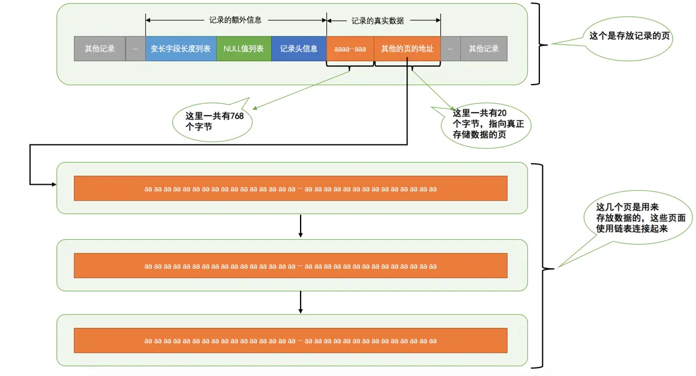

# InnoDB 行格式

我们平时是以记录为单位来向表中插入数据的，这些记录在磁盘上的存放方式也被称为行格式或者记录格式。目前为止出现了 4 种不同类型的行格式，分别是 Compact、Redundant、Dynamic、Compressed

## Compact 行格式

### 记录的额外信息

服务器为了描述这条记录而添加的额外信息

#### 变长字段长度列表

MySQL 支持一些变长的数据类型，拥有这些数据类型的列也被称为变长字段，变长字段中存储多少字节的数据是不固定的，所以在存储真实数据的时候需要把这些数据占用的字节数也存起来

所以变长字段占用的存储空间分为两部分

1. 真正的数据内容
2. 占用的字节数

在 Compact 行格式中，把所有变长字段的真实数据占用的字节长度都存放在记录的开头部位，从而形成一个变长字段长度列表，各变长字段数据占用的字节数按照列的顺序 **逆序存放**

变长字段长度列表中只存储值为 **非 NULL** 的列内容占用的长度，值为 NULL 的列的长度是不储存的

如果表中所有的列都不是变长的数据类型的话，这一部分是不需要有的。但使用定长类型的列，如果使用的是变长字符集，也会被加入到变长字段长度列表

##### 占用字节数

- 假设某个字符集中表示一个字符最多需要使用的字节数为 W
  - utf8 字符集为 3，gbk 字符集 为 2，ascii 字符集 为 1
- 对于变长类型 `VARCHAR(M)` 来说，这种类型表示能存储最多 M 个 **字符**，所以这个类型能表示的字符串最多占用的字节数就是 `M * W`
- 假设实际存储的字符串占用的字节数是 L

如果该可变字段 `允许存储的最大字节数 > 255 && 真实存储的字节数 > 127`，则使用 2 个字节，否则使用 1 个字节

#### NULL 值列表

表中的某些列可能存储 NULL 值，如果把这些 NULL 值都放到记录的真实数据中存储会很占地方，所以 Compact 行格式把这些值为 NULL 的列统一管理起来，存储到 NULL 值列表中

1. 首先统计表中允许存储 NULL 的列有哪些
2. 如果表中没有允许存储 NULL 的列，则 NULL 值列表也就不存在了，否则将每个允许存储 NULL 的列对应一个二进制位，二进制位按照列的顺序逆序排列
    - 1 表示为 NULL，0 表示不为 NULL
3. MySQL 规定 NULL 值列表必须用整数个字节的位表示，如果使用的二进制位个数不是整数个字节，则在字节的高位补 0

#### 记录头信息

记录头信息由固定的 5 个字节组成

- 预留位 1（1）：没有使用
- 预留位 2（1）：没有使用
- delete_mask（1）：标记该记录是否被删除
- min_rec_mask（1）：标记 B+ 树的每层非叶子节点中的最小记录
- n_owned（4）：当前记录拥有的记录数
- heap_no（13）：当前记录在页中的位置
- record_type（3）：当前记录的类型
  - 0：普通记录
  - 1：B+ 树非叶子节点记录
  - 2：最小记录
  - 3：最大记录
- next_record（16）：下一条记录的相对位置

### 记录的真实数据

记录的真实数据除了我们自己定义的列的数据以外， MySQL 会为每个记录默认的添加一些列，也被称为隐藏列

| 列名 | 是否必须 | 占用空间（字节） | 描述 |
| :-: | :-: | :-: | :-: |
| row_id | 否 | 6 | 行 ID，唯一标识 |
| transaction_id | 是 | 6 | 事务 ID |
| roll_pointer | 是 | 7 | 回滚指针 |

InnoDB 表主键的生成策略

1. 优先使用用户自定义主键
2. 如果没有用户自定义主键，则选取一个 Unique 键
3. 如果没有 Unique 键，则 InnoDB 会为表默认添加一个名为 row_id 的隐藏列作为主键

## 行溢出数据

### `VARCHAR(M)` 最多能存储的数据

MySQL 对一条记录占用的最大存储空间是有限制的，除了 BLOB、TEXT 类型的列之外，其他所有的列（不包括隐藏列和记录头信息）占用的字节长度加起来 **不能超过 65535 个字节**

为了存储一个 `VARCHAR(M)` 类型的列，其实需要占用 3 部分存储空间

1. 真实数据
2. 真实数据占用的字节长度
3. NULL 值标识

所以 `VARCHAR(M)` 最多能存储的字节数为 `65535 - (是否允许 NULL 值 ? 1 : 0) - 2`

- 因为可变字段允许存储的最大字节数超过 255 字节并且真实存储的字节数超过 127 字节，则使用 2 个字节，否则使用 1 个字节

`VARCHAR(M)` 最多能存储的字符数为 65532 ~ 65533，除以字符集中表示一个字符最多需要使用的字节数

### 记录中的数据太多产生的溢出

MySQL 中磁盘和内存交互的基本单位是页，而一个页的大小一般是 16KB，也就是 16384 字节，是小于一个 `VARCHAR(M)` 可存储的最大字节数的

在 Compact 行格式中，对于占用存储空间非常大的列，在记录的真实数据处只会存储该列的前 768 个字节的数据和一个指向其他页的地址，然后把剩下的数据存放到其他页中，这个过程也叫做行溢出，存储超出 768 字节的那些页面也被称为溢出页

- 还有 TEXT、BLOB 类型的列在存储数据非常多的时候也会发生行溢出

### 行溢出的临界点

- MySQL 中规定一个页中至少存放 2 行记录
- 每个页除了存放我们的记录以外，也需要存储一些额外的信息，需要 132 个字节的空间
- 每个记录需要的额外信息是 27 字节
  - 真实数据占用的字节长度（2）
  - NULL 值标识（1）
  - 记录头信息（5）
  - 隐藏列（19）

所以行溢出的临界点就为 `132 + 2 * (27 + n) < 16384`，即 8099

注意这并不是一个固定值，只要知道如果一条记录的某个列中存储的数据占用的字节数非常多时，该列就可能成为溢出列
