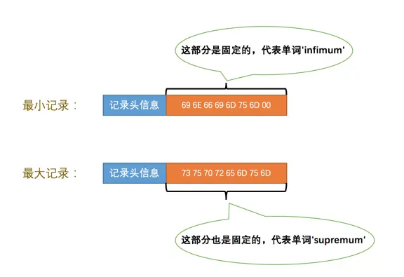
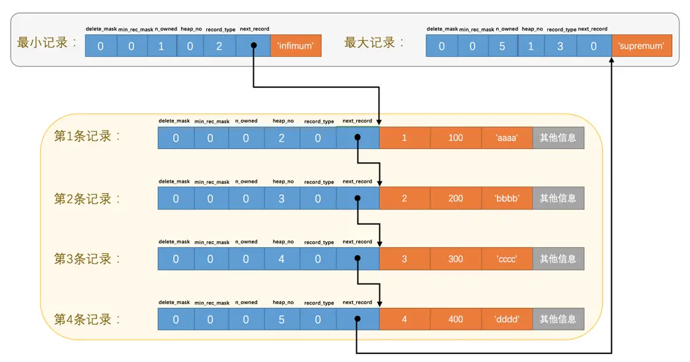
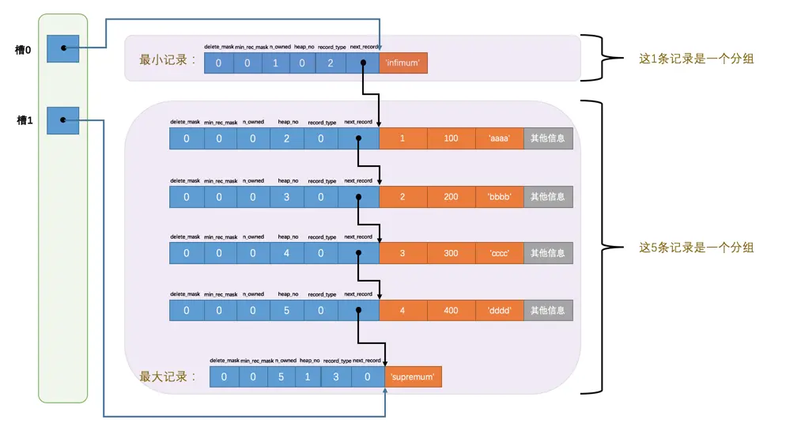

# InnoDB 数据页格式

页是 InnoDB 管理存储空间的基本单位，一个页的大小一般是 16KB。InnoDB 为了不同的目的而设计了许多种不同类型的页

## 记录在页中的存储

在一开始生成页的时候，其实并没有 User Records 这个部分，每当我们插入一条记录，都会从 Free Space 中申请一个记录大小的空间划分到 User Records 部分

当 Free Space 部分的空间全部被 User Records 部分替代掉之后，也就意味着这个页使用完了，如果还有新的记录插入的话，就需要去申请新的页了

## 记录头信息相关

### delete_mask

标记该记录是否被删除，被删除的记录仍会留在页中。如果立即从磁盘中移除被删除的记录，其他的记录需要在磁盘上重新排列，造成性能消耗

所有被删除掉的记录都会组成一个垃圾链表，在这个链表中的记录占用的空间称之为所谓的可重用空间，之后如果有新记录插入到表中的话，可能把这些被删除的记录占用的存储空间覆盖

### n_owned

当前记录拥有的记录数，用于 Page Directory，表示一个分组内的记录数量

### heap_no

当前记录在页中的位置，从 2 开始

- 自动创建的最小记录和最大记录的 heap_no 值分别是 0 和 1

### record_type

当前记录的类型

- 0：普通记录
- 1：B+ 树非叶子节点记录
- 2：最小记录（Infimum）
- 3：最大记录（Supremum）

### next_record

下一条记录的相对位置，当前记录的真实数据到下一条记录的真实数据的地址偏移量

- 例如值为 32，表示该位置的真实数据的地址向后找 32 个字节，即是下一条记录的真实数据

注意下一条记录指得并不是按照我们插入顺序的下一条记录，而 **是按照主键值由小到大的顺序** 的下一条记录

next_record 指针指向的是记录头信息和真实数据之间的位置，这样 **向左读取就是记录头信息，向右读取就是真实数据**

## Page Header（页面头部）

存储数据页的一些状态信息，占用固定的 56 个字节

| 名称 | 字节数 | 描述 |
| - | :-: | - |
| PAGE_N_DIR_SLOTS | 2 | 页目录中的槽数量 |
| PAGE_HEAP_TOP | 2 | 还未使用的空间最小地址，即从该地址之后就是 Free Space |
| PAGE_N_HEAP | 2 | 本页中的记录的数量（包括最小和最大记录以及标记为删除的记录） |
| PAGE_FREE | 2 | 第一个已经标记为删除的记录地址（各个已删除的记录通过 next_record 也会组成一个单链表，这个单链表中的记录可以被重新利用） |
| PAGE_GARBAGE | 2 | 已删除记录占用的字节数 |
| PAGE_LAST_INSERT | 2 | 最后插入记录的位置 |
| PAGE_DIRECTION | 2 | 记录插入的方向 |
| PAGE_N_DIRECTION | 2 | 一个方向连续插入的记录数量 |
| PAGE_N_RECS | 2 | 该页中记录的数量（不包括最小和最大记录以及被标记为删除的记录） |
| PAGE_MAX_TRX_ID | 8 | 修改当前页的最大事务 ID，该值仅在二级索引中定义 |
| PAGE_LEVEL | 2 | 当前页在 B+ 树中所处的层级|
| PAGE_INDEX_ID | 8 | 索引 ID，表示当前页属于哪个索引|
| PAGE_BTR_SEG_LEAF | 10 | B+ 树叶子段的头部信息，仅在 B+ 树的 Root 页定义|
| PAGE_BTR_SEG_TOP | 10 | B+ 树非叶子段的头部信息，仅在 B+ 树的 Root 页定义|

- PAGE_DIRECTION：如果新插入的一条记录的主键值比上一条记录的主键值大，我们说这条记录的插入方向是右边，反之则是左边
- PAGE_N_DIRECTION：假设连续几次插入新记录的方向都是一致的，InnoDB 会把沿着同一个方向插入记录的条数记下来。如果插入的方向改变了，这个状态的值会被清零重新统计

## Infimum + Supremum（最小记录与最大记录）

InnoDB 会自动给每个页里加两个记录，由于这两个记录并不是我们自己插入的，所以也被称为伪记录或者虚拟记录。一个代表最小记录，一个代表最大记录

- 对于一条完整的记录来说，比较记录的大小就是比较主键的大小

该部分由 5 字节大小的记录头信息和 8 字节大小的一个固定的部分组成的

Infimum 的 next_record 为本页用户记录中最小的记录，本页用户记录中最大的记录 next_record 为 Supremum。由于 Supremum 为本页最大的记录，没有下一条记录了，所以他的 next_record 为 0

## Page Directory（页面目录）

InnoDB 将所有正常的记录（包括最大和最小记录，不包括标记为已删除的记录）划分为几个组

每个组的最后一条记录（即组内最大的那条记录）的头信息中的 n_owned 属性表示该记录拥有多少条记录，即该组内共有几条记录

将每个组的最后一条记录的地址偏移量单独提取出来按顺序存储到靠近页的尾部的地方，这个地方就是所谓的 Page Directory。页面目录中的这些地址偏移量被称为槽（Slot），所以这个页面目录就是由槽组成的

通过 Page Directory 可以方便快速的在一个数据页中查找指定主键值的记录

1. 首先通过二分法确定记录所在的槽位，再找到该槽位所在分组的最小记录
2. 通过 next_record 属性遍历分组中的记录，从而找到所需的记录

### 每个分组的记录条数

最小记录所在的分组只能有 1 条记录，最大记录所在的分组拥有的记录条数只能在 1 ~ 8 条之间，剩下的分组中记录的条数范围只能在是 4 ~ 8 条之间

1. 初始情况下一个数据页里只有最小记录和最大记录两条记录，并且分属于两个分组
2. 每插入一条记录，都会从页目录中找到主键值比本记录的主键值大且差值最小的槽，然后把该槽对应的记录的 n_owned 值加 1，表示本组内又添加了一条记录
3. 在一个组中的记录数等于 8 个后再插入一条记录时，会将组中的记录拆分成两个组，一个组中 4 条记录，另一个 5 条记录。这个过程会在页目录中新增一个槽来记录这个新增分组中最大的那条记录的偏移量

## File Header（文件头部）

File Header 是各种类型的页都通用的，这个部分占用固定的 38 个字节

| 名称 | 字节数 | 描述 |
| - | :-: | - |
| FIL_PAGE_SPACE_OR_CHKSUM | 4 | 页的校验和 |
| FIL_PAGE_OFFSET | 4 | 页号 |
| FIL_PAGE_PREV | 4 | 上一个页的页号 |
| FIL_PAGE_NEXT | 4 | 下一个页的页号 |
| FIL_PAGE_LSN | 8 | 页面被最后修改时对应的日志序列位置（Log Sequence Number） |
| FIL_PAGE_TYPE | 2 | 该页的类型 |
| FIL_PAGE_FILE_FLUSH_LSN | 8 | 仅在系统表空间的一个页中定义，代表文件至少被刷新到了对应的LSN值 |
| FIL_PAGE_ARCH_LOG_NO_OR_SPACE_ID | 4 | 页属于哪个表空间 |

## File Trailer（文件尾部）

File Trailer 是各种类型的页都通用的。为了检测一个页是否完整，InnoDB 在每个页的尾部都加了一个 File Trailer 部分，这个部分由 8 个字节组成

前 4 个字节代表页的校验和，后 4 个字节代表页面被最后修改时对应的日志序列位置（LSN）

因为 File Header 在页面的前边，所以校验和会被首先同步到磁盘，当完全写完时，校验和也会被写到页的尾部，如果完全同步成功，则页的首部和尾部的校验和应该是一致的

如果写了一半儿断电了，那么在 File Header 中的校验和就代表着已经修改过的页，而在 File Trailer 中的校验和代表着原先的页，二者不同则意味着同步中间出了错
