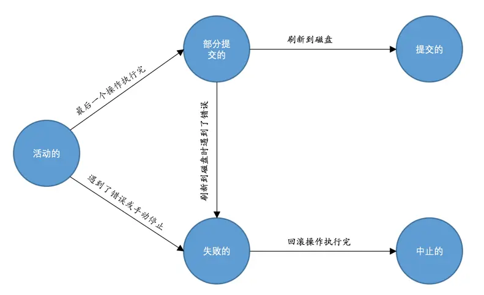

# 事务

## 事务状态

- 活动的（active）：事务对应的数据库操作正在执行过程中时
- 部分提交的（partially committed）：当事务中的最后一个操作执行完成，但由于操作都在内存中执行，所造成的影响并没有刷新到磁盘时
- 失败的（failed）：当事务处在活动的或者部分提交的状态时，可能遇到了某些错误（数据库自身的错误、操作系统错误或者直接断电等）而无法继续执行，或者人为的停止当前事务的执行
- 中止的（aborted）：如果事务执行了半截而变为失败的状态，执行回滚操作，当回滚操作执行完毕时，也就是数据库恢复到了执行事务之前的状态
- 提交的（committed）：当一个处在部分提交的状态的事务将修改过的数据都同步到磁盘上之后

## 开启事务

- `BEGIN [WORK]`：开启一个事务，后边的 `WORK` 可有可无。开启事务后，就可以继续写若干条语句，这些语句都属于刚刚开启的这个事务
- `START TRANSACTION`：开启一个事务，后边可以跟随修饰符，跟随多个可以使用逗号将修饰符分开
  - `READ ONLY`：标识当前事务是一个只读事务，也就是属于该事务的数据库操作只能读取数据，而不能修改数据
  - `READ WRITE`：标识当前事务是一个读写事务，也就是属于该事务的数据库操作既可以读取数据，也可以修改数据
  - `WITH CONSISTENT SNAPSHOT`：启动一致性读

一个事务的访问模式不能同时既设置为只读的也设置为读写的，所以不能同时把 READ ONLY 和 READ WRITE 放到 START TRANSACTION 语句后边

另外，如果我们不显式指定事务的访问模式，那么该事务的访问模式就是读写模式

## 提交事务

`COMMIT [WORK]`：提交一个事务，后边的 `WORK` 可有可无

## 手动中止事务

`ROLLBACK [WORK]`：回滚一个事务，后边的 `WORK` 可有可无

`ROLLBACK` 语句是我们程序员手动的去回滚事务时才去使用的，如果事务在执行过程中遇到了某些错误而无法继续执行的话，事务自身会自动的回滚

## 支持事务的存储引擎

目前只有 InnoDB 和 NDB 存储引擎支持

## 自动提交

MySQL 中有一个系统变量 autocommit，默认值是 ON。在默认情况下，如果不显式的使用 `START TRANSACTION` 或者 `BEGIN` 语句开启一个事务，那么每一条语句都算是一个独立的事务，这种特性称之为事务的自动提交

如果我们想关闭这种自动提交，可以使用下边两种方法

- 显式的的使用 `START TRANSACTION` 或者 `BEGIN` 语句开启一个事务。这样在本次事务提交或者回滚前会暂时关闭掉自动提交的功能
- 将系统变量 autocommit 修改为 OFF。这样我们写入的多条语句就算是属于同一个事务了，直到我们显式的写出 `COMMIT` 语句来把这个事务提交掉，或者显式的写出 `ROLLBACK` 语句来把这个事务回滚掉

## 隐式提交

当我们输使用某些特殊的语句而导致事务提交的情况被称为隐式提交

### 定义或修改数据库对象的数据定义语言（DDL，Data definition language）

使用 `CREATE`、`ALTER`、`DROP` 等语句去修改数据库、表、视图、存储过程等数据库对象

### 隐式使用或修改 mysql 数据库中的表

使用 `ALTER USER`、`CREATE USER`、`DROP USER`、`GRANT`、`RENAME USER`、`REVOKE`、`SET PASSWORD` 等语句

### 事务控制或关于锁定的语句

在一个事务还没提交或者回滚时就又使用 `START TRANSACTION` 或者 `BEGIN` 语句开启了另一个事务时，会隐式的提交上一个事务

当前的 autocommit 系统变量的值为 OFF，我们手动把它调为 ON 时，也会隐式的提交前边语句所属的事务

使用 `LOCK TABLES`、`UNLOCK TABLES` 等关于锁定的语句也会隐式的提交前边语句所属的事务

### 加载数据的语句

使用 `LOAD DATA` 语句来批量往数据库中导入数据时

### 关于 MySQL 复制的一些语句

`START SLAVE`、`STOP SLAVE`、`RESET SLAVE`、`CHANGE MASTER TO` 等语句

### 其它的一些语句

`ANALYZE TABLE`、`CACHE INDEX`、`CHECK TABLE`、`FLUSH`、`LOAD INDEX INTO CACHE`、`OPTIMIZE TABLE`、`REPAIR TABLE`、`RESET` 等语句

## 保存点

在事务对应的数据库语句中打几个点，我们在调用 `ROLLBACK` 语句时可以指定会滚到哪个点，而不是回到最初的原点

- `SAVEPOINT 保存点名称`：创建一个保存点
- `ROLLBACK [WORK] TO [SAVEPOINT] 保存点名称`：回滚到某个保存点，后边的 `WORK` 和 `SAVEPOINT` 可有可无
- `RELEASE SAVEPOINT 保存点名称`：删除某个保存点
