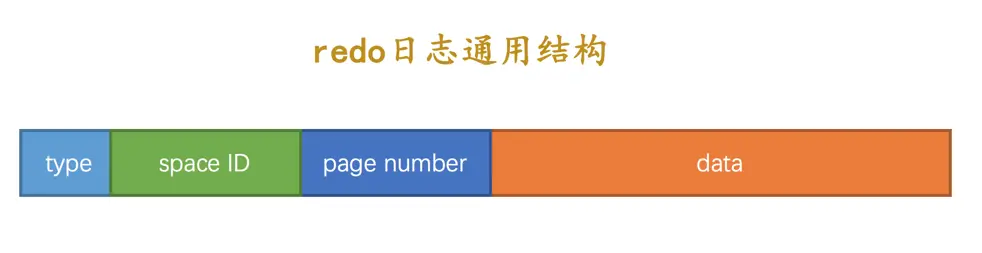
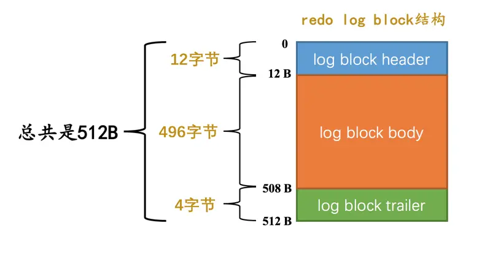
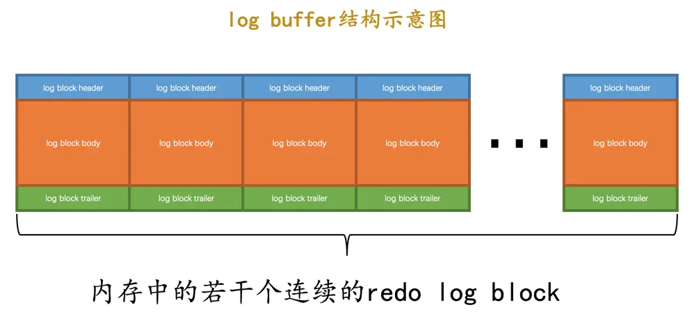
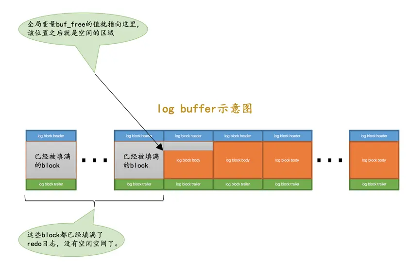

# redo 日志

在事务提交时，将事务内做的修改刷新到磁盘中，即使之后系统崩溃了，重启之后只要按照里面的内容所记录的步骤重新更新一下数据页，那么该事务对数据库中所做的修改又可以被恢复出来，也就意味着满足持久性的要求。所以里面的内容也被称之为重做日志（redo log）

- redo 日志占用的空间非常小
- redo 日志是顺序写入磁盘的：在执行事务的过程中，每执行一条语句，就可能产生若干条 redo 日志，这些日志是按照产生的顺序写入磁盘的，也就是使用顺序 IO

## 日志格式

- type：redo 日志的类型
- space ID：表空间 ID
- page number：页号
- data：该条 redo 日志的具体内容

## Mini-Transaction

MySQL 把对底层页面中的一次原子访问的过程称之为一个 Mini-Transaction，简称 mtr。一个 mtr 可以包含一组 redo 日志，在进行崩溃恢复时这一组 redo 日志作为一个不可分割的整体

一个事务可以包含若干条语句，每一条语句其实是由若干个 mtr 组成，每一个 mtr 又可以包含若干条 redo 日志

## redo 日志写入过程

InnoDB 为了更好的进行系统崩溃恢复，把通过 mtr 生成的 redo 日志都放在了大小为 512 字节的页中

为了和表空间中的页做区别，我们把用来存储 redo 日志的页称为 block

真正的 redo 日志都是存储到占用 496 字节大小的 log block body 中，log block header 和 log block trailer 存储的是一些管理信息

## redo 日志缓冲区

InnoDB 为了解决磁盘速度过慢的问题而引入了 Buffer Pool。同理，写入 redo 日志时也不能直接直接写到磁盘上，实际上在服务器启动时就向操作系统申请了一大片称之为 redo log buffer（redo 日志缓冲区） 的连续内存空间

该缓冲区默认大小为 16MB，可以通过 innodb_log_buffer_size 参数进行修改

## redo 日志写入 log buffer

向 log buffer 中写入 redo 日志的过程是顺序的，先往前边的 block 中写，当该 block 的空闲空间用完之后再往下一个 block 中写。InnoDB 特意提供了一个称之为 buf_free 的全局变量，该变量指明后续写入的 redo 日志应该写入到 log buffer 中的哪个位置

一个 mtr 执行过程中可能产生若干条 redo 日志，这些 redo 日志是一个不可分割的组，所以其实并不是每生成一条 redo 日志，就将其插入到 log buffer 中，而是每个 mtr 运行过程中产生的日志先暂时存到一个地方，当该 mtr 结束的时候，将过程中产生的一组 redo 日志再全部复制到 log buffer 中

## redo 日志刷盘时机

mtr 运行过程中产生的一组 redo 日志在 mtr 结束时会被复制到 log buffer 中，但在某些情况下它们也会被刷新到磁盘里

- log buffer 空间不足时：如果当前写入 log buffer 的 redo 日志量已经占满了总容量的大约一半左右，就需要把这些日志刷新到磁盘上
- 事务提交时：在事务提交时可以不把修改过的 Buffer Pool 页面刷新到磁盘，但是为了保证持久性，必须要把修改这些页面对应的 redo 日志刷新到磁盘
- 将某个脏页刷新到磁盘前，会保证先将该脏页对应的 redo 日志刷新到磁盘中
- 后台线程：后台有一个线程，大约每秒都会刷新一次 log buffer 中的 redo 日志到磁盘
- 正常关闭服务器时
- checkpoint：InnoDB 定期会执行检查点操作，将内存中的脏数据（已修改但尚未写入磁盘的数据）刷新到磁盘，并且会将相应的重做日志一同刷新，以确保数据的一致性

## Log Sequence Number

InnoDB 为记录已经写入的 redo 日志量，设计了一个称之为 Log Sequence Number（LSN） 的全局变量，也就是日志序列号，初始值为 8704

## redo 日志文件组

磁盘上的 redo 日志文件不只一个，而是以一个日志文件组的形式出现的。这些文件以 `ib_logfile[数字]` 的形式进行命名。在将 redo 日志写入日志文件组时，是从 ib_logfile0 开始写，如果 ib_logfile0 写满了，就接着 ib_logfile1 写，以此类推，写满最后一个文件时，再重新转到 ib_logfile0 继续写

redo 日志文件的个数默认为 2，最大值为 100，可以通过 `innodb_log_files_in_group` 参数进行修改

## checkpoint

redo 日志文件组容量是有限的，为此不得不选择循环使用 redo 日志文件组中的文件，但是这会造成最后写的 redo 日志与最开始写的 redo 日志追尾

redo 日志只是为了系统崩溃后恢复脏页用的，如果对应的脏页已经刷新到了磁盘，也就是说即使现在系统崩溃，那么在重启后也用不着使用 redo 日志恢复该页面了，所以该 redo 日志也就没有存在的必要了，那么它占用的磁盘空间就可以被后续的 redo 日志所重用

InnoDB 提出了一个全局变量 checkpoint_lsn 来代表当前系统中可以被覆盖的 redo 日志总量是多少，这个变量初始值也是 8704

当 redo 日志就可以被覆盖了，我们就可以进行一个增加 checkpoint_lsn 的操作，我们把这个过程称之为做一次 checkpoint

## innodb_flush_log_at_trx_commit 的用法

为了保证事务的持久性，用户线程在事务提交时需要将该事务执行过程中产生的所有 redo 日志都刷新到磁盘上，这很明显的降低数据库性能。如果对事务的持久性要求不高的话，可以修改该参数

- 0：表示在事务提交时不立即向磁盘中同步 redo 日志，这个任务是交给后台线程做的
  - 可以加快请求处理速度，但是如果事务提交后服务器挂了，后台线程没有及时将 redo 日志刷新到磁盘，那么该事务对页面的修改会丢失
- 1：默认值，在事务提交时需要将 redo 日志同步到磁盘，可以保证事务的持久性
- 2：在事务提交时需要将 redo 日志写到操作系统的缓冲区中，但并不需要保证将日志真正的刷新到磁盘
  - 如果数据库挂了，操作系统没挂的话，事务的持久性还是可以保证的，但是操作系统也挂了的话，那就不能保证持久性了

## 崩溃恢复

### 确定恢复的起点

checkpoint_lsn 之前的 redo 日志都可以被覆盖，也就是说这些 redo 日志对应的脏页都已经被刷新到磁盘中了，既然它们已经被刷盘，我们就没必要恢复它们了

对于 checkpoint_lsn 之后的 redo 日志，它们对应的脏页可能没被刷盘，也可能被刷盘了，我们不能确定，所以需要从 checkpoint_lsn 开始读取 redo 日志来恢复页面

### 确定恢复的终点

redo 日志的时候都是顺序写的，写满了一个 block 之后会再往下一个 block 中

普通 block 的 log block header 部分有一个称之为 LOG_BLOCK_HDR_DATA_LEN 的属性，该属性值记录了当前 block 里使用了多少字节的空间。对于被填满的 block 来说，该值永远为 512。如果该属性的值不为 512，那么就是它了，它就是此次崩溃恢复中需要扫描的最后一个 block
