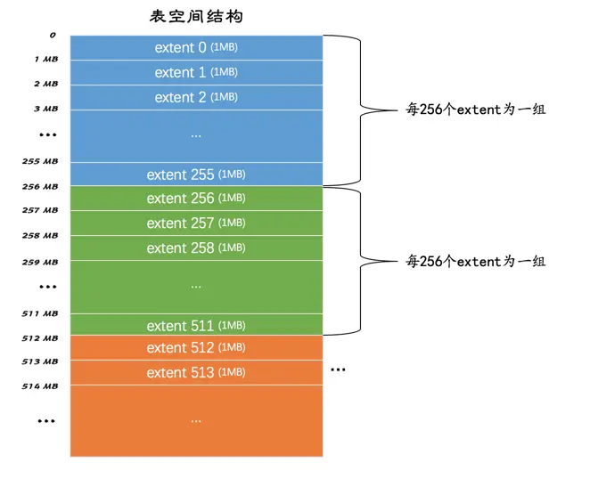

# InnoDB 表空间

## 表空间（tablespace）

表空间是一个抽象的概念，它可以对应文件系统上一个或多个真实文件

### 系统表空间（system tablespace）

默认情况下，InnoDB 会在数据目录下创建一个名为 ibdata1、大小为 12M 的文件，这个文件就是对应的系统表空间在文件系统上的表示。且这个文件是个自扩展文件，当不够用的时候它会自己增加文件大小

在一个 MySQL 服务器中，系统表空间只有一份。从 MySQL5.5.7 ~ MySQL5.6.6，我们表中的数据都会被默认存储到系统表空间

### 独立表空间（file-per-table tablespace）

在 MySQL5.6.6 以及之后的版本中，InnoDB 并不会默认的把各个表的数据存储到系统表空间中，而是为每一个表建立一个独立表空间

使用独立表空间来存储表数据，会在该表所属数据库对应的子目录下创建一个表示该独立表空间的文件，文件名和表名相同，后缀为 `.ibd`

## 区（extent）

表空间中的页实在是太多了，为了更好的管理这些页面，InnoDB 提出了区的概念。对于 16KB 的页来说，连续的 64 个页就是一个区，即一个区默认占用 1MB 空间大小。不论是系统表空间还是独立表空间，都可以看成是由若干个区组成的，每 256 个区被划分成一组

- 第一个组最开始的 3 个页面的类型是固定的
  - FSP_HDR：这个类型的页面是用来登记整个表空间的一些整体属性以及本组所有的区。整个表空间只有一个该类型的页面
  - IBUF_BITMAP：这个类型的页面是存储本组所有的区的所有页面关于 INSERT BUFFER 的信息
  - INODE：这个类型的页面存储了许多称为 INODE 的数据结构
- 其余各组最开始的 2 个页面的类型是固定的
  - XDES：用来登记本组 256 个区的属性，与 FSP_HDR 的作用类似
  - IBUF_BITMAP

## 段（segment）

B+ 树的每一层中的页都会形成一个双向链表，如果是以页为单位来分配存储空间的话，双向链表相邻的两个页之间的物理位置可能离得非常远，这就是所谓的随机 I/O。为了能利用到顺序 I/O，引入了区的概念，一个区就是在物理位置上连续的 64 个页。在表中数据量大的时候，为某个索引分配空间的时候就不再按照页为单位分配了，而是按照区为单位分配，甚至在表中的数据十分非常特别多的时候，可以一次性分配多个连续的区。虽然可能造成一点点空间的浪费（数据不足填充满整个区），但是从性能角度看，可以消除很多的随机 I/O

所谓范围查询，其实是对 B+ 树叶子节点中的记录进行顺序扫描，而如果不区分叶子节点和非叶子节点，统统把节点代表的页面放到申请到的区中的话，进行范围扫描的效果就大打折扣了

InnoDB 对 B+ 树的叶子节点和非叶子节点进行了区别对待，叶子节点和非叶子节点都有自己独有的区。存放叶子节点的区的集合就算是一个段（segment），存放非叶子节点的区的集合也算是一个段。也就是说一个索引会生成 2 个段，一个叶子节点段，一个非叶子节点段

为了考虑以完整的区为单位分配给某个段对于数据量较小的表太浪费存储空间的这种情况，InnoDB 提出了碎片（fragment）区的概念，也就是在一个碎片区中，并不是所有的页都是为了存储同一个段的数据而存在的，而是碎片区中的页可以用于不同的目的，比如有些页用于段 A，有些页用于段 B，有些页甚至哪个段都不属于。碎片区直属于表空间，并不属于任何一个段

- 在刚开始向表中插入数据的时候，段是从某个碎片区以单个页面为单位来分配存储空间的
- 当某个段已经占用了 32 个碎片区页面之后，就会以完整的区为单位来分配存储空间

所以段不能仅定义为是某些区的集合，更精确的应该是某些零散的页面以及一些完整的区的集合

## 区的分类

