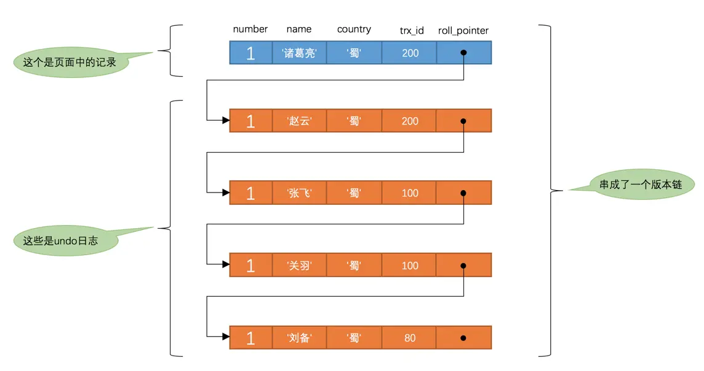

# MVCC

## 版本链

每次对记录进行改动，都会记录一条 undo 日志，每条 undo 日志也都有一个 roll_pointer 属性（INSERT 操作对应的 undo 日志没有该属性，因为该记录并没有更早的版本），可以将这些 undo 日志都连起来，串成一个链表

对该记录每次更新后，都会将旧值放到一条 undo 日志中，就算是该记录的一个旧版本，随着更新次数的增多，所有的版本都会被 roll_pointer 属性连接成一个链表，这就是版本链，版本链的头节点就是当前记录最新的值。另外，每个版本中还包含生成该版本时对应的事务 id

## ReadView

对于使用 READ UNCOMMITTED 隔离级别的事务来说，由于可以读到未提交事务修改过的记录，所以直接读取记录的最新版本就好了

对于使用 SERIALIZABLE 隔离级别的事务来说，InnoDB 规定使用加锁的方式来访问记录

对于使用 READ COMMITTED 和 REPEATABLE READ 隔离级别的事务来说，都必须保证读到已经提交了的事务修改过的记录，也就是说假如另一个事务已经修改了记录但是尚未提交，是不能直接读取最新版本的记录的

为此就需要判断一下版本链中的哪个版本是当前事务可见的，InnoDB 提出了一个 ReadView 的概念，主要包含 4 个比较重要的内容

- m_ids：表示在生成 ReadView 时当前系统中活跃的读写事务的事务 id 列表
- min_trx_id：表示在生成 ReadView 时当前系统中活跃的读写事务中最小的事务 id，也就是 m_ids 中的最小值
- max_trx_id：表示生成 ReadView 时系统中应该分配给下一个事务的 id 值，并不是 m_ids 中的最大值
- creator_trx_id：表示生成该 ReadView 的事务的事务 id

有了 ReadView，这样在访问某条记录时，只需要按照下边的步骤判断记录的某个版本是否可见

- 如果被访问版本的 trx_id 属性值与 ReadView 中的 creator_trx_id 值相同，意味着当前事务在访问它自己修改过的记录，所以该版本可以被当前事务访问
- 如果被访问版本的 trx_id 属性值小于 ReadView 中的 min_trx_id 值，表明生成该版本的事务在当前事务生成 ReadView 前已经提交，所以该版本可以被当前事务访问
- 如果被访问版本的 trx_id 属性值大于或等于 ReadView 中的 max_trx_id 值，表明生成该版本的事务在当前事务生成 ReadView 后才开启，所以该版本不可以被当前事务访问
- 如果被访问版本的 trx_id 属性值在 ReadView 的 min_trx_id 和 max_trx_id 之间，那就需要判断一下 trx_id 属性值是不是在 m_ids 列表中。如果在，说明创建 ReadView 时生成该版本的事务还是活跃的，该版本不可以被访问；如果不在，说明创建 ReadView 时生成该版本的事务已经被提交，该版本可以被访问

如果某个版本的数据对当前事务不可见的话，那就顺着版本链找到下一个版本的数据，继续按照上边的步骤判断可见性，依此类推，直到版本链中的最后一个版本。如果最后一个版本也不可见的话，那么就意味着该条记录对该事务完全不可见，查询结果就不包含该记录

### 生成 ReadView 的时机

#### READ COMMITTED

每次读取数据前都生成一个 ReadView

当前事务多次访问某条记录时，如果有其他事务对其进行了修改并提交，得到的结果可能不同

#### REPEATABLE READ

在第一次读取数据时生成一个 ReadView

保证当前事务多次访问某条记录时，得到的结果都是相同的，即便有其他事务对其进行了修改并提交
