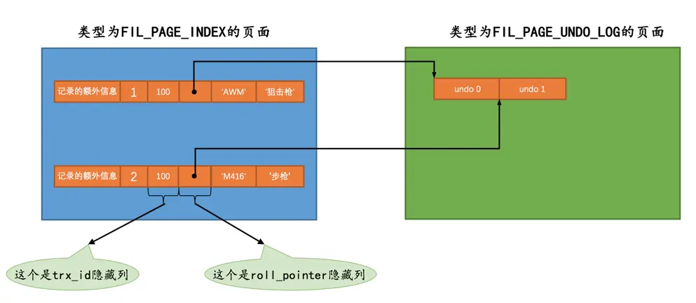
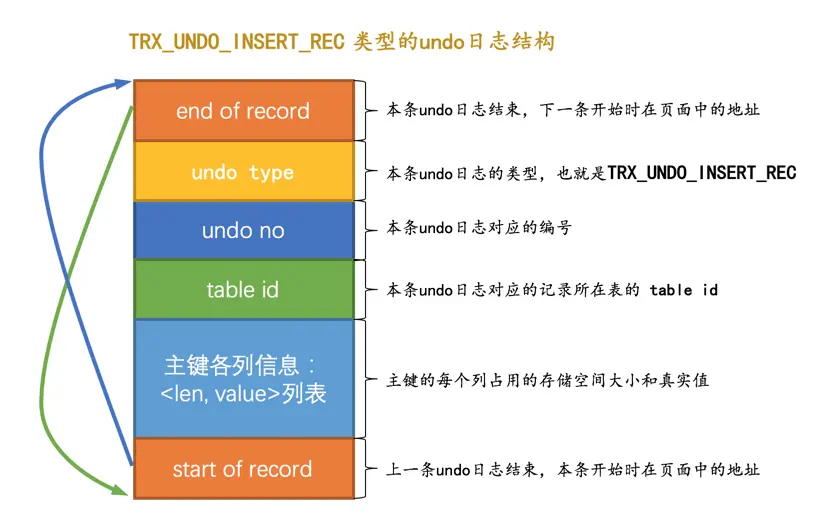
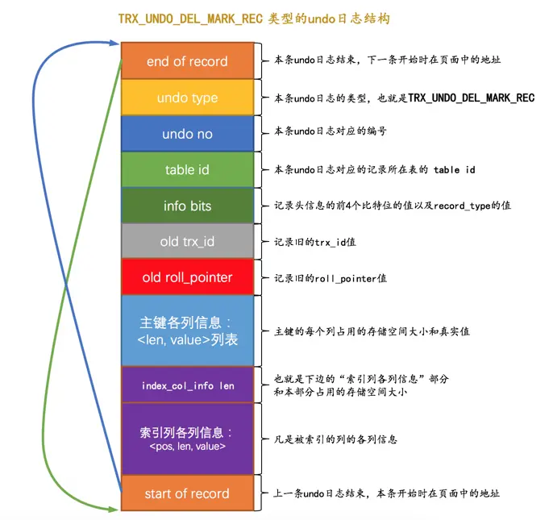
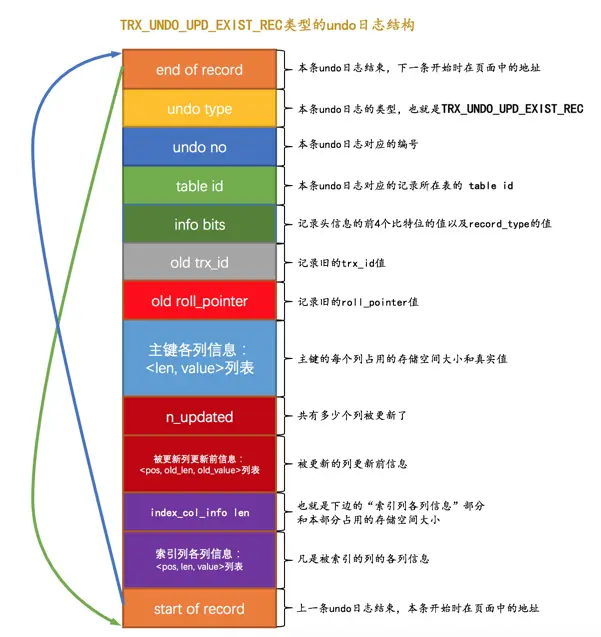

# undo 日志

为了回滚而记录的内容称之为撤销日志

## 事务 id

如果某个事务执行过程中对某个表执行了增、删、改操作，那么 InnoDB 存储引擎就会给它分配一个独一无二的事务 id

- 对于只读事务来说，只有在它第一次对某个用户创建的临时表执行增、删、改操作时才会为这个事务分配一个事务 id，否则的话是不分配事务 id 的
- 对于读写事务来说，只有在它第一次对某个表（包括用户创建的临时表）执行增、删、改操作时才会为这个事务分配一个事务 id，否则的话也是不分配事务 id 的

### 事务 id 的生成

事务 id 本质上就是一个数字，它的分配策略和隐藏列 row_id 的分配策略大抵相同

- 服务器会在内存中维护一个全局变量，每当需要为某个事务分配一个事务 id 时，就会把该变量的值当作事务 id 分配给该事务，并且把该变量自增 1
- 每当这个变量的值为 256 的倍数时，就会将该变量的值刷新到系统表空间的页号为 5 的页面中一个称之为 Max Trx ID 的属性处，这个属性占用 8 个字节的存储空间
- 当系统下一次重新启动时，会将 Max Trx ID 属性加载到内存中，将该值加上 256 之后赋值给全局变量

### trx_id 隐藏列

某个对这个聚簇索引记录做改动的语句所在的事务对应的事务 id

### roll_pointer 隐藏列

一个指向记录对应的 undo 日志的一个指针

## undo 日志格式

为了实现事务的原子性，InnoDB 在实际进行增、删、改一条记录时，都需要先把对应的 undo 日志记下来。一般每对一条记录做一次改动，就对应着一条 undo 日志，但在某些更新记录的操作中，也可能会对应着 2 条 undo 日志

### INSERT 操作对应的 undo 日志

undo no 在一个事务中是从 0 开始递增的，也就是说只要事务没提交，每生成一条 undo 日志，那么该条日志的 undo no 就增 1

### DELETE 操作对应的 undo 日志

实际上的删除过程需要经历两个阶段

1. delete mark：仅仅将记录的 delete_mask 标识位设置为 1，其他的不做修改
    - 此时该记录并没有被加入到垃圾链表，还处于一个中间状态，直到删除语句所在的事务进行提交
2. purge：当该删除语句所在的事务提交之后，会有专门的线程后来真正的把记录删除掉。也就是把该记录从正常记录链表中移除，并且加入到垃圾链表中，然后还要调整一些页面的其他信息

### UPDATE 操作对应的 undo 日志

#### 不更新主键

在不更新主键的情况下，又可以细分为被更新的列占用的存储空间不发生变化和发生变化的情况

- 就地更新（in-place update）：更新记录时，对于被更新的每个列来说，如果更新后的列和更新前的列占用的存储空间都一样大，那么就可以进行就地更新，也就是直接在原记录的基础上修改对应列的值
- 先删除掉旧记录，再插入新记录：如果有任何一个被更新的列更新前和更新后占用的存储空间大小不一致，那么就需要先把这条旧的记录从聚簇索引页面中删除掉，然后再根据更新后列的值创建一条新的记录插入到页面中
  - 删除并不是 delete mark 操作，而是真正的删除掉，也就是把这条记录从正常记录链表中移除并加入到垃圾链表中，并且修改页面中相应的统计信息

#### 更新主键

针对 UPDATE 语句中更新了记录主键值的这种情况，InnoDB 在聚簇索引中分了两步处理

1. 将旧记录进行 delete mark 操作
2. 根据更新后各列的值创建一条新记录，并将其插入到聚簇索引中原来的位置中
