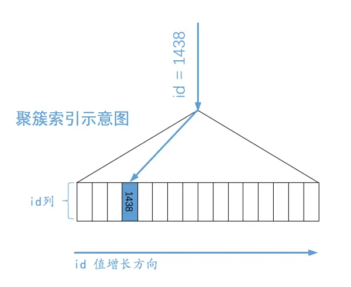
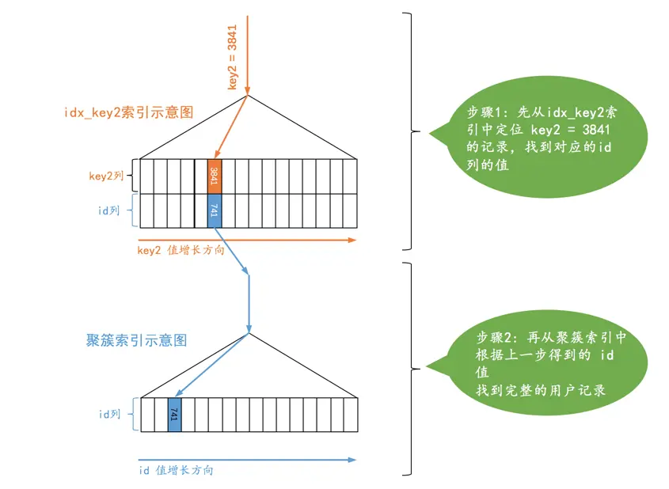
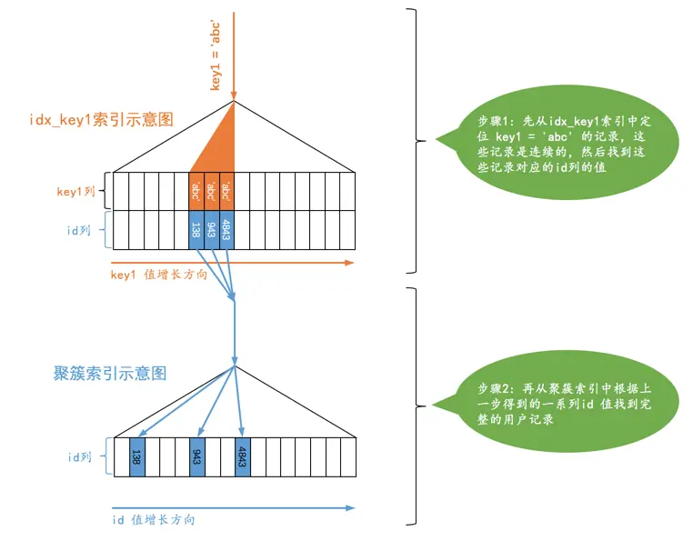
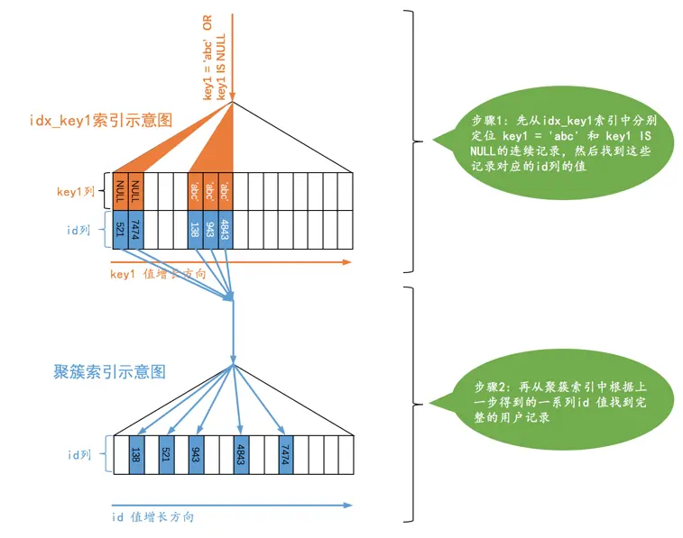

# 单表访问方法

我们平时所写的那些查询语句本质上只是一种声明式的语法，只是告诉 MySQL 我们要获取的数据符合哪些规则。对于单个表的查询来说，查询的执行方式大致分为下边两种

- 使用全表扫描进行查询
- 使用索引进行查询
  - 针对主键或唯一二级索引的等值查询
  - 针对普通二级索引的等值查询
  - 针对索引列的范围查询
  - 直接扫描整个索引

MySQL 将执行查询语句的方式称之为访问方法（access method）或者访问类型

```sql
CREATE TABLE single_table (
    id INT NOT NULL AUTO_INCREMENT,
    key1 VARCHAR(100),
    key2 INT,
    key3 VARCHAR(100),
    key_part1 VARCHAR(100),
    key_part2 VARCHAR(100),
    key_part3 VARCHAR(100),
    common_field VARCHAR(100),
    PRIMARY KEY (id),
    KEY idx_key1 (key1),
    UNIQUE KEY idx_key2 (key2),
    KEY idx_key3 (key3),
    KEY idx_key_part(key_part1, key_part2, key_part3)
) Engine=InnoDB CHARSET=utf8;
```

## const

通过主键或者唯一二级索引列与常数的等值比较来定位一条记录是非常快的

MySQL 把通过主键或者唯一二级索引列来定位一条记录的访问方法定义为 const，意思是常数级别的，代价是可以忽略不计的

- 如果主键或者唯一二级索引是由多个列构成的话，索引中的每一个列都需要与常数进行等值比较，这个 const 访问方法才有效

```sql
SELECT * FROM single_table WHERE id = 1438;
```



```sql
SELECT * FROM single_table WHERE key2 = 3841;
```



对于唯一二级索引来说，由于唯一二级索引列并不限制 NULL 值的数量，可能会查询到多条记录，所以不可以使用 const 访问方法来执行

```sql
SELECT * FROM single_table WHERE key2 IS NULL;
```

## ref

由于普通二级索引并不限制索引列值的唯一性，所以可能找到多条对应的记录，也就是说使用二级索引来执行查询的代价取决于等值匹配到的二级索引记录条数。如果匹配的记录较少，则回表的代价还是比较低的

MySQL 把通过二级索引列与常数等值比较，采用二级索引来执行查询的访问方法称为 ref。虽然效率比 const 差了点，但在二级索引等值比较时匹配的记录数较少时的效率还是很高的

```sql
SELECT * FROM single_table WHERE key1 = 'abc';
```



不论是普通的二级索引，还是唯一二级索引，它们的索引列对包含 NULL 值的数量并不限制，所以我们采用 `key IS NULL` 这种形式的搜索条件最多只能使用 ref 的访问方法，而不是 const 的访问方法

对于某个包含多个索引列的二级索引来说，只要是最左边的连续索引列是与常数的等值比较就可能采用 ref 的访问方法

```sql
SELECT * FROM single_table WHERE key_part1 = 'god like';

SELECT * FROM single_table WHERE key_part1 = 'god like' AND key_part2 = 'legendary';

SELECT * FROM single_table WHERE key_part1 = 'god like' AND key_part2 = 'legendary' AND key_part3 = 'penta kill';
```

如果最左边的连续索引列并不全部是等值比较的话，它的访问方法就不能称为 ref 了

```sql
SELECT * FROM single_table WHERE key_part1 = 'god like' AND key_part2 > 'legendary';
```

## ref_or_null

有时候我们不仅想找出某个二级索引列的值等于某个常数的记录，还想把该列的值为 NULL 的记录也找出来，当使用二级索引而不是全表扫描的方式执行该查询时，这种类型的查询使用的访问方法就称为 ref_or_null

```sql
SELECT * FROM single_table WHERE key1 = 'abc' OR key1 IS NULL;
```



## range

MySQL 把利用索引进行范围匹配的访问方法称之为 range

```sql
SELECT * FROM single_table WHERE key2 IN (1438, 6328) OR (key2 >= 38 AND key2 <= 79);
```

## index

MySQL 把采用遍历二级索引记录的执行方式称之为 index

```sql
SELECT key_part1, key_part2, key_part3 FROM single_table WHERE key_part2 = 'abc';
```

key_part2 不是联合索引 idx_key_part 最左索引列，但他的查询条件只有 3 个列，且都包含在 idx_key_part 索引中，搜索条件中只有 key_part2 列，也包含在索引 idx_key_part 中

这样通过遍历 idx_key_part 索引的叶子节点的记录来比较 `key_part2 = 'abc'` 这个条件是否成立，把匹配成功的二级索引记录的 key_part1, key_part2, key_part3 列的值直接加到结果集中就行了

由于二级索引记录比聚簇索记录小的多（聚簇索引记录要存储所有用户定义的列以及所谓的隐藏列，而二级索引记录只需要存放索引列和主键），而且这个过程也不用进行回表操作，所以直接遍历二级索引比直接遍历聚簇索引的成本要小很多

## all

全表扫描

## 索引合并

MySQL 在一般情况下执行一个查询时最多只会用到单个二级索引，但在这些特殊情况下也可能在一个查询中使用到多个二级索引，MySQL 把这种使用到多个索引来完成一次查询的执行方法称之为 index merge

### Intersection 合并

当某个查询可以使用多个二级索引，将从多个二级索引中查询到的结果取交集

```sql
SELECT * FROM single_table WHERE key1 = 'a' AND key3 = 'b';
```

- 从 idx_key1 二级索引对应的 B+ 树中取出 `key1 = 'a'` 的相关记录
- 从 idx_key3 二级索引对应的 B+ 树中取出 `key3 = 'b'` 的相关记录
- 计算出这两个结果集中 id 值的交集
- 通过获取到的交集列表进行回表操作，将完整用户记录取出来，返回给用户

当然也可以直接使用 idx_key1 或者 idx_key3 只根据某个搜索条件去读取一个二级索引，然后回表后再过滤另外一个搜索条件。不过虽然只需要读取一个二级索引，但是读取二级索引的操作是顺序 I/O，而回表操作是随机 I/O。如果需要回表的记录数太多，回表造成的性能损耗会比访问多个二级索引带来的性能损耗更高

最好使用联合索引替代 Intersection 索引合并

#### 使用注意

MySQL 在某些特定的情况下才可能会使用到 Intersection 索引合并

- 二级索引列是等值匹配的情况，对于联合索引来说，在联合索引中的每个列都必须等值匹配，不能出现只匹配部分列的情况

```sql
# 可能会使用
SELECT * FROM single_table WHERE key1 = 'a' AND key_part1 = 'a' AND key_part2 = 'b' AND key_part3 = 'c';

# 不会使用
SELECT * FROM single_table WHERE key1 > 'a' AND key_part1 = 'a' AND key_part2 = 'b' AND key_part3 = 'c';

# 不会使用
SELECT * FROM single_table WHERE key1 = 'a' AND key_part1 = 'a';
```

二级索引的用户记录是由索引列与主键构成的，二级索引列的值相同的记录可能会有好多条，这些索引列的值相同的记录又是按照主键的值进行排序的

所以等值匹配从二级索引内获取到的结果集，主键必然是有序的。这样取交集时，逐个取出这两个结果集中最小的主键值，如果两个值相等，则加入最后的交集结果中，否则丢弃当前较小的主键值，再取该丢弃的主键值所在结果集的后一个主键值来比较，直到某个结果集中的主键值用完了

上面这段操作的时间复杂度是 O(n)，但是如果从各个二级索引中查询出的结果集并不是按照主键排序的话，那就要先把结果集中的主键值排序完再来做上边的那个过程，就比较耗时了

- 主键列可以是范围匹配

```sql
SELECT * FROM single_table WHERE id > 100 AND key1 = 'a';
```

在对二级索引进行查找时，可以直接使用 id 值进行过滤

### Union 合并

Intersection 是交集的意思，这适用于使用不同索引的搜索条件之间使用 AND 连接起来的情况。Union 是并集的意思，适用于使用不同索引的搜索条件之间使用 OR 连接起来的情况

```sql
SELECT * FROM single_table WHERE key1 = 'a' OR key3 = 'b'
```

#### 使用注意

- 二级索引列是等值匹配的情况，对于联合索引来说，在联合索引中的每个列都必须等值匹配，不能出现只匹配部分列的情况

```sql
# 可能会使用
SELECT * FROM single_table WHERE key1 = 'a' OR ( key_part1 = 'a' AND key_part2 = 'b' AND key_part3 = 'c');

# 不会使用
SELECT * FROM single_table WHERE key1 > 'a' OR (key_part1 = 'a' AND key_part2 = 'b' AND key_part3 = 'c');

# 不会使用
SELECT * FROM single_table WHERE key1 = 'a' OR key_part1 = 'a';
```

- 主键列可以是范围匹配
- 使用 Intersection 索引合并的搜索条件

搜索条件的某些部分使用 Intersection 索引合并的方式得到的主键集合和其他方式得到的主键集合取交集

```sql
SELECT * FROM single_table WHERE key_part1 = 'a' AND key_part2 = 'b' AND key_part3 = 'c' OR (key1 = 'a' AND key3 = 'b');
```

先按照搜索条件 `key1 = 'a' AND key3 = 'b'` 从索引 idx_key1 和 idx_key3 中使用 Intersection 索引合并的方式得到一个主键集合

再按照搜索条件 `key_part1 = 'a' AND key_part2 = 'b' AND key_part3 = 'c'` 从联合索引 idx_key_part 中得到另一个主键集合

采用 Union 索引合并的方式把上述两个主键集合取并集，然后进行回表操作，将结果返回给用户

### Sort-Union 合并

Union 索引合并的使用条件太苛刻，必须保证各个二级索引列在进行等值匹配的条件下才可能被用到

```sql
SELECT * FROM single_table WHERE key1 < 'a' OR key3 > 'z'
```

- 先根据 `key1 < 'a'` 条件从 idx_key1 二级索引中获取记录，并按照记录的主键值进行排序
- 再根据 `key3 > 'z'` 条件从 idx_key3 二级索引中获取记录，并按照记录的主键值进行排序
- 因为上述的两个二级索引主键值都是排好序的，剩下的操作和 Union 索引合并方式就一样了

这种先对二级索引记录的主键值进行排序，之后按照 Union 索引合并方式执行的方式被称之为 Sort-Union 索引合并，很显然，这种 Sort-Union 索引合并比单纯的 Union 索引合并多了一步对二级索引记录的主键值排序的过程
