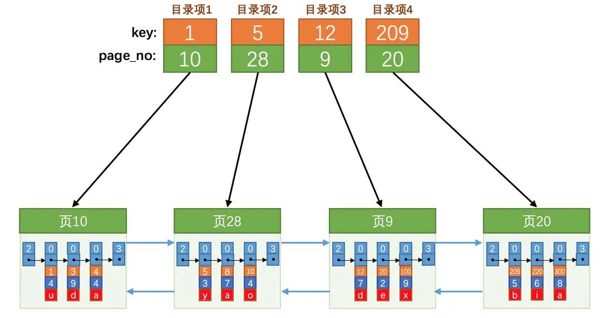
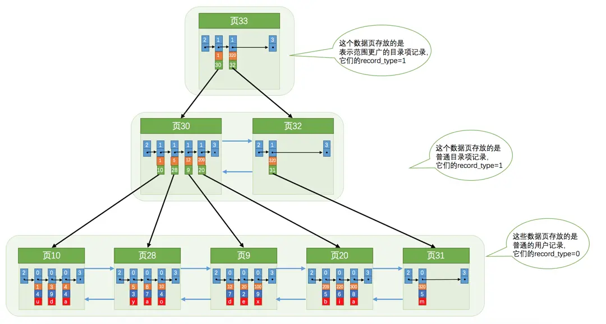
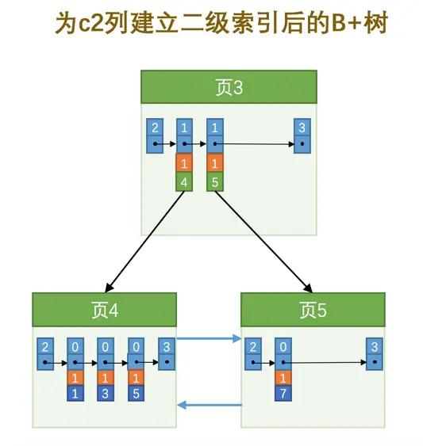
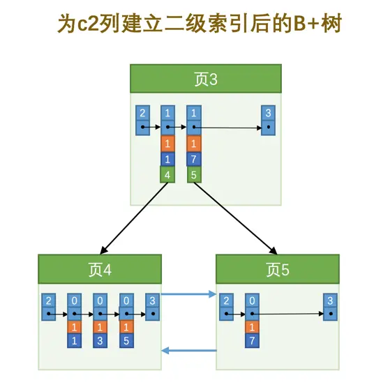

# 索引

因为页在物理存储上可能并不挨着，所以如果想从这么多页中根据主键值快速定位某些记录所在的页，需要给它们做个目录，也就是索引，每个页对应一个目录项，每个目录项包括下边两个部分

1. 页中用户记录中最小的主键值
2. 页号



由于目录项与用户记录十分相像，所以 MySQL 复用了存储用户记录的数据页来存储目录项

通过记录头信息中的 record_type 可以区分用户记录与目录项记录

- 0：普通记录
- 1：目录项记录
- 2：最小记录
- 3：最大记录

由于一个页只有 16KB 大小，能存放的目录项记录也是有限的，为此就需要多创建几个用于存储目录项记录的页，最终形成了一个 B+ 树



实际用户记录其实都存放在 B+ 树的最底层的节点上，这些节点也被称为叶子节点或叶节点，其余用来存放目录项的节点称为非叶子节点或者内节点，其中 B+ 树最上边的那个节点也称为根节点

## 聚簇索引

符合以下两种特性的 B+ 树称为聚簇索引

- 使用记录主键值的大小进行记录和页的排序
  - 页内的记录是按照主键的大小顺序排成一个单向链表
  - 各个存放用户记录的页也是根据页中用户记录的主键大小顺序排成一个双向链表
  - 存放目录项记录的页分为不同的层次，在同一层次中的页也是根据页中目录项记录的主键大小顺序排成一个双向链表
- B+ 树的叶子节点存储的是完整的用户记录

所有完整的用户记录都存放在聚簇索引的叶子节点处。这种聚簇索引并不需要我们自己去创建，InnoDB 会自动的为我们创建聚簇索引

## 二级索引

聚簇索引只能在搜索条件是主键值时才能发挥作用，因为 B+ 树中的数据都是按照主键进行排序的。如果想使用别的列作为搜索条件，就需要多建几颗 B+ 树，不同的 B+ 树中的数据采用不同的排序规则

- 使用记录索引列的大小进行记录和页的排序
- B+ 树的叶子节点存储的不再是完整的用户记录，而是索引列与主键的值
- 目录项记录中不再是主键与页号的搭配，而变成了索引列与页号的搭配

### 联合索引

也可以同时以多个列的大小作为排序规则，也就是同时为多个列建立索引。建立一个联合索引也只会建立一颗 B+ 树

### 根节点

当为某个表创建一个 B+ 树索引（非聚簇索引）时，都会为这个索引创建一个根节点页面

- 在表中没数据时，根节点既不会存用户记录，也不会存目录项记录
- 向表中插入用户记录时，会先把用户记录存储到根节点中
- 当根节点中的可用空间用完时，再插入记录，此时会将根节点中的所有记录复制到一个新分配的页。然后对这个新页进行页分裂的操作，得到另一个新页。再根据新插入记录的键值大小，分配到其中的某个页中，而根节点便升级为存储目录项记录的页

一个 B+ 树索引的根节点自诞生之日起，便不会再移动。当我们对某个表建立一个索引时，那么它的根节点的页号便会被记录到某个地方，然后凡是 InnoDB 存储引擎需要用到这个索引的时候，都会从那个固定的地方取出根节点的页号，从而来访问这个索引

### 内节点中目录项记录的唯一性

如果二级索引中目录项记录的内容只是索引列与页号的搭配，当遇到索引值相同，页号不同时，就很难确定加入到哪个页中



为了让新插入记录能找到自己在那个页里，我们需要保证在 B+ 树的同一层内节点的目录项记录除页号这个字段以外是唯一的。所以对于二级索引的内节点的目录项记录的内容实际上是由 3 个部分构成的

- 索引列的值
- 主键值
- 页号



### 一个页最少存储 2 条记录

B+ 树本质上就是一个大的多层级目录，每经过一个目录时都会过滤掉许多无效的子目录，直到最后访问到存储真实数据的目录

如果一个页面只存储了 1 条记录，那就是目录层级非常非常非常多，而且最后的那个存放真实数据的目录中只能存放一条记录

## 索引的代价

- 空间代价：每建立一个索引都要为它建立一棵 B+ 树，每一棵 B+ 树的每一个节点都是一个数据页，一个页默认会占用 16KB 的存储空间，一棵很大的 B+ 树由许多数据页组成
- 时间代价：每次对表中的数据进行增、删、改操作时，都需要去修改各个 B+ 树索引。每个增、删、改操作都可能会对节点和记录的排序造成破坏，存储引擎需要额外的时间进行一些记录移位，页面分裂、页面回收等操作来维护节点和记录的排序

## 适用条件

```sql
CREATE TABLE person_info(
    id INT NOT NULL auto_increment,
    name VARCHAR(100) NOT NULL,
    birthday DATE NOT NULL,
    phone_number CHAR(11) NOT NULL,
    country varchar(100) NOT NULL,
    PRIMARY KEY (id),
    KEY idx_name_birthday_phone_number (name, birthday, phone_number)
);
```

### 全值匹配

搜索条件中的列和索引列一致

```sql
SELECT * FROM person_info WHERE name = 'Ashburn' AND birthday = '1990-09-27' AND phone_number = '15123983239';
```

其实 idx_name_birthday_phone_number 索引，就是记录先按照 name 进行排序，如果 name 相同，再按照 birthday 排序，如果前两列的值都相同，再按 phone_number 排序

name、birthday、phone_number 顺序调换也是没影响的，MySQL 的查询优化器会分析搜索条件并且按照可以使用的索引中列的顺序来决定先使用哪个搜索条件

### 匹配左边的列

搜索条件中可以不用包含全部联合索引中的列，可以只包含左边一个或多个列

```sql
SELECT * FROM person_info WHERE name = 'Ashburn';
```

```sql
SELECT * FROM person_info WHERE name = 'Ashburn' AND birthday = '1990-09-27';
```

如果不使用左边的列，是使用不到索引的，因为无法保证该列在索引中是有序的

```sql
SELECT * FROM person_info WHERE birthday = '1990-09-27';
```

### 匹配列前缀

对于字符串类型的索引列来说，只匹配它的前缀也是可以快速定位记录，因为字符串在排序时，也是逐个比较字符的大小的

```sql
SELECT * FROM person_info WHERE name LIKE 'As%';
```

### 匹配范围值

在索引中所有记录都是按照索引列的值从小到大的顺序排好序的，所以这极大的方便我们查找索引列的值在某个范围内的记录

```sql
SELECT * FROM person_info WHERE name > 'Asa' AND name < 'Barlow';
```

1. 先找到 name 值大于 Asa 的二级索引记录，读取该记录的主键值进行回表操作，获得对应的聚簇索引记录后发送给客户端
2. 再沿着找到的二级索引记录所在的链表向后查找，判断该记录是否符合 name 值小于 Barlow 的条件，如果符合，则进行回表操作后发送至客户端
3. 重复上一步骤，直到某条二级索引记录不符合 name 值小于 Barlow 的条件为止

在使用联合索引进行范围查找时，只有对索引最左边的那个列进行范围查找的时候才能用到索引

```sql
SELECT * FROM person_info WHERE name > 'Asa' AND name < 'Barlow' AND birthday > '1980-01-01';
```

birthday 在相同的 name 范围内是有序的，但从总体角度看是无序的

### 精确匹配某一列并范围匹配另外一列

如果左边的列是精确查找，则右边的列可以进行范围查找

```sql
SELECT * FROM person_info WHERE name = 'Ashburn' AND birthday > '1980-01-01' AND birthday < '2000-12-31' AND phone_number > '15100000000';
```

### 用于排序

当需要通过 `ORDER BY` 子句对查询出来的记录按照某种规则进行排序时，一般只能把记录都加载到内存中，再用一些排序算法在内存中对这些记录进行排序。有时查询的结果集太大以至于不能在内存中进行排序的话，还可能暂时借助磁盘的空间来存放中间结果，排序操作完成后再把排好序的结果集返回到客户端

在 MySQL 中，把在内存中或者磁盘上进行排序的方式统称为文件排序（filesort），跟文件这个词儿一沾边儿，就显得这些排序操作非常慢了。但是如果 `ORDER BY` 子句里使用到了索引列，就有可能省去在内存或文件中排序的步骤

```sql
SELECT * FROM person_info ORDER BY name, birthday, phone_number LIMIT 10;
```

`ORDER BY` 的子句后边的列的顺序也必须按照索引列的顺序给出，当然也适用最左匹配原则

#### 不可以使用索引进行排序的情况

##### ASC、DESC 混用

对于使用联合索引进行排序的场景，要求各个排序列的排序顺序是一致的

```sql
SELECT * FROM person_info ORDER BY name ASC, birthday ASC LIMIT 10;
```

从索引的最左边开始往右读 10 行记录即可

```sql
SELECT * FROM person_info ORDER BY name DESC, birthday DESC LIMIT 10;
```

从索引的最右边开始往左读 10 行记录即可

```sql
SELECT * FROM person_info ORDER BY name, birthday DESC LIMIT 10;
```

- 先从索引的最左边找到 name 列最小的值，找到 name 列等于该值的所有记录，再从这堆记录的最右边开始，向左找 10 条记录
- 如果找到的记录不足 10 条，再继续向右找 name 值第二小的记录，重复以上过程，直到找到 10 条记录为止

##### 排序列包含非同一个索引的列

用来排序的多个列不属于同一个索引，也是不能使用索引进行排序

```sql
SELECT * FROM person_info ORDER BY name, country LIMIT 10;
```

##### 排序列使用了复杂的表达式

索引列必须以单独列的形式出现，而不是修饰过的形式

```sql
SELECT * FROM person_info ORDER BY UPPER(name) LIMIT 10;
```

### 用于分组

如果分组顺序和索引列的顺序是一致的，可以直接使用索引进行分组

```sql
SELECT name, birthday, phone_number, COUNT(*) FROM person_info GROUP BY name, birthday, phone_number
```

其实分组操作与建立索引的操作类似，分组是先按照 name 进行分组，name 相同再按照 birthday 分组，birthday 相同再按照 phone_number 分组。建立索引时需要对记录进行排序，先按照 name 进行排序，name 相同再按照 birthday 排序，birthday 相同再按照 phone_number 排序

## 回表

```sql
SELECT * FROM person_info WHERE name > 'Asa' AND name < 'Barlow';
```

1. 从索引 idx_name_birthday_phone_number 对应的 B+ 树中取出 name 值在 Asa ~ Barlow 之间的用户记录
2. 由于索引 idx_name_birthday_phone_number 对应的 B+ 树用户记录中只包含 name、birthday、phone_number、id 这 4 个字段，还需要获取到 country 字段的值。这时就需要通过上一步获取到的主键值，再从聚簇索引中找到完整的用户记录。这就是所谓的回表，然后把完整的用户记录返回给查询用户

由于索引 idx_name_birthday_phone_number 对应的 B+ 树中的记录首先会按照 name 列的值进行排序，所以值在 Asa ~ Barlow 之间的记录在磁盘中的存储是相连的，集中分布在一个或几个数据页中，我们可以很快的把这些连着的记录从磁盘中读出来，这种读取方式也可以称为顺序 I/O

根据第 1 步中获取到的记录的主键值可能并不相连，而在聚簇索引中记录是根据主键的顺序排列的，所以根据这些并不连续的主键值到聚簇索引中访问完整的用户记录可能分布在不同的数据页中，这样读取完整的用户记录可能要访问更多的数据页，这种读取方式也可以称为随机 I/O

一般情况下，顺序 I/O 比随机 I/O 的性能高很多，所以步骤 1 的执行可能很快，而步骤 2 就慢一些

所以回表会使用到两个 B+ 树索引，一个二级索引，一个聚簇索引。并且访问二级索引使用顺序 I/O，访问聚簇索引使用随机 I/O

需要回表的记录越多，使用二级索引的性能就越低，甚至让某些查询宁愿使用全表扫描也不使用二级索引

### 覆盖索引

为了彻底告别回表操作带来的性能损耗，在搜索条件中最好只包含索引列，这样就不必到聚簇索引中再查找记录的剩余列

我们把这种只需要用到索引的查询方式称为索引覆盖。排序操作也优先使用覆盖索引的方式进行查询

```sql
SELECT name, birthday, phone_number FROM person_info WHERE name > 'Asa' AND name < 'Barlow'
```

## 索引建议

### 只为用于搜索、排序或分组的列创建索引

只为出现在 `WHERE` 子句中的列、连接子句中的连接列，或者出现在 `ORDER BY` 或 `GROUP BY` 子句中的列创建索引

### 考虑列的基数

列的基数指的是某一列中不重复数据的个数，在记录行数一定的情况下，列的基数越大，该列中的值越分散，列的基数越小，该列中的值越集中

最好为那些列的基数大的列建立索引，为基数太小列的建立索引效果可能不好

### 索引列的类型尽量小

尽量让索引列使用较小的类型

- 数据类型越小，在查询时进行的比较操作越快（这是 CPU 层次的操作）
- 数据类型越小，索引占用的存储空间就越少，在一个数据页内就可以放下更多的记录，从而减少磁盘 I/O 带来的性能损耗，也就意味着可以把更多的数据页缓存在内存中，从而加快读写效率

主键更建议使用尽可能小的数据类型，因为聚簇索引、二级索引都会存储主键值，使用更小的数据类型，意味着节省更多的存储空间和更高效的 I/O

### 索引字符串值的前缀

我们在 MySQL 中常用 utf8 字符集去存储字符串，编码一个字符需要占用 1 ~ 3 个字节。如果字符串很长，那存储一个字符串就需要占用很大的存储空间，并且建立索引时，占用的空间也很大，做字符串比较也会占用更多的时间

可以只对字符串的前几个字符进行索引。这样在查找记录时虽然不能精确的定位到记录的位置，但是能定位到相应前缀所在的位置，然后根据前缀相同的记录的主键值回表查询完整的字符串值，再对比就好了

```sql
CREATE TABLE person_info(
    name VARCHAR(100) NOT NULL,
    birthday DATE NOT NULL,
    phone_number CHAR(11) NOT NULL,
    country varchar(100) NOT NULL,
    KEY idx_name_birthday_phone_number (name(10), birthday, phone_number)
);    
```

`name(10)` 就表示在建立的 B+ 树索引中只保留记录的前 10 个字符的编码

#### 索引列前缀对排序的影响

由于索引列前缀不包含完整的信息，只会将前面几个字符进行排序，后面的字符可能还是乱序的，也就无法对整个列进行排序，所以只能使用文件排序

```sql
SELECT * FROM person_info ORDER BY name LIMIT 10;
```

### 让索引列在比较表达式中单独出现

如果索引列在比较表达式中不是以单独列的形式出现，而是以某个表达式，或者函数调用形式出现的话，是用不到索引的

```sql
# 无法使用索引
WHERE my_col * 2 < 4

# 可以使用索引
WHERE my_col < 4/2
```

### 主键插入顺序

记录是存储在数据页中的，数据页和记录又是按照记录主键值从小到大的顺序进行排序，所以如果我们插入的记录的主键值是依次增大的话，那我们每插满一个数据页就换到下一个数据页继续插，而如果我们插入的主键值忽大忽小的话，这就比较麻烦了

当数据页满了，再插入数据，当前页面就会分裂成两个页面，把本页中的一些记录移动到新创建的这个页中。这就意味着性能损耗，所以应尽量避免这样无谓的性能损耗，最好让插入的记录的主键值依次递增

### 冗余和重复索引

冗余和重复索引，只会增加维护的成本，并不会对搜索有什么好处
