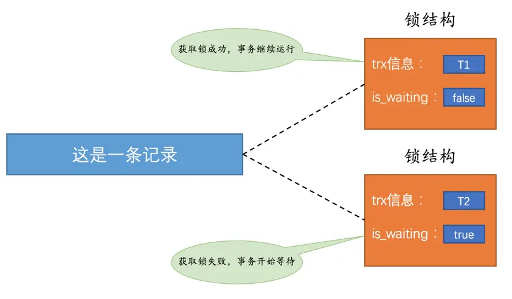
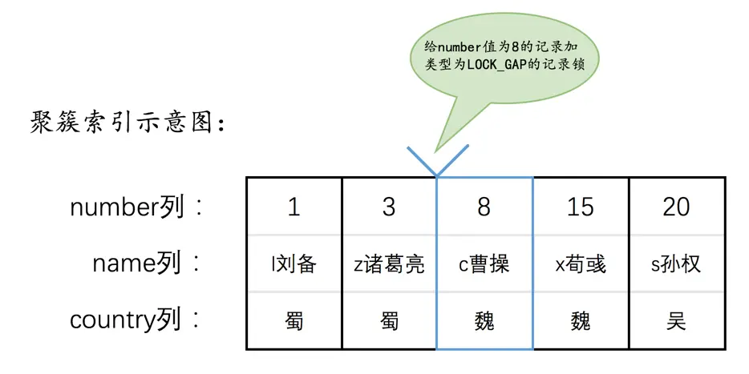
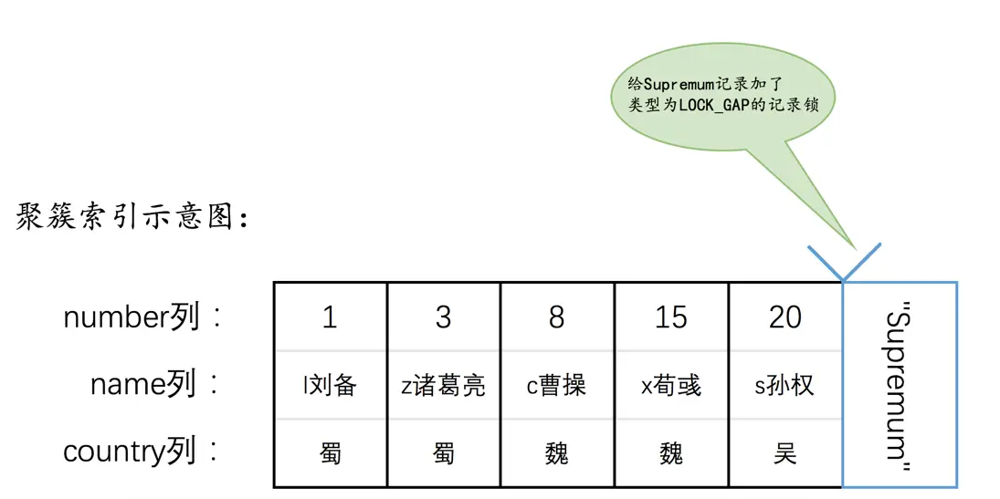
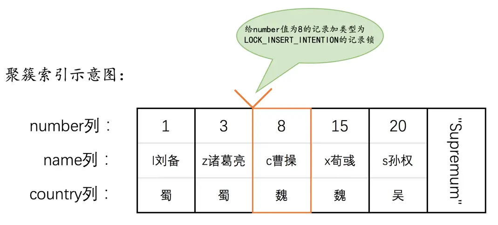
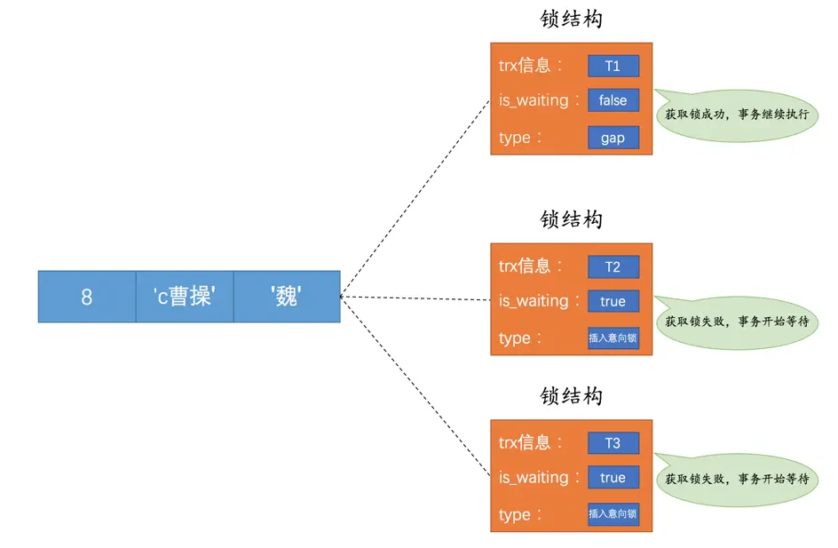
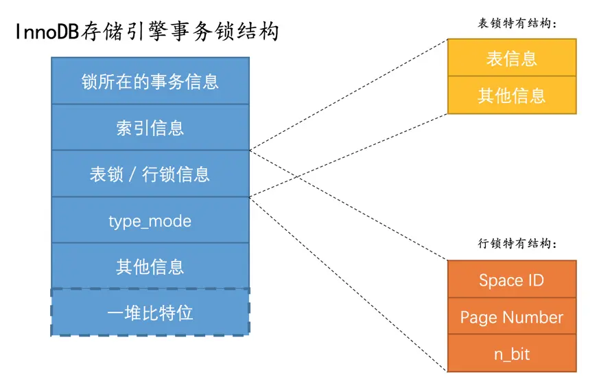
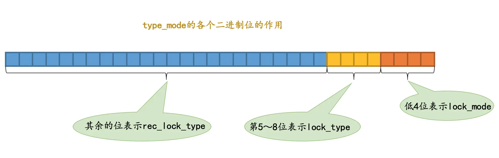
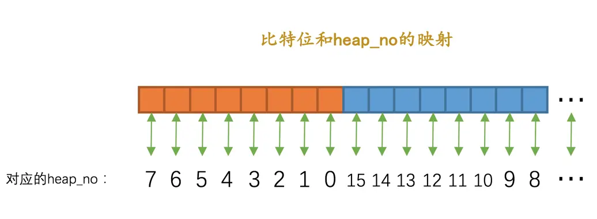

# 锁

## 并发事务访问相同记录的情况

### 读-读

并发事务相继读取相同的记录

读取操作本身不会对记录产生修改，并不会引起什么问题，所以允许这种情况的发生

### 写-写

并发事务相继对相同的记录做出改动

可能会发生脏写的问题，任何一种隔离级别都不允许这种问题的发生。所以在多个未提交事务相继对一条记录做改动时，需要让它们排队执行，这个排队的过程其实是通过锁来实现的

锁其实是一个内存中的结构，在事务执行前本来是没有锁的。当一个事务想对这条记录做改动时，首先会看看内存中有没有与这条记录关联的锁结构，当没有的时候就会在内存中生成一个锁结构与之关联

锁结构有两个重要的属性

- trx 信息：代表这个锁结构是哪个事务生成的
- is_waiting：代表当前事务是否在等待



在事务提交之后，就会把该事务生成的锁结构释放掉，然后看看还有没有别的事务在等待获取锁。如果有就将其对应的锁结构的 is_waiting 属性设置为 false，然后把该事务对应的线程唤醒，让它继续执行

### 读-写或写-读

一个事务进行读取操作，另一个进行改动操作

这种情况下可能发生脏读、不可重复读、幻读的问题

为了解决脏读、不可重复读、幻读这些问题，有两种可选的解决方案

- 读操作利用多版本并发控制（MVCC），写操作进行加锁
  - 读操作读到的是记录的历史版本，而写操作针对的是最新版本的记录，所以采用 MVCC 时，读-写操作并不冲突
- 读、写操作都采用加锁的方式
  - 如果不允许读记录的旧版本，这样在读取记录的时候也就需要对其进行加锁操作，也就意味着读操作和写操作也像写-写操作那样排队执行

## 一致性读（Consistent Reads）

事务利用 MVCC 进行的读取操作称之为一致性读，或者一致性无锁读，有的地方也称之为快照读

所有普通的 SELECT 语句在 READ COMMITTED、REPEATABLE READ 隔离级别下都算是一致性读

一致性读并不会对表中的任何记录做加锁操作，其他事务可以自由的对表中的记录做改动

## 锁定读（Locking Reads）

### 共享锁和独占锁

由于既要允许读-读情况不受影响，又要使写-写、读-写或写-读情况中的操作相互阻塞，所以 MySQL 给锁分了个类

- 共享锁（Shared Locks）：简称 S 锁，在事务要读取一条记录时，需要先获取该记录的 S 锁
- 独占锁（Exclusive Locks）：简称 X 锁，在事务要改动一条记录时，需要先获取该记录的 X 锁

S 锁与 S 锁之间是兼容的，与 X 锁有关的都是不兼容的

一个事务获取到了某条记录的 S 锁，其他事务也可以获取到该条记录的 S 锁。但如果想获取该条记录的 X 锁，就必须等待该事务提交后将锁释放掉

一个事务获取到了某条记录的 X 锁，其他事务就必须等待该事务提交后将锁释放掉，无论想获取的是 S 锁还是 X 锁

### 锁定读的语句

- 对读取的记录加 S 锁

```sql
SELECT ... LOCK IN SHARE MODE;
```

- 对读取的记录加 X 锁

```sql
SELECT ... FOR UPDATE;
```

## 写操作

### DELETE

对一条记录做 DELETE 操作的过程其实是先在 B+ 树中定位到这条记录的位置，然后获取一下这条记录的 X 锁，然后再执行 delete mark 操作

- 我们也可以把这个定位待删除记录在 B+ 树中位置的过程看成是一个获取 X 锁的锁定读

### UPDATE

在对一条记录做 UPDATE 操作时分为 3 种情况

- 如果未修改该记录的键值并且被更新的列占用的存储空间在修改前后未发生变化，则先在 B+ 树中定位到这条记录的位置，然后再获取一下记录的 X 锁，最后在原记录的位置进行修改操作
  - 我们也可以把这个定位待修改记录在 B+ 树中位置的过程看成是一个获取 X 锁的锁定读
- 如果未修改该记录的键值并且至少有一个被更新的列占用的存储空间在修改前后发生变化，则先在 B+ 树中定位到这条记录的位置，然后获取一下记录的 X 锁，将该记录彻底删除掉（就是把记录彻底移入垃圾链表），最后再插入一条新记录
  - 我们也可以把这个定位待修改记录在 B+ 树中位置的过程看成是一个获取 X 锁的锁定读，，新插入的记录由 INSERT 操作提供的隐式锁进行保护
- 如果修改了该记录的键值，则相当于在原记录上做 DELETE 操作之后再来一次 INSERT 操作，加锁操作就需要按照 DELETE 和 INSERT 的规则进行了

### INSERT

一般情况下，新插入一条记录的操作并不加锁，InnoDB 通过隐式锁来保护这条新插入的记录在本事务提交前不被别的事务访问

## 多粒度锁

锁可以加在记录上，被称之为行级锁或者行锁。也可以加在整个表上，被称之为表级锁或者表锁。给表加的锁也可以分为共享锁（S 锁）和独占锁（X 锁）

在加表锁的时候需要判断表内是否存在行锁。InnoDB 提出了意向锁（Intention Locks）可以用来快速判断表中的记录是否被上锁，以避免用遍历的方式来查看表中有没有上锁的记录

- 意向共享锁（Intention Shared Lock，IS 锁）：当事务准备在某条记录上加 S 锁时，需要先在表级别加一个 IS 锁
- 意向独占锁（Intention Exclusive Lock，IX 锁）：当事务准备在某条记录上加 X 锁时，需要先在表级别加一个 IX 锁

如果需要获取一个行级的 S 锁，需要先给表加一个 IS 锁，同理如果需要获取一个行级的 X 锁，需要先给表加一个 IX 锁

如果需要获取一个表级的 S 锁，需要先判断表上是否已被加入 IX 锁，如果有，需等待 IX 锁释放后，才能获取到该表的 S 锁

如果需要获取一个表级的 X 锁，，需要先判断表上是否已被加入 IX 锁或 IS 锁，如果有，需等待 IX 锁或 IS 锁释放后，才能获取到该表的 X 锁

表级别的各种锁的兼容性

| 兼容性 | X | IX | S | IS |
| :-: | :-: | :-: | :-: | :-: |
| X | 不兼容 | 不兼容 | 不兼容 | 不兼容 |
| IX | 不兼容 | 兼容 | 不兼容 | 兼容 |
| S | 不兼容 | 不兼容 | 兼容 | 兼容 |
| IS | 不兼容 | 兼容 | 兼容 | 兼容 |

与 X 锁相关的都不兼容，意向锁之间是相互兼容的，S 锁与 S 锁、S 锁与 IS 锁也是兼容的

## InnoDB 中的锁

### 表级锁

#### S 锁、X 锁

在对某个表执行 SELECT、INSERT、DELETE、UPDATE 语句时，InnoDB 存储引擎是不会为这个表添加表级别的 S 锁或者 X 锁的

在对某个表执行一些诸如 `ALTER TABLE`、`DROP TABLE` 这类的 DDL 语句时，其他事务对这个表并发执行诸如 `SELECT`、`INSERT`、`DELETE`、`UPDATE` 的语句会发生阻塞，同理，某个事务中对某个表执行 `SELECT`、`INSERT`、`DELETE`、`UPDATE` 语句时，在其他会话中对这个表执行 DDL 语句也会发生阻塞。这个过程其实是通过在 server 层元数据锁（Metadata Locks，MDL）来实现的，一般情况下也不会使用 InnoDB 存储引擎自己提供的表级别的 S 锁和 X 锁

InnoDB 提供的表级 S 锁或者 X 锁是相当鸡肋，只会在一些特殊情况下，比方说崩溃恢复过程中用到，并不会提供什么额外的保护，只是会降低并发能力

- `LOCK TABLES t READ`：InnoDB 会对表 t 加表级别的 S 锁
- `LOCK TABLES t WRITE`：InnoDB 会对表 t 加表级别的 X 锁

#### IS 锁、IX 锁

当我们在对某些记录加 S 锁之前，那就需要先在表级别加一个 IS 锁，当我们在对某些记录加 X 锁之前，那就需要先在表级别加一个 IX 锁

IS 锁和 IX 锁的使命只是为了后续在加表级别的 S 锁和 X 锁时判断表中是否有已经被加锁的记录，以避免用遍历的方式来查看表中有没有上锁的记录

#### AUTO-INC 锁

在使用 MySQL 过程中，我们可以为表的某个列添加 AUTO_INCREMENT 属性，之后在插入记录时，可以不指定该列的值，系统会自动为它赋上递增的值

系统实现这种自动给 AUTO_INCREMENT 修饰的列递增赋值的原理主要是两个

- 采用 AUTO-INC 锁，也就是在执行插入语句时就在表级别加一个 AUTO-INC 锁，然后为每条待插入记录的 AUTO_INCREMENT 修饰的列分配递增的值，在该语句执行结束后，再把 AUTO-INC 锁释放掉。这样一个事务在持有 AUTO-INC 锁的过程中，其他事务的插入语句都要被阻塞，可以保证一个语句中分配的递增值是连续的
  - 一般适用于执行前不可以确定具体要插入多少条记录
- 采用一个轻量级的锁，在为插入语句生成 AUTO_INCREMENT 修饰的列的值时获取一下这个轻量级锁，然后生成本次插入语句需要用到的 AUTO_INCREMENT 列的值之后，就把该轻量级锁释放掉，并不需要等到整个插入语句执行完才释放锁
  - 适用于在执行前就可以确定具体要插入多少条记录，可以避免锁定表，提升插入性能

### 行级锁

#### Record Locks

普通的记录锁，官方的类型名称为 LOCK_REC_NOT_GAP，分为 S 锁和 X 锁

#### Gap Locks

在 REPEATABLE READ 隔离级别下是可以解决幻读问题的，解决方案有两种，可以使用 MVCC 方案解决，也可以采用加锁方案解决

但是在使用加锁方案解决时有个大问题，就是事务在第一次执行读取操作时，那些幻影记录尚不存在，我们无法给这些幻影记录加上普通记录锁。不过 InnoDB 提出了一种称之为 Gap Locks 的锁，官方的类型名称为 LOCK_GAP，可以简称为 gap 锁



加了 gap 锁，就意味着不允许其他事务在这个间隙内插入新数据

gap 锁的提出仅仅是为了防止插入幻影记录而提出的，虽然有共享 gap 锁和独占 gap 锁这样的说法，但是它们起到的作用都是相同的，如果对一条记录加了 gap 锁，并不会限制其他事务对这条记录加记录锁或者继续加 gap 锁

对于最后一条记录之后的间隙，会在该记录所处页面的 Supremum 记录上加上 gap 锁



#### Next-Key Locks

有时候我们既想锁住某条记录，又想阻止其他事务在该记录前边的间隙插入新记录，就可以使用 Next-Key Locks 锁，官方的类型名称为 LOCK_ORDINARY，可以简称为 next-key 锁

next-key 锁的本质就是一个正经记录锁和一个 gap 锁的合体，它既能保护该条记录，又能阻止别的事务将新记录插入被保护记录前边的间隙

#### Insert Intention Locks

一个事务在插入一条记录时需要判断一下插入位置是不是被别的事务加了所谓的 gap 锁（next-key 锁也包含 gap 锁），如果有的话，插入操作需要等待，直到拥有 gap 锁的那个事务提交

但是 InnoDB 规定事务在等待的时候也需要在内存中生成一个锁结构，表明有事务想在某个间隙中插入新记录，但是现在在等待。InnoDB 把这种类型的锁命名为 Insert Intention Locks，官方的类型名称为 LOCK_INSERT_INTENTION，也可以称为插入意向锁





当一个事务释放了 gap 锁，其他事务就能获取到插入意向锁，且事务之间并不会相互阻塞，他们都能获取到插入意向锁，然后执行插入操作

插入意向锁并不会阻止别的事务继续获取该记录上任何类型的锁

#### 隐式锁

一个事务在执行 INSERT 操作时，如果即将插入的间隙已经被其他事务加了 gap 锁，那么本次 INSERT 操作会阻塞，并且当前事务会在该间隙上加一个插入意向锁，否则一般情况下 INSERT 操作是不加锁的

如果一个事务首先插入了一条记录（此时并没有与该记录关联的锁结构），然后另一个事务

- 立即使用 `SELECT ... LOCK IN SHARE MODE` 语句读取这条记录，也就是在要获取这条记录的 S 锁，或者使用 `SELECT ... FOR UPDATE` 语句读取这条记录，也就是要获取这条记录的 X 锁
  - 如果允许这种情况的发生，那么可能产生脏读问题
- 立即修改这条记录，也就是要获取这条记录的 X 锁
  - 如果允许这种情况的发生，那么可能产生脏写问题

这时事务 id 就起作用了

- 对于聚簇索引记录来说，有一个 trx_id 隐藏列，该隐藏列记录着最后改动该记录的事务 id。如果其他事务此时想对该记录添加 S 锁或者 X 锁时，首先会看一下该记录的 trx_id 隐藏列代表的事务是否是当前的活跃事务，如果是的话，那么就帮助当前事务创建一个 X 锁，然后自己进入等待状态
- 对于二级索引记录来说，本身并没有 trx_id 隐藏列，但是在二级索引页面的 Page Header 部分有一个 PAGE_MAX_TRX_ID 属性，该属性代表对该页面做改动的最大的事务 id，如果 PAGE_MAX_TRX_ID 属性值小于当前最小的活跃事务 id，那么说明对该页面做修改的事务都已经提交了，否则就需要在页面中定位到对应的二级索引记录，然后回表找到它对应的聚簇索引记录，然后再重复情景一的做法

一个事务对新插入的记录可以不显式的加锁（生成一个锁结构），但是由于事务 id 的存在，相当于加了一个隐式锁。别的事务在对这条记录加 S 锁或者 X 锁时，由于隐式锁的存在，会先帮助当前事务生成一个锁结构，然后自己再生成一个锁结构后进入等待状态

## InnoDB 锁的内存结构

对一条记录加锁的本质就是在内存中创建一个锁结构与之关联，但一个事务对多条记录进行加锁，会进行优化

- 在同一个事务中进行加锁操作
- 被加锁的记录在同一个页面中
- 加锁的类型是一样的
- 等待状态是一样的

如果满足以上条件，这些记录的锁就可以被放到一个锁结构中

### 锁结构



#### 锁所在的事务信息

不论是表锁还是行锁，都是在事务执行过程中生成的，哪个事务生成了这个锁结构，这里就记载着这个事务的信息

存放的只是一个指针

#### 索引信息

对于行锁来说，需要记录一下加锁的记录是属于哪个索引的

#### 表锁 / 行锁信息

表锁结构和行锁结构在这个位置的内容是不同的

- 表锁：记载着这是对哪个表加的锁，还有其他的一些信息
- 行锁：记载了三个重要的信息
  - Space Id：记录所在的表空间
  - Page Number：记录所在页号
  - n_bits：对于行锁来说，一条记录就对应着一个比特位，一个页面中包含很多记录，用不同的比特位来区分到底是哪一条记录加了锁。为此在行锁结构的末尾放置了一堆比特位，这个 n_bits 属性代表使用了多少比特位

#### type_mode

这是一个 32 位的数，被分成了 lock_mode、lock_type和rec_lock_type 三个部分



##### lock_mode

锁的模式，占用低 4 位

- LOCK_IS（十进制的 0）：表示共享意向锁，也就是 IS 锁
- LOCK_IX（十进制的 1）：表示独占意向锁，也就是 IX 锁
- LOCK_S（十进制的 2）：表示共享锁，也就是 S 锁
- LOCK_X（十进制的 3）：表示独占锁，也就是 X 锁
- LOCK_AUTO_INC（十进制的 4）：表示 AUTO-INC 锁

##### lock_type

锁的类型，占用第 5 ~ 8 位，不过现阶段只有第 5 位和第 6 位被使用

- LOCK_TABLE（十进制的 16），也就是当第 5 个比特位置为 1 时，表示表级锁
- LOCK_REC（十进制的 32），也就是当第 6 个比特位置为 1 时，表示行级锁

##### rec_lock_type

行锁的具体类型，使用其余的位来表示，也就是只有在 lock_type 的值为 LOCK_REC 时，才会被细分为更多的类型

- LOCK_ORDINARY（十进制的 0）：表示 next-key 锁
- LOCK_GAP（十进制的 512）：也就是当第 10 个比特位置为 1 时，表示 gap 锁
- LOCK_REC_NOT_GAP（十进制的 1024）：也就是当第 11 个比特位置为 1 时，表示正经记录锁
- LOCK_INSERT_INTENTION（十进制的 2048）：也就是当第 12 个比特位置为 1 时，表示插入意向锁
- LOCK_WAIT（十进制的 256） ：也就是当第 9 个比特位置为 1 时，表示 is_waiting 为 true，也就是当前事务尚未获取到锁，处在等待状态；当这个比特位为 0 时，表示 is_waiting 为 false，也就是当前事务获取锁成功

#### 其他信息

为了更好的管理系统运行过程中生成的各种锁结构而设计了各种哈希表和链表

#### 一堆比特位

如果是行锁结构的话，在该结构末尾还放置了一堆比特位，比特位的数量是由 n_bits 属性表示的

页面中的每条记录在记录头信息中都包含一个 heap_no 属性，锁结构最后的一堆比特位就对应着一个页面中的记录，一个比特位映射一个 heap_no，不过为了编码方便，映射方式有点怪


