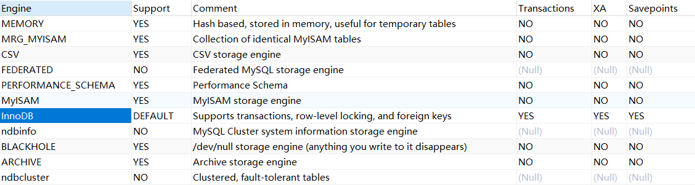
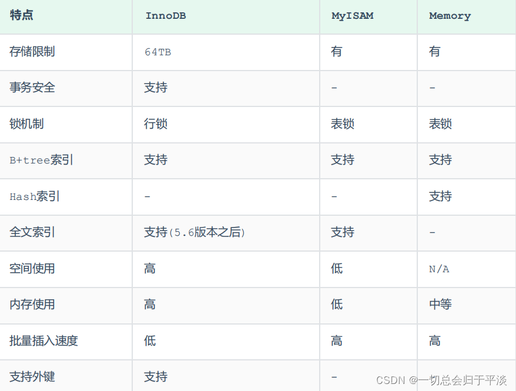

# MySQL

MySQL 默认是隐式提交，每执行一条语句就把这条语句当成一个事务然后进行提交。当出现 START TRANSACTION 语句时，会关闭隐式提交；当 COMMIT 或 ROLLBACK 语句执行后，事务会自动关闭，重新恢复隐式提交

通过 set autocommit=0 可以取消自动提交，直到 set autocommit=1 才会提交；autocommit 标记是针对每个连接而不是针对服务器的。

## 数据库范式

## 语法相关

### count

对于 `COUNT(*)`、`COUNT(常数)`、`COUNT(主键)` 来说，优化器可以选择最小的索引执行查询，从而提升效率，它们的执行过程是一样的，只不过对于 NULL 值有不同的判断方式，这个判断为 `NULL` 的过程的代价可以忽略不计，所以可以认为 `COUNT(*)`、`COUNT(常数)`、`COUNT(主键)` 所需要的代价是相同的

对于 `COUNT(非主键列)` 来说，server 层必须要从 InnoDB 中读到包含非主键列的记录，所以优化器并不能随心所欲的选择最小的索引去执行

- `COUNT(*)`：包含 NULL 值
- `COUNT(常数)`：包含 NULL 值
- `COUNT(列名)`：不包含 NULL 值

## 查询语句的执行顺序

```sql
FROM <left_table>
ON <join_condition>
<join_type> JOIN <right_table>
WHERE <where_condition>
GROUP BY <group_by_list>
HAVING <having_condition>
SELECT
DISTINCT
ORDER BY <order_by_condition>
LIMIT <limit_number>
```

1. 首先对 `FROM` 子句中的前两个表执行一个笛卡尔乘积，此时生成虚拟表 vt1
    - `FROM` 子句中写在最后的表将被最先处理，即最后的表为驱动表，当 `FROM` 子句中包含多个表的情况下，选择数据最少的表作为基础表
2. 对虚拟表 vt1 应用 `ON` 筛选器，`ON` 中的逻辑表达式将应用到虚拟表 vt1 中的各个行，筛选出满足 `ON` 逻辑表达式的行，生成虚拟表 vt2
3. 如果使用的是 `OUTER JOIN`，就将第二步中过滤掉的数据重新添加过来，生成虚拟表 vt3
4. 如果 `FROM` 子句包含两个以上的表，就对虚拟表 vt3 和下一个表重复 1 ~ 3 的步骤，最终得到一个新的虚拟表 vt3
5. 对虚拟表 vt3 应用 `WHERE` 筛选器。根据指定的条件对数据进行筛选，并把满足的数据插入虚拟表 vt4
6. 按 `GROUP BY` 子句中的列表将虚拟表 vt4 中的行唯一的值组合成为一组，生成虚拟表 vt5。如果应用了 `GROUP BY`，那么后面的所有步骤都只能得到的虚拟表 vt5 的列或者是聚合函数。原因在于最终的结果集中每一个组只用一行数据来表示
    - 从这一步开始，后面的语句中都可以使用 `SELECT` 中的别名
7. 对虚拟表 vt5 应用 `HAVING` 筛选器，根据指定的条件对数据进行筛选，并把满足的数据插入虚拟表 vt6
8. 将虚拟表 vt6 中的在 `SELECT` 中出现的列筛选出来，产生虚拟表 vt7
9. 将重复的行从虚拟表 vt7 中移除，产生虚拟表 vt8
10. 将虚拟表 vt8 中的行按 `ORDER BY` 子句中的列表进行排序，生成一个游标
11. 使用 `LIMIT` 指定需要返回的行数

使用内连接时，我们写的 `ON` 条件都会解析成 `WHERE` 条件，所以我们将条件写在 `ON` 或者 `WHERE` 里是没有区别的

## 架构


<small>[SQL语句在MySQL中的执行过程](https://javaguide.cn/database/mysql/how-sql-executed-in-mysql.html)</small>

### server 层

#### 连接器

主要负责用户登录数据库，进行用户的身份认证

#### 查询缓存

MySQL 8.0 版本后已删除该功能

主要用来缓存我们所执行的 `SELECT` 语句以及该语句的结果集，以查询语句为 key，结果集为 value，缓存在内存中

在执行查询语句时，会先查询缓存。如果缓存命中，就会直接返回，没有命中，才会执行查询语句，执行完成后也会将结果集缓存起来

两个查询在任何字符上的不同都会导致缓存不命中，且如果对表结构或数据进行了修改，那么所有与这个表相关的缓存都会失效

#### 分析器

1. 词法分析：一条 SQL 语句有多个字符串组成，首先要提取关键字，比如 `SELECT`，提出查询的表，提出字段名，提出查询条件等
2. 语法分析：判断输入的 SQL 是否正确，是否符合 MySQL 的语法

#### 优化器

选择最优的方案执行 SQL 语句

#### 执行器

执行 SQL 语句

### 语句分析

#### 查询语句是如何执行的

1. 先检查该语句是否有权限，如果没有权限，直接返回错误信息，如果有权限会先查询缓存（MySQL 8.0 版本之前）
2. 使用分析器进行词法分析和语法分析
3. 使用优化器确定执行方案
4. 按照生成的执行计划，执行并返回结果

#### 更新语句是如何执行的

1. 先找到要修改的数据
2. 对数据进行修改后，调用引擎 API 接口，写入这一行数据
3. 引擎将这行新数据更新到内存中，同时将这个更新操作记录到 redo log 中，此时 redo log 处于prepare状态。然后告知执行器执行完成了，随时可以提交事务
4. 执行器收到通知后记录 binlog，并把 binlog 写入磁盘，然后调用引擎接口，提交 redo log 为提交状态，更新完成

## 存储引擎





<small>[MySQL进阶之存储引擎【InnoDB、MySAM、Memory】](https://blog.csdn.net/weixin_53041251/article/details/124241047)</small>

- InnoDB 支持的哈希索引是自适应的，InnoDB 会根据表的使用情况自动为表生成哈希索引，不能人为干预是否在一张表中生成哈希索引

### Memory

所有的数据都存储在内存中，数据的处理速度快，但是安全性不高，存储的数据量受到内存大小的限制

### InnoDB 与 MylSAM

- 事务：InnoDB 支持，MylSAM 不支持
- 外键：InnoDB 支持，MylSAM 不支持
  - 不建议在实际生产环境中使用外键约束
- 锁粒度：InnoDB 支持行级锁，MylSAM 只支持表级锁
- 表的具体行数：MyISAM 保存了表的总行数
- 索引：InnoDB 与 MyISAM 都使用 B+ 树作为索引结构，但具体实现的方式不一样
  - InnoDB 索引与数据是存放在一起的，索引叶子节点存储的就是数据记录，即聚簇索引
  - MyISAM 索引文件和数据文件是分离的，索引叶子节点存储的是数据记录的地址，需要根据地址读取相应的数据记录，即非聚簇索引
- 性能：


## SQL 优化

慢SQL如何定位呢？

有哪些方式优化慢SQL？

怎么看执行计划（explain），如何理解其中各个字段的含义？

## 事务

事务的四大特性

那ACID靠什么保证的呢

事务的隔离级别有哪些？MySQL 的默认隔离级别是什么

什么是幻读，脏读，不可重复读呢？

事务的各个隔离级别都是如何实现的？

MVCC了解吗？怎么实现的？

## 锁

MySQL中有哪几种锁，列举一下？

说说InnoDB里的行锁实现?

意向锁是什么知道吗？

MySQL的乐观锁和悲观锁了解吗

MySQL 遇到过死锁问题吗，你是如何解决的？

## 读写分离

数据库读写分离了解吗？

那读写分离的分配怎么实现呢？

主从复制原理了解吗？

主从同步延迟怎么处理

## 分库分表

你们一般是怎么分库的呢

那你们是怎么分表的

水平分表有哪几种路由方式

常用的分库分表中间件有哪些

那你觉得分库分表会带来什么问题呢

## 参考

- [VIP MySQL 是怎样运行的：从根儿上理解 MySQL](https://juejin.cn/book/6844733769996304392)
- [mysql中varchar能存多少汉字、数字，以及varchar(100)和varchar(10)的区别](https://blog.csdn.net/weixin_43431218/article/details/124734940)
- [mysql中的int(10)int(20)分别代表什么意思](https://blog.csdn.net/weixin_45707610/article/details/131439336)
- [SQL 查询语句的执行顺序解析](https://learnku.com/articles/35655)
- [Mysql关键字执行顺序-深入解析](https://developer.aliyun.com/article/1131899)
- [MySQL中SQL语句的执行顺序（详细）](https://www.cnblogs.com/antLaddie/p/17175396.html)
- [SQL语句在MySQL中的执行过程](https://javaguide.cn/database/mysql/how-sql-executed-in-mysql.html)


