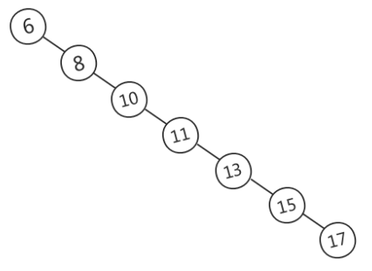
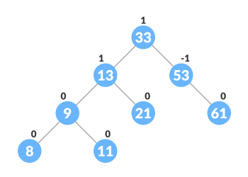
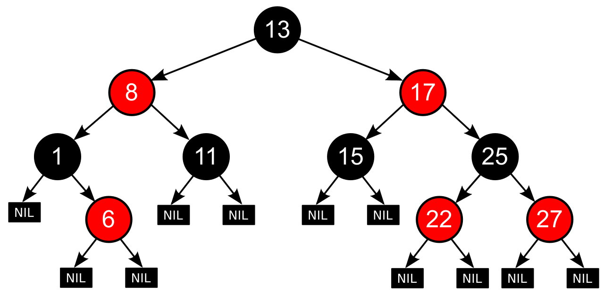

# 索引

## 数据结构

### 二叉查找树（BST，Binary Search Tree）

<small>[【深入学习MySQL】MySQL的索引结构为什么使用B+树？ - 二叉查找树(BST)：不平衡](https://www.cnblogs.com/kismetv/p/11582214.html)</small>

- 任意节点的左子树上所有节点值不大于根节点的值
- 任意节点的右子树上所有节点值不小于根节点的值

当需要快速查找时，将数据存储在 BST 是一种常见的选择，因为此时查询时间取决于树高，平均时间复杂度是 O(logN)。然而，在某些情况下 BST 可能长歪而变得不平衡，此时 BST 退化为链表，时间复杂度退化为 O(N)

<small>[【深入学习MySQL】MySQL的索引结构为什么使用B+树？ - 二叉查找树(BST)：不平衡](https://www.cnblogs.com/kismetv/p/11582214.html)</small>

### 平衡二叉树（AVL Tree）

<small>[AVL树概念 AVL树旋转、插入、删除操作说明](https://fuxi.163.com/database/220)</small>

AVL 树是严格的平衡二叉树，所有节点的左右子树高度差不能超过 1。AVL 树查找、插入和删除在平均和最坏情况下都是 O(logN)

AVL 树为了维护严格的平衡性，在插入或删除元素时，会进行大量的维护平衡的操作，维护平衡所需的代价可能高于其带来的好处，因此 AVL 树实际使用并不广泛

### 红黑树（R-B Tree）

与 AVL 树相比，红黑树并不追求严格的平衡，而是大致的平衡，确保从根到叶子的最长的可能路径不多于最短的可能路径的两倍长

- 每个节点要么是黑色要么是红色
- 根节点是黑色
- 所有叶子节点都是黑色，并且为空节点
- 每个红色节点必须有两个黑色的子节点
- 从任一节点到其每个叶子的所有路径都包含相同数目的黑色节点

<small>[红黑树](https://zh.wikipedia.org/zh-cn/%E7%BA%A2%E9%BB%91%E6%A0%91)</small>

红黑树允许少量的不平衡，省去了很多的平衡操作，也就有了更好的插入或删除的效率

对于数据在内存中的情况，红黑树的表现是非常优异的。但是对于数据在磁盘中的情况，红黑树并不擅长，因为红黑树长得还是太高了

当数据在磁盘中时，磁盘 IO 会成为最大的性能瓶颈，所以应该尽量减少 IO 次数。而树的高度越高，增删改查所需要的 IO 次数也越多，会严重影响性能

### B 树（B-Tree）

为磁盘等辅存设备设计的多路平衡查找树，与二叉树相比，B 树的每个非叶节点可以有多个子树。因此，当总节点数量相同时，B 树的高度远远小于 AVL 树和红黑树，磁盘 IO 次数大大减少

<small>[B树和B+树的插入、删除图文详解 - B树](https://www.cnblogs.com/nullzx/p/8729425.html)</small>

B 树的优势除了树高小，还有对访问局部性原理的利用

- 局部性原理，是指当一个数据被使用时，其附近的数据有较大概率在短时间内被使用

### B+ 树（B+ Tree）

B+ 树是 B 树的一种变体

<small>[B树和B+树的插入、删除图文详解 - B+树](https://www.cnblogs.com/nullzx/p/8729425.html)</small>

#### 与 B 树的区别

- B 树的所有节点既存储 key，又存储 data。B+ 树只有叶子节点存储 data，其他节点只存储 key
  - B+ 树的一个节点可以存储更多的 key，使得 B+ 树相对于 B 树来说会更矮，磁盘 IO 次数也就更少
- B+ 树的叶子节点之间通过双向链表链接，并按照索引列的值进行排序，能更好支持范围查找
  - B 树进行范围查询时，要先找到查找的下限，然后对 B 树进行中序遍历，直到找到查找的上限
  - B+ 树进行范围查询时，只需要遍历链表即可
- B+ 树的查询效率更稳定，任何查找都是从根节点到叶子节点的过程。而 B 树每个节点都可能查找到数据，可能还没有到达叶子节点，检索就结束了，所以不稳定

B+ 树与 B 树相比，具备更少的 IO 次数、更稳定的查询效率和更适于范围查询这些优势

### 哈希表（Hash）

哈希表是键值对的集合，通过 key 即可快速取出对应的 value，因此哈希表可以快速检索数据，接近 O(1)

使用了哈希表，就一定会发生哈希冲突，数据量越大，发生冲突的概率也就越大。哈希冲突会产生性能损耗，并影响查询效率

哈希索引不支持顺序和范围查询，因为哈希表中数据是无序的

InnoDB 存储引擎不直接支持常规的哈希索引，但是，InnoDB 存储引擎中存在一种特殊的自适应哈希索引（Adaptive Hash Index）

自适应哈希索引结合了 B+ 树和哈希索引的特点，每个哈希桶实际上是一个小型的 B+ 树结构。这个 B+ 树结构可以存储多个键值对，而不仅仅是一个键。这有助于减少哈希冲突链的长度，提高了索引的效率

## 聚簇索引（Clustered Index）与非聚簇索引（Non-Clustered Index）

聚簇索引是索引结构和数据一起存放的索引，并不是一种单独的索引类型。InnoDB 中的主键索引就属于聚簇索引

- 查询速度非常快：因为整个 B+ 树本身就是一颗多叉平衡树，叶子节点也都是有序的，定位到索引的节点，就相当于定位到了数据
- 对排序查找和范围查找优化：对于索引列的排序查找和范围查找速度非常快
- 依赖于有序的数据：如果索引的数据不是有序的，那么就需要在插入时排序

非聚簇索引是索引结构和数据分开存放的索引，并不是一种单独的索引类型。二级索引就属于非聚簇索引

非聚簇索引的叶子节点可以存放数据的指针，也可以存放主键值

- 依赖于有序的数据
- 可能会二次查询：即回表，查到索引对应的指针或主键后，可能还需要根据指针或主键再到数据文件或表中查询

### 主键索引

InnoDB 会自动的为每个表创建一个主键索引，叶子节点存储的是完整的用户记录

1. 优先使用用户自定义主键
2. 如果没有用户自定义主键，则选取一个 Unique 键
3. 如果没有 Unique 键，则 InnoDB 会为表默认添加一个名为 row_id 的隐藏列作为主键

### 二级索引

叶子节点存储的是主键值。唯一索引、普通索引、前缀索引、全文索引等都属于二级索引

## 回表

由于二级索引中只包含索引列和主键，主键索引是包含完整的用户记录数据的。当同时需要获取其他非索引列的数据时，就需要进行回表，即用从二级索引中获取到的主键值，再去主键索引中进行查询

### 覆盖索引

为了避免回表操作带来的性能损耗，在搜索条件中最好只包含索引列，这样就不必到聚簇索引中再查找记录的剩余列

## 索引下推

## 优缺点

优点：使用索引可以大大加快 数据的检索速度（大大减少检索的数据量）, 这也是创建索引的最主要的原因。通过创建唯一性索引，可以保证数据库表中每一行数据的唯一性

缺点：创建索引和维护索引需要耗费许多时间。当对表中的数据进行增删改的时候，如果数据有索引，那么索引也需要动态的修改，会降低 SQL 执行效率。索引需要使用物理文件存储，也会耗费一定空间

但是，使用索引一定能提高查询性能吗?大多数情况下，索引查询都是比全表扫描要快的。但是如果数据库的数据量不大，那么使用索引也不一定能够带来很大提升。

索引下推优化

什么是最左前缀原则/最左匹配原则？

创建索引有哪些注意点？

为什么使用索引会加快查询？

索引哪些情况下会失效呢？

## 参考

- [B树和B+树的插入、删除图文详解](https://www.cnblogs.com/nullzx/p/8729425.html)
- [MySQL B+树相对于B树的区别及优势](https://juejin.cn/post/7117516433386373133)
- [【深入学习MySQL】MySQL的索引结构为什么使用B+树？](https://www.cnblogs.com/kismetv/p/11582214.html)
