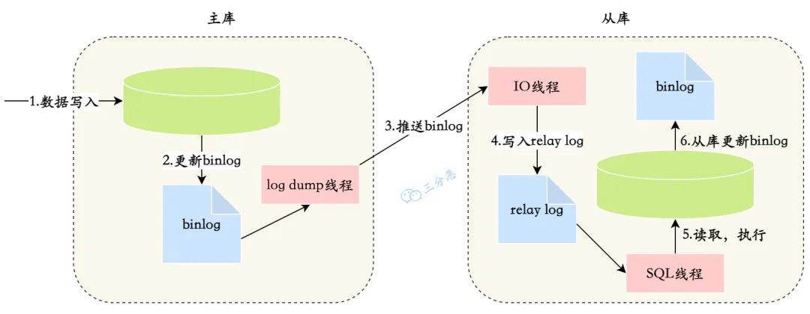

# 读写分离

将对数据库的读写操作分散到不同的数据库节点上，这样就能小幅提升写性能，大幅提升读性能

1. 部署多台数据库，选择其中的一台作为主数据库，其他作为从数据库
2. 保证主数据库和从数据库之间的数据是实时同步的，即主从复制
3. 系统将写请求交给主数据库处理，读请求交给从数据库处理

## 主从复制原理

1. 主库将数据库中数据的变化写入到 binlog
2. 从库连接主库
3. 从库会创建一个 I/O 线程向主库请求更新的 binlog
4. 主库会创建一个 binlog dump 线程来发送 binlog ，从库中的 I/O 线程负责接收
5. 从库的 I/O 线程将接收的 binlog 写入到 relay log 中
6. 从库的 SQL 线程读取 relay log 同步数据本地

<small>[面渣逆袭：MySQL六十六问，两万字+五十图详解！有点六！ - 主从复制原理](https://mp.weixin.qq.com/s?__biz=MzkwODE5ODM0Ng==&mid=2247491831&idx=1&sn=ef4b4bfa81c00db71768dc6600a0916a&chksm=c0cf0852f7b88144460749605fbd6da0b34ca614a41cfec6315d5a61833a1ae0b5bcc1fb76b3&scene=178&cur_album_id=2041709347461709827#rd)</small>

## 主从同步延迟

数据是先写入到主库，再同步到从库的，这其中必然存在着延迟

- 从库 I/O 线程接收 binlog 的速度跟不上主库写入 binlog 的速度，导致从库 relay log 的数据滞后于主库 binlog 的数据
- 从库 SQL 线程执行 relay log 的速度跟不上从库 I/O 线程接收 binlog 的速度，导致从库的数据滞后于从库 relay log 的数据

### 如何解决

那读写分离的分配怎么实现呢？
