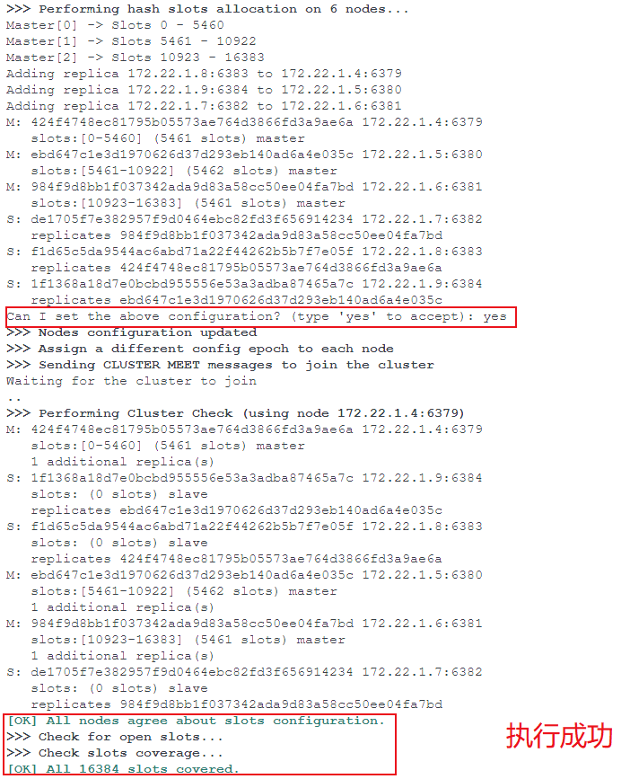
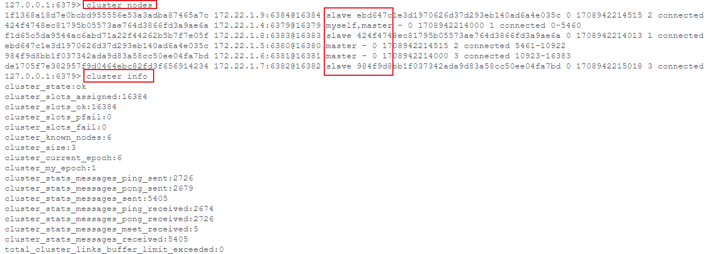

# Docker搭建Redis集群

一个集群至少要有 3 个主节点，所以以下将创建 6 个节点，3 个主节点，3 个从节点

## 创建虚拟网卡

```shell
docker network create --driver bridge --subnet 172.22.1.0/24 --gateway 172.22.1.1 myredis

# 查看Docker网卡信息
docker network ls

# 查看网卡详细信息
docker network inspect myredis

# 删除指定网卡
docker network rm myredis
```

## 配置文件

不同的节点修改端口号与集群节点 IP 即可

```conf
# 端口号
port 6379
# 密码，必须设置
requirepass 996icu
# 集群模式改为0.0.0.0
bind 0.0.0.0
# 关闭保护模式
protected-mode no
# 开启集群模式
cluster-enabled yes
# 集群节点信息文件，不重要
cluster-config-file nodes.conf
# 集群节点连接超时时间，不重要
cluster-node-timeout 5000
# 集群节点IP
# 服务器填公网IP，或者内部对应容器的IP
cluster-announce-ip  172.22.1.4
# 集群节点映射端口
cluster-announce-port 6379
# 集群节点总线端口
cluster-announce-bus-port 16379
```

### Shell 脚本

```shell
for port in $(seq 6379 6384); 
do 
touch ${port}.conf
cat  << EOF > ${port}.conf
port ${port}
requirepass 996icu
bind 0.0.0.0
protected-mode no
daemonize no
appendonly yes
cluster-enabled yes 
cluster-config-file nodes.conf
cluster-node-timeout 5000
# 需修改
cluster-announce-ip 
cluster-announce-port ${port}
cluster-announce-bus-port 1${port}
EOF
done
```

## 启动

不同的节点修改端口号与集群节点 IP 即可

```shell
# --ip用来指定内网IP地址，与配置文件中相同
docker run -d -p 6379:6379 -p 16379:16379 -v 6379.conf:/usr/local/etc/redis/redis.conf --restart always --name redis-6379 --net myredis --ip=172.22.1.4 redis redis-server /usr/local/etc/redis/redis.conf
```

### Shell 脚本

```shell
for port in $(seq 6379 6384);
do 
  docker run -d -p ${port}:${port} -p 1${port}:1${port} \
  -v redis_${port}.conf:/usr/local/etc/redis/redis.conf \
  --restart always --name redis-${port} --net myredis \
  redis redis-server /usr/local/etc/redis/redis.conf
done
```

## 创建集群

```bash
# 进入任一节点内执行
# --cluster-replicas：一个主节点有多少个从节点
redis-cli -a 996icu --cluster create 172.18.0.2:6379 172.18.0.3:6380 172.18.0.4:6381 172.18.0.5:6382 172.18.0.6:6383 172.18.0.7:6384 --cluster-replicas 1
```



```shell
# 查看集群信息
cluster info

# 查看节点信息
cluster nodes
```



## 参考

- [Docker 搭建 Redis Cluster集群 每一步都带有操作图、命令！！！](https://juejin.cn/post/6992872034065727525)
