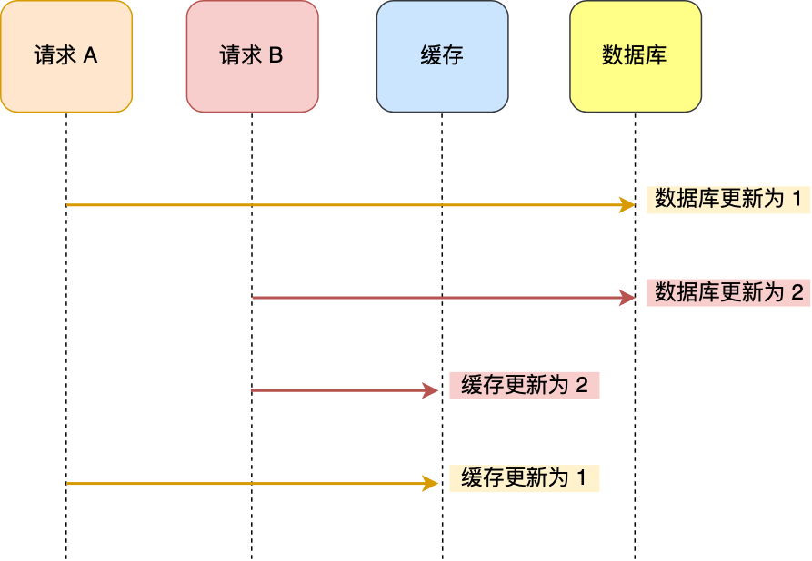
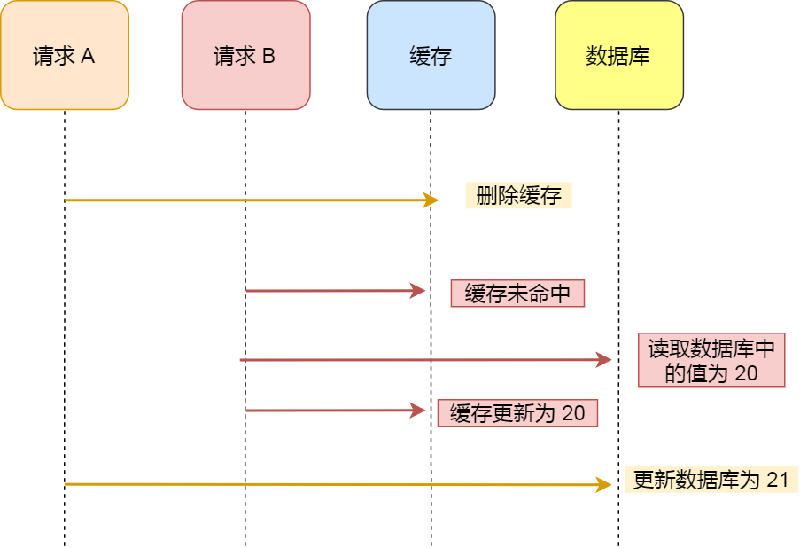
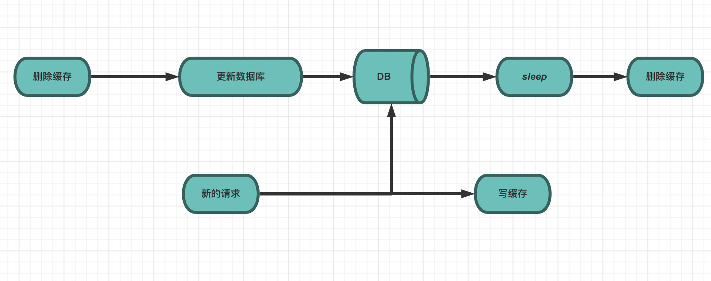
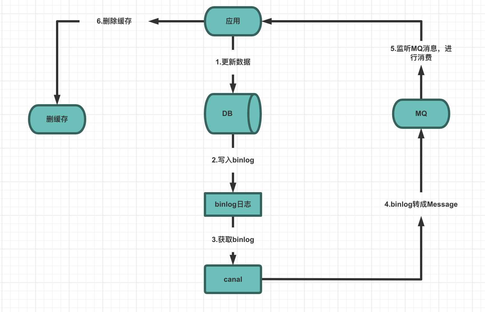
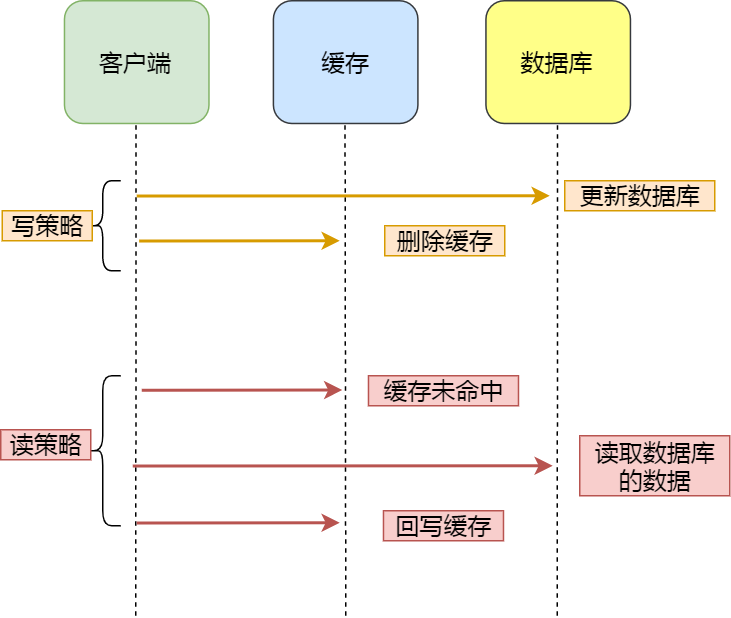

## 为什么要使用缓存

- 在日常的 Web 应用对数据库的访问中，**读操作的次数远超写操作**

- **高性能**：当用户第一次访问数据库中的某些数据，是从硬盘上读取的，所以过程会比较慢。将该用户访问的数据存在缓存中，再访问这些数据的时候就可以直接从缓存中获取了。**操作缓存就是直接操作内存，所以速度相当快**

- **高并发**：缓存能够承受的请求是远远大于直接访问数据库的，**极大减小数据库的压力**，可以把数据库中的部分数据转移到缓存中去，这样用户的一部分请求会直接到缓存这里而不用经过数据库

- 不建议使用缓存的场景
  
  - 业务数据不常用， 命中率很低
  - 写操作多，频繁需要写入数据库
  - 如果要存储几百兆字节的文件，会给缓存带来很大的压力

## 为什么要使用 Redis 而不用 Map 做缓存

1. **Map 是本地缓存**，最主要的特点是轻量以及快速，如果有多台实例的话，**每个实例都需要各自保存一份缓存，缓存不具有一致性**。生命周期随着 JVM 的销毁而结束，而且 JVM 内存太大容易挂掉的，一般用做于容器来存储临时数据
   - Map 所存储的数据结构，缓存过期机制等需要程序员自己手写的

2. **Redis 是分布式缓存**，如果有多台实例的话，**每个实例都共享一份缓存，缓存具有一致性**。缺点是需要保持 Redis 服务的高可用，整个程序架构上较为复杂
   - 原生提供丰富的数据结构、缓存过期机制等简单好用的功能

## 缓存预热

提前缓存好数据，避免在用户请求的时候，先查询数据库，然后再将数据缓存的问题

## 缓存异常

### 缓存雪崩

大量缓存数据在同一时间过期（失效）或者 Redis 故障宕机，导致大量的请求直接落到了数据库上，严重的甚至会造成数据库宕机

#### 大量数据同时过期的解决方案

##### 1.过期时间添加随机数

应避免将大量的数据设置为同一过期时间，可以给这些数据的过期时间加上一个随机数，保证数据不会在同一时间过期

##### 2. 互斥锁

如果发现访问的数据不在 Redis 里，就加个互斥锁，保证同一时间内只能有一个请求来构建缓存，构建完成后，再释放锁

- 未能获取到锁的请求，要么等待锁释放后重新读取缓存，要么直接返回空值或默认值
- 最好设置一个过期时间，防止意外一直不释放锁

##### 3. 双 key 策略

缓存数据时可以使用两个 key，一个主 key，设置过期时间，一个是备用 key，不会设置过期，它们只是 key 不一样，但是 value 值是一样的

当请求获取不到主 key 的数据时，就直接返回备用 key 的数据，然后在更新缓存的时候，同时更新两个 key 的数据

##### 4. 后台更新缓存

不为缓存数据设置过期时间，交由后台异步的更新缓存。但当内存紧张时，有些缓存数据还是会被淘汰

- 频繁地检测缓存是否有效，如果失效了立即更新缓存
- 不主动检测是否失效，而是当请求过来发现数据失效了，通过消息队列发送一条消息通知后台更新缓存

#### 故障宕机的解决方案

##### 1. 服务熔断

暂停业务应用对缓存服务的访问，直接返回错误，等到 Redis 恢复正常后，再允许业务应用访问缓存服务

##### 2. 请求限流

只将少部分请求发送到数据库进行处理，再多的请求就在入口直接拒绝服务，等到 Redis 恢复正常并把缓存预热完后，再解除请求限流的机制

##### 3. 高可用集群

通过主从节点的方式构建 Redis 高可用集群

### 缓存击穿

某个热点数据过期了，此时大量的请求访问了该热点数据，一下子都发送到了后端数据库，导致了数据库压力激增

#### 解决方案

- 互斥锁
- 不为热点数据设置过期时间，由后台异步更新缓存
- 在热点数据要过期前，提前通知后台线程更新缓存以及重新设置过期时间

### 缓存穿透

当请求的数据，既不在缓存中，也不在数据库中，无法构建缓存，如果持续有大量的请求，就会同时给缓存和数据库带来巨大压力

- 业务误操作：缓存中与数据库中的数据都被误删了
- 恶意攻击：故意大量访问某些读取不存在数据的业务

#### 解决方案

##### 1. 限制非法请求

验证请求参数是否合理，判断出是恶意请求就直接返回错误，避免进一步访问缓存和数据库

##### 2. 缓存空值或者默认值

针对查询的数据，在缓存中设置一个空值或者默认值，这样后续请求就可以从缓存中读取到空值或者默认值了，不会再继续请求数据库了

##### 3. 布隆过滤器

在写入数据库数据时，可以使用布隆过滤器做标记，然后在请求到来时，可以通过查询布隆过滤器快速判断数据是否存在

布隆过滤器只能表示一定不存在，不能表示一定存在

## 缓存一致性

因为数据库与缓存是不同的组件，操作肯定有先后顺序，所以就会出现数据在缓存中与数据库中不一致的情况

### 更新缓存 OR 删除缓存

为了解决缓存不一致的问题，是更新缓存还是修改缓存呢

#### 无效写

如果每次更新数据库时，都要更新缓存，如果某个缓存更新的频率特别高，不仅耗费性能，还作了很多无用功。不如直接删掉，等缓存真正需要被读取时才去数据库中加载（懒加载）

#### 高并发

在高并发环境下，如果更新缓存，那就更加容易导致缓存不一致的问题，删除缓存则简单、直接的多

### 先删除缓存，再更新数据库

在读写并发的时候，仍可能会出现缓存不一致的现象

#### 延迟双删

为了解决先删除缓存，再更新数据库产生的缓存不一致问题。在删除完缓存，更新完数据库后，延迟一段时间再删除一次缓存

通过两次缓存的删除，避免了更新数据库的时候，其他请求进来，读到了旧值，并把旧值写到缓存中

- 一般把延迟的时间设置为大于读数据 + 写缓存的时间
  - 如果更新数据库之后立即就删除缓存，这时如果有请求进来，数据库还未更新完成，会导致读取的还是旧数据

### 先更新数据库，再删除缓存

也有可能会出现缓存不一致的现象，但概率极低，需得满足三个条件

1. 缓存刚好过期
2. 在缓存过期时发生了查询请求，且查询时写请求还没完成数据库更新操作
3. 查询请求的写缓存操作比写请求的删除操作来得更晚

缓存要刚好过期，读操作必需在写操作前进入数据库操作，又要晚于写操作更新缓存，而且缓存的写入通常要远远快于数据库的写入，所以概率极低

### 缓存删除失败

当发生网络波动或者系统卡顿等问题，可能会导致缓存删除失败，缓存一致性也就被破坏了

#### 设置过期时间

给缓存设置一个过期时间，适合数据更新不频繁的业务，实时性差

#### 定时任务

如果没有响应结果或者有删除失败结果，将重试数据加入到重试表中，通过定时任务每隔一段时间进行重试，实时性较差

#### 消息队列

如果没有响应结果或者有删除失败结果，将重试数据加入到消息队列中，由消息队列负责重试

#### 订阅 MySQL 的 binlog

如果更新数据库成功，就会产生一条变更日志，记录在 binlog 里。这时就可以通过 Canal 中间件，Canal 会伪装成一个 MySQL 的从节点，向 MySQL 发送请求后，MySQL 就会把 binlog 推送给 Canal，再通过解析把数据发送到消息队列中，由消息队列负责删除缓存和重试

## 缓存更新策略

### 旁路缓存（Cache Aside）

需要修改数据库与缓存，比较适合读多写少的场景，最常用

- 写策略：先更新数据库，再删除缓存
- 读策略：如果有缓存，则直接返回缓存中的数据。如果没有缓存，则从数据库中进行查找，并将数据写入到缓存，再将数据返回

### 读穿/写穿（Read/Write Through）

只和缓存交互，不再和数据库交互，而是由缓存组件和数据库交互，对于客户端是透明的

- Read Through：如果有缓存，则直接返回缓存中的数据。如果没有缓存，则由缓存组件负责从数据库查询数据，并将数据写入到缓存，再将数据返回
  - 与旁路缓存类似，但旁路缓存是由客户端负责将数据放入缓存，而读穿是由缓存组件来处理
- Write Through：当有数据更新的时候，先查询要写入的数据在缓存中是否已经存在。如果有缓存，则更新缓存，并且由缓存组件同步更新到数据库中，再将数据返回。如果没有缓存，则直接更新数据库，再将数据返回

### 写回（Write Back / Write Behind）

只和缓存交互，当有数据更新时，只更新缓存，并将缓存数据设置为脏的，不会立即直接更新数据库，之后会通过批量异步更新的方式进行数据库的更新。特别适合写多的场景

- 数据不是强一致性的，而且会有数据丢失的风险

## 引用
- [再也不怕，缓存雪崩、击穿、穿透！](https://mp.weixin.qq.com/s?__biz=MzUxODAzNDg4NQ==&mid=2247490008&idx=1&sn=8f576e69ec63e02a8b42a00ae6754f0a&chksm=f98e5d72cef9d464710c891c4c0537c20e4949b39ee70c97c44c3f6f95df83fc406f52fc161b&scene=178&cur_album_id=1790401816640225283#rd)
- [Redis缓存篇之缓存异常：如何解决缓存雪崩、击穿、穿透难题？](https://blog.csdn.net/weixin_43161461/article/details/121871042)
- [redis 缓存一致性问题](https://zhuanlan.zhihu.com/p/415817453)
- [趣说 ｜ 数据库和缓存如何保证一致性？](https://mp.weixin.qq.com/s?__biz=MzUxODAzNDg4NQ==&mid=2247508038&idx=2&sn=50a5d4a4b88f9572976753562aeb1b52&chksm=f98de4eccefa6dfaf9c48451685b51a7be62f237cb5ab13efb75a83b814437a370b2f8abfa88&scene=178&cur_album_id=1790401816640225283#rd)
- [面试官：3 种缓存更新策略是怎样的？](https://mp.weixin.qq.com/s?__biz=MzUxODAzNDg4NQ==&mid=2247516371&idx=2&sn=1976ef550b5b0a1d52f7ca09ec9d5d80&chksm=f98dc479cefa4d6fd74412c99f12b21ed3cee4b8e74c005710ce5bc575d0832e96e6184126c5&scene=178&cur_album_id=1790401816640225283#rd)
