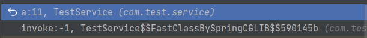
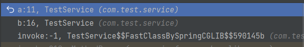
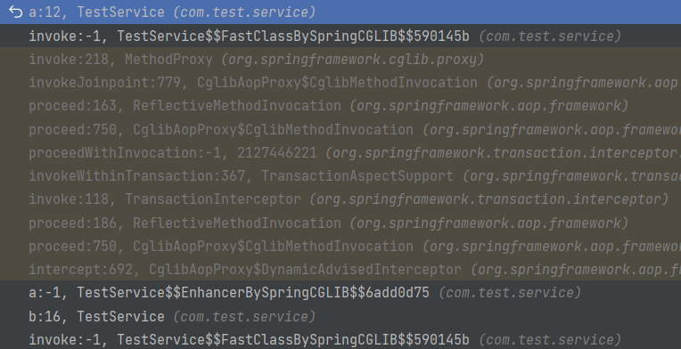
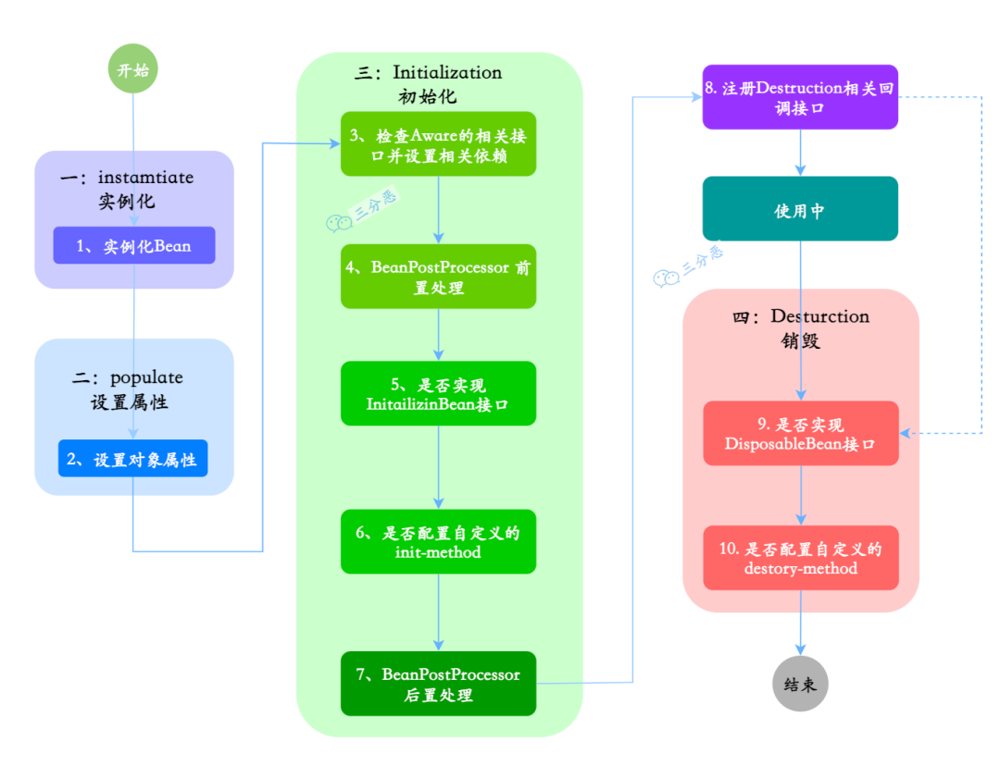
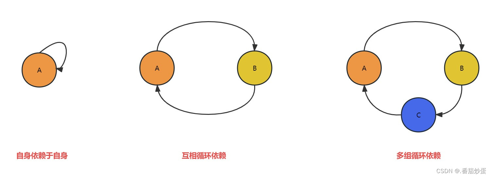
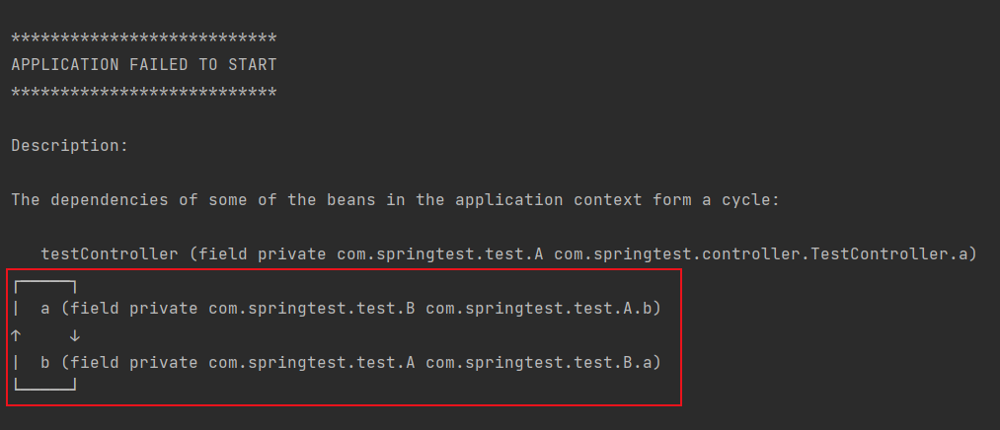

# Spring

## IOC（Inversion of Control，控制反转）

IOC 是一种设计思想，不是一种具体的实现，也并非 Spring 独有的。IOC 的思想就是将原本在程序中手动创建对象的控制权（new 对象），交由 Spring 容器来管理，当我们需要哪个对象时，去 IOC 容器中取就行了。即控制对象生命周期的不再是引用他的对象，而是容器

- 控制：创建（实例化、管理）对象的权利
- 翻转：控制权交给外部环境（Spring 框架、IOC 容器）

在 Spring 中， IOC 容器是 Spring 用来实现 IOC 的载体， IOC 容器实际上就是个 Map（key，value），Map 中存放的是各种对象。不过在 Spring 中一般通过 XML 文件来配置 Bean，过于繁琐，影响开发效率，所以 Spring Boot 中就引入了注解配置

IOC 最大的好处就是解耦，使用硬编码会造成对象间的过度耦合，使用 IOC 后就不用关心对象间的依赖，简化了应用的开发，把应用从复杂的依赖关系中解放出来，也方便对资源的管理

## DI（Dependency Injection，依赖注入）

容器在实例化对象的时候把它依赖的类注入给它，DI 是 IOC 的一种实现

### 依赖注入方式

- 属性

```java
@Autowired
private Test test;
```

- setter

```java
private Test test;

@Autowired
public void setTest(Test test) {
    this.test = test;
}
```

- 构造器

```java
private final Test test;

@Autowired
public TestService(Test test) {
    this.test = test;
}
```

Spring 官方推荐使用构造器注入，这样属性就可被 final 修饰，保证依赖不可变，不为空，使用时已是完全初始化状态，且如果发生了循环依赖，Spring 是启动不了的，会提醒出现循环依赖

- 如果使用构造器注入，且类中只有一个构造方法，可以省略 `@Autowired` 注解

### 注入注解

- `@Autowired`：默认根据类型自动匹配，当存在多个符合条件的 Bean 时，则根据名称自动匹配
- `@Resource`：JDK 提供的注解，默认根据名称自动匹配，也可使用类型

```java
@Target({TYPE, FIELD, METHOD})
@Retention(RUNTIME)
public @interface Resource {

    String name() default "";

    Class<?> type() default java.lang.Object.class;

    ...
}
```

- `@Qualifier`：在存在多个候选 Bean 时，指定要注入的具体 Bean，常和 `@Autowired` 搭配使用

```java
public interface TestInterface {
}

@Service
public class A implements TestInterface {
}

@Service
public class B implements TestInterface {
}
```

```java
// 报错，有多个候选Bean
@Autowired
private TestInterface testInterface;

// 正确注入，有多个候选Bean时，根据名称进行匹配
@Autowired
private TestInterface a;

// 正确注入，有多个候选Bean时，指定具体的Bean
@Autowired
@Qualifier("a")
private TestInterface testInterface;
```

- `@Value`：注入简单的值，如基本类型、字符串等

#### 静态注入

静态成员是属于类的，而 Spring 是基于对象的依赖注入，所以不能直接对静态成员进行注入，当然办法还是有的

- setter 注入

```java
@Service
public class TestService {

    private static Test test;

    @Autowired
    public void setTest(Test test) {
        TestService.test = test;
    }
}
```

- 使用 `@PostConstruct` 注解

```java
@Service
public class TestService {

    @Autowired
    private Test test;

    @Autowired
    private static Test staticTest;

    @PostConstruct
    public void init() {
        TestService.staticTest = this.test;
    }

}
```

## AOP（Aspect Oriented Programming，面向切面编程）

AOP 能够将那些与业务无关，却为业务模块所共同调用的逻辑或责任（例如事务处理、日志管理、权限控制等）封装起来，便于减少系统的重复代码，降低模块间的耦合度，并有利于未来的可拓展性和可维护性

Spring AOP 是基于动态代理实现的，如果要代理的对象，实现了某个接口，那么 Spring AOP 会使用 JDK 动态代理，去创建代理对象，而对于没有实现接口的对象，就无法使用 JDK 动态代理 去进行代理了，这时候 Spring AOP 会使用 Cglib 生成一个被代理对象的子类来作为代理

### Spring AOP 与 AspectJ AOP

- Spring AOP 属于运行时增强，基于代理，功能少，使用简单，性能稍差
- AspectJ AOP 是编译时增强，基于字节码操作，功能强大，使用较复杂，但性能很好


<small>[面渣逆袭：Spring三十五问，四万字+五十图详解！建议收藏！ - 22.说说Spring AOP 和 AspectJ AOP 区别?](https://mp.weixin.qq.com/s/Y17S85ntHm_MLTZMJdtjQQ)</small>

### 核心概念

- 横切关注点（cross-cutting concerns）：多个类或对象中的公共行为（例如事务处理、日志管理、权限控制等）
- 切面（Aspect）：一个切面就是一个类，切面中可以定义多个通知，用来实现具体的功能，也可以理解为 `切入点 + 通知`
- 通知（Advice）：也被称作增强，就是切面在某个连接点要执行的操作
- 目标对象（Target）：被通知的对象
- 连接点（JoinPoint）：方法调用或者方法执行时的某个特定时刻，目标对象的所属类中，定义的所有方法均为连接点
- 切点（Pointcut）：一个切点就是一个表达式，用来匹配哪些连接点需要被切面所增强
- 织入（Weaving）：将通知应用到目标对象，进而生成代理对象的过程动作

#### 通知类型

- 前置通知（Before）：目标对象的方法调用之前触发
- 后置通知（After）：目标对象的方法调用之后触发
- 环绕通知（Around）：目标对象的方法调用之前和之后都触发
- 返回通知（AfterReturning）：目标对象的方法调用完成，在返回结果值之后触发
- 异常通知（AfterThrowing）：目标对象的方法运行中抛出异常后触发

### Spring AOP 自调用失效

使用 Spring AOP 时，调用某个方法时，该方法同时调用了同一个类中的其他方法，会导致 Spring AOP 失效

- 例如使用 `@Transactional` 时，直接调用方法 a，会导致事务失效

```java
@Service
public class TestService {

    @Transactional
    public void a() {
    }

    public void b() {
        this.a();
    }
}
```

Spring AOP 是使用动态代理来实现的，他在操作的其实是代理对象，并不是本身的对象。而自调用是使用本身的对象进行调用的，没有使用到代理对象，自然也就无法进行 AOP 操作

- 直接调用方法 a



可以看出是通过代理对象调用的方法 a

- 通过同类的方法 b 去调用方法 a



可以看出也是通过代理对象调用的方法 b，但方法 b 调用方法 a 并不是通过代理对象调用的

#### 如何解决

最好的办法就是将两个方法拆分成两个类，或是合并为一个方法，当然也可以通过 AopContext 获取当前上下文的代理对象

需引入 aspectj 包，并在启动类上加入 `@EnableAspectJAutoProxy(exposeProxy = true)` 注解

```java
@Service
public class TestService {

    @Transactional
    public void a() {
    }

    public void b() {
        ((TestService) AopContext.currentProxy()).a();
    }
}
```

- 通过同类的方法 b 去调用方法 a



方法 b 调用方法 a 也变成了通过代理对象调用了

### 使用

```java
/**
 * 切面
 */
@Aspect
@Component
public class AopTest {

    /**
     * 切点
     */
    @Pointcut("execution(* com.test.aop.Test.m2*(..))")
    public void pointCut() {
    }

    /**
     * 环绕通知
     */
    @Around("pointCut()")
    public Object around(ProceedingJoinPoint jp) throws Throwable {
        // 横切关注点
        System.out.println("before!!!");
        Object proceed = jp.proceed();
        System.out.println("after!!!");
        return proceed;
    }
}
```

```java
@Service
public class Test {

    /**
     * 连接点
     */
    public void m1() {
        System.out.println("m1");
    }

    /**
     * 连接点
     */
    public void m2() {
        System.out.println("m2");
    }

    /**
     * 连接点
     */
    public void m3() {
        System.out.println("m3");
    }
}
```

```java
@RestController
public class TestController {

    /**
     * 目标对象
     */
    @Autowired
    private Test test;

    @GetMapping("test")
    public String test() {
        test.m1();
        test.m2();
        test.m3();
        return "done";
    }
}
```

> m1
before!!!
m2
after!!!
m3

## Bean

被 IOC 容器管理的对象

### 作用域

可使用 `@Scope` 注解设置作用域，可加在类上或方法上

```java
@Service
@Scope(ConfigurableBeanFactory.SCOPE_SINGLETON)
public class Test {
}
```

```java
@Bean
@Scope(value = ConfigurableBeanFactory.SCOPE_PROTOTYPE)
public Person personPrototype() {
    return new Person();
}
```

#### singleton

默认作用域，容器中只存在一个 Bean 实例

```java
ConfigurableBeanFactory.SCOPE_SINGLETON
```

#### prototype

每次获取都会创建一个新的 Bean 实例

```java
ConfigurableBeanFactory.SCOPE_SINGLETON
```

#### request

仅 Web 应用可用，每一次 HTTP 请求都会产生一个新的 Bean 实例，且该实例只在当前请求内有效

```java
WebApplicationContext.SCOPE_REQUEST
```

#### session

Web 应用可用，同一个 session 共享一个 Bean 实例，且该实例只在当前 session 内有效

```java
WebApplicationContext.SCOPE_SESSION
```

#### application（global-session）

仅 Web 应用可用，每个 Web 应用在启动时创建一个 Bean 实例，且该实例只在当前应用内有效

```java
WebApplicationContext.SCOPE_APPLICATION
```

### 生命周期

1. 实例化一个 Bean 对象
2. 设置对象属性
3. 检查该 Bean 是否实现了 Aware 的相关接口，并设置相关依赖
    - 如果实现了 BeanNameAware 接口，调用 setBeanName 方法，传入 Bean 的名称
    - 如果实现了 BeanClassLoaderAware 接口，调用 setBeanClassLoader 方法，传入 ClassLoader 对象
    - 如果实现了 setBeanFactory 接口，传入 BeanFactory 实例
4. 调用 BeanPostProcessor 的 postProcessBeforeInitialization 方法进行前置处理
5. 检查该 Bean 是否实现了 InitializingBean 接口，执行 afterPropertiesSet 方法
6. 检查该 Bean 是否配置了 init-method，执行指定方法
7. 调用 BeanPostProcessor 的 postProcessAfterInitialization 方法进行后置处理
8. Bean 完成初始化，可以进行使用
9. 如需销毁 Bean，检查该 Bean 是否实现了 DisposableBean 接口，执行 destroy 方法
10. 检查该 Bean 是否配置了 destroy-method，执行指定方法



<small>[面渣逆袭：Spring三十五问，四万字+五十图详解！建议收藏！ - 9.能说一下Spring Bean生命周期吗？](https://mp.weixin.qq.com/s/Y17S85ntHm_MLTZMJdtjQQ)</small>

#### Aware 相关接口

```java
@Service
public class Test implements BeanNameAware, BeanClassLoaderAware, BeanFactoryAware {

    @Override
    public void setBeanName(String name) {
    }

    @Override
    public void setBeanClassLoader(ClassLoader classLoader) {
    }

    @Override
    public void setBeanFactory(BeanFactory beanFactory) throws BeansException {
    }
}
```

#### BeanPostProcessor 接口

```java
@Service
public class Test implements BeanPostProcessor {

    @Override
    public Object postProcessBeforeInitialization(Object bean, String beanName) throws BeansException {
        System.out.println("before");
        return BeanPostProcessor.super.postProcessBeforeInitialization(bean, beanName);
    }

    @Override
    public Object postProcessAfterInitialization(Object bean, String beanName) throws BeansException {
        System.out.println("after");
        return BeanPostProcessor.super.postProcessAfterInitialization(bean, beanName);
    }
}
```

#### InitializingBean 接口

```java
@Service
public class Test implements InitializingBean {

    @Override
    public void afterPropertiesSet() throws Exception {
    }
}
```

#### init-method

可以使用 `@Bean` 注解中的 initMethod 参数定义，或者使用 `@PostConstruct`，`@PostConstruct` 是 JDK 自带的注解，优先级更高

```java
public class Test implements InitializingBean {

    @Override
    public void afterPropertiesSet() throws Exception {
        System.out.println("InitializingBean");
    }

    @PostConstruct
    public void postConstruct() {
        System.out.println("PostConstruct");
    }

    public void initMethod() {
        System.out.println("initMethod");
    }
}
```

```java
@Configuration
public class Config {

    @Bean(initMethod = "initMethod")
    public Test test() {
        return new Test();
    }
}
```

> PostConstruct
InitializingBean
initMethod

#### DisposableBean 接口

```java
@Service
public class Test implements DisposableBean {

    @Override
    public void destroy() throws Exception {
    }
}
```

#### destroy-method

可以使用 `@Bean` 注解中的 destroyMethod 参数定义，或者使用 `@PreDestroy`，`@PreDestroy` 是 JDK 自带的注解，优先级更高

```java
public class Test implements DisposableBean {

    @Override
    public void destroy() throws Exception {
        System.out.println("DisposableBean");
    }

    @PreDestroy
    public void preDestroy() {
        System.out.println("PreDestroy");
    }

    public void destroyMethod() {
        System.out.println("destroyMethod");
    }
}
```

```java
@Configuration
public class Config {

    @Bean(destroyMethod = "destroyMethod")
    public Test test() {
        return new Test();
    }
}
```

> PreDestroy
DisposableBean
destroyMethod

### 线程安全

Spring 中的 Bean 是否线程安全取决于作用域和状态

大部分 Bean 实际上都是无状态（没有定义可变的成员变量）的（例如 Controller、Service、Dao），这种情况下， Bean 是线程安全的

- 在 singleton 作用域下，容器中只有唯一的 Bean 实例，且如果 Bean 是有状态的，可能会存在资源竞争问题
- 在 prototype 作用域下，每次获取都会创建一个新的 Bean 实例，不会有资源竞争的问题

#### 如何解决

- 在 Bean 实例中尽量避免定义可变的成员变量
- 使用 prototype 作用域（不推荐）
- 将 Bean 中的成员变量保存在 ThreadLocal 中

### 循环依赖

自己依赖自己，或者多个类之间相互依赖，形成循环的依赖关系，可能会导致程序编译失败或运行时出现异常



<small>[循环依赖详解及解决方案](https://blog.csdn.net/qq_43135259/article/details/130134970)</small>

```java
public class Test {

    public static void main(String[] args) {
        Test t = new Test();
    }

    private Test test = new Test();
}
```

#### Spring 中的循环依赖

在 Spring 中只有 singleton 作用域会存在依赖注入问题，在 prototype 作用域下，会直接抛出异常，因为 A、B 循环依赖，在实例化 A 时，发现依赖 B，于是又去实例化 A，依此无限循环下去

```java
@Service
@Scope(scopeName = ConfigurableBeanFactory.SCOPE_PROTOTYPE)
public class A {

    @Autowired
    private B b;
}
```

```java
@Service
@Scope(scopeName = ConfigurableBeanFactory.SCOPE_PROTOTYPE)
public class B {

    @Autowired
    private A a;
}
```



#### Spring 自己可以解决的循环依赖


<small>[面渣逆袭：Spring三十五问，四万字+五十图详解！建议收藏！ - Spring可以解决哪些情况的循环依赖？](https://mp.weixin.qq.com/s/Y17S85ntHm_MLTZMJdtjQQ)</small>

注意并不是只有使用构造方法注入才会产生循环依赖，而是在 Spring 启动时就会提醒出现循环依赖，并且启动失败，使用其他方式进行注入也是可能会产生循环依赖的，只是在启动时不会提醒

- 使用构造器注入，应用启动失败，报循环依赖

```java
@Service
public class A {

    private B b;

    @Autowired
    public A(B b) {
        this.b = b;
    }
}

@Service
public class B {

    private A a;

    @Autowired
    public B(A a) {
        this.a = a;
    }
}
```

- A 中使用构造器注入，B 中使用 setter 注入，应用启动失败，报循环依赖

```java
@Service
public class A {

    private B b;

    @Autowired
    public A(B b) {
        this.b = b;
    }
}

@Service
public class B {

    private A a;

    @Autowired
    public void setA(A a) {
        this.a = a;
    }
}
```

Spring 在创建 Bean 时默认会根据自然排序进行创建，所以 A 会先于 B 进行创建。而当 Spring 采用构造方法注入时，Spring 是无法自己解决循环依赖问题的

#### 其他情况如何解决

##### 重构代码

出现循环依赖，说明代码的结构设计有问题，在条件允许下，重构代码是最优的解决方法

##### `@Lazy` 注解

`@Lazy` 注解的作用就是将 Bean 的初始化延迟到第一次使用时，而不是在在容器启动时立即初始化

当一个 Bean 依赖于被 `@Lazy` 注解修饰的 Bean 时，Spring 会返回一个代理对象，而不是实际的 Bean 实例。当代理对象需要被调用时，才会去初始化 Bean

##### 使用 setter 注入或属性注入

Bean 只会在被调用时才会被注入

### 三级缓存

Spring 中的三级缓存是针对 Bean 的加载和创建过程而设计的，可以有效的解决循环依赖

三级缓存只适用于单例 Bean，而非单例 Bean 是不需要缓存的

```java
// 一级缓存
private final Map<String, Object> singletonObjects = new ConcurrentHashMap<>(256);

// 二级缓存
private final Map<String, Object> earlySingletonObjects = new ConcurrentHashMap<>(16);

// 三级缓存
private final Map<String, ObjectFactory<?>> singletonFactories = new HashMap<>(16);
```

- singletonObjects：一级缓存，也被称作单例池。存放已完全初始化好的单例 Bean
  - 每次请求获取一个 Bean 时，会先检查一级缓存中是否已存在该 Bean，如果存在则直接返回，不存在才会去创建
- earlySingletonObjects：二级缓存，存放正在创建过程中的 Bean，已实例化，但尚未完成属性注入、初始化
- singletonFactories：三级缓存，存放用以创建 Bean 的对象工厂

在创建 A 实例时，先将 A 的创建工厂放入三级缓存中，对象创建完成后，再将其放入二级缓存中，并移除其在三级缓存中的创建工厂，在属性注入、初始化完成后，将其移除二级缓存，并加入到一级缓存中

如果在 A 创建完成后准备属性注入时，发现发现其依赖 B，会先从一级缓存、二级缓存中依次查找，如果有则直接进行注入，如果没有再从三级缓存中查找

- 如果三级缓存中有，则将 A 放入二级缓存中，再通过创建工厂创建 B，并将 B 注入到 A 中
- 如果三级缓存中也没有，则将 B 的创建工厂放入三级缓存中，再执行上面的操作

如果 A、B 发生了循环依赖，在 A 创建完成后会被加入到二级缓存中，再去实例化 B，此时 A 已经实例化完成了，直接注入到 B 中就行，A 中也可以继续属性注入了，此时 A 中就有了 B 的实例，B 中也有 A 的实例

#### 为什么不能解决构造器注入的循环依赖

Spring 解决循环依赖的方式，是先创建一个实例，再为其注入其他对象。而通过构造方法注入，需要同时完成实例化与注入

#### 为什么需要三级缓存

二级缓存已经足够能有效的避免循环依赖了，使用三级缓存主要是为了生成代理对象。因为三级缓存中放的是⽣成具体对象的匿名内部类，调用其 getObject 方法获取对象时，可以是代理对象，也可以是普通对象。使⽤三级缓存主要是为了保证不管什么时候使⽤的都是⼀个对象

## 事务

事务是逻辑上的一组操作，要么都执行，要么都不执行

Spring 事务是由数据库的事务支持的，Spring 本身是无法提供事务功能的。Spring 事务的提交和回滚是通过数据库的事务机制实现

### 事务隔离级别

- ISOLATION_DEFAULT：使用后端数据库默认的隔离级别
- ISOLATION_READ_UNCOMMITTED：读未提交
- ISOLATION_READ_COMMITTED：读已提交
- ISOLATION_REPEATABLE_READ：可重复读
- ISOLATION_SERIALIZABLE：串行化

### 事务传播机制

- PROPAGATION_REQUIRED：默认事务传播机制，如果当前存在事务，则加入该事务，如果当前没有事务，则创建一个新的事务
- PROPAGATION_SUPPORTS：如果当前存在事务，则加入该事务，如果当前没有事务，则以非事务的方式继续运行
- PROPAGATION_MANDATORY：如果当前存在事务，则加入该事务，如果当前没有事务，则抛出异常
- PROPAGATION_REQUIRES_NEW：创建一个新的事务，如果当前存在事务，则挂起当前事务
- PROPAGATION_NOT_SUPPORTED：以非事务方式运行，如果当前存在事务，则挂起当前事务
- PROPAGATION_NEVER：以非事务方式运行，如果当前存在事务，则抛出异常
- PROPAGATION_NESTED：如果当前存在事务，就在嵌套事务内执行；如果当前没有事务，则创建一个新的事务
  - 在外部方法开启事务的情况下，在内部开启一个新的事务，作为嵌套事务存在

<small>[面渣逆袭：Spring三十五问，四万字+五十图详解！建议收藏！ - 7种事务传播机制](https://mp.weixin.qq.com/s/Y17S85ntHm_MLTZMJdtjQQ)</small>

### Spring 事务管理

#### 编程式事务管理

代码侵入性大，自由度高，可以手动提交或回滚

- 使用 TransactionTemplate

```java
@Autowired
private TransactionTemplate transactionTemplate;

public void test() {
    transactionTemplate.execute(new TransactionCallbackWithoutResult() {
        @Override
        protected void doInTransactionWithoutResult(TransactionStatus transactionStatus) {
            try {

                ...

            } catch (Exception e) {
                // 回滚
                transactionStatus.setRollbackOnly();
            }
        }
    });
}
```

- 使用 PlatformTransactionManager

```java
@Autowired
private PlatformTransactionManager transactionManager;

public void test() {
    TransactionStatus status = transactionManager.getTransaction(new DefaultTransactionDefinition());
    try {

        ...

        // 手动提交
        transactionManager.commit(status);
    } catch (Exception e) {
        // 回滚
        transactionManager.rollback(status);
    }
}
```

#### 声明式事务管理

使用 `@Transactional` 注解，代码侵入性小，使用方便，通过 AOP 实现

### `@Transactional` 注解

```java
@Target({ElementType.TYPE, ElementType.METHOD})
@Retention(RetentionPolicy.RUNTIME)
@Inherited
@Documented
public @interface Transactional {

    @AliasFor("transactionManager")
    String value() default "";

    @AliasFor("value")
    String transactionManager() default "";

    // 事务传播机制
    Propagation propagation() default Propagation.REQUIRED;

    // 事务隔离级别
    Isolation isolation() default Isolation.DEFAULT;

    // 事务超时时间
    // 事务所允许执行的最长时间，如果超过该时间限制但事务还没有完成，则自动回滚事务
    // 默认-1
    int timeout() default TransactionDefinition.TIMEOUT_DEFAULT;

    // 只读事务
    // 只读事务不涉及数据的修改，数据库会提供一些优化手段
    boolean readOnly() default false;

    // 指定哪些异常会触发回滚
    Class<? extends Throwable>[] rollbackFor() default {};

    String[] rollbackForClassName() default {};

    Class<? extends Throwable>[] noRollbackFor() default {};

    String[] noRollbackForClassName() default {};
}
```

### 原理

基于 AOP 实现。如果一个类使用了 `@Transactional` 注解的话，Spring 容器就会在启动的时候为其创建一个代理对象。当通过代理对象调用 Bean 方法的时候，会触发对应的 AOP 增强拦截器，声明式事务是一种环绕增强

### 注意事项

- 只能作用于 public 修饰的方法
- 避免自调用
- 正确的设置 rollbackFor 和 propagation 属性

## 参考

- [Spring常见面试题总结](https://javaguide.cn/system-design/framework/spring/spring-knowledge-and-questions-summary.html)
- [面渣逆袭：Spring三十五问，四万字+五十图详解！建议收藏！](https://mp.weixin.qq.com/s/Y17S85ntHm_MLTZMJdtjQQ)
- [IoC & AOP详解（快速搞懂）](https://javaguide.cn/system-design/framework/spring/ioc-and-aop.html)
- [第15章-Spring AOP切点表达式（Pointcut）详解](https://blog.csdn.net/weixin_43793874/article/details/124753521)
- [谈谈Spring中的BeanPostProcessor接口](https://www.cnblogs.com/tuyang1129/p/12866484.html)
- [InitializingBean、initMethod和@PostConstruct的比较](https://blog.csdn.net/m0_48480302/article/details/129198346)
- [Spring中实现init-method 和 destroy-method的四种方式](https://juejin.cn/post/7101683978121248799)
- [@Lazy注解解决循环依赖原理](https://zhuanlan.zhihu.com/p/658671735)
- [循环依赖如何避免和解决](https://juejin.cn/post/6844904039231012878)
- [为什么 Spring 构造器注入不需要 @Autowired 注解](https://www.cnblogs.com/changtong1819/p/15621965.html)
- [【Spring】浅谈spring为什么推荐使用构造器注入](https://www.cnblogs.com/joemsu/p/7688307.html)
- [Autowired自动装配到底是ByType还是ByName？](https://blog.csdn.net/m0_46472175/article/details/106770325)
- [Spring使用三级缓存解决循环依赖](https://juejin.cn/post/7099745254743474212)
- [Spring 事务详解](https://javaguide.cn/system-design/framework/spring/spring-transaction.html)
