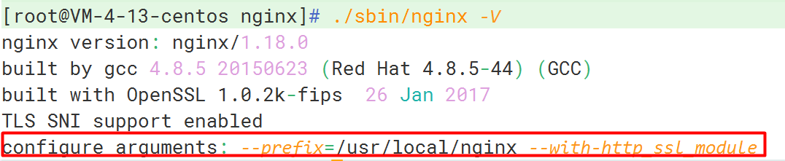

# nginx 配置 SSL

## 1. 首先查看 nginx 是否安装 http_ssl_module 模块

```bash
nginx -V
```



这一步可以省略，无论检不检查，没装的话你是用不了的 `^_^`

### 如果没有 SSL 模块

进入到 **解压目录** 执行以下命令，注意不是安装目录

- 解压目录：下载 nginx 压缩包后解压的目录，也可叫做源码目录
- 安装目录：安装时如没特别指定的话，一般在 `/usr/local/nginx`

```bash
./configure --prefix=/usr/local/nginx --with-http_stub_status_module --with-http_ssl_module
```

执行成功后进行编译

```bash
make
```

切记不要使用 `make install` 进行编译，会覆盖原来安装的文件

关闭并备份可执行文件，个人使用的话就没有太大的备份需要，可以省略备份步骤

```bash
nginx -s stop
```

```bash
cp /usr/local/nginx/sbin/nginx /usr/local/nginx/sbin/nginx.bak
```

编译完成后，会在解压目录中生成一个 objs 文件，将里面的 nginx 文件复制到安装目录中就 OK 了

```bash
cp objs/nginx /usr/local/nginx/sbin/
```

## 2. SSL 配置

```bash
worker_processes  auto;

events {
    worker_connections  1024;
}


http {
    include       mime.types;
    default_type  application/octet-stream;

    sendfile        on;
    keepalive_timeout  65;

    server {
        listen       80;
        server_name  你的域名;

        location / {
            root   你的项目地址;
            index  index.html index.htm;
        }

        # 将请求转成https
        rewrite ^(.*)$ https://$host$1 permanent;

        error_page   500 502 503 504  /50x.html;
        location = /50x.html {
            root   html;
        }
    }

    # SSL配置
    server {
        listen       443 ssl;
        server_name  你的域名;

        # 配置下载下来的的证书文件
        ssl_certificate      /usr/local/nginx/cert/你的证书.crt;
        ssl_certificate_key  /usr/local/nginx/cert/你的证书.key;

        ssl_session_cache    shared:SSL:50m;
        ssl_session_timeout  1d;

        ssl_protocols TLSv1.2 TLSv1.3;
        ssl_ciphers  ECDHE-RSA-AES128-GCM-SHA256:HIGH:!aNULL:!MD5:!RC4:!DHE;
        ssl_prefer_server_ciphers  on;

        location / {
            root   你的项目地址;
            index  index.html index.htm;
        }
    }
}
```

配置完成，执行 `nginx -t` 检查下配置，不通过的话会提示你哪些地方有错误，修改之后启动 nginx 即可开始享受 HTTPS 了

## 参考

- [Nginx配置Https（详细、完整）](https://www.cnblogs.com/ambition26/p/14077773.html)
- [Nginx 服务器 SSL 证书安装部署（Linux）](https://cloud.tencent.com/document/product/400/35244?from_cn_redirect=1)
- [nginx启动报 ssl parameter requires ngx_http_ssl_module](https://blog.csdn.net/qq_40390762/article/details/131879841)
- [nginx improving SSL Configuration](https://gist.github.com/mohanpedala/9f6bc9f9f6a50fd04c9d09dc95155fe3)
