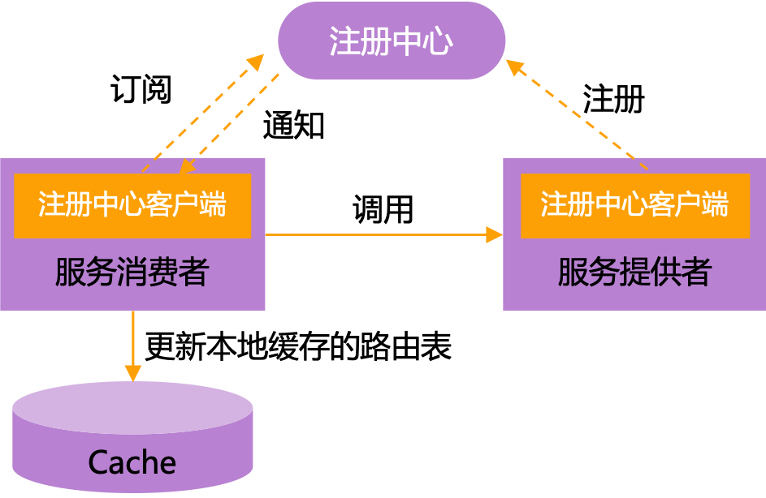

## 服务注册与发现

微服务之间需要相互配合来维持系统的正常运行，在没有服务注册与发现机制之前，每个服务会将其依赖的其他服务的信息写死在配置文件中，如果依赖的某个服务宕机或者需要修改信息，就需要手动更新对应服务节点的信息并重启

有了服务注册与发现机制之后，由注册中心维护可用服务的列表，消费者可通过注册中心动态获取可用服务的地址信息。如果服务信息发生变更，注册中心会将变更推送给相关联的服务，无需手动更新和重启



### 服务注册

每个服务在启动时，会向注册中心注册服务，也就是将自己的地址信息（ip、端口以及服务名字等信息的组合）上报给注册中心，注册中心负责将地址信息保存起来，其他服务就可以通过注册中心获取到当前可用的服务列表

### 服务发现

一个服务节点如果要调用另外一个服务节点，可以通过向注册中心查询特定服务的注册信息，获得可用的服务实例列表

- 通常情况下，服务节点拿到地址信息之后，还会在本地缓存一份，以保证在注册中心宕机时仍然可以正常调用服务

### 注册中心

注册中心是服务实例信息的存储仓库，也是服务提供者和服务消费者进行交互的桥梁，不仅需要提供服务注册、服务发现功能，还要对服务信息进行管理与健康检查

#### 功能

##### 服务注册与发现

核心功能

##### 健康检测

注册中心能够监测和检测服务的状态，注册中心会通过 **心跳机制** 来检测服务是否可用，如果服务不可用的话，注册中心会主动剔除该服务并将变更推送给相关联的服务，更新服务地址信息

##### 负载均衡

注册中心可以对同一服务的多个实例进行负载均衡，将请求分发到不同的实例上

##### 服务治理

通过注册中心可以进行服务的配置管理、动态扩缩容、服务路由、灰度发布等操作，实现对服务的动态管理和控制

#### 注册中心选型

| 特性 | Eureka | ZooKeeper | Nacos |
| :- | :-: | :-: | :-: |
| 开发公司 | Netflix | Apache 基金会 | 阿里巴巴 |
| CAP | AP | CP | AP 或 CP，默认 AP |
| 功能 | 服务注册与发现 | 分布式协调、配置管理、分布式锁 | 服务注册与发现、配置管理、服务管理 |
| 负载均衡 | Ribbon | - | 权重/metadata/Selector |
| 访问协议 | HTTP | TCP | HTTP/DNS |
| 自我保护 | 支持 | - | 支持 |
| 数据存储 | 内嵌数据库、多个实例形成集群 | ACID 特性的分布式文件系统 ZAB 协议 | 内嵌数据库、MySQL 等 |
| 健康检查 | Client Beat | Keep Alive | TCP/HTTP/MYSQL/Client Beat |
| 特点 | 简单易用、自我保护机制 | 高性能、强一致性 | 动态配置管理、流量管理、灰度发布等 |

- Eureka 适用于服务实例数量不大的服务注册中心
- ZooKeeper 相对服务注册中心来说更适用于分布式协调服务
  - **作为注册中心，可用性的要求要高于一致性**
- Nacos 既适用于大量服务实例的服务注册中心，也可以作为配置中心

## Nacos

Nacos 是一个由阿里巴巴开源的项目，提供了服务发现和服务健康监测、动态配置管理、动态 DNS 服务、服务及其元数据管理等功能，使得开发者可以更敏捷和容易地构建、交付和管理微服务平台

### 注册中心

Nacos 最主要的功能就是作为注册中心

#### 集成

### Nacos 服务

- 推荐在 `https://hub.docker.com/r/nacos/nacos-server/tags` 找指定版本

```bash
docker pull nacos/nacos-server:v2.1.0
```

```bash
docker run -d --name nacos -p 8848:8848 -p 9848:9848 -p 9849:9849 -e MODE=standalone nacos/nacos-server
```

### 依赖

- 要注意版本对应关系，否则可能会报错
  - 我目前 Spring Boot 是 `2.3.12.RELEASE`，Spring Cloud Alibaba 是 `2.2.7.RELEASE`

```xml
<dependency>
    <groupId>org.springframework.boot</groupId>
    <artifactId>spring-boot-starter-web</artifactId>
</dependency>

<dependency>
    <groupId>com.alibaba.cloud</groupId>
    <artifactId>spring-cloud-starter-alibaba-nacos-discovery</artifactId>
</dependency>
```

### 配置

```yaml
server:
  port: 8888
spring:
  application:
    name: nacos-test
  cloud:
    nacos:
      discovery:
        server-addr: 127.0.0.1:8848
        namespace: public
        group: normal_group
        username: nacos
        password: nacos
```

### 启动类

- 启动类上加上 `@EnableDiscoveryClient` 注解就大功告成了

```java
@SpringBootApplication
@EnableDiscoveryClient
public class NacosApplication {
    public static void main(String[] args) {
        SpringApplication.run(NacosApplication.class, args);
    }
}
```

### 配置中心

## 引用

- [微服务注册中心原理、实现和选型](https://www.modb.pro/db/634009)
- [Nacos 版本不一致报错Request nacos server failed解决](https://www.jb51.net/article/267441.htm)
- [详解Spring Cloud版本问题](https://blog.csdn.net/Joker_ZJN/article/details/131019270)
- [30.docker安装nacos](https://www.cnblogs.com/cheng8/p/17608788.html)
