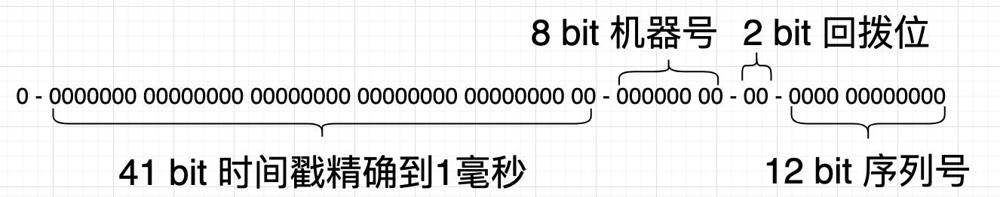
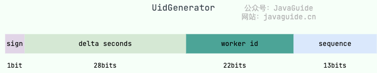

## 分布式 ID

在复杂的分布式系统中，往往需要对大量的数据进行唯一标识

### 基本要求

- 全局唯一：必须保证生成的 ID 是全局性唯一的
- 可用性：需要保证高并发下的可用性
- 高性能：生成速度快，资源消耗小
- 方便易用：拿来即用，使用方便，快速接入

### 可选的要求

- 安全性：不暴露系统和业务的信息
- 有序递增：保证下一个 ID 一定大于上一个 ID
- 业务含义：能有具体的业务含义

## 常见生成方案

### UUID

唯一标识符（Universally Unique Identifier）是一个包含 32 个 16 进制数字的字符串，且被分为 5 段（8 - 4 - 4 - 4 - 12）

- 优点
  - 生成速度比较快、简单易用
- 缺点
  - 不易存储：UUID 太长，16 字节 128 位，通常以 36 长度的字符串表示（32 个十六进制数字和 4 个连字符）
  - 不安全：可能会造成 MAC 地址泄露
  - 无序

### 数据库自增 ID

通过关系型数据库的自增主键产生来唯一的 ID

- 优点
  - 实现简单、ID 有序递增、存储消耗空间小
- 缺点
  - 对数据库的依赖强，会由于数据库部署的一些特性而存在单点故障、数据一致性等问题
  - 支持并发量不大
  - 不安全：根据递增的规律，可能会泄露出业务信息

### Redis 生成 ID

通过 Redis 的 incr、incrby 来实现

- 优点
  - 不依赖于数据库，使用灵活，性能更好
  - 有序递增
- 缺点
  - 对 Redis 的依赖强，可能会有单点故障、持久化等问题
  - 不安全：根据递增的规律，可能会泄露出业务信息

### Zookeeper 生成 ID

利用 Zookeeper 的 znode 数据版本来生成序列号，可以生成 32 位和 64 位的数据版本号

- 依赖 Zookeeper，并且是多步调用 API，在高并发的分布式环境下效果不甚理想

### 号段模式

当下分布式 ID 生成器的主流实现方式之一，可以理解成从数据库批量获取 ID，然后将 ID 缓存在本地，以此来提高业务获取 ID 的效率

从数据库取出一个号段范围，通常是一个当前最大的 ID 和一个偏移量，加载到内存后，业务获取时 ID 直接在这个范围递增取值

- 优点
  - 不强依赖于数据库，不会频繁的访问数据库，对数据库的压力小很多
- 缺点
  - 服务器重启，单点故障会造成 ID 不连续

### Snowflake （雪花）算法

Twitter 开源的分布式 ID 生成算法，以划分命名空间的方式将 64 个 bit 位分割成了多个部分，每个部分都有具体的不同含义

- 在 Java 中 long 类型就是 64 位的，所以在 Java 中 Snowflake 算法生成的 ID 就是long来存储的

- 第一部分：ID 一般都是正数，所以始终填 0
- 第二部分：存储的不是当前时间的时间戳，而是存储时间戳差值，当前时间戳减去某个时间点的开始时间戳
  - 41 个 bit 位可以表示 2^41 个数，每个数代表的是毫秒，那么就代表雪花算法可以不重复的使用 `(2^41) / (1000 × 60 × 60 × 24 × 365) ≈ 69` 年
- 第三部分：机器数，可以部署 1024 个节点，包括 5 位 datacenterId 和 5 位 workerId
- 第四部分：自增序列

理论上每个节点每毫秒能产生 4096 个不重复 ID 序号

#### 优点

生成速度比较快、生成的 ID 有序递增，可对雪花算法进行简单的改造

#### 缺点

雪花算法强依赖于机器时间，如果时间上的时钟发生回拨，则可能引起生成的 ID 冲突的问题

##### 时钟回拨处理方案

- 将 ID 生成交给少量服务器，然后关闭这些服务器的时钟回拨能力
- 当遇到时钟回拨问题时直接报错，交给上层业务来处理
- 如果回拨时间较短，在耗时要求范围内，比如几毫秒，就等待回拨时长后再生成
- 可以找 2 个 bit 位作为时钟回拨位，发现有时钟回拨就将回拨位加 1，达到最大位后再从 0 开始进行循环

### 美团（Leaf）

提供了号段模式和 Snowflake 两种模式。并且支持双号段，还解决了雪花 ID 系统时钟回拨问题，不过时钟问题的解决需要弱依赖于 Zookeeper

#### 双号段

在一个号段还没用完之前，就主动提前去获取下一个号段

### 百度（Uidgenerator）

基于 Snowflake 算法，但对 Snowflake 算法作了改进

- 第一部分与 Snowflake 相同
- 第二部分仍存储的是当前时间与某个时间点的差值，但 **单位改为了秒**，位数也从 41 位降低到了 28 位
- 第三部分：机器 ID，内置实现为在启动时由数据库分配，默认分配策略为用后即弃，后续可提供复用策略
- 第四部分：每秒下的并发序列

### 滴滴（TinyID）

基于号段模式，支持 HTTP 与客户端两种调用方式

- 双号段缓存：号段在用到一定程度的时候，就会去异步加载下一个号段，保证内存中始终有可用号段
- 多数据库支持：支持多个数据库，并且每个数据库都能生成唯一 ID，提高了可用性
- 增加 tinyid-client 客户端：纯本地操作，无 HTTP 请求消耗，性能和可用性都有很大提升

## 引用

- [分布式唯一 ID 生成方案浅谈](https://mp.weixin.qq.com/s/10hn22MInanJXuT6wOYh1Q)
- [九种分布式ID解决方案，总有一款适合你！](https://mp.weixin.qq.com/s/VM3VxXDKY2mb2wEPT-reZA)
- [分布式ID介绍&实现方案总结](https://javaguide.cn/distributed-system/distributed-id.html)
- [改良版雪花算法，分布式唯一ID神器！](https://mp.weixin.qq.com/s/5De11QmAnORurdEGw-duWw)
