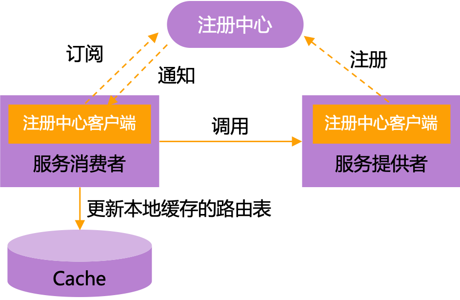

## 服务注册与发现

微服务间需要互相配合来维持系统的正常运行，在没有服务注册与发现机制之前，每个服务会将其依赖的其他服务的地址信息写死在配置文件里，如果某个服务突然宕机或者需要变更信息，要手动更新对应的服务节点信息并重启

有了服务注册与发现机制之后，由注册中心维护可用服务的列表，通过注册中心可以动态获取可用服务的地址信息。如果服务信息发生变更，注册中心会将变更推送给相关联的服务，无需手动更新和重启

### 服务注册

每个服务在启动时，会向注册中心注册服务，也就是将自己的地址信息（ip、端口以及服务名字等信息的组合）上报给注册中心，注册中心负责将地址信息保存起来，其他服务就可以通过注册中心获取到当前可用的服务列表

### 服务发现

一个服务节点如果要调用另外一个服务节点，可以通过向注册中心查询特定服务的注册信息，获得可用的服务实例列表

- 通常情况下，服务节点拿到地址信息之后，还会在本地缓存一份，以保证在注册中心宕机时仍然可以正常调用服务

### 注册中心

注册中心是服务实例信息的存储仓库，也是服务提供者和服务消费者进行交互的桥梁，不仅需要提供服务注册、服务发现功能，还要对服务信息进行管理与健康检查

- 负载均衡：注册中心可以对同一服务的多个实例进行负载均衡，将请求分发到不同的实例上
- 故障恢复：注册中心能够监测和检测服务的状态，当服务实例发生故障或下线时，可以及时更新注册信息，从而保证服务能够正常工作
  - 不可用服务剔除：注册中心会通过 **心跳机制** 来检测服务是否可用，如果服务不可用的话，注册中心会主动剔除该服务并将变更推送给相关联的服务，更新服务地址信息
- 服务治理：通过注册中心可以进行服务的配置管理、动态扩缩容、服务路由、灰度发布等操作，实现对服务的动态管理和控制
- 作为注册中心，可用性的要求要高于一致性

### 常见注册中心

| 特性 | Eureka | ZooKeeper | Nacos |
| :- | :-: | :-: | :-: |
| 开发公司 | Netflix | Apache 基金会 | 阿里巴巴 |
| CAP | AP | CP | AP 或 CP，默认 AP |
| 功能 | 服务注册与发现 | 分布式协调、配置管理、分布式锁 | 服务注册与发现、配置管理、服务管理 |
| 负载均衡 | Ribbon | - | 权重/metadata/Selector |
| 访问协议 | HTTP | TCP | HTTP/DNS |
| 自我保护 | 支持 | - | 支持 |
| 数据存储 | 内嵌数据库、多个实例形成集群 | ACID 特性的分布式文件系统 ZAB 协议 | 内嵌数据库、MySQL 等 |
| 健康检查 | Client Beat | Keep Alive | TCP/HTTP/MYSQL/Client Beat |
| 特点 | 简单易用、自我保护机制 | 高性能、强一致性 | 动态配置管理、流量管理、灰度发布等 |

## 引用

- [微服务注册中心原理、实现和选型](https://www.modb.pro/db/634009)
