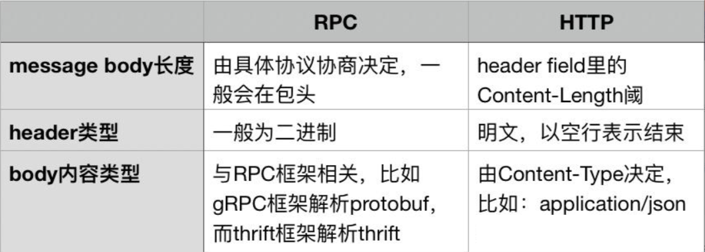
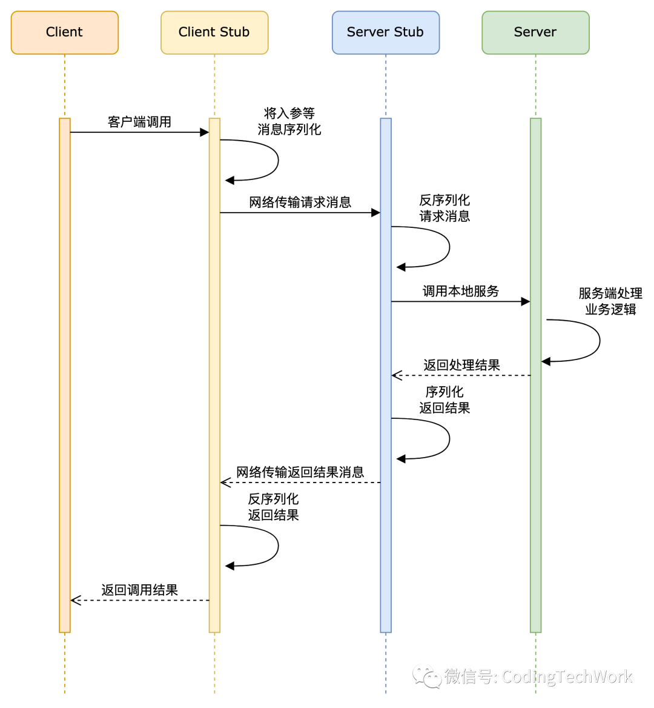
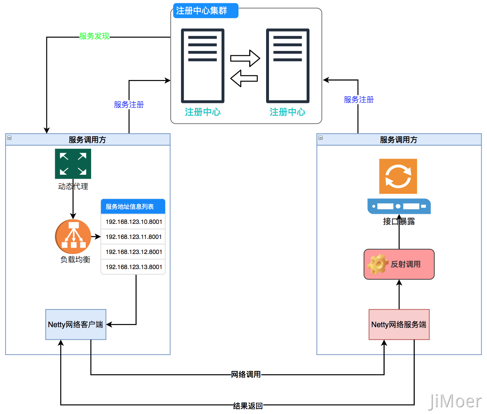
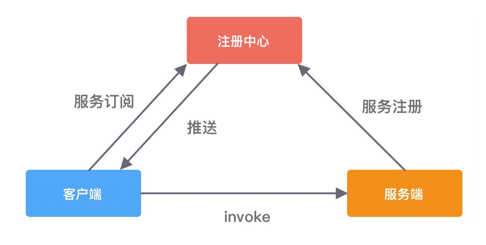
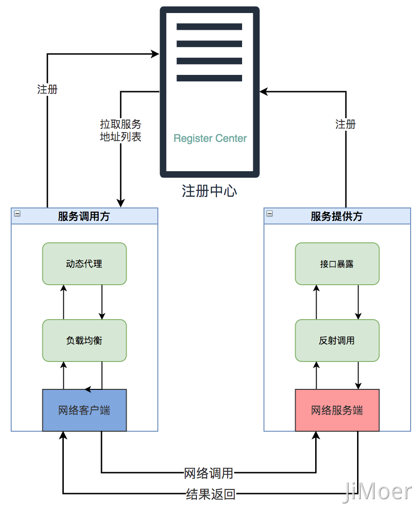
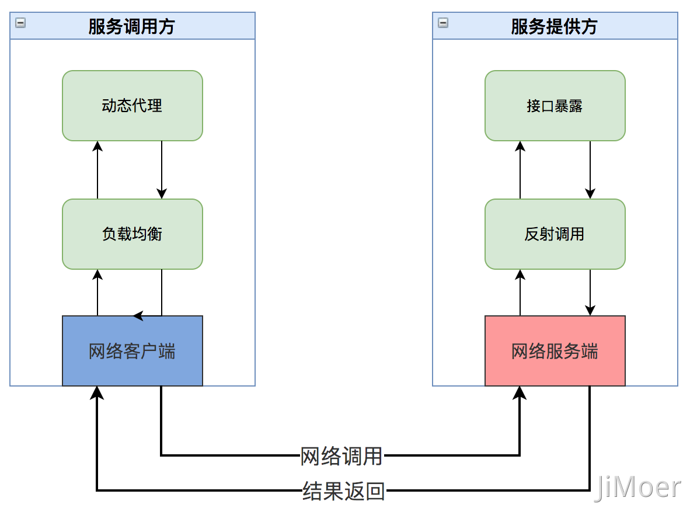

## RPC（Remote Procedure Call，远程过程调用）

随着计算机程序的工作范围从单机扩展到网络，从本地延伸至远程，需要一个高效的通讯手段来进行服务间交互

RPC 的目的就是为了让计算机能够跟调用本地方法一样去调用远程方法，而且不需要关心底层通信细节和调用过程

- RPC 是一个协议，也就是一套规范，需要人们遵循这套规范来进行实现，如 Dubbo、gRPC、Thrift 等
- 底层实现是透明的
- 跨语言能力

### 三个基本问题

所有的 RPC 协议，说到底都是为了解决三个基本问题

#### 如何表示数据

数据包括了传递给方法的参数，以及方法执行后的返回值。远程调用可能面临着交互双方的程序语言不同，即使程序语言相同，在不同硬件指令集、不同操作系统下，同样的数据类型也完全可能有不一样表现细节

有效的做法是将交互双方所涉及的数据转换为某种事先约定好的中立数据流格式来进行传输，再将数据流转换回不同语言中对应的数据类型来进行使用，也就是 **序列化和反序列化**

- 每种 RPC 协议都应该要有对应的序列化协议

#### 如何传递数据

如何通过网络，在两个服务之间相互操作、交换数据，不只是扔个序列化数据流来表示参数和结果就行的，还有异常、超时、安全、认证、授权、事务等等

#### 如何确定方法

每门语言的方法签名都可能有所差别，所以如何表示一个方法，如何找到一个方法需要一个跨语言的统一的标准，用一个唯一标识来确定方法

### 为何有了 HTTP，还要用 RPC 呢

#### 传输协议

HTTP 是基于 HTTP 协议的，而 HTTP 协议又是基于 TCP 协议的

RPC 可以基于 TCP 协议，也可以基于 HTTP 协议，还可以自定义协议，gRPC 底层就是直接用的 HTTP/2。所以 RPC 与其说是一个协议，倒不如说就是一种调用方式

- HTTP/3 已经抛弃 TCP，改用 UDP 了

#### 性能

影响性能的主要有两方面，一个是传输数据体积，体积越大，传输的效率也就越大；另一个是序列化的效率

##### 体积

HTTP 为了通用性，消息头存放了很多信息，有些信息并不是每次都需要的，所以也就可能会有很多冗余信息，而且无论请求头还是消息体都是用文本传输的，报文的体积也就会比较大

RPC 一般都是内部调用，不需要过于考虑通用性，定制化程度高，可以只传需要的信息

##### 序列化

HTTP 多以 JSON 文本传输数据，序列化的效率也较低

RPC 可以采用体积更小的 Protobuf 或其他序列化协议去保存数据，序列化的效率也更高

|| XML | JSON | Protobuf |
| :- | :-: | :-: | :-: |
| 数据结构 | 复杂 | 简单 | 较复杂 |
| 数据存储方式 | 文本 | 文本 | 二进制 |
| 数据大小 | 大 | 一般 | 小 |
| 解析效率 | 慢 | 一般 | 快 |
| 跨语言支持 | 非常多 | 多 | 一般 |
| 开发难度 | 繁琐 | 简单 | 一般 |

#### 历史因素

使用 RPC 的最主要的原因，就是性能好，但这是和 HTTP/1.1 作比较的。HTTP/2 作了很多改进，可以有效的减少报文体积，性能可能比很多 RPC 协议还要好，gRPC 底层就是直接用的 HTTP/2

但是 HTTP/2 是 2015 年出来的，当时许多公司内部的 RPC 协议都已经跑了好些年了，基于历史原因，一般也没必要去换了

## 调用流程

- Client（客户端）：服务消费者/调用方
- Client Stub（客户端存根）：将客户端的请求数据通过网络传输发送给服务端，其实就是一个代理
- Server Stub（服务端存根）：接收客户端发送过来的请求消息并进行解包，然后再调用本地服务进行处理
- Server（服务端）：服务生产者/提供方

1. Client 通过本地调用的方式调用服务
2. Client Stub 接收到调用请求后，将方法、参数等序列化成能够进行网络传输的消息体，找到远程的服务地址，将消息发给服务端
3. Server Stub 收到消息后进行反序列化操作，根据反序列化后的数据调用本地的服务进行处理
4. Server 进行处理后，将结果返回给 Server Stub
5. Server Stub 将处理结果序列化成能够进行网络传输的消息体，并将消息发给客户端
6. Client Stub 收到消息后进行反序列化操作，并将结果返回给客户端
7. Client 得到结果，完成调用

2 ~ 7 对用户都是透明的，用户只需要调用并等待返回结果就可以了

## RPC 框架

一个 RPC 框架至少要包含三个组件，是客户端、服务端和注册中心

### 注册中心

注册中心负责服务注册与发现，在一次 RPC 调用中主要负责服务地址查找

### 网络传输

既然提供远程调用的方法，就需要网络请求来传递信息，主要通过使用基于 NIO 的网络编程框架 Netty 来实现

### 序列化

数据在网络中是以二进制的形式传输的，所以需要序列化数据，再接受到序列化数据后需要反序列化，来获取需要的数据

### 通讯协议

通过选择或者自定义协议，来保证规范性，和获取更好的性能

### 动态代理

RPC 就是通过动态代理屏蔽了远程方法调用的底层细节，使得我们可以像调用本地接口一样调用远端服务

### 负载均衡

负载均衡策略是影响 RPC 框架吞吐量很重要的一个因素

## 引用

- [3.8 既然有 HTTP 协议，为什么还要有 RPC？](https://www.xiaolincoding.com/network/2_http/http_rpc.html)
- [SpringCloud 远程调用为啥要采用HTTP，而不是RPC？](https://blog.csdn.net/weixin_38405253/article/details/132797860)
- [总监又来了，人狠话不多，这篇 gRPC，小弟佩服！](https://mp.weixin.qq.com/s?__biz=Mzg3OTU5NzQ1Mw==&mid=2247490689&idx=1&sn=273eee9f2e182e6c176822d949a44f53&chksm=cf035e63f874d775cc4a0cfcffdadc79a45bde8f57c2a4a91f14ae4ee2a67588ee20026aab83&scene=178&cur_album_id=2206501082485358594#rd)
- [RPC | RPC协议介绍及原理详解](https://mp.weixin.qq.com/s/prOW3e2KxHIDW4gR81cw-w)
- [架构设计：系统间通信（10）——RPC的基本概念](https://blog.csdn.net/yinwenjie/article/details/49453303)
- [RPC框架：从原理到选型，一文带你搞懂RPC](https://mp.weixin.qq.com/s?__biz=Mzg3OTU5NzQ1Mw==&mid=2247486405&idx=1&sn=e03722a78de27f7aacea2189461b1848&chksm=cf034927f874c0319605cf7fdabd83c0f11f544c616e049105a61db3d1d48bb7aead9c44c7c9&scene=178&cur_album_id=2206501082485358594#rd)
- [RPC 框架架构设计](https://www.cnblogs.com/xiaojiesir/p/15567552.html)
- [远程服务调用](http://icyfenix.cn/architect-perspective/general-architecture/api-style/rpc.html)
- [你说说RPC的一个请求的流程是怎么样的？ ](https://www.cnblogs.com/jimoer/p/15511954.html)
