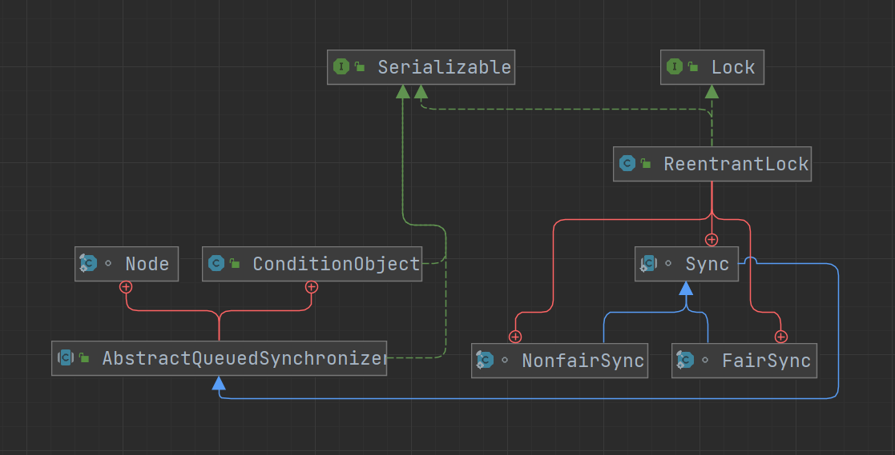

# 可重入锁

也叫做递归锁，一个线程在获取到某个锁后，可以再次获取该锁而不会被阻塞，其他线程尝试获取的话会被阻塞。使用可重入锁主要是为了同一线程多次获取同一个锁时，避免产生死锁

- 有多少次成功获取到锁，就要同样有多少次释放锁，否则其他线程是获取不到锁的

Java 中自带的锁都是可重入的，如 synchronized、ReentrantLock 等

```java
public class Test {

    final static Object lock = new Object();

    public static void main(String[] args) {
        synchronized (lock) {
            System.out.println("第一次获取成功");
            synchronized (lock) {
                System.out.println("第二次获取成功");
            }
        }
    }
}
```

> 第一次获取成功
> 第二次获取成功

如果 synchronized 是不可重入的，则第二次获取时会产生死锁

## ReentrantLock

ReentrantLock 是一个基于 AQS 框架的可重入锁，可以完全替代 synchronized 关键字，功能更加强大，更灵活，性能更好

- 在 JDK1.6 之后，synchronized 做了大量的优化，使得两者的性能差距变得很小
- ReentrantLock 可以响应中断，而 synchronized 只能等待其执行完成
- ReentrantLock 可以在获取锁时添加等待时间，超过时间则停止获取，而 synchronized 获取不到锁则会一直等待
- ReentrantLock 支持公平锁和非公平锁，而 synchronized 只支持非公平锁



### Lock 接口

ReentrantLock 是 Lock 接口的默认实现，Lock 接口主要定义了加锁及释放锁的操作

```java
public interface Lock {

    // 加锁，如果锁被占用，则等待
    void lock();

    // 同lock，可响应中断
    void lockInterruptibly() throws InterruptedException;

    // 尝试加锁，成功返回true，失败返回false，直接返回结果，不会等待
    boolean tryLock();

    // 尝试加锁，有时间限制
    boolean tryLock(long time, TimeUnit unit) throws InterruptedException;

    // 释放锁
    void unlock();

    // 新建条件状态
    Condition newCondition();
}
```

### 构造方法

```java
// 当前使用的锁
private final Sync sync;

// 默认使用非公平锁
public ReentrantLock() {
    sync = new NonfairSync();
}

// 是否使用公平锁
public ReentrantLock(boolean fair) {
    sync = fair ? new FairSync() : new NonfairSync();
}
```

### Sync 内部类

ReentrantLock 主要依靠内部类 Sync 实现加锁解锁等操作

```java
abstract static class Sync extends AbstractQueuedSynchronizer {
    private static final long serialVersionUID = -5179523762034025860L;

    /**
     * Performs {@link Lock#lock}. The main reason for subclassing
     * is to allow fast path for nonfair version.
     */
    abstract void lock();

    /**
     * Performs non-fair tryLock.  tryAcquire is implemented in
     * subclasses, but both need nonfair try for trylock method.
     */
    final boolean nonfairTryAcquire(int acquires) {
        final Thread current = Thread.currentThread();
        int c = getState();
        if (c == 0) {
            if (compareAndSetState(0, acquires)) {
                setExclusiveOwnerThread(current);
                return true;
            }
        }
        else if (current == getExclusiveOwnerThread()) {
            int nextc = c + acquires;
            if (nextc < 0) // overflow
                throw new Error("Maximum lock count exceeded");
            setState(nextc);
            return true;
        }
        return false;
    }

    protected final boolean tryRelease(int releases) {
        int c = getState() - releases;
        if (Thread.currentThread() != getExclusiveOwnerThread())
            throw new IllegalMonitorStateException();
        boolean free = false;
        if (c == 0) {
            free = true;
            setExclusiveOwnerThread(null);
        }
        setState(c);
        return free;
    }

    protected final boolean isHeldExclusively() {
        // While we must in general read state before owner,
        // we don't need to do so to check if current thread is owner
        return getExclusiveOwnerThread() == Thread.currentThread();
    }

    final ConditionObject newCondition() {
        return new ConditionObject();
    }

    // Methods relayed from outer class

    final Thread getOwner() {
        return getState() == 0 ? null : getExclusiveOwnerThread();
    }

    final int getHoldCount() {
        return isHeldExclusively() ? getState() : 0;
    }

    final boolean isLocked() {
        return getState() != 0;
    }

    /**
     * Reconstitutes the instance from a stream (that is, deserializes it).
     */
    private void readObject(java.io.ObjectInputStream s)
        throws java.io.IOException, ClassNotFoundException {
        s.defaultReadObject();
        setState(0); // reset to unlocked state
    }
}

/**
 * Sync object for non-fair locks
 */
static final class NonfairSync extends Sync {
    private static final long serialVersionUID = 7316153563782823691L;

    /**
     * Performs lock.  Try immediate barge, backing up to normal
     * acquire on failure.
     */
    final void lock() {
        if (compareAndSetState(0, 1))
            setExclusiveOwnerThread(Thread.currentThread());
        else
            acquire(1);
    }

    protected final boolean tryAcquire(int acquires) {
        return nonfairTryAcquire(acquires);
    }
}

/**
 * Sync object for fair locks
 */
static final class FairSync extends Sync {
    private static final long serialVersionUID = -3000897897090466540L;

    final void lock() {
        acquire(1);
    }

    /**
     * Fair version of tryAcquire.  Don't grant access unless
     * recursive call or no waiters or is first.
     */
    protected final boolean tryAcquire(int acquires) {
        final Thread current = Thread.currentThread();
        int c = getState();
        if (c == 0) {
            if (!hasQueuedPredecessors() &&
                compareAndSetState(0, acquires)) {
                setExclusiveOwnerThread(current);
                return true;
            }
        }
        else if (current == getExclusiveOwnerThread()) {
            int nextc = c + acquires;
            if (nextc < 0)
                throw new Error("Maximum lock count exceeded");
            setState(nextc);
            return true;
        }
        return false;
    }
}
```

## 参考

