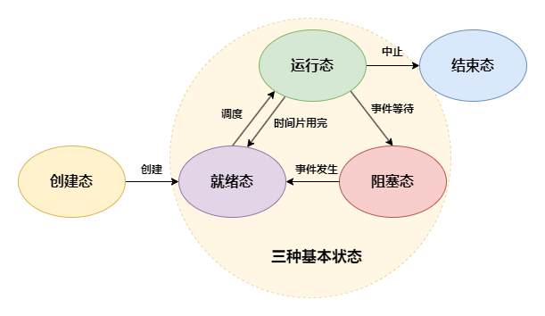
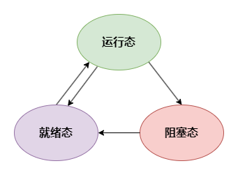

# 并发

## 前置知识

JMM
操作系统

## 同步与异步

- 同步（Synchronous）：发出调用后，必须一直等待返回结果，才能继续后续操作
- 异步（Asynchronous）：发出调用后，无需等待返回结果，可直接进行后续操作

## 并发与并行

- 并行（Parallelism）：同一时刻，多个任务同时执行
- 并发（concurrency）：在一个时间段内，多个任务交替执行

## 进程与线程

- 进程（Process）：进程是静态的程序的动态的执行过程，是系统进行资源分配的基本单位
- 线程（Thread）：线程是进程当中的一条执行流程，是系统进行调度的基本单位

### 进程与线程的区别

### 上下文切换

### 进程的状态

一个进程通常有 5 种状态，其中至少有 3 种基本状态

- 运行态（Runing）：进程正在运行
- 就绪态（Ready）：进程在可运行状态，等待获取 CPU
- 阻塞态（Blocked）：又称等待态（Waiting），进程正在等待某一事件而暂停运行
- 创建态（New）：进程正在被创建，暂未转到就绪态
- 结束态（Terminated）：进程正在从系统中消失，可能是正常执行结束或其他原因中断运行退出

### 线程的状态

线程被视为轻量级进程，所以操作系统线程的状态其实和操作系统进程的状态是一致的，通常只关注最主要的 3 种状态

## 参考

- [进程](https://zh.wikipedia.org/wiki/%E8%A1%8C%E7%A8%8B)
