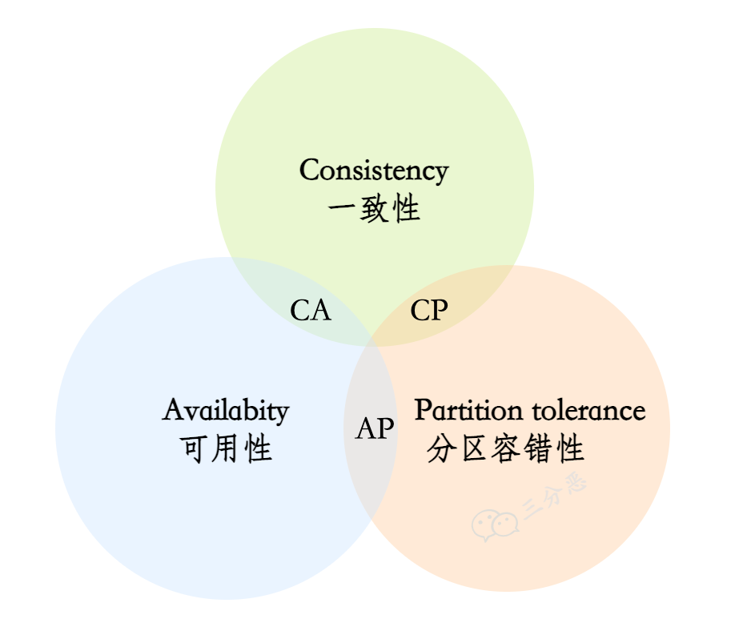
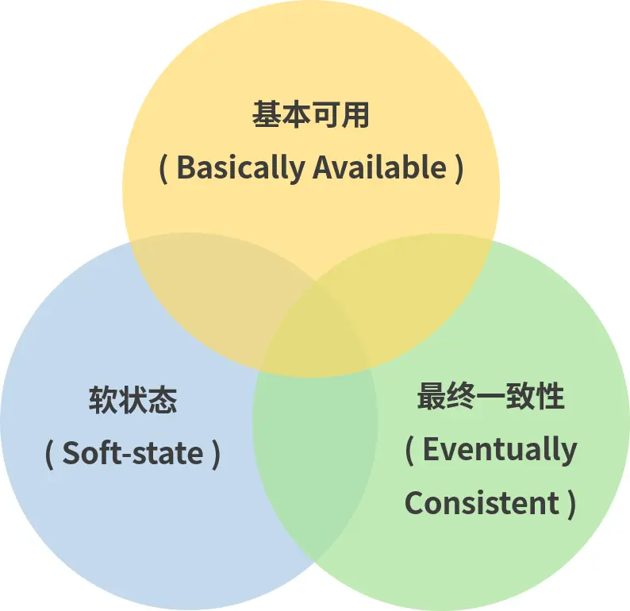
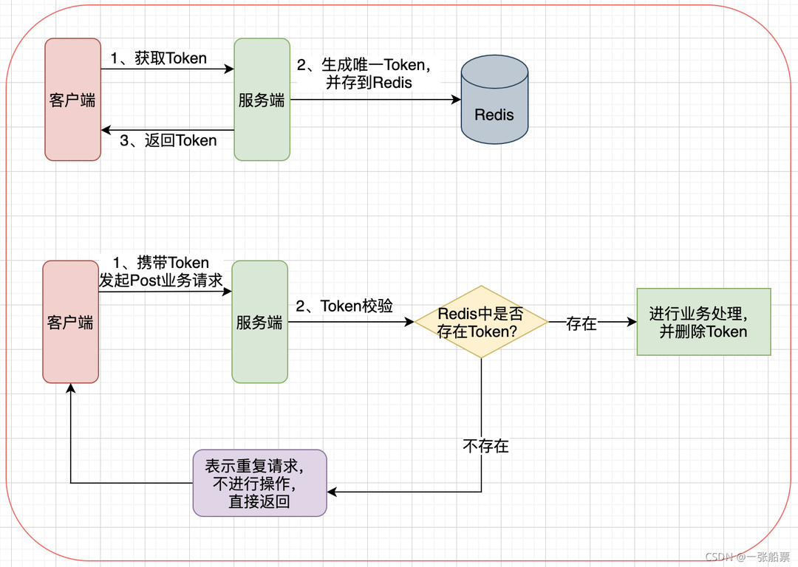

## CAP

在一个分布式系统中，Consistency（一致性）、 Availability（可用性）、Partition tolerance（分区容错性）这 3 个基本需求，最多只能同时满足其中的 2 个



- **一致性（Consistency）**：数据在多个副本之间能够保持一致的特性
  - 数据在任何时刻、任何分布式节点中所看到的都是符合预期的
  - 要么读到最新的数据，要么失败，其强调的是数据正确
- **可用性（Availability）**：系统提供的服务必须一直处于可用的状态，每次请求都能获取到非错的响应
  - 代表系统不间断地提供服务的能力
  - 一定会返回数据，不会返回错误，但不保证数据时最新的，强调的是不出错，任何时候读写都是成功的
- **分区容错性（Partition tolerance）**：分布式环境中部分节点因网络原因而彼此失联后，即与其他节点形成网络分区时，系统仍能正确地提供服务
  - 系统一直运行，不管内部出现何种数据同步问题，强调的是不挂掉

### 为何不能三者共存

对于分布式系统，因为需要用到网络来共享数据，网络分区是必然存在的

所以分区容错性就必须有所保障，否则就得把服务和资源放到一个机器，或者一个同生共死的集群，那就违背了分布式的初衷。而为了满足了分区容错性，一致性和可用性就不可能共存

- 一致性得保证数据都是最新且正确的，如果不符合条件，要么返回错误，要么不返回数据
  - 假如有 3 个副本，向 3 个副本写入，3 个副本都返回写入成功才算成功，不能保证立即就能返回成功
- 可用性得保证每次请求都能立即返回非错的数据
  - 假如有 3 个副本，向 3 个副本写入，只要有 1 个副本返回写入成功就算成功，不能保证都写入成功

### 取舍

#### 如果放弃分区容忍性（CA without P）

理论上放弃 P，则 CA 是可以保证的，但在分布式系统中分区是不可避免的

传统的关系数据库集群就是为了 CA，放弃了 P，虽然集群仍需要网络连接来协调多个节点的工作，但数据却不是通过网络来实现共享的。各个节点是通过共享存储中的同一份数据文件和控制文件来获取数据的，通过共享磁盘的方式来避免出现网络分区

#### 如果放弃可用性（CP without A）

一旦网络发生分区，节点之间的信息同步时间可以无限制地延长

选择放弃可用性的 CP 系统情况一般用于对数据质量要求很高的场合中，常见的应用有分布式数据库、分布式锁等

#### 如果放弃一致性（AP without C）

一旦网络发生分区，节点之间所提供的数据可能不一致

选择放弃一致性的 AP 系统目前是设计分布式系统的主流选择，目前大多数 NoSQL 库和支持分布式的缓存框架都是 AP 系统

## BASE

BASE 是对 CAP 中 AP 的一个扩展，即便不能达到强一致性，也可以根据应用特点采用适当的方式来达到最终一致性的效果。通过牺牲强一致性来获得可用性，并允许数据在一段时间内是不一致的，但最终达到一致状态



- 基本可用（Basically Available）：出现不可预知故障的时候，允许损失部分可用性，相比正常的系统，可能是响应时间延长，保证核心功能可用，或者是服务被降级
- 软状态（Soft State）：硬状态要求多个节点的数据副本都是一致的，而软状态允许系统中的数据存在中间状态，并认为该状态不影响系统的整体可用性，即允许系统在多个不同节点的数据副本存在数据延时
- 最终一致性（Eventually Consistent）：数据可以是软状态的，但不能一直是软状态的。在一定的时间后，应该保证所有副本保持数据一致性，从而达到数据的最终一致性

## 幂等性

任意多次执行对资源本身所产生的影响均与一次执行的影响相同。只要调用接口成功，外部多次调用对系统的影响是一致的，返回的结果也是相同的

- 除了业务上的特殊要求外，一般情况下不需要引入的接口幂等性

### 需求场景

#### 前端重复提交

表单填写完成后用户进行提交，由于网络波动等原因导致没能及时对用户的提交进行反馈，致使用户认为没有提交成功，频繁点击提交按钮

#### 用户恶意刷单

用户频繁点击提交按钮，或者恶意频繁请求接口，导致接收到大量重复的请求

#### 接口超时重试

对于给第三方调用的接口，为了防止网络波动超时等造成的请求失败，都会添加重试机制，导致一个请求提交多次

#### 消息重复消费

当使用 MQ 消息中间件时候，如果发生消息中间件出现错误未及时提交消费信息，导致发生重复消费

### 解决方案

#### select + insert

对于并发量不高的系统，可以先查询下数据已存在，再去判断是否进行数据插入

#### 唯一索引

添加唯一索引后，如果重复插入数据就会抛出异常，为了保证幂等性，一般需要捕获这个异常

#### 全局唯一 ID

根据业务的操作和内容生成一个全局 ID，执行操作前下查询该全局 ID 是否存在，再去判断是否进行数据插入

#### Token 令牌

生成一个有有效时间的 Token，带着这个 Token 才能去请求接口，服务端对 Token 进行校验，来判断是否是重复请求



#### 去重表

将特定的数据插入到去重表中，执行操作前先查询是否存在在去重表中，再去判断是否进行数据插入

#### 悲观锁

总是假设最坏的情况，每次去拿数据的时候都认为别人会修改，所以每次在拿数据的时候都会上锁

```sql
select ... from ... where ... for update;
```

- 使用 for update 的 select 语句，只有当事务提交或回滚时，所加的锁才会被释放

#### 乐观锁

每次去拿数据的时候都认为别人不会修改，所以不会上锁，但是在更新的时候会判断一下在此期间别人有没有去更新这个数据

可以在表中增加 timestamp 或者 version 字段作为查找条件，并在更新时同时更新这些字段

```sql
update ... set version = version + 1, ... where version = 1 and ...
```

#### 状态机

有些业务表是有状态的，根据不同的状态执行不同的操作，如果状态机已经处于下一个状态，这时候来了一个上一个状态的变更，理论上是不能够变更的

#### 分布式锁

在进入方法时，先去获取锁，如果获取到锁，就继续后续操作，操作完成后释放锁。没有获取到锁的，就要等待锁的释放。锁要设个超时时间，防止意外没有释放到锁

## 引用

- [分布式理论系列（一）：CAP 定理、BASE理论](https://juejin.cn/post/6844904116100022280?searchId=20231204154642C694A522C23ABC46937F)
- [分布式系统 9种实现接口幂等性方案，杜绝重复提交！](https://mp.weixin.qq.com/s/Nc1ReyCFm1KbAXIWE5I2hQ)
- [幂等性问题的思考和总结，防重、幂等，常用解决方案，解决方式](https://mp.weixin.qq.com/s/p4UuQlGOcd3FnFRH1shyVQ)
