## 数据库事务

对于数据库来说，事务可以保证一系列操作要么全成功，要么全失败，通常一个事务对应一个完整的业务

### ACID

#### 原子性（Atomicity）

一个事务中的所有操作，要么全部完成，要么全部不完成，不会出现部分成功部分失败的情况

#### 一致性（Consistency）

在事务开始之前和事务结束以后，数据库的完整性没有被破坏

#### 隔离性（Isolation）

事务之间相互独立

#### 持久性（Durability）

事务处理结束后，对数据的修改就是永久的

## 分布式事务

分布式事务是为了解决形式都是分布式系统中不同节点之间的数据一致性问题

- 柔性事务：追求最终一致性
  - TCC、Saga、MQ 事务、本地项目表
- 刚性事务：追求强一致性
  - 2PC、3PC

### XA

XA 是一个分布式事务协议，由 AP、RM、TM 组成

- AP（Application Program）：应用程序本身
- RM（Resource Manager）：资源管理器，事务的参与者，通常指数据库
- TM（Transaction Manager）：事务管理器，负责管理全局事务，分配事务的唯一标识、监控事务的执行情况、并负责事务的提交、回滚等操作

由 XA 协议，衍生了 2PC 和 3PC 协议，并引入了两个角色，一个协调者（TM）和 n 个参与者（RM）

#### 2PC（2 Phase Commit，两阶段提交）

基于 XA 协议，2PC 将事务的提交过程分为 2 个阶段：准备阶段和提交阶段

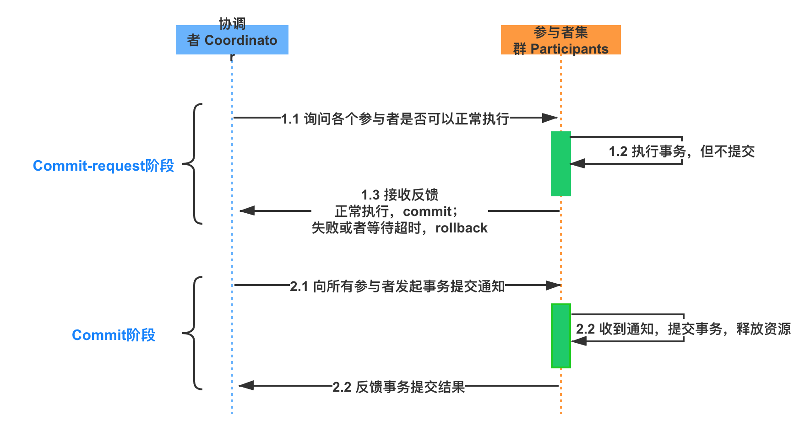

##### 准备阶段（Prepare）

1. 协调者向所有的参与者发送事务内容，询问是否可以执行事务提交操作，并开始等待各参与者的响应
2. 参与者接收到消息，执行本地数据库事务预操作，写入 Undo Log 或者 Redo Log，**此时并不会提交事务**
3. 如果本地事务执行成功，返回 Yes 表示已就绪，否则返回 No 表示未就绪

##### 提交阶段（Commit）

1. 协调者向参与者发送 Commit 消息
2. 参与者接收到 Commit 消息，正式执行事务提交操作，并在提交完成后释放整个事务期间占用的资源
3. 参与者在完成事务提交之后，向协调者发送 ACK 信息
4. 协调者接收到所有参与者反馈的 ACK 消息后，完成事务

当任一参与者处于未就绪状态，就会中断事务

1. 协调者向所有参与者发送 Rollback 消息
2. 参与者接收到消息，执行本地数据库回滚操作，并在回滚完成后释放整个事务期间占用的资源
3. 参与者在完成事务回滚之后，向协调者发送 ACK 信息
4. 协调者接收到所有参与者反馈的 ACK 消息后，完成事务中断

##### 缺点

- 同步阻塞：事务参与者会在正式提交事务之前会一直占用相关的资源，其他事务如果需要操作其中的资源，就会发生阻塞
- 数据不一致：由于网络问题或者协调者宕机都有可能会造成数据不一致的情况
  - 例如在第 2 阶段，部分参与者收不到 Commit 或者 Rollback 消息的话，就会导致数据不一致
- 单点故障：一旦协调者发生故障，参与者会一直阻塞下去

#### 3PC（3 Phase Commit，三阶段提交）

在 2PC 的基础上做了些优化，在协调者和参与者中都引入了超时机制。如果在一定时间内没有收到事务参与者的消息就默认失败，进而避免事务参与者一直阻塞占用资源

增加了预提交阶段，保证了在最后提交阶段之前各参与节点的状态是一致的

- 3PC 没能完美的解决 2PC 的一致性问题，但性能更差，实际应用也不广泛
  - 参与者接收到了 PreCommit 消息后，如果出现网络分区，在这种情况下，提交阶段的参与者依然会进行事务的提交，就会导致数据不一致

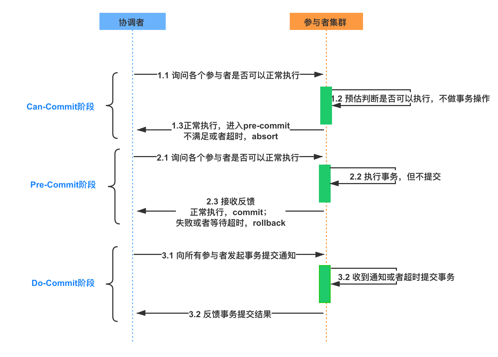

##### 准备阶段（CanCommit）

协调者向参与者发送 CanCommit 消息，参与者判断是否可以执行事务，返回 Yes 或者 No

##### 预提交阶段（PreCommit）

1. 协调者向所有参与者发送 PreCommit 消息
2. 参与者接收到消息，执行本地数据库事务预操作，写入 Undo Log 或者 Redo Log，**此时并不会提交事务**
3. 如果本地事务执行成功，向协调者发送 ACK 信息

当任一参与者处于未就绪状态，或者等待超时后，仍无法获得响应，就会中断事务

1. 协调者向所有参与者发送 Abort 消息
2. 参与者接收到消息，直接中断事务

##### 提交阶段（DoCommit）

1. 协调者向所有参与者发送 DoCommit 消息
2. 参与者接收到消息，正式执行事务提交操作，并在提交完成后释放整个事务期间占用的资源
3. 参与者在完成事务提交之后，向协调者发送 ACK 信息
4. 协调者接收到所有参与者反馈的 ACK 消息后，完成事务

### TCC（Try Confirm Cancel，补偿事务）

TCC 本质上就是一个应用层面的 2PC，需要通过业务逻辑来实现，针对每个操作，都需要有一个其对应的确认和取消操作

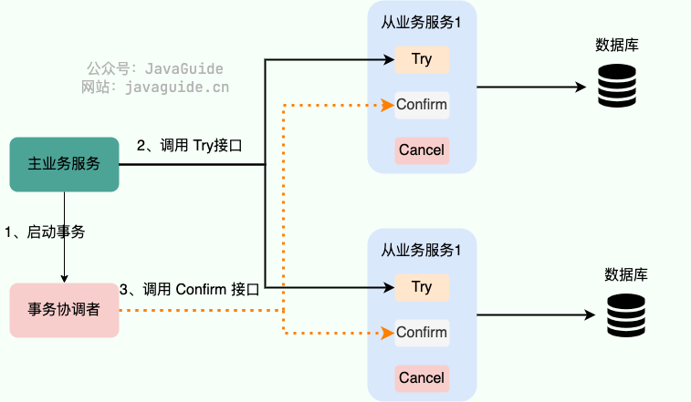
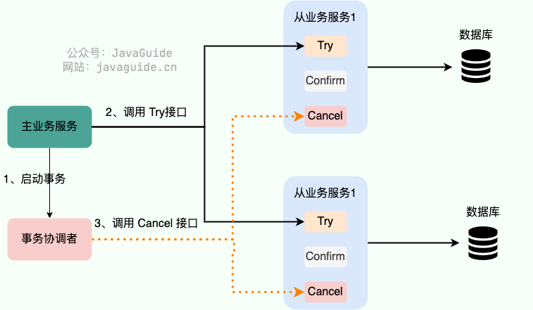

- Try 阶段：对业务系统做检测及资源预留
- Confirm 阶段：确认执行业务操作
- Cancel 阶段：取消执行业务操作

#### 与 2PC / 3PC 区别

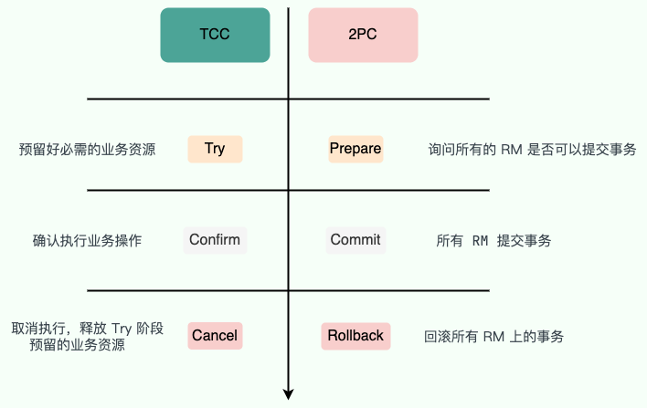

| | 2PC / 3PC | TCC |
| -- | -- | -- |
| 实现 | 依赖于数据库的事务 | 基于业务代码 |
| 业务侵入性 | 无 | 有 |
| 事务资源 | 会一直占用 | 不会一直占用 |
| 一致性 | 追求强一致性 | 追求最终一致性 |

#### 优点

- 不存在资源阻塞的问题，每个方法都直接进行事务的提交，一旦有异常通过 Cancel 来进行回滚补偿
- 每个阶段都由业务代码控制，不会锁定整个资源，锁粒度变小，可以避免长事务，性能更好
- 业务活动管理器可以变成多点，引入集群，解决了单点故障问题
- 引入超时机制，超时后可进行补偿
- 有了补偿机制之后，由业务活动管理器保证一致性

#### 缺点

- 对业务侵入性强，业务逻辑的每个分支都需要实现 Try、Confirm、Cancel 三个操作，代码量大且复用性低

#### 注意

##### 空回滚

TCC 服务在未收到 Try 请求的情况下收到 Cancel 请求，被称为空回滚，TCC 服务在实现时应当允许空回滚的执行

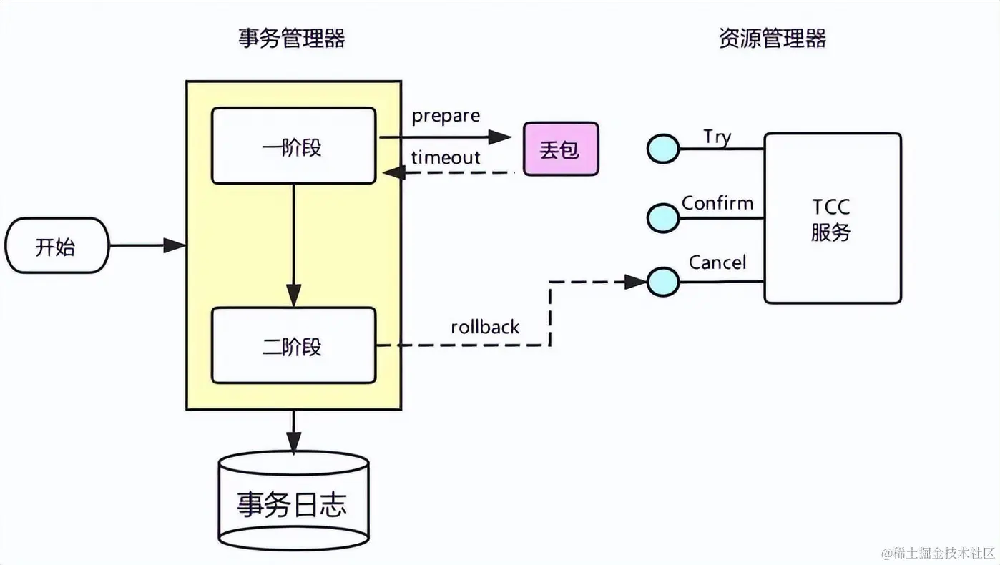

##### 防悬挂

TCC 服务在实现时应当允许空回滚，但是要拒绝执行空回滚之后到来的一阶段 Try 请求

对于事务管理器来说这时候事务已经是结束了的，这冻结操作就被悬挂了

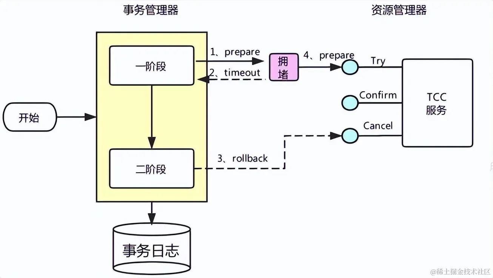

##### 幂等

考虑到网络波动等原因，为保证请求一定送达都会有重试机制，所以还需要考虑接口的幂等性

##### 并发访问

需要考虑业务数据的并发控制，尽量将逻辑锁粒度降到最低，以最大限度的提高分布式事务的并发性

### 最大努力通知

最大努力通知实现简单，适用于最终一致性要求低、时间敏感性低的业务，且被动方处理结果不影响主动方的处理结果

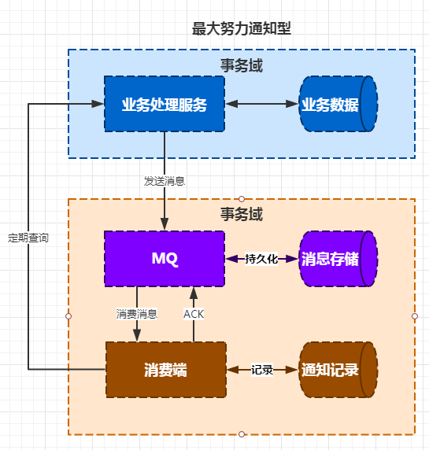

### 本地消息表

将分布式事务拆分成本地事务进行处理。在数据库中存放一个本地消息表，在进行本地事务操作时，增加了本地消息的插入，将业务的执行和将消息放入消息表中的操作放在同一个事务中提交

本地事务执行成功的话，消息肯定也插入成功，然后再调用其他服务，如果调用成功就修改这条本地消息的状态

会有一个后台线程对消息表进行扫描，如果有失败的状态，会进行重试，一般会设置重试的次数，超过限制则进行特殊记录，可以人工介入处理

- 需要保证服务的幂等性，避免同一条消息被多次消费造成数据不一致

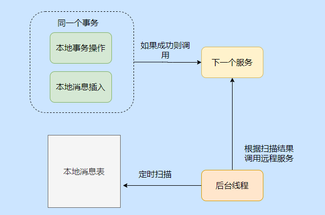

### MQ 事务

实际上其实是对本地消息表的一个封装，将本地消息表移动到了 MQ 内部

- 相较于本地消息表，不需要再建消息表，对性能的损耗和业务的入侵更小

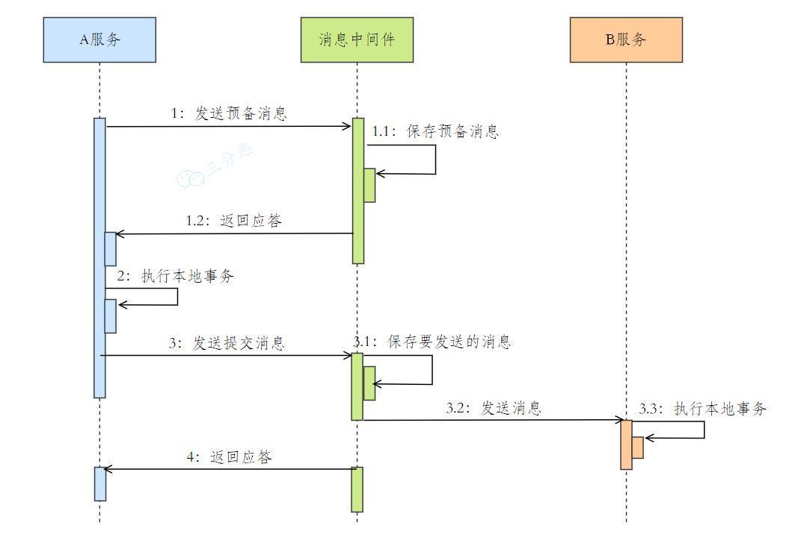

1. 发送 prepare 消息到消息中间件
2. 发送成功后，执行本地事务
3. 如果事务执行成功，则提交，消息中间件将消息下发至消费端
4. 如果事务执行失败，则回滚，消息中间件将这条 prepare 消息删除
5. 消费端接收到消息进行消费，如果消费失败，则不断重试

### Saga

将长事务拆分为多个本地短事务，由 Saga 事务协调器协调，且 **每个短事务都有一个补偿机制**

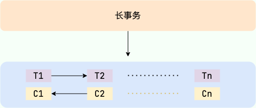

#### 恢复模式

如果短事务都能顺利完成，整个事务也就顺利完成，否则将采取恢复模式

##### 正向恢复

如果某个短事务提交失败，则补偿所有已完成的事务

##### 反向恢复

如果某个短事务提交失败，则对该事务一直进行重试，直到成功为止

## 引用

- [分布式理论系列（二）一致性算法： 2PC 到 3PC 有哪些改进](https://juejin.cn/post/6844904135641268237)
- [浅谈分布式事务及解决方案 | 京东物流技术团队](https://juejin.cn/post/7290547545214779449?searchId=20231204171556E339D1646872E15096CF)
- [分布式事务，你了解多少？ | 京东物流技术团队](https://juejin.cn/post/7268297948638330935?searchId=20231204171556E339D1646872E15096CF)
- [面试官：RocketMQ 分布式事务消息的缺点？](https://mp.weixin.qq.com/s/cBx1l1zaThN6_808fMl27g)
- [分布式事务解决方案(四)【最大努力通知】](https://blog.csdn.net/wulex/article/details/80938753)
- [再有人问你分布式事务，把这篇扔给他](https://juejin.cn/post/6844903647197806605)
- [不就是分布式事务，这下彻底清楚了](https://mp.weixin.qq.com/s?__biz=MzkwODE5ODM0Ng==&mid=2247488268&idx=1&sn=5707facc0405ea0b09b8d32a841853d5&chksm=c0ccfba9f7bb72bf0519fca2984e235aaeb6dceba25aff6a220048c3116117c4cf5493b03f5f&scene=178&cur_album_id=2041709347461709827#rd)
- [20 张图搞懂「分布式事务」 | 🏆 技术专题第五期征文](https://juejin.cn/post/6874788280378851335?searchId=20231204171556E339D1646872E15096CF)
