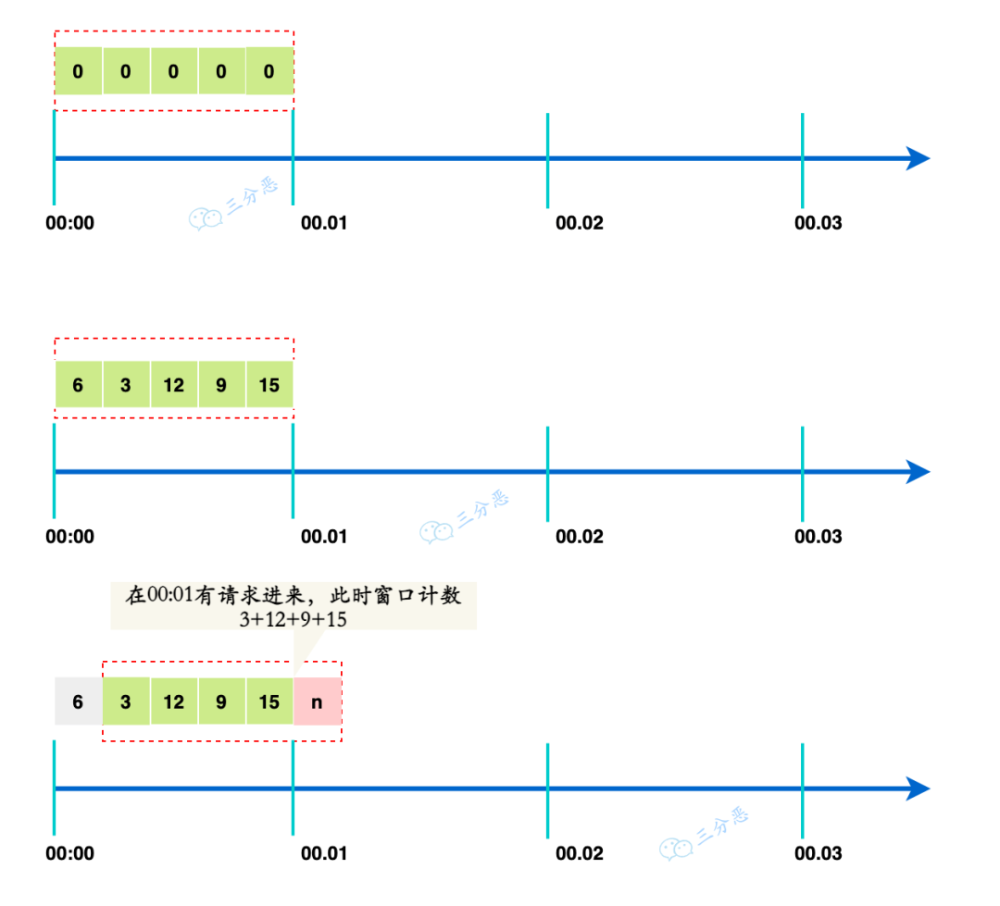
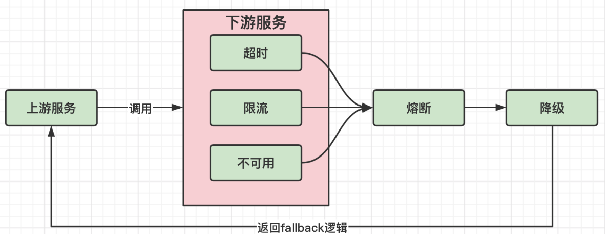
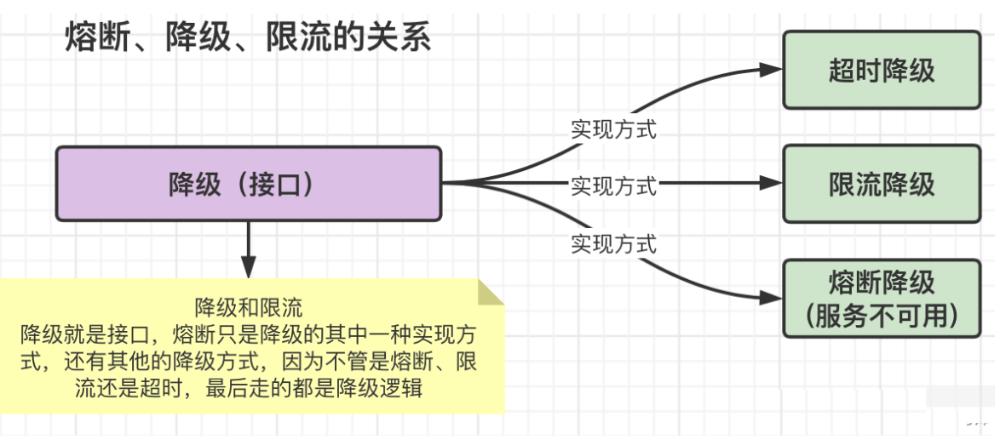

## 限流

对请求的速率进行限制，避免瞬时的大量请求击垮软件系统

- 单机限流：仅能保护自身节点，但无法保护应用依赖的各种服务，并且在进行节点扩容、缩容时也无法准确控制整个服务的请求限制
- 分布式限流：以集群为维度，可以方便的控制这个集群的请求限制，从而保护下游依赖的各种服务资源
  - 借助中间件架限流：可以借助 Sentinel 或者使用 Redis + Lua 来自己实现对应的限流逻辑
  - 网关层限流

### 限流算法

#### 固定窗口

也叫做计数器算法，就是把时间划分为固定的时间窗口，每个窗口内允许固定数量的请求次数

1. 给定一个计数器来记录当前接口处理的请求数量，初始值为 0
2. 在单位时间内，每处理一个请求就加 1
3. 在单位时间内，计数器的值达到了限制的数量，后续的请求就全被拒绝
4. 本次时间结束后，就将计数器重置，重新开始计数

##### 临界问题

固定窗口算法实现简单，占用空间小，但是它存在临界问题。由于窗口的切换是瞬间完成的，因此请求的处理并不平滑，可能会在窗口切换的瞬间出现流量的剧烈波动

- 假如计数器的限制是每 10 秒处理 50 个请求，前 10 秒和后 10 秒都没超过限制，但在切换的前后的 1 秒钟内，接收到了 80 个请求，虽然每个周期都符合限制，但确实是某个时间点超出了限制

#### 滑动窗口

将一个大的时间窗口划分为多个小的时间窗口，每个小的窗口都有独立的计数。请求过来的时候，判断请求的次数是否超过 **整个窗口** 的限制，而窗口的移动是每次向前 **滑动一个小的单元窗口**

- 解决临界问题，格子越多，那么整体的滑动就会越平滑，限流的效果就会越精准
- 在高并发的情况下，可能会比较占内存

#### 漏桶

请求就像水一样以任意速度注入漏桶，而桶会按照固定的速率将水漏掉。漏桶算法的两大作用是流量整形、速度限制

- 流量整形：限制网络设备的流量突变，使得网络报文以比较均匀的速度向外发送

固定窗口和滑动窗口都属于否决式限流，超过阈值的流量就必须强制失败或降级，很难进行阻塞等待处理，也就很难在细粒度上对流量曲线进行整形，起不到削峰填谷的作用，这就需要漏桶和令牌桶这种阻塞式限流

#### 令牌桶

以一种固定的速率向桶中添加令牌，每个请求在发送前都需要从桶中取出一个令牌，只有取到令牌的请求才被通过。因此，令牌桶算法允许请求以任意速率发送，只要桶中有足够的令牌

## 降级

当服务器压力剧增的情况下，根据当前业务情况及流量对一些服务和页面有策略的降级，以此释放服务器资源以保证核心任务的正常运行

## 熔断

当调用链路的某个微服务不可用或者响应时间太长时，会进行服务熔断，不再有该节点微服务的调用，快速返回错误的响应信息。当检测到该节点微服务调用响应正常后，恢复调用链路

### 熔断器模型

- closed：闭合状态，也是初始状态，熔断器会保持闭合，对资源的访问直接通过熔断器的检查
- open：断开状态，熔断器处于开启状态，对资源的访问会被切断
- half-open：半开状态，该状态下除了探测流量，其余对资源的访问也会被切断
  - 会周期性的允许一定数目的探测请求通过，如果探测请求能够正常的返回，代表探测成功，此时熔断器会重置状态到 closed 状态，结束熔断；如果探测失败，则回滚到 open 状态

### 熔断策略

#### 慢调用比例（slow request radio）

当响应慢的请求达到一定的比例达到了限制，就会熔断

#### 错误比例（error radio）

在统计周期内资源请求访问异常的比例达到了限制，就会熔断

#### 错误计数（error count）

在统计周期内资源请求访问异常的数量达到了限制，就会熔断

### 熔断与降级

- 共同点
  - 都是从可用性、可靠性出发，提高系统的容错能力
  - 使某一些应用不可达或不可用，来保证整体系统稳定
- 区别
  - 熔断通常是下级服务故障引起，降级通常为整体系统而考虑
  - 降级是一种退而求其次的选择，而熔断却是整体不可用

降级和熔断其实就是服务安全中的 2 个不同的流程，在服务发生故障时，肯定是先断开与服务的连接，然后在执行降级逻辑

## 引用

- [来，四种分布式限流算法实现！](https://mp.weixin.qq.com/s/fsTBXAKacoeLx2NUBYaFsQ)
- [聊聊限流](https://mp.weixin.qq.com/s?__biz=Mzg3OTU5NzQ1Mw==&mid=2247487439&idx=1&sn=87beaedb8a8024615f0674c1cf88ca02&chksm=cf034d2df874c43bc2a928e856ebd7dc3f17742e425bb192e3e410f4c15ee4ab195f13e8c706&scene=178&cur_album_id=2206501082485358594#rd)
- [服务限流详解](https://javaguide.cn/high-availability/limit-request.html)
- [微服务面试题：熔断和降级有什么区别？](https://blog.csdn.net/BruceLiu_code/article/details/129122169)
