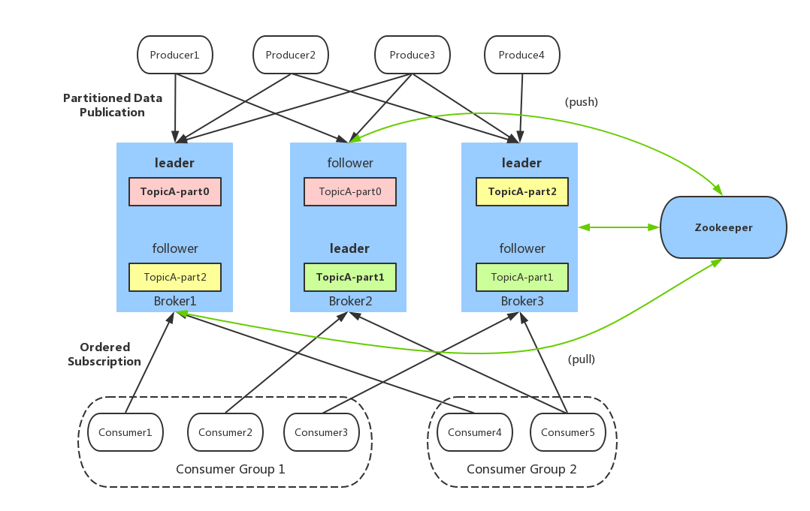
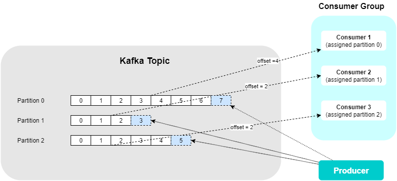
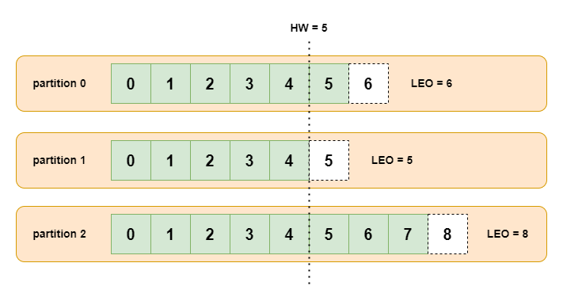
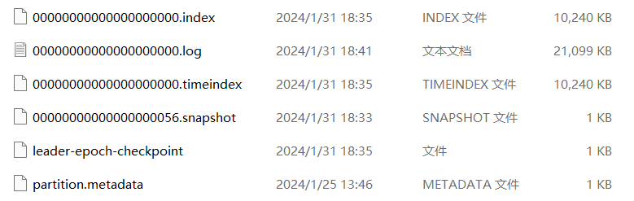

# Kafka

Kafka 是一个开源的分布式事件流处理平台，可以实时发布、订阅、存储和处理事件流，由 Scala 和 Java 编写。主要有 3 个关键功能

1. 消息系统：Kafka 和传统的消息系统都具备系统解耦、冗余存储、流量削峰、缓冲、异步通信、扩展性、可恢复性等功能
2. 存储系统：Kafka 把消息持久化到磁盘，相比于其他基于内存存储的系统而言，有效地降低了数据丢失的风险
3. 流式处理平台：Kafka 不仅为每个流行的流式处理框架提供了可靠的数据来源，还提供了一个完整的流式处理类库

主要有 2 种应用场景：消息队列、数据处理



<small>[Kafka 设计原理 - Kafka架构](https://cloud.tencent.com/developer/article/1005736)</small>

## broker（代理）

Kafka 的服务节点，即 Kafka 服务器

## producer（生产者）

负责生产消息

## consumer（消费者）

负责消费消息

## topic（主题）

主题是一个逻辑上的概念，Kafka 中的消息以主题为单位进行划分

生产者将消息发送到特定的主题，消费者通过订阅特定的主题获得消息并消费

## consumer group（消费者组）

每个消费者都属于一个特定的消费者组，一个消费者组可以包含一个或多个消费者

- 同一条消息可以被不同消费者组消费
- 在同一个消费者组中，一条消息只能由组内的某一个消费者进行消费

对于消息中间件而言，一般有两种消息投递模式：点对点（P2P）模式、发布 / 订阅（Pub / Sub）模式

- 如果所有的消费者在同一个消费组中，那么每条消息只会被其中一个消费者处理，相当于点对点模式
- 如果所有的消费者在不同的消费组中，那么每条消息会被所有的消费者处理，相当于发布 / 订阅模式

## partition（分区）

一个主题可以有一个或多个分区。并且同一个主题下的分区可以分布在不同的 broker 上

同一主题下的不同分区包含的消息是不同的，分区在存储层面可以看作一个可追加的日志（log）文件，消息在被追加到分区日志、文件的时候都会分配一个特定的偏移量（offset）

分区以文件形式存储在文件系统，目录命名规则：`<topic_name>-<partition_id>`

理论上一个主题下的分区越多，整个集群所能达到的吞吐量就越大，但分区不是越多越好

- 越多的分区需要打开更多的文件句柄：在 Kafka 中，每个分区都会对照着文件系统的一个目录。在 Kafka 的数据日志文件目录中，每个日志数据段都会分配两个文件，一个索引文件和一个数据文件。因此分区越多，需要的文件句柄数急剧增加，必要时需要调整操作系统允许打开的文件句柄数
- 客户端 / 服务器端需要使用的内存就越多：生产者有个参数 `batch.size`，默认是 16KB。它会为每个分区缓存消息，一旦满了就打包将消息批量发出。因为这个参数是分区级别的，如果分区数越多，这部分缓存所需的内存占用也会更多
- 降低高可用性：分区越多，每个 broker 上分配的分区也就越多，当一个发生 broker 宕机，那么恢复时间将很长

### 分区选择策略

#### 生产者分区选择策略

生产者的分区分配是指为每条消息指定其所要发往的分区

- 指定某个分区
- 没有指定的分区，但是存在 key，在发送消息时可以指定消息的 key，key 的作用是将将消息与特定的分区进行绑定，此时将 key 的 hash 值与该主题的分区总数进行取余
- 没有指定的分区，也不存在 key
  - Kafka 2.4 之前默认使用轮询分配策略（RoundRobinAssignor），在第一次调用时会随机生成一个整数，后面每次调用在这个整数上自增，将这个值与可用的分区总数取余
  - Kafka 2.4 之后默认使用粘性分配策略（StickyAssignor）

#### 消费者分区选择策略

消费者中的分区分配是指为消费者指定其可以消费消息的分区

- RangeAssignor：首先会计算每个消费者可以消费的分区个数，然后按照顺序将指定个数范围的分区分配给各个消费者
- RoundRobinAssignor：通过轮询方式逐个将分区依次分配给每个消费者
- StickyAssignor：分区的分配要尽可能均匀；分区的分配尽可能与上次分配的保待相同。当两者发生冲突时，第一个目标优先于第二个目标。尽可能地让前后两次分配相同，进而减少系统资源的损耗及其他异常情况的发生

## offset（偏移量）

offset 是消息在分区中的唯一标识，Kafka 通过它来保证消息在分区内的顺序性，不过 offset 并不跨越分区，每个分区都有自己独立的 offset

offset 从 0 开始，每当有新的消息写入分区时，offset 就会加 1。offset 是不可变的，即使消息被删除或过期，offset 也不会改变或重用

消费者在消费 Kafka 消息时，需要维护一个当前消费的 offset 值，以及一个已提交的 offset 值。当前消费的 offset 值表示消费者正在消费的消息的位置，已提交的 offset 值表示消费者已经确认消费过的消息的位置。消费者在消费完一条消息后，需要提交 offset 来更新已提交的 offset 值，分为自动提交与手动提交



<small>[Kafka Offset Explained](https://kontext.tech/diagram/1159/kafka-offset-explained)</small>

主要有 2 大作用

1. 定位消息：通过指定 offset，消费者可以准确地找到分区中的某条消息，或者从某个位置开始消费消息
2. 记录消费进度：消费者在消费完一条消息后，需要提交 offset 来告诉 broker 自己消费到哪里了。这样，如果消费者发生故障或重启，它可以根据保存的 offset 来恢复消费状态

### LEO 与 HW



- LEO（Log End Offset）：标识当前日志文件中下一条待写入消息 offset
- HW（High Watermark）：指代消费者能见到的最大的 offset，ISR 队列中最小的 LEO。消费者只能拉取到这个 offset 之前的消息

## replication（副本）

为了保证数据的高可用，每个分区以有多个副本，分布在不同的 broker 上

- leader：每个分区可以有多个副本，其中有且只有一个可以作为 leader，只有他负责对外提供读写服务
- follower：follower 跟随 leader，所有写请求都通过 leader 路由，数据变更会广播给所有 follower

分区使用多副本机制来提升可靠性，生产者和消费者只与 leader 副本进行交互，而 follower 副本只负责消息的同步，很多时候 follower 副本中的消息相对 leader 副本而言会有一定的滞后

如果一个分区的 leader 副本不可用，那么就意味着整个分区变得不可用，此时就需要 Kafka 从剩余的 follower 副本中挑选一个新的 leader 副本来继续对外提供服务

### ISR

分区中的所有副本统称为 AR (Assigned Replicas）。所有与 leader 保持一定程度同步的副本（包括 leader 副本在内）组成 ISR（In-Sync Replicas)。所有与 leader 滞后过多的副本组成 OSR（Out-of-Sync Replicas）

leader 负责维护和跟踪 ISR 集合中所有 follower 的滞后状态，follower 落后或失效时，leader 会把它从 ISR 集合中剔除。OSR 集合中有 follower 追上了 leader，那么 leader 会把它从 OSR 集合转移至 ISR 集合

当生产者将消息发送到 Kafka 的一个分区时，消息首先被写入 leader，然后 leader 会将消息同步到 ISR 中的其他副本。leader 在 ISR 中的副本都成功地接收并复制了消息之后，leader 才会向生产者发送确认，当然也有其他的一些确认策略

ISR 的存在有助于保障数据的可靠性和一致性。如果一个副本不能及时地跟上 leader 的写入，Kafka 会将其从 ISR 中移除，以确保只有跟上同步的副本才会参与消息的写入。这样可以有效地防止数据的不一致，同时提高系统的可用性

### 分区故障

当 leader 发生故障时，Kafka 会从 ISR 中选举出一个新的 leader。为了保证多个副本之间的数据一致性，其余的 follower 会先将各自的 log 文件高于 HW 的部分截掉，然后从新的 leader 中同步数据

当 follower 发生故障时，它会被临时从 ISR 中提出。在恢复后，follower 会读取本地磁盘记录的上次的 HW，并将 log 文件高于 HW 的部分截掉。接着 follower 从 HW 开始向 leader 进行同步。一旦 follower 追上 leader，它就可以重新加入 ISR

### ACK 设置

生产者的确认方式

- `acks=0`：生产者不等待确认，直接发送下一条消息
  - 这一操作提供了最低的延迟，如果 leader 还没完成写入，broker 发生故障有可能丢失数据
- `acks=1`：leader 在将消息写入本地日志后会向生产者发送确认
  - 如果在 follower 同步成功之前 leader 故障，那么将丢失数据。只有 leader 写入成功
- `acks=-1`（或 `acks=all`）：leader 在将消息写入本地日志并等待所有 ISR 副本确认后才向生产者发送确认
  - 如果在 follower 同步完成后，发送确认消息之前，leader 发生了故障，会造成数据重复。这里的数据重复是因为没有收到，所以继续重发导致的数据重复

### 重试

如果 leader 一直没有发送 ack，生产者会不断重试发送消息，直到达到配置的最大重试次数。一旦重试次数达到上限（默认 10 次），生产者将放弃发送消息，并根据配置中的错误处理策略来处理

如果触发了 leader 重新选举，并且新的 leader 已经被选举出来，生产者会尝试将消息发送到新的 leader，并等待确认。如果新的 leader 成功接收并确认消息，那么整个过程就会继续

生产者的配置中通常包含了一个 `retry.backoff.ms` 参数，用于指定在重试发送消息之前等待的时间。这个参数表示在两次重试之间等待的时间间隔，以毫秒为单位。这个时间间隔的设置可以帮助避免在网络瞬时故障或 leader 选举等情况下过于频繁地重试发送消息

## Zookeeper

ZooKeeper 主要为 Kafka 提供元数据的管理的功能，协调 Kafka 的正常运行

- broker 注册：每个 broker 在启动时，都会到 Zookeeper 上进行注册并交由管理
- topic 注册：在 Kafka 中，同一个主题的消息会被分成多个分区并将其分布在多个 broker 上，这些分区信息及与 broker 的对应关系也都是由 Zookeeper 在维护
- 生产者负载均衡：一个主题可以有多个分区，并分布在不同的 broker 上。当生产者产生消息后也会尽量投递到不同 broker 的分区里面。当消费者消费的时候，Zookeeper 可以根据当前的分区数量以及消费者数量来实现动态负载均衡

## rebalance（重平衡 / 再均衡）

如果消费者组里的消费者数量有变化或消费的分区数有变化，Kafka 会重新分配消费者消费分区的关系

- 主题中的分区个数增加
- 消费者组内成员发生变更，消费者的加入或离开
- 订阅的主题数量发生变化

在再均衡发生期间，消费组内的消费者是无法读取消息的。即在再均衡发生期间的这一小段时间内，消费组会变得不可用。另外，当一个分区被重新分配给另一个消费者时，消费者当前的状态也会丢失，可能会造成重复消费。所以在实际环境中，应该尽量避免

主题中的分区个数增加、订阅的主题发生变化、消费者的加入通常是运维时的主动操作，引发的 rebalance 大都是不可避免的。消费者的离开一般是被动的，有时是因为故障，有时是因为超时，我们可以避免一些由消费者超时引发的 rebalance

- 消费者心跳超时：消费者未能及时发送心跳，导致消费者被踢出消费者组而引发 rebalance
  - 设置 `session.timeout.ms = 6s`
  - 设置 `heartbeat.interval.ms = 2s`
  - 要保证消费者实例在被判定为死亡之前，能够发送至少 3 轮的心跳请求，即 `session.timeout.ms >= 3 * heartbeat.interval.ms`
- 消费者处理时间过长：如果消费者处理时间过长，那么同样会导致协调者认为该消费者死亡了，从而引发 rebalance
  - 设置 `max.poll.interval.ms` 每次消费的处理最大时间，一般增加消费者的处理时间
  - 设置 `max.poll.records` 每次消费的消息数量，一般减少消费者每次处理的消息数

## 一致性

一致性是指 Kafka 消息是否能够被正确地发送和接收，不会出现丢失或重复的情况。Kafka 提供了三种不同级别的一致性保证

### At Most Once

保证消息最多被传递一次，但不保证一定被传递

- 适用场景：适用于对消息重复出现非常敏感，但对消息丢失的容忍度较高的场景。在这种语义下，如果消息在传递过程中丢失，可能不会被再次传递。

将服务器 ACK 级别设置为 0，可以保证生产者每条消息只会被发送一次，但是不能保证数据不丢失

### At Least Once

保证消息至少被传递一次，但允许重复

• 适用场景：适用于对消息重复出现不太敏感，但要求不丢失消息的场景。在消息系统中，可能会存在网络故障、生产者重试等情况，导致消息可能被传递多次

将服务器的 ACK 级别设置为 -1（all），可以保证生产者到 broker 之间不会丢失数据，但是不能保证数据不重复

### Exactly Once

既保证消息不丢失，又保证消息不重复，是最高级别的语义

• 适用场景： 适用于对消息的完整性和一致性要求非常高的场景。在这种语义下，每条消息被确保只传递一次且不会重复

在 Kafka 0.11 之前，只能保证数据不丢失，在下游对数据的重复进行去重操作，多余多个下游应用的情况，则分别进行全局去重，对性能有很大影

在 Kafka 0.11 之后，引入了一项重大特性，幂等性，生产者不论向 broker 发送了多少次重复数据，broker 都只会持久化一条数据。幂等性结合 At Least Once 语义就构成了 Kafka 的 Exactly Once 语义

启用幂等性，即在生产者的参数中设置 `enable.idempotence=true` 即可，Kafka 的幂等性实现实际是将之前的去重操作放在了数据上游来做，开启幂等性的生产者在初始化的时候会被分配一个 PID（Producer ID），发往同一个分区的消息会附带 Sequence Number，一个自增的 ID，而 broker 会对 `<PID,Partition,SeqNumber>` 做缓存，当具有相同主键的消息的时候，broker 只会持久化一条

- PID 在重启之后会发生变化，同时不同的分区也具有不同的主键，所以幂等性无法保证跨分区跨会话的 Exactly Once

## 事务

Kafka 事务基于幂等性实现，通过事务机制，Kafka 可以实现对多个主题、多个分区的原子性的写入，即处于同一个事务内的所有消息，最终结果是要么全部写成功，要么全部写失败

开启 Kafka 事务，客户端需显式的设置 `transactional.id` 的值，并同时开启幂等性 `enable.idempotence=true`

1. 在使用事务的时候，必须给生产者指定一个事务 ID，生产者启动时，Kafka 会根据事务 ID 来分配一个事务协调器。每个 broker 都有一个事务协调器，负责分配 PID 和管理事务
2. 分配完事务协调器后，该事务协调器会给生产者分配一个 PID
3. 生产者分配到 PID 后，要先告诉事务协调器要把消息发往哪些分区，协调器会做一个记录，然后生产者就可以开始发送消息了，这些消息与普通的消息不同，它们带着一个字段标识自己是事务消息
4. 当生产者发送完事务内的消息，或者遇到异常发送失败，协调器会收到 Commit 或 Abort 请求，接着事务协调器会与该事务涉及到的所有分区通信，告诉它们事务是成功还是失败的
5. 如果是成功，该事务涉及到的所有分区会汇报自己已经收到消息，协调者收到所有主题的回应便确认了事务完成，并持久化这一结果
6. 如果是失败的，该事务涉及到的所有分区会把这个事务内的消息丢弃，并汇报给协调者，协调者收到所有结果后再持久化这一信息，事务结束。整个放弃事务的过程消费者是无感知的，它并不会收到这些数据

## 高可用

- 消息备份：同一个分区的副本不会存储在同一个 broker 上，Kafka 会尽量将所有的分区以及其各个副本均匀地分配在整个集群中，这样既做好了负载均衡，又提高了容错能力
- ISR
- 消息应答 ACK
- LEO 与 HW

## 高性能 / 高吞吐量

### 批量发送消息

Kafka 允许进行批量发送消息，生产者发送消息的时候，可以将消息缓存在本地，等到了固定条件发送到 broker，可减少 IO 延迟

### 批量压缩

如果每个消息都压缩，但是压缩率相对很低。Kafka 支持对多个消息一起进行压缩，减少传输的数据量，减轻对网络传输的压力

### 顺序写

磁盘的顺序读写的情况下，磁盘的顺序读写速度和内存随机读写持平

Kafka 通过文件追加的方式写入消息，即只能在日志文件的尾部追加新的消息，并且不允许修改已写入的消息

### 页缓存（PageCache）

Kafka 在写数据的时候，会先将数据写入到页缓存，满足一定条件后刷写到磁盘上，可以保证更高的读写性能

页缓存是操作系统实现的一种主要的磁盘缓存，以此来减少对磁盘 I/O 的操作，把磁盘中的数据缓存到内存中，把对磁盘的访问变为对内存的访问

当一个进程准备读取磁盘上的文件内容时，操作系统会先查看待读取的数据所在的页（page）是否在页缓存中，如果存在（命中）则直接返回数据，从而避免对物理磁盘的 I/O 操作。如果没有命中，则从磁盘中读取并将数据页存入页缓存，之后再将数据返回给进程

### 零拷贝（Zero-Copy）

零拷贝是一种高效的数据传输技术，它可以将数据从内核空间直接传输到应用程序的内存空间中

传统的数据传输过程通常需要经历多次内存拷贝。首先，从磁盘读取数据，然后将数据从内核空间拷贝到用户空间，再从用户空间拷贝到应用程序的内存中。这些额外的拷贝会消耗大量的 CPU 资源和内存带宽，降低数据传输的效率。零拷贝就是为了避免这些不必要的数据拷贝，能够将数据直接传输到目标内存区域，以提高数据传输的效率

Kafka 使用到了 mmap 和 sendfile 的方式来实现零拷贝

### 分区并发

Kafka 的主题可以分成多个分区，每个分区类似于一个队列，保证数据有序。同一个消费者组下的不同消费者并发消费分区，分区实际上是 Kafka 的最小并行单元，可以说，每增加一个分区就增加了一个消费并发

## 顺序消费

在使用消息队列的过程中经常有业务场景需要严格保证消息的消费顺序，而 Kafka 只能保证分区内的消息有序

- 一个主题只对应一个分区
- 发送消息是指定分区、key

## 重复消费

服务端侧已经消费的数据没有成功提交 offset。或者由于服务端处理业务时间长或者网络链接等原因让 Kafka 认为服务假死，触发了分区 rebalance

- 消费者做幂等校验
- 关闭消费者的 offset 自动提交 `enable.auto.commit=false`，开发者在代码中手动提交
  - 处理完再提交：依旧有消息重复消费的风险，和自动提交一样
  - 拉取到消息就提交：会有消息丢失的风险。允许消息延时的场景，一般会采用这种方式。然后，通过定时任务在业务不繁忙的时候做数据兜底

## 消息丢失

### 生产者丢失消息

生产者执行发送操作，用于网络故障等原因导致发送失败

- 如果消息发送失败，那么生产者可以重试发送消息。设置 `retries` 重试次数，`retry.backoff.ms` 重试时间间隔到合适的值

### 消费者丢失消息

当消费者拉取到了分区的某个消息之后，消费者会自动提交了 offset。当消费者刚拿到这个消息准备进行真正消费的时候，突然挂掉了，消息实际上并没有被消费，但是 offset 却被自动提交了

- 关闭自动提交 offset，每次在真正消费完消息之后再自己手动提交 offset

### broker 丢失消息

假如 leader 副本所在的 broker 突然挂掉，那么就要从 follower 副本重新选出一个 leader ，但是 leader 的数据还有一些没有被 follower 副本的同步的话，就会造成消息丢失

- 设置 `acks=-1`（或 `acks=all`）：所有 ISR 列表的副本全部收到消息时，生产者才会接收到来自服务器的响应，这种响应模式是最安全的，也是延迟最高的
- 设置 `replication.factor`：每个分区的副本数，一般推荐 3 个。虽然造成了数据冗余，但是带来了数据的安全性
- 设置 `min.insync.replicas`：ISR 集合中的最少副本数，默认值为 1，在实际生产中应尽量避免默认值 1。推荐 `replication.factor = min.insync.replicas + 1`，如果设置 `replication.factor = min.insync.replicas`，只要有 1 个副本挂掉，整个分区就不可用了
- 设置 `unclean.leader.election.enable`：设置为 false 意味着非 ISR 中的副本不能够参与选举。这样当 leader 发生故障时，就不会从同步程度达不到要求的副本中选出 leader，降低了消息丢失的可能性

## 日志文件存储

分区以文件形式存储在文件系统，目录命名规则：`<topic_name>-<partition_id>`




如果一个分区是一个单个非常长的文件的话，那么查找操作会非常慢并且容易出错。为解决这个问题，分区又被划分成多个 segment 来组织数据。segment 由两个部分组成

- 索引文件：以 `.index` 后缀结尾，存储当前数据文件的索引
- 数据文件：以 `.log` 后缀结尾，存储当前索引文件名对应的数据文件

分区全局的第一个 segment 从 0 开始，后续每个 segment 文件名为上一个 segment 文件最后一条消息的 offset 值。数值最大为 64 位 long 大小，19 位数字字符长度，没有数字用 0 填充

### 如何通过 offset 找到某条消息

1. 首先通过二分查找 index 文件
2. 找到索引文件后，从索引文件中找到 offset 和对应的消息行在 log 日志中的存储行号。因为 Kafka 采用稀疏矩阵的方式来存储索引信息，并不是每一条索引都存储，所以这里只是查到文件中符合当前 offset 范围的索引
3. 拿到当前查到的范围索引对应的行号之后，再去对应的 log 文件中从当前位置开始查找 offset 对应的消息，直到找到该 offset 为止

## SpringBoot 整合

- 安装

从官网上下载压缩包后进行解压，需提前配置好 Java 环境，不用安装 Zookeeper，Kafka 现在已经内置了 Zookeeper

- 引入依赖

```xml
<dependency>
    <groupId>org.springframework.kafka</groupId>
    <artifactId>spring-kafka</artifactId>
    <version>2.3.5.RELEASE</version>
</dependency>
```

- 配置文件

生产者配置

```yaml
server:
  port: 8890
spring:
  application:
    name: kafka-producer
  kafka:
    bootstrap-servers: localhost:9092
```

消费者配置

```yaml
server:
  port: 8891
spring:
  application:
    name: kafka-consumer
  kafka:
    bootstrap-servers: localhost:9092
    consumer:
      # 默认消费者组。如果所有的消费者都指定了消费者组，则无需设置
      group-id: normal
```

- 额外配置

```java
@Configuration
@EnableKafka
public class KafkaConfig {

    @Value("${spring.kafka.bootstrap-servers}")
    private String bootstrapServers;

    public Map<String, Object> producerConfigs() {
        Map<String, Object> props = new HashMap<>();
        // broker地址
        props.put(ProducerConfig.BOOTSTRAP_SERVERS_CONFIG, bootstrapServers);
        // 序列化
        props.put(ProducerConfig.KEY_SERIALIZER_CLASS_CONFIG, StringSerializer.class);
        props.put(ProducerConfig.VALUE_SERIALIZER_CLASS_CONFIG, StringSerializer.class);
        // 幂等性
        props.put(ProducerConfig.ENABLE_IDEMPOTENCE_CONFIG, true);
        return props;
    }

    @Bean
    public ProducerFactory<String, String> producerFactory() {
        return new DefaultKafkaProducerFactory<>(producerConfigs());
    }

    @Bean
    public KafkaTemplate<String, String> kafkaTemplate() {
        return new KafkaTemplate<>(producerFactory());
    }
}
```

- 生产者

```java
@RestController
public class TestController {

    @Autowired
    private KafkaTemplate template;

    @GetMapping("test")
    public String test(@RequestParam String msg) {
        // 指定分区
        // ProducerRecord record = new ProducerRecord("goooooood", 1, "perfect", msg);
        // ListenableFuture future = template.send(record);
        ListenableFuture future = template.send("goooooood", msg);
        future.addCallback(new SuccessCallback() {
            @Override
            public void onSuccess(Object o) {
                SendResult result = (SendResult) o;
                System.out.println(o);
                System.out.println(result.getRecordMetadata().partition());
                System.out.println(result.getRecordMetadata().offset());
            }
        }, new FailureCallback() {
            @Override
            public void onFailure(Throwable throwable) {
                System.out.println("失败了");
            }
        });

        return "good";
    }
}
```

- 消费者

```java
@Configuration
public class Consumer {

    @KafkaListener(topicPartitions = {@TopicPartition(topic = "goooooood", partitions = {"0", "1"})}, groupId = "done")
    public void goooooood(ConsumerRecord record) {
        System.out.println(record);
    }

    @KafkaListener(topics = "goooooood")
    public void goooooood2(ConsumerRecord record) {
        System.out.println(record);
    }
}
```

## 参考

- 《深入理解Kafka：核心设计与实践原理》
- [Kafka 万字精讲｜工作五年这些你都知道吗？](https://mp.weixin.qq.com/s/FevAo21rb-b0k2yTqwruVA)
- [Kafka常见问题总结](https://javaguide.cn/high-performance/message-queue/kafka-questions-01.html)
- [Kafka 消费者组](https://www.cnblogs.com/shix0909/p/16579572.html)
- [java——spring boot集成kafka——broker、主题、分区、副本——概念理解](https://blog.csdn.net/m0_61442607/article/details/129787919)
- [kafka —— offset篇](https://blog.csdn.net/weixin_44320890/article/details/114292601)
- [Kafka 分区分配策略](https://www.cnblogs.com/hongdada/p/16921205.html)
- [一文教你理解Kafka offset](https://juejin.cn/post/7283308529745494031)
- [Kafka再平衡机制详解](https://mp.weixin.qq.com/s?__biz=MzI2NTkwOTgxMw==&mid=2247483653&idx=1&sn=e0df814f7818414f27ad2c2c567b031a&chksm=ea97625fdde0eb4922eae9ded101dbdf149a35a9241046aadaa90922cf8399c9e609cda4df9f&scene=27)
- [【Kafka】Kafka的Rebalance机制可能造成的影响及解决方案](https://blog.csdn.net/qq_33594101/article/details/124970671)
- [Kafka【再平衡】](https://blog.csdn.net/yao_wen_yu/article/details/127408366)
- [聊聊 Kafka：如何避免消费组的 Rebalance](https://blog.csdn.net/riemann_/article/details/122484531)
- [一文搞懂什么是零拷贝](https://blog.csdn.net/AmazDreamer/article/details/132044589)
- [Kafka原理解析(二)：高可用、高性能机制](https://blog.csdn.net/Murphy_H/article/details/120243073)
- [Kafka性能篇：为何Kafka这么"快"？](https://mp.weixin.qq.com/s/iJJvgmwob9Ci6zqYGwpKtw)
- [Kafka事务「原理剖析」](https://www.cnblogs.com/xijiu/p/16917741.html)
- [面试官：Kafka 事务是如何工作的？](https://juejin.cn/post/7122295644919693343)
- [Kafka 事务实现原理](https://zhuanlan.zhihu.com/p/336548290)
- [Kafka 消息存储机制](https://www.cnblogs.com/rickiyang/p/14649750.html)
- [Kafka文件存储机制那些事](https://tech.meituan.com/2015/01/13/kafka-fs-design-theory.html)
