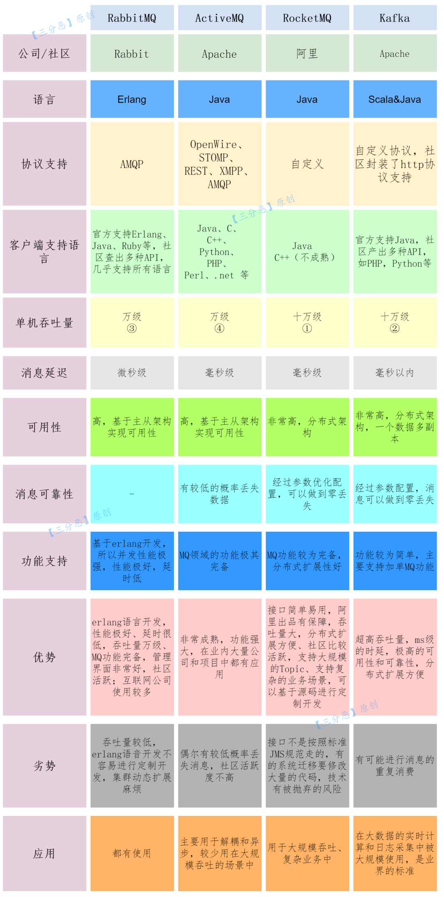

# 消息队列

## 作用

- 异步：可以将耗时的、不需要立即返回结果的任务使用消息队列进行处理，提高响应效率，如增减库存，批量导入等
- 解耦：降低模块、功能之间的耦合性
- 削峰：减轻服务端压力，将短时间的大量的请求，转为长时间的平滑稳定的请求

## 缺点

- 系统可用性降低：增加消息队列可能导致原本独立的系统之间出现依赖关系，增加了单点故障的风险，导致整体系统可用性的下降。还需考虑消息队列的可用性
- 系统复杂性提高：需要保证消息队列能正确处理消息丢失、重复消费以及顺序性等问题，增加开发的复杂性和成本
- 一致性问题：在分布式系统环境中，消息丢失或者重复消费可能会导致不一致的结果

## 选型

<small>[面渣逆袭：RocketMQ二十三问 - 四大消息队列对比](https://mp.weixin.qq.com/s?__biz=MzkwODE5ODM0Ng==&mid=2247490996&idx=1&sn=ba9558574d71979aa689a710c28c7e0e&chksm=c0ccf511f7bb7c07f23d6593e0792cae5dcc9fd003bc4b92f590199b470133ae32fa4025ec39&scene=178&cur_album_id=2041709347461709827#rd)</small>

ActiveMQ 虽然已经非常成熟，但性能较差、版本迭代慢、社区目前也不活跃，基本已经算淘汰了

- 吞吐量：推荐 RocketMQ 与 Kafka
- 响应：RabbitMQ 的响应延迟能达到微秒级，其他都在毫秒级
- 可用性：RocketMQ 与 Kafka 基于分布式架构，相比与 RabbitMQ 的主从架构，可用性更高
- 消息丢失：RabbitMQ 丢失的可能性非常低，RocketMQ 与 Kafka 理论上能做到 0 丢失

## 消费模式

消费模式分为推（push）模式和拉（pull）模式。推模式是指由broker主动推送消息至消费端，实时性较好，不过需要一定的流控机制来确保broker推送过来的消息不会压垮消费端。而拉模式是指消费端主动向broker请求拉取（一般是定时或定量）消息，实时性较推模式差，但可以根据自身的处理能力控制拉取的消息量。

广播消费：消息一般有两种传递模式：点对点（P2P，Point-to-Point）模式和发布/订阅（Pub/Sub）模式。对点对点的模式而言，消息被消费以后，队列中不会再存储消息，所以消息消费者不可能消费已经被消费的消息。虽然队列可以支持多个消费者，但是一条消息只会被一个消费者消费。发布/订阅模式定义了如何向一个内容节点发布和订阅消息，这个内容节点称为主题，主题可以认为是消息传递的中介，消息发布者将消息发布到某个主题，而消息订阅者从主题中订阅消息。主题使得消息的订阅者与消息的发布者互相保持独立，不需要进行接触即可保证消息的传递，发布/订阅模式在消息的一对多广播时采用。

## 优先级队列

优先级高的消息具备优先被消费的特权

## 延时队列

消息被发送以后，并不想让消费者立刻获取，而是等待特定的时间后，消费者才能获取这个消息进行消费

## 死信队列

由于某些原因消息无法被正确地投递，为了确保消息不会被无故地丢弃，一般将其置于一个特殊角色的队列，这个队列一般称为死信队列。后续分析程序可以通过消费这个死信队列中的内容来分析当时遇到的异常情况，进而可以改善和优化系统

## 回退队列

如果消费者在消费时发生了异常，那么就不会对这一次消费进行确认，进而发生回滚消息的操作之后，消息始终会放在队列的顶部，然后不断被处理和回滚，导致队列陷入死循环。为了解决这个问题，可以为每个队列设置一个回退队列，它和死信队列都是为异常处理提供的一种机制保障。实际情况下，回退队列的角色可以由死信队列和重试队列来扮演

## 重试队列

重试队列其实可以看作一种回退队列，具体指消费端消费消息失败时，为了防止消息无故丢失而重新将消息回滚到 broker 中。与回退队列不同的是，重试队列一般分成多个重试等级，每个重试等级一般也会设置重新投递延时，重试次数越多投递延时就越大

## 消息积压

消息队列中的消息无法及时处理和消费，导致队列中消息累积过多

- 消息不能及时消费，导致任务不能及时处理
- 消费者处理大量的消息任务，导致系统性能下降、延迟增加以及资源消耗过高

关于消息积压的出现，最粗粒度的原因，只有 2 种：消息发送变快了、系统消费的速度变慢了

### 处理方案

事中处理，先确认并解决服务端和消费端的 bug，找到是由什么原因导致生产者发送了大量的消息，消费者为何消费变慢了。同时可以尝试停止所有消费者，或增加消费者的数量、队列容量，临时的缓解积压现象。考虑是否丢弃一些重要性不高的消息，或者考虑服务器的扩容

- 优化消费端的逻辑：检查消息消费逻辑是否存在性能瓶颈或不必要的复杂计算。优化消息消费的逻辑可以提高消费速度，减少消息积压
- 监控与告警：建立监控和告警机制，及时发现消息积压的情况并采取相应的措施
- 消息过滤：过滤一些重复的、不重要的消息
- 增加消费者：增加消费速率
- 增加队列容量：缓解积压问题
- 定期清理过期和无效的消息：避免队列中存在大量无效的消息占用资源
- 设置消费失败的处理逻辑：当消息消费失败时，可以根据业务需求选择合适的处理方式。可以将失败的消息记录下来，后续再次消费；或者将失败的消息发送到死信队列进行处理
- 设置消息的优先级：根据消息的重要性和紧急程度，调整消息的优先级。优先处理重要的消息，确保关键业务的及时性，而对于非关键的消息可以进行降级处理或延后处理

## 消费失败

- 当消息消费失败时，会对消息进行重新推送
- 如果重试次数超过最大值，会将异常消息存储到数据库，然后人工介入排查问题，进行手工重试

## 消息丢失

## 重复消费

## 参考

- [消息队列基础知识总结](https://javaguide.cn/high-performance/message-queue/message-queue.html)
- [面渣逆袭：RocketMQ二十三问](https://mp.weixin.qq.com/s?__biz=MzkwODE5ODM0Ng==&mid=2247490996&idx=1&sn=ba9558574d71979aa689a710c28c7e0e&chksm=c0ccf511f7bb7c07f23d6593e0792cae5dcc9fd003bc4b92f590199b470133ae32fa4025ec39&scene=178&cur_album_id=2041709347461709827)
- [消息积压的处理](https://www.cnblogs.com/chjxbt/p/11434240.html)
- [线上消息队列发生积压，如何快速解决？](https://juejin.cn/post/7327124869921636367)
- [MQ消息积压处理方案](https://www.cnblogs.com/yangyongjie/p/17644874.html)
- [消息消费失败如何处理？](https://www.51cto.com/article/647598.html)
