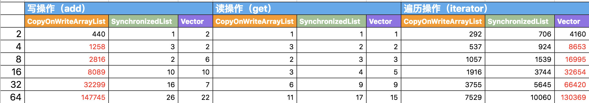

# 集合

Java 集合，也叫做容器，主要用于存储元素


集合主要分为 4 类，继承自 Collection 接口的 List、Set、Queue 与单独的 Map

- List：有序可重复
- Set：不重复，可以有序（TreeSet）可以无序（HashSet）
- Queue：有序可重复
- Map：key 不可重复，可以有序（TreeMap）可以无序（HashMap），value 可重复

## Iterable

```java
public interface Iterable<T> {

    // 获取一个迭代器
    Iterator<T> iterator();

    // 遍历
    default void forEach(Consumer<? super T> action) {
        Objects.requireNonNull(action);
        for (T t : this) {
            action.accept(t);
        }
    }

    // 返回一个可分割的迭代器，并行遍历的迭代器
    default Spliterator<T> spliterator() {
        return Spliterators.spliteratorUnknownSize(iterator(), 0);
    }
}
```

## Collection

```java
public interface Collection<E> extends Iterable<E> {

    // 返回集合中的元素数量
    int size();

    // 集合是否为空
    boolean isEmpty();

    // 集合是否包含给定的元素
    boolean contains(Object o);

    // 获取一个迭代器
    Iterator<E> iterator();

    // 转数组
    Object[] toArray();

    // 转数组
    <T> T[] toArray(T[] a);

    // 添加
    boolean add(E e);

    // 删除
    boolean remove(Object o);

    // 判断是否包含给定的集合中的所有元素
    boolean containsAll(Collection<?> c);

    // 将给定的集合里的元素添加到集合中
    boolean addAll(Collection<? extends E> c);

    // 移除给定的集合中的所有元素
    boolean removeAll(Collection<?> c);

    // 移除满足条件的元素
    default boolean removeIf(Predicate<? super E> filter) {
        Objects.requireNonNull(filter);
        boolean removed = false;
        final Iterator<E> each = iterator();
        while (each.hasNext()) {
            if (filter.test(each.next())) {
                each.remove();
                removed = true;
            }
        }
        return removed;
    }

    // 从当前的集合中保留给定的集合中的元素
    boolean retainAll(Collection<?> c);

    // 清空
    void clear();

    // 判断两个集合是否相等
    boolean equals(Object o);

    // 获取当前集合的hashCode
    int hashCode();

    // 返回一个可分割的迭代器，并行遍历的迭代器
    @Override
    default Spliterator<E> spliterator() {
        return Spliterators.spliterator(this, 0);
    }

    // 获得一个流
    default Stream<E> stream() {
        return StreamSupport.stream(spliterator(), false);
    }

    // 获得一个并行流
    default Stream<E> parallelStream() {
        return StreamSupport.stream(spliterator(), true);
    }
}
```

## List


```java
public interface List<E> extends Collection<E> {
    // 返回集合中的元素数量
    int size();

    // 集合是否为空
    boolean isEmpty();

    // 集合是否包含给定的元素
    boolean contains(Object o);

    // 获取一个迭代器
    Iterator<E> iterator();

    // 转数组
    Object[] toArray();

    // 转数组
    <T> T[] toArray(T[] a);

    // 添加
    boolean add(E e);

    // 删除
    boolean remove(Object o);

    // 判断是否包含给定的集合中的所有元素
    boolean containsAll(Collection<?> c);

    // 将给定的集合里的元素添加到集合中
    boolean addAll(Collection<? extends E> c);

    // 将给定的集合里的元素添加到集合中的指定位置后面
    boolean addAll(int index, Collection<? extends E> c);

    // 移除给定的集合中的所有元素
    boolean removeAll(Collection<?> c);

    // 从当前的集合中保留给定的集合中的元素
    boolean retainAll(Collection<?> c);

    // 遍历并替换元素
    default void replaceAll(UnaryOperator<E> operator) {
        Objects.requireNonNull(operator);
        final ListIterator<E> li = this.listIterator();
        while (li.hasNext()) {
            li.set(operator.apply(li.next()));
        }
    }

    // 排序
    @SuppressWarnings({"unchecked", "rawtypes"})
    default void sort(Comparator<? super E> c) {
        Object[] a = this.toArray();
        Arrays.sort(a, (Comparator) c);
        ListIterator<E> i = this.listIterator();
        for (Object e : a) {
            i.next();
            i.set((E) e);
        }
    }

    // 清空
    void clear();

    // 判断两个集合是否相等
    boolean equals(Object o);

    // 获取当前集合的hashCode
    int hashCode();

    // 根据下标获取元素
    E get(int index);

    // 根据下标修改元素
    E set(int index, E element);

    // 添加元素到指定位置
    void add(int index, E element);

    // 根据下标移除元素
    E remove(int index);

    // 正序查找，返回给定元素的第一次出现的下标
    int indexOf(Object o);

    // 倒序查找，返回给定元素的第一次出现的下标
    int lastIndexOf(Object o);

    // 获取一个迭代器
    ListIterator<E> listIterator();

    // 获取一个从给定下标开始的迭代器
    ListIterator<E> listIterator(int index);

    // 截取集合
    List<E> subList(int fromIndex, int toIndex);

    // 返回一个可分割的迭代器，并行遍历的迭代器
    @Override
    default Spliterator<E> spliterator() {
        return Spliterators.spliterator(this, Spliterator.ORDERED);
    }
}
```

### List 与数组

- List 创建时不需要指定大小，可以随着元素的增加进行动态扩容；数组创建时必须要指定大小，并且创建完成后就无法改变长度了
- List 中只能存储对象，而数组既可以存对象也可以存基本数据类型
- ArrayList、Vector、CopyOnWriteList 内部也是由数组实现的

### ArrayList 与 LinkedList

- ArrayList 是由数组实现的，LinkedList 是由双向链表实现的
- ArrayList 可以指定初始化容量，并且当容量不足时会进行扩容，LinkedList 不支持初始化容量，也不需要扩容
- ArrayList 支持快速随机访问，可以通过下标获取所需的元素，而 LinkedList 只支持顺序访问，除了头尾，都需要通过遍历来获取所需的元素
- 执行插入或删除操作时
  - 列表头部：ArrayList 需要移动数组内的所有元素，时间复杂度为 O(n)；LinkedList 直接在头部进行操作，时间复杂度为 O(1)
  - 列表尾部：ArrayList 不需要移动数组内的元素，时间复杂度为 O(1)；LinkedList 直接在尾部进行操作，时间复杂度为 O(1)
  - 列表中间：ArrayList 能立即找到位置，但需要移动数组内的部分元素，时间复杂度为 O(n)；LinkedList 需要遍历才能找到位置，时间复杂度为 O(n)
- ArrayList 中的数组一般不会填充完全，会有一些空间的浪费；LinkedList 中的元素是存在节点中的，每个节点还需要保存前驱节点与后继节点的指向，所以 LinkedList 相比于 ArrayList，每个元素存储时消耗的空间都更大

### 线程安全的 List

在 Java 中有 3 个常用的线程安全的列表：Vetcor、CopyOnWriteArrayList、SynchronizedList

- Vetcor 的实现与 ArrayList 类似，只是里面方法都添加了 synchronized 关键字，进行同步
- CopyOnWriteArrayList 基于写时复制技术，并使用了 ReentrantLock 来保证修改时的线程安全，适用于读多写少的场景
- SynchronizedList 位于 Collections 工具类中，可以通过 Collections.synchronizedList 方法将一个非线程安全的 List 包装为 SynchronizedList。内部也是通过 synchronized 关键字来保证线程安全，但与 Vetcor 不同的是，没有加在方法上面，而是在方法体里面，当然效果是差不多的



<small>[Collections.synchronizedList 、CopyOnWriteArrayList、Vector介绍、源码浅析与性能对比](https://juejin.cn/post/6844904054745743367#heading-6)</small>

Vetcor 实际上读写性能都不弱，只是遍历时的效率较低。CopyOnWriteArrayList 读与遍历的性能非常好，但写操作效率就非常低了。SynchronizedList 读写效率都挺高，遍历的效率略低，另外注意 SynchronizedList 的中迭代器不是线程安全的

## Map

```java
public interface Map<K,V> {

    int size();

    boolean isEmpty();

    boolean containsKey(Object key);

    boolean containsValue(Object value);

    V get(Object key);

    V put(K key, V value);

    V remove(Object key);

    void putAll(Map<? extends K, ? extends V> m);

    void clear();

    Set<K> keySet();

    Collection<V> values();

    Set<Map.Entry<K, V>> entrySet();

    interface Entry<K,V> {

        K getKey();

        V getValue();

        V setValue(V value);

        boolean equals(Object o);

        int hashCode();

        public static <K extends Comparable<? super K>, V> Comparator<Map.Entry<K,V>> comparingByKey() {
            return (Comparator<Map.Entry<K, V>> & Serializable)
                (c1, c2) -> c1.getKey().compareTo(c2.getKey());
        }

        public static <K, V extends Comparable<? super V>> Comparator<Map.Entry<K,V>> comparingByValue() {
            return (Comparator<Map.Entry<K, V>> & Serializable)
                (c1, c2) -> c1.getValue().compareTo(c2.getValue());
        }

        public static <K, V> Comparator<Map.Entry<K, V>> comparingByKey(Comparator<? super K> cmp) {
            Objects.requireNonNull(cmp);
            return (Comparator<Map.Entry<K, V>> & Serializable)
                (c1, c2) -> cmp.compare(c1.getKey(), c2.getKey());
        }

        public static <K, V> Comparator<Map.Entry<K, V>> comparingByValue(Comparator<? super V> cmp) {
            Objects.requireNonNull(cmp);
            return (Comparator<Map.Entry<K, V>> & Serializable)
                (c1, c2) -> cmp.compare(c1.getValue(), c2.getValue());
        }
    }

    boolean equals(Object o);

    int hashCode();

    default V getOrDefault(Object key, V defaultValue) {
        V v;
        return (((v = get(key)) != null) || containsKey(key))
            ? v
            : defaultValue;
    }

    default void forEach(BiConsumer<? super K, ? super V> action) {
        Objects.requireNonNull(action);
        for (Map.Entry<K, V> entry : entrySet()) {
            K k;
            V v;
            try {
                k = entry.getKey();
                v = entry.getValue();
            } catch(IllegalStateException ise) {
                // this usually means the entry is no longer in the map.
                throw new ConcurrentModificationException(ise);
            }
            action.accept(k, v);
        }
    }

    default void replaceAll(BiFunction<? super K, ? super V, ? extends V> function) {
        Objects.requireNonNull(function);
        for (Map.Entry<K, V> entry : entrySet()) {
            K k;
            V v;
            try {
                k = entry.getKey();
                v = entry.getValue();
            } catch(IllegalStateException ise) {
                // this usually means the entry is no longer in the map.
                throw new ConcurrentModificationException(ise);
            }

            // ise thrown from function is not a cme.
            v = function.apply(k, v);

            try {
                entry.setValue(v);
            } catch(IllegalStateException ise) {
                // this usually means the entry is no longer in the map.
                throw new ConcurrentModificationException(ise);
            }
        }
    }

    default V putIfAbsent(K key, V value) {
        V v = get(key);
        if (v == null) {
            v = put(key, value);
        }

        return v;
    }

    default boolean remove(Object key, Object value) {
        Object curValue = get(key);
        if (!Objects.equals(curValue, value) ||
            (curValue == null && !containsKey(key))) {
            return false;
        }
        remove(key);
        return true;
    }

    default boolean replace(K key, V oldValue, V newValue) {
        Object curValue = get(key);
        if (!Objects.equals(curValue, oldValue) ||
            (curValue == null && !containsKey(key))) {
            return false;
        }
        put(key, newValue);
        return true;
    }

    default V replace(K key, V value) {
        V curValue;
        if (((curValue = get(key)) != null) || containsKey(key)) {
            curValue = put(key, value);
        }
        return curValue;
    }

    default V computeIfAbsent(K key,
            Function<? super K, ? extends V> mappingFunction) {
        Objects.requireNonNull(mappingFunction);
        V v;
        if ((v = get(key)) == null) {
            V newValue;
            if ((newValue = mappingFunction.apply(key)) != null) {
                put(key, newValue);
                return newValue;
            }
        }

        return v;
    }

    default V computeIfPresent(K key,
            BiFunction<? super K, ? super V, ? extends V> remappingFunction) {
        Objects.requireNonNull(remappingFunction);
        V oldValue;
        if ((oldValue = get(key)) != null) {
            V newValue = remappingFunction.apply(key, oldValue);
            if (newValue != null) {
                put(key, newValue);
                return newValue;
            } else {
                remove(key);
                return null;
            }
        } else {
            return null;
        }
    }

    default V compute(K key,
            BiFunction<? super K, ? super V, ? extends V> remappingFunction) {
        Objects.requireNonNull(remappingFunction);
        V oldValue = get(key);

        V newValue = remappingFunction.apply(key, oldValue);
        if (newValue == null) {
            // delete mapping
            if (oldValue != null || containsKey(key)) {
                // something to remove
                remove(key);
                return null;
            } else {
                // nothing to do. Leave things as they were.
                return null;
            }
        } else {
            // add or replace old mapping
            put(key, newValue);
            return newValue;
        }
    }

    default V merge(K key, V value,
            BiFunction<? super V, ? super V, ? extends V> remappingFunction) {
        Objects.requireNonNull(remappingFunction);
        Objects.requireNonNull(value);
        V oldValue = get(key);
        V newValue = (oldValue == null) ? value :
                   remappingFunction.apply(oldValue, value);
        if(newValue == null) {
            remove(key);
        } else {
            put(key, newValue);
        }
        return newValue;
    }
}
```

## Set

```java
public interface Set<E> extends Collection<E> {

    // 返回集合中的元素数量
    int size();

    // 集合是否为空
    boolean isEmpty();

    // 集合是否包含给定的元素
    boolean contains(Object o);

    // 获取一个迭代器
    Iterator<E> iterator();

    // 转数组
    Object[] toArray();

    // 转数组
    <T> T[] toArray(T[] a);

    // 添加一个元素
    boolean add(E e);

    // 移除一个元素
    boolean remove(Object o);

    // 判断是否包含给定的集合中的所有元素
    boolean containsAll(Collection<?> c);

    // 将给定的集合里的元素添加到集合中
    boolean addAll(Collection<? extends E> c);

    // 从当前的集合中保留给定的集合中的元素
    boolean retainAll(Collection<?> c);

    // 移除给定的集合中的所有元素
    boolean removeAll(Collection<?> c);

    // 清空
    void clear();

    // 判断两个集合是否相等
    boolean equals(Object o);

    // 获取当前集合的hashCode
    int hashCode();

    // 返回一个可分割的迭代器，并行遍历的迭代器
    @Override
    default Spliterator<E> spliterator() {
        return Spliterators.spliterator(this, Spliterator.DISTINCT);
    }
}
```

### LinkedHashMap

LinkedHashMap 继承自 HashMap，是一个有序的 Map，可以按照添加的顺序，也可以按照访问的顺序

```java
public class Test {

    public static void main(String[] args) {
        put(new HashMap<>());
        // 添加顺序
        put(new LinkedHashMap<>());
        // 访问顺序
        put(new LinkedHashMap<>(16, 0.75f, true));
    }

    static void put(Map<String, String> map) {
        map.put("one", "one");
        map.put("two", "two");
        map.put("three", "three");
        map.put("four", "four");
        map.put("five", "five");
        map.put("six", "six");
        map.put("seven", "seven");
        map.put("eight", "eight");
        map.put("nine", "nine");
        map.put("ten", "ten");

        map.get("one");
        map.get("two");

        System.out.println(map.keySet());
    }
}
```

> [nine, six, four, one, seven, ten, two, three, five, eight]
> [one, two, three, four, five, six, seven, eight, nine, ten]
> [three, four, five, six, seven, eight, nine, ten, one, two]

通过结果可以看出，LinkedHashMap 以什么顺序添加元素，就以什么顺序输出。而访问顺序是指会将获取过的元素添加到尾部，所以可以作为 LRU（Least Recently Used，最近最少使用） 的一种实现

#### 实现

LinkedHashMap 通过在内部维护了一个双向链表，来实现有序性

LinkedHashMap 的 put 方法就直接使用的 HashMap 的 put 方法，但在创建节点时，调用的是自己重写的方法

```java
Node<K,V> newNode(int hash, K key, V value, Node<K,V> e) {
    LinkedHashMap.Entry<K,V> p =
        new LinkedHashMap.Entry<K,V>(hash, key, value, e);
    linkNodeLast(p);
    return p;
}
```

可以看出创建的是一个 Entry 节点，而该节点又继承自 HashMap.Node，并且多维护 before、after 两个变量，表示前一个节点和后一个节点

```java
static class Entry<K,V> extends HashMap.Node<K,V> {
    Entry<K,V> before, after;
    Entry(int hash, K key, V value, Node<K,V> next) {
        super(hash, key, value, next);
    }
}
```


<small>[Java集合框架源码剖析：LinkedHashSet 和 LinkedHashMap](https://www.cnblogs.com/CarpenterLee/p/5541111.html)</small>

在 HashMap 中有 3 个空方法就是专门留给 LinkedHashMap 来实现的

```java
void afterNodeAccess(Node<K,V> p) { }
void afterNodeInsertion(boolean evict) { }
void afterNodeRemoval(Node<K,V> p) { }
```

```java
// 删除元素后
void afterNodeRemoval(Node<K,V> e) { // unlink
    LinkedHashMap.Entry<K,V> p =
        (LinkedHashMap.Entry<K,V>)e, b = p.before, a = p.after;
    p.before = p.after = null;
    if (b == null)
        head = a;
    else
        b.after = a;
    if (a == null)
        tail = b;
    else
        a.before = b;
}

// 插入元素后
void afterNodeInsertion(boolean evict) { // possibly remove eldest
    LinkedHashMap.Entry<K,V> first;
    if (evict && (first = head) != null && removeEldestEntry(first)) {
        K key = first.key;
        removeNode(hash(key), key, null, false, true);
    }
}

// 访问元素后，用于按照访问顺序
void afterNodeAccess(Node<K,V> e) { // move node to last
    LinkedHashMap.Entry<K,V> last;
    if (accessOrder && (last = tail) != e) {
        LinkedHashMap.Entry<K,V> p =
            (LinkedHashMap.Entry<K,V>)e, b = p.before, a = p.after;
        p.after = null;
        if (b == null)
            head = a;
        else
            b.after = a;
        if (a != null)
            a.before = b;
        else
            last = b;
        if (last == null)
            head = p;
        else {
            p.before = last;
            last.after = p;
        }
        tail = p;
        ++modCount;
    }
}
```

### TreeMap

TreeMap 是一个有序的 Map，与 LinkedHashMap 不同的是 TreeMap 不是按照添加或者访问顺序来排序，而是按照指定的比较器来进行自动排序

```java
public class Test implements Comparable {

    int i;

    public Test(int i) {
        this.i = i;
    }

    public static void main(String[] args) {
        put(new HashMap<>());
        put(new LinkedHashMap<>());
        put(new TreeMap<>());
        put(new TreeMap<>(new Comparator<Test>() {
            @Override
            public int compare(Test o1, Test o2) {
                return Integer.compare(o1.i, o2.i);
            }
        }));
    }

    static void put(Map<Test, String> map) {
        for (int i = 10; i > 0; i--) {
            map.put(new Test(i), "");
        }

        System.out.println(map.keySet());
    }

    @Override
    public int compareTo(Object o) {
        Test test = (Test) o;
        return Integer.compare(this.i - test.i, 0);
    }

    @Override
    public String toString() {
        return String.valueOf(i);
    }
}
```

> [8, 5, 2, 6, 10, 4, 9, 7, 1, 3]
[10, 9, 8, 7, 6, 5, 4, 3, 2, 1]
[1, 2, 3, 4, 5, 6, 7, 8, 9, 10]
[1, 2, 3, 4, 5, 6, 7, 8, 9, 10]

注意作为 key 的对象必须实现 Comparable 接口

### 线程安全的 Map

在 Java 中有 3 个常用的线程安全的 Map：Hashtable、ConcurrentHashMap、SynchronizedMap

为什么 key 与 value 不能为 null

## 参考

- [Collections.synchronizedList 、CopyOnWriteArrayList、Vector介绍、源码浅析与性能对比](https://juejin.cn/post/6844904054745743367)
